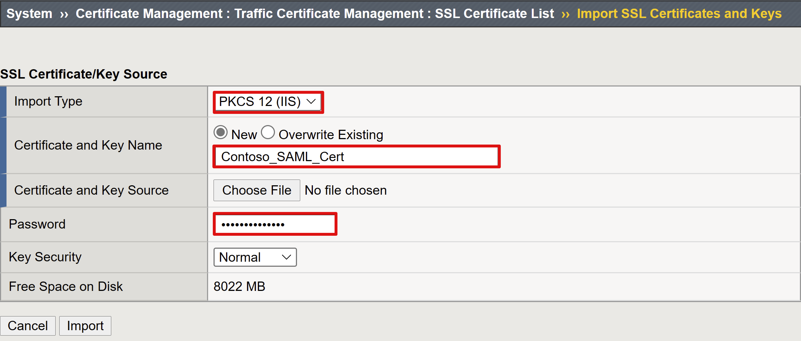
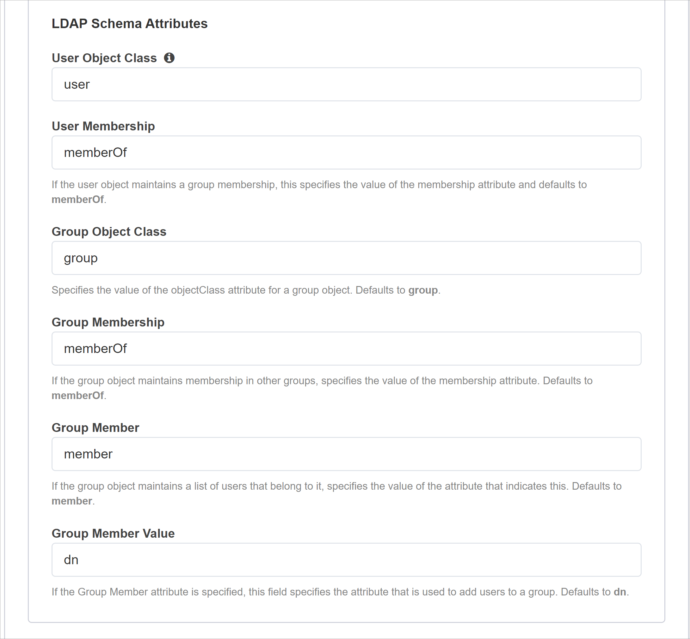
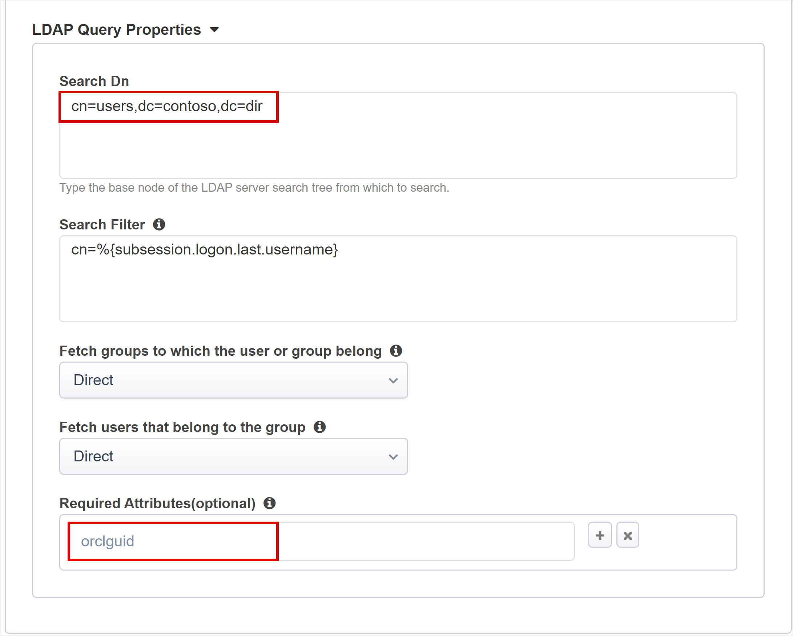
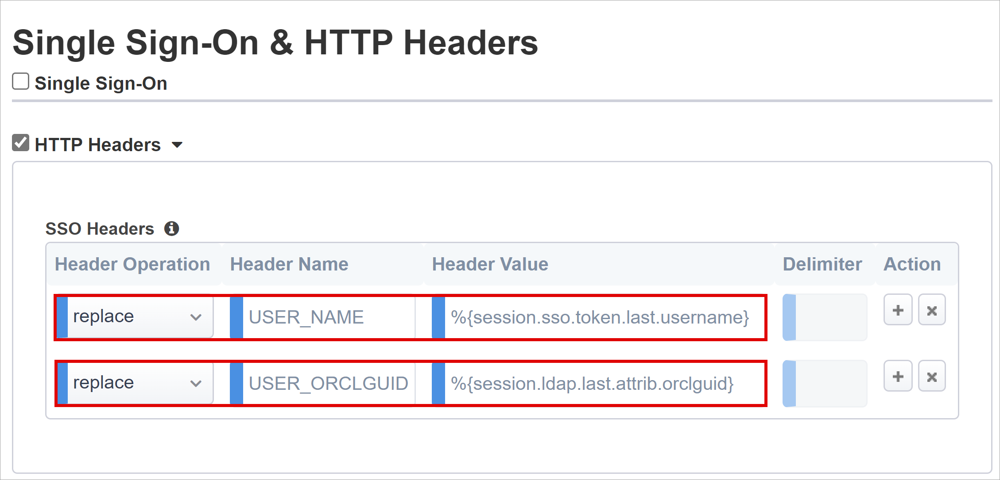

# Tutorial: Configure F5 BIG-IP Easy Button for SSO to Oracle EBS

Learn to secure Oracle Enterprise Business Suite (EBS) using Azure Active Directory (Azure AD), with F5 BIG-IP Easy Button Guided Configuration. Integrating a BIG-IP with Azure AD has many benefits:

* Improved Zero Trust governance through Azure AD preauthentication and Conditional Access 
  * See, [What is Conditional Access?](../conditional-access/overview.md)
  * See, [Zero Trust security](../../security/fundamentals/zero-trust.md)
* Full SSO between Azure AD and BIG-IP published services
* Managed identities and access from one control plane
  * See, the [Azure portal](https://azure.microsoft.com/features/azure-portal)

Learn more:

* [Integrate F5 BIG-IP with Azure AD](./f5-aad-integration.md)
* [Enable SSO for an enterprise application](add-application-portal-setup-sso.md)

## Scenario description

This scenario covers the classic Oracle EBS application that uses HTTP authorization headers to manage access to protected content.

Legacy applications lack modern protocols to support Azure AD integration. Modernization is costly, time consuming, and introduces downtime risk. Instead, use an F5 BIG-IP Application Delivery Controller (ADC) to bridge the gap between legacy applications and the modern ID control plane, with protocol transitioning.

A BIG-IP in front of the app enables overlay of the service with Azure AD preauthentication and header-based SSO. This configuration improve application security posture.

## Scenario architecture

The secure hybrid access (SHA) solution has the following components:

* **Oracle EBS application** - BIG-IP published service to be protected by Azure AD SHA
* **Azure AD**  - Security Assertion Markup Language (SAML) identity provider (IdP) that verifies user credentials, Conditional Access, and SAML-based SSO to the BIG-IP
  * With SSO, Azure AD provides BIG-IP session attributes
* **Oracle Internet Directory (OID)** - hosts the user database
  * BIG-IP verifies authorization attributes with LDAP
* **Oracle E-Business Suite AccessGate** - before issuing EBS access cookies, it validates authorization attributes with the OID service
* **BIG-IP** - reverse-proxy and SAML service provider (SP) to the application 
  * Before header-based SSO to the Oracle application, authentication is delegated to the SAML IdP

SHA supports SP- and IdP-initiated flows. The following diagram illustrates the SP-initiated flow.

   

1. User connects to application endpoint (BIG-IP).
2. BIG-IP APM access policy redirects user to Azure AD (SAML IdP).
3. Azure AD preauthenticates user and applies Conditional Access policies.
4. User is redirected to BIG-IP (SAML SP) and SSO occurs using the issued SAML token.
5. BIG-IP performs an LDAP query for the user Unique ID (UID) attribute.
6. BIG-IP injects returned UID attribute as user_orclguid header in EBS session cookie request to Oracle AccessGate.
7. Oracle AccessGate validates UID against OID service and issues EBS access cookie.
8. EBS user headers and cookie sent to application and returns the payload to the user.

## Prerequisites

You need the following components:

* An Azure subscription
  * If you don't have one, get an [Azure free account](https://azure.microsoft.com/free/)
* For the account, have Azure AD Application Administrator permissions
* A BIG-IP or deploy a BIG-IP Virtual Edition (VE) in Azure
  * See, [Deploy F5 BIG-IP Virtual Edition VM in Azure](./f5-bigip-deployment-guide.md)
* Any of the following F5 BIG-IP license SKUs:
  * F5 BIG-IP® Best bundle
  * F5 BIG-IP Access Policy Manager™ (APM) standalone license
  * F5 BIG-IP Access Policy Manager™ (APM) add-on license on a BIG-IP F5 BIG-IP® Local Traffic Manager™ (LTM)
  * 90-day BIG-IP full feature trial. See, [Free Trials](https://www.f5.com/trial/big-ip-trial.php).
* User identities synchronized from an on-premises directory to Azure AD
  * See, [Azure AD Connect sync: Understand and customize synchronization](../hybrid/how-to-connect-sync-whatis.md)
* An SSL certificate to publish services over HTTPS, or use default certificates while testing
  * See, [SSL profile](./f5-bigip-deployment-guide.md#ssl-profile)
* An Oracle EBS Suite, Oracle AccessGate, and an LDAP-enabled Oracle Internet Database (OID)

## BIG-IP configuration method

This tutorial uses the Guided Configuration v16.1 Easy Button template. With the Easy Button, admins no longer go back and forth to enable services for SHA. The deployment and policy management is handled by the APM Guided Configuration wizard and Microsoft Graph. This integration ensures applications support identity federation, SSO, and Conditional Access, thus reducing administrative overhead.

   >[!NOTE] 
  > Replace example strings or values with those in your environment.

## Register the Easy Button

Before a client or service accesses Microsoft Graph, the Microsoft identity platform must trust it.

Learn more: [Quickstart: Register an application with the Microsoft identity platform](../develop/quickstart-register-app.md)

Create a tenant app registration to authorize the Easy Button access to Graph. The BIG-IP pushes configurations to establish a trust between a SAML SP instance for published application, and Azure AD as the SAML IdP.

1. Sign in to the [Azure portal](https://portal.azure.com/) with Application Administrative permissions.
2. In the left navigation pane, select the **Azure Active Directory** service.
3. Under **Manage**, select **App registrations > New registration**.
4. Enter an application **Name**. For example, F5 BIG-IP Easy Button.
5. Specify who can use the application > **Accounts in this organizational directory only**.
6. Select **Register**.
7. Navigate to **API permissions**.
8. Authorize the following Microsoft Graph **Application permissions**:

   * Application.Read.All
   * Application.ReadWrite.All
   * Application.ReadWrite.OwnedBy
   * Directory.Read.All
   * Group.Read.All
   * IdentityRiskyUser.Read.All
   * Policy.Read.All
   * Policy.ReadWrite.ApplicationConfiguration
   * Policy.ReadWrite.ConditionalAccess
   * User.Read.All

9. Grant admin consent for your organization.
10. Go to **Certificates & Secrets**.
11. Generate a new **Client Secret**. Make a note of the Client Secret.
12. Go to **Overview**. Make a note of the Client ID and Tenant ID.

## Configure the Easy Button

1. Initiate the APM **Guided Configuration**.
2. Start the **Easy Button** template.
3. Navigate to **Access > Guided Configuration > Microsoft Integration**.
4. Select **Azure AD Application**.

   

5. Review the configuration options.
6. Select **Next**.

   

7. Use the graphic to help publish your application.

   

### Configuration Properties

The **Configuration Properties** tab creates a BIG-IP application config and SSO object. The **Azure Service Account Details** section represents the client you registered in your Azure AD tenant, as an application. With these settings a BIG-IP OAuth client registers a SAML SP in your tenant, with SSO properties. Easy Button does this action for BIG-IP services published and enabled for SHA.

To reduce time and effort, reuse global settings to publish other applications.

1. Enter a **Configuration Name**.
2. For **Single Sign-On (SSO) & HTTP Headers**, select **On**.
3. For **Tenant ID, Client ID**, and **Client Secret** enter what you noted during Easy Button client registration.
4. Confirm the BIG-IP connects to your tenant.
5. Select **Next**.

   

### Service Provider

Use Service Provider settings for the properties of the SAML SP instance of the protected application.

1. For **Host**, enter the public FQDN of the application.
2. For **Entity ID**, enter the identifier Azure AD uses for the SAML SP requesting a token.

   

3. (Optional) In **Security Settings**, select or clear the **Enable Encrypted Assertion** option. Encrypting assertions between Azure AD and the BIG-IP APM means the content tokens can’t be intercepted, nor personal or corporate data compromised.
4. From the **Assertion Decryption Private Key** list, select **Create New**

   

5. Select **OK**. 
6. The **Import SSL Certificate and Keys** dialog appears in a new tab.
7. Select **PKCS 12 (IIS)**.
8. The certificate and private key are imported. 
9. Close the browser tab to return to the main tab.

   

6. Select **Enable Encrypted Assertion**.
7. For enabled encryption, from the **Assertion Decryption Private Key** list, select the certificate private key BIG-IP APM uses to decrypt Azure AD assertions.
8. For enabled encryption,from the **Assertion Decryption Certificate** list, select the certificate BIG-IP uploads to Azure AD to encrypt the issued SAML assertions.

   

### Azure AD

Easy Button has application templates for Oracle PeopleSoft, Oracle E-business Suite, Oracle JD Edwards, SAP ERP as well as generic SHA template for any other apps. The following screenshot is the Oracle E-Business Suite option under Azure Configuration

1. Select **Oracle E-Business Suite**.
2. Select **Add**.

   

#### Azure Configuration

1. Enter a **Display Name** for the app BIG-IP creates in your Azure AD tenant, and the icon on the MyApps portal.
2. In **Sign On URL (optional)**, enter the EBS application public FQDN.
3. Enter the default path for the Oracle EBS homepage.

    

3. Next to the **Signing Key** and **Signing Certificate**, select the **refresh** icon.
4. Locate the certificate you imported.
5. In **Signing Key Passphrase**, enter the certificate password.
6. (Optional) Enable **Signing Option**. This ensures BIG-IP accepts tokens and claims signed by Azure AD.

    

7. For **User And User Groups**, add a user or group for testing, otherwise all access is denied. Users and user groups are dynamically queried from the Azure AD tenant and authorize access to the application. 

    

#### User Attributes & Claims

When a user authenticates, Azure AD issues a SAML token with default claims and attributes identifying the user. The **User Attributes & Claims** tab has default claims to issue for the new application. Use this area to configure more claims. If needed, add Azure AD attributes, however the Oracle EBS scenario requires the default attributes.

   

#### Additional User Attributes

The **Additional User Attributes** tab supports distributed systems that require attributes stored in directories for session augmentation. Attributes fetched from an LDAP source are injected as more SSO headers to control access based on roles, partner ID, etc.

1. Enable the **Advanced Settings** option.
2. Check the **LDAP Attributes** check box.
3. In **Choose Authentication Server**, select **Create New**.
4. Depending on your setup, select **Use pool** or **Direct** server connection mode. This provides the target LDAP service server address. For a single LDAP server, select **Direct**.
5. For **Service Port**, enter **3060** (Default), **3161** (Secure), or another port for the Oracle LDAP service.
6. Enter a **Base Search DN**. Use the distinguished name (DN) to search for groups in a directory.
7. For **Admin DN** enter the account distinguished name APM uses to authenticate LDAP queries.
8. For **Admin Password**, enter the password.

   

9. Leave the default **LDAP Schema Attributes**.

   

10. Under **LDAP Query Properties**, for **Search Dn** enter the LDAP server base node for user object search.
11. For **Required Attributes**, enter the user object attribute name to be returned from the LDAP directory. For EBS, the default is **orclguid**.

    

#### Conditional Access Policy

Conditional Access policies control access based on device, application, location, and risk signals. Policies are enforced after Azure AD preauthentication. The Available Policies view has Conditional Access policies with no user actions. The Selected Policies view has policies for cloud apps. You can't deselect these policies or move them to Available Policies because they're enforced at the tenant level.

To select a policy for the application to be published:

1. In **Available Policies**, select a policy.
2. Select the **right arrow** and move it to **Selected Policies**.

> [!NOTE]
> The **Include** or **Exclude** option is selected for some policies. If both options are checked, the policy is unenforced.

   

> [!NOTE]
> The policy list appears when you select the **Conditional Access Policy** tab. Use the **Refresh** button for the wizard to query your tenant. Refresh appears for deployed applications.

### Virtual Server Properties

A virtual server is a BIG-IP data plane object represented by a virtual IP address listening for application client requests. Received traffic is processed and evaluated against the APM profile associated with the virtual server. Then, traffic is directed according to policy.

1. Enter a **Destination Address**, an IPv4 or IPv6 address BIG-IP uses to receive client traffic. Ensure a corresponding record in DNS that enables clients to resolve the external URL, of the BIG-IP published application, to the IP. Use a test computer localhost DNS for testing.
3. For **Service Port**, enter **443**, and select **HTTPS**.
4. Select **Enable Redirect Port**.
5. For **Redirect Port**, enter **80**, and select **HTTP**. This action redirects incoming HTTP client traffic to HTTPS.
6. Select the **Client SSL Profile** you created, or leave the default for testing. Client SSL Profile enables the virtual server for HTTPS. Client connections are encrypted over TLS. 

   

### Pool Properties

The **Application Pool** tab has services behind a BIG-IP, a pool with one or more application servers.

1. From **Select a Pool**, select **Create New**, or select another option.
2. For **Load Balancing Method**, select **Round Robin**.
3. Under **Pool Servers**, select and enter an **IP Address/Node Name** and **Port** for the servers hosting Oracle EBS.
4. Select **HTTPS**.

   

5. Under **Access Gate Pool** confirm the **Access Gate Subpath**. 
6. For **Pool Servers** select and enter an **IP Address/Node Name** and **Port** for the servers hosting Oracle EBS.
7. Select **HTTPS**.

   

#### Single Sign-On & HTTP Headers

The Easy Button wizard supports Kerberos, OAuth Bearer, and HTTP authorization headers for SSO to published applications. The Oracle EBS application expects headers, enable HTTP headers.

1. On **Single Sign-On & HTTP Headers**, select **HTTP Headers**.
2. For **Header Operation**, select **replace**.
3. For **Header Name**, enter **USER_NAME**.
4. For **Header Value**, enter **%{session.sso.token.last.username}**.
5. For **Header Operation**, select **replace**.
6. For **Header Name**, enter **USER_ORCLGUID**.
7. For **Header Value**, enter **%{session.ldap.last.attr.orclguid}**.

   

   >[!NOTE] 
   >APM session variables in curly brackets are case-sensitive.

### Session Management

Use BIG-IPs Session Management to define conditions for user session termination or continuation. 

To learn more, got to support.f5.com for [K18390492: Security | BIG-IP APM operations guide](https://support.f5.com/csp/article/K18390492)

Single Log-Out (SLO) functionality ensures sessions between the IdP, BIG-IP, and the user agent, terminate when users sign off. When the Easy Button instantiates a SAML application in your Azure AD tenant, it populates the Logout URL with the APM SLO endpoint. Thus, IdP-initiated sign out, from the My Apps portal, terminate the session between the BIG-IP and a client.

See, Microsoft [My Apps](https://myapplications.microsoft.com/)

The SAML federation metadata for the published application is imported from the tenant. This action provides the APM with the SAML sign out endpoint for Azure AD. Then, SP-initiated sign out terminates the client and Azure AD session. Ensure the APM knows when a user signs out.

If you use the BIG-IP webtop portal to access published applications, a sign-out is processed by the APM to call the Azure AD sign-out endpoint. If you don't use the BIG-IP webtop portal, the user can't instruct the APM to sign out. If the user signs out of the application, the BIG-IP is oblivious to the action. Ensure SP-initiated sign out triggers secure sessions terminatation. Add an SLO function to the applications **Sign out** button to redirect the client to the Azure AD SAML or BIG-IP sign-out endpoint. Find the SAML sign-out endpoint URL for your tenant in **App Registrations > Endpoints**.

If you can't change the app, have the BIG-IP listen for the application sign-out call and trigger SLO. 

Learn more:

* [PeopleSoft SLO Logout](./f5-big-ip-oracle-peoplesoft-easy-button.md#peoplesoft-single-logout)
* Go to support.f5.com for: 
  * [K42052145: Configuring automatic session termination (logout) based on a URI-referenced file name](https://support.f5.com/csp/article/K42052145
  * [K12056: Overview of the Logout URI Include option](https://support.f5.com/csp/article/K12056)

## Deploy

1. Select **Deploy** to commit settings.
2. Verify the application appears in the tenant Enterprise applications list.

## Test

From a browser, connect to the **Oracle EBS application’s external URL** or select the application’s icon in the [Microsoft MyApps portal](https://myapps.microsoft.com/). After authenticating to Azure AD, you’ll be redirected to the BIG-IP virtual server for the application and automatically signed in through SSO.

For increased security, organizations using this pattern could also consider blocking all direct access to the application, thereby forcing a strict path through the BIG-IP.

## Advanced deployment

There may be cases where the Guided Configuration templates lack the flexibility to achieve more specific requirements. For those scenarios, see [Advanced Configuration for headers-based SSO](./f5-big-ip-header-advanced.md). Alternatively, the BIG-IP gives the option to disable **Guided Configuration’s strict management mode**. This allows you to manually tweak your configurations, even though bulk of your configurations are automated through the wizard-based templates.

You can navigate to **Access > Guided Configuration** and select the **small padlock icon** on the far right of the row for your applications’ configs. 


At that point, changes via the wizard UI are no longer possible, but all BIG-IP objects associated with the published instance of the application will be unlocked for direct management.

> [!NOTE] 
> Re-enabling strict mode and deploying a configuration will overwrite any settings performed outside of the Guided Configuration UI, therefore we recommend the advanced configuration method for production services.

## Troubleshooting

Failure to access a SHA protected application can be due to any number of factors. BIG-IP logging can help quickly isolate all sorts of issues with connectivity, SSO, policy violations, or misconfigured variable mappings. Start troubleshooting by increasing the log verbosity level.

1. Navigate to **Access Policy > Overview > Event Logs > Settings**

2. Select the row for your published application then **Edit > Access System Logs**

3. Select **Debug** from the SSO list then **OK**

Reproduce your issue, then inspect the logs, but remember to switch this back when finished as verbose mode generates lots of data. 

If you see a BIG-IP branded error immediately after successful Azure AD pre-authentication, it’s possible the issue relates to SSO from Azure AD to the BIG-IP.

1. Navigate to **Access > Overview > Access reports**

2. Run the report for the last hour to see if the logs provide any clues. The **View session** variables link for your session will also help understand if the APM is receiving the expected claims from Azure AD

If you don’t see a BIG-IP error page, then the issue is probably more related to the backend request or SSO from the BIG-IP to the application.

1. In which case head to **Access Policy > Overview > Active Sessions** and select the link for your active session

2. The **View Variables** link in this location may also help root cause SSO issues, particularly if the BIG-IP APM fails to obtain the right attributes from Azure AD or another source

See [BIG-IP APM variable assign examples](https://devcentral.f5.com/s/articles/apm-variable-assign-examples-1107) and [F5 BIG-IP session variables reference](https://techdocs.f5.com/en-us/bigip-15-0-0/big-ip-access-policy-manager-visual-policy-editor/session-variables.html) for more info.

The following command from a bash shell validates the APM service account used for LDAP queries and can successfully authenticate and query a user object:

```ldapsearch -xLLL -H 'ldap://192.168.0.58' -b "CN=oraclef5,dc=contoso,dc=lds" -s sub -D "CN=f5-apm,CN=partners,DC=contoso,DC=lds" -w 'P@55w0rd!' "(cn=testuser)" ```

For more information, visit this F5 knowledge article [Configuring LDAP remote authentication for Active Directory](https://support.f5.com/csp/article/K11072). There’s also a great BIG-IP reference table to help diagnose LDAP-related issues in this [F5 knowledge article on LDAP Query](https://techdocs.f5.com/en-us/bigip-16-1-0/big-ip-access-policy-manager-authentication-methods/ldap-query.html).
