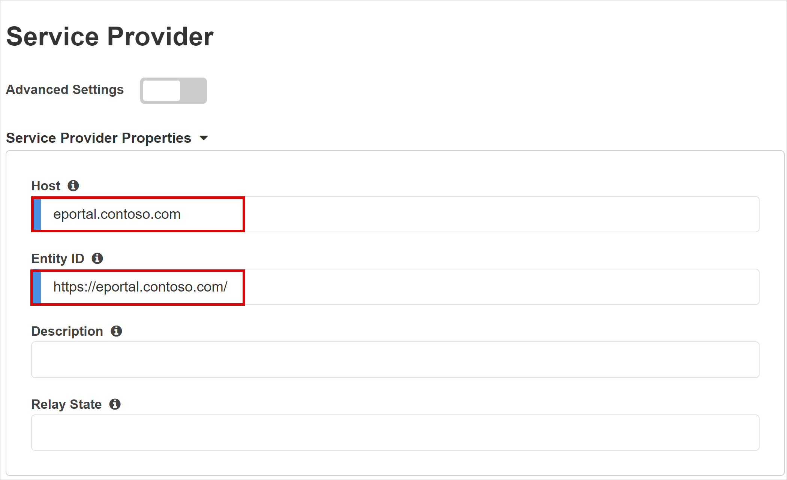
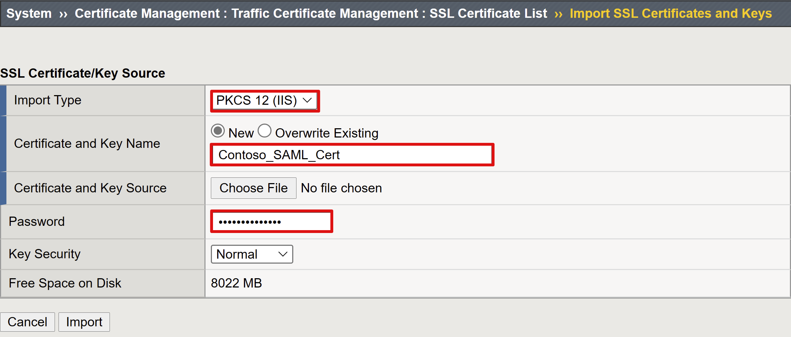
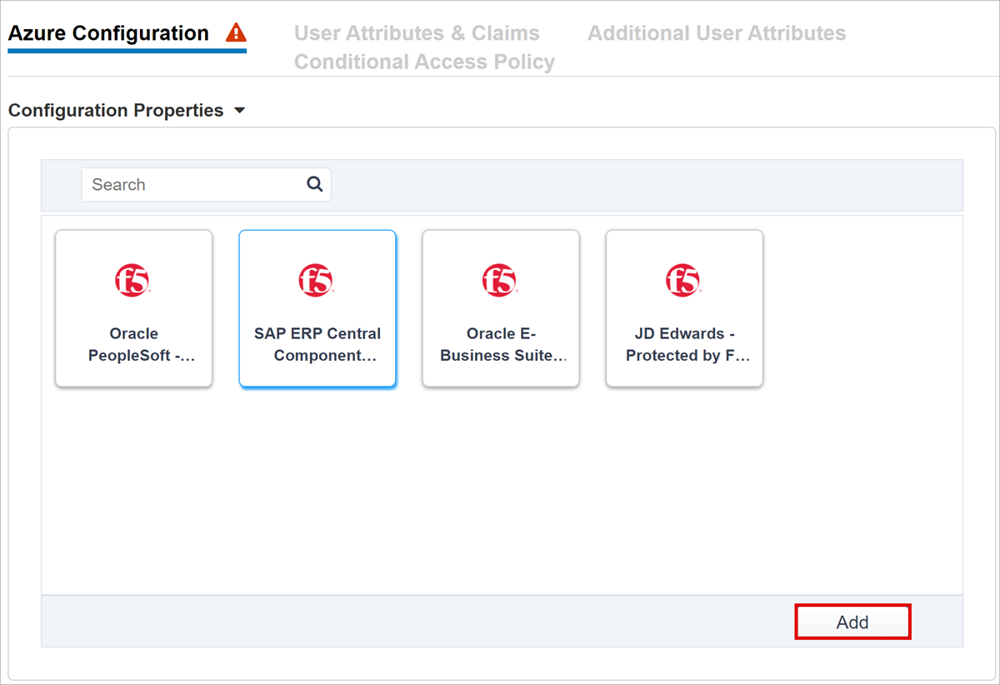
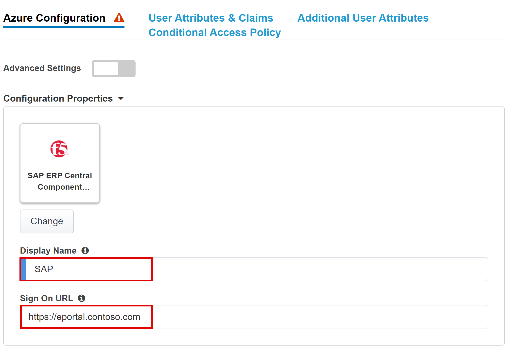
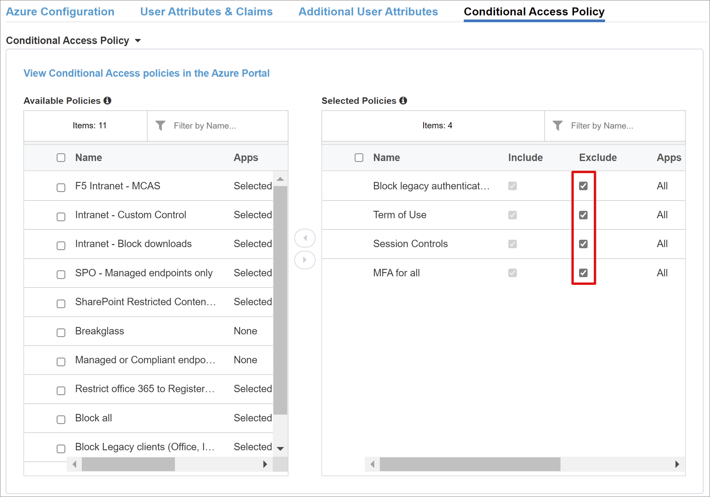

# Tutorial: Configure F5 BIG-IP Easy Button for SSO to SAP ERP

In this article, learn to secure SAP ERP using Microsoft Entra ID, with F5 BIG-IP Easy Button Guided Configuration 16.1. Integrating a BIG-IP with Microsoft Entra ID has many benefits:

* [Zero Trust framework to enable remote work](https://www.microsoft.com/security/blog/2020/04/02/announcing-microsoft-zero-trust-assessment-tool/) 
* [What is Conditional Access?](~/identity/conditional-access/overview.md)
* Single sign-on (SSO) between Microsoft Entra ID and BIG-IP published services
* Manage identities and access from the [Microsoft Entra admin center](https://entra.microsoft.com)

Learn more: 

* [Integrate F5 BIG-IP with Microsoft Entra ID](./f5-integration.md)
* [Enable SSO for an enterprise application](add-application-portal-setup-sso.md).

## Scenario description

This scenario includes the SAP ERP application using Kerberos authentication to manage access to protected content.

Legacy applications lack modern protocols to support integration with Microsoft Entra ID. Modernization is costly, requires planning, and introduces potential downtime risk. Instead, use an F5 BIG-IP Application Delivery Controller (ADC) to bridge the gap between the legacy application and the modern ID control plane, through protocol transitioning. 

A BIG-IP in front of the application enables overlay of the service with Microsoft Entra preauthentication and headers-based SSO. This configuration improves overall application security posture.

## Scenario architecture

The secure hybrid access (SHA) solution has the following components:

* **SAP ERP application** - a BIG-IP published service protected by Microsoft Entra SHA
* **Microsoft Entra ID** - Security Assertion Markup Language (SAML) identity provider (IdP) that verifies user credentials, Conditional Access, and SAML-based SSO to the BIG-IP
* **BIG-IP** - reverse-proxy and SAML service provider (SP) to the application. BIG-IP delegates authentication to the SAML IdP then performs header-based SSO to the SAP service

SHA supports SP and IdP initiated flows. The following image illustrates the SP-initiated flow.

   

1. User connects to application endpoint (BIG-IP)
2. BIG-IP APM access policy redirects user to Microsoft Entra ID (SAML IdP)
3. Microsoft Entra ID pre-authenticates user and applies enforced Conditional Access policies
4. User is redirected to BIG-IP (SAML SP) and SSO occurs with issued SAML token 
5. BIG-IP requests Kerberos ticket from KDC
6. BIG-IP sends request to back-end application, with the Kerberos ticket for SSO
7. Application authorizes request and returns payload

## Prerequisites

* A Microsoft Entra ID Free account, or higher
  * If you don't have one, get an [Azure free account](https://azure.microsoft.com/free/active-directory/)
* A BIG-IP or a BIG-IP Virtual Edition (VE) in Azure
  * See, [Deploy F5 BIG-IP Virtual Edition VM in Azure](./f5-bigip-deployment-guide.md)
* Any of the following F5 BIG-IP licenses:
    * F5 BIG-IP® Best bundle
    * F5 BIG-IP APM standalone license
    * F5 BIG-IP APM add-on license on an existing BIG-IP F5 BIG-IP® Local Traffic Manager™ (LTM)
    * 90-day BIG-IP full feature [trial license](https://www.f5.com/trial/big-ip-trial.php)
* User identities synchronized from an on-premises directory to Microsoft Entra ID, or created in Microsoft Entra ID and flowed back to the on-premises directory
  * See, [Microsoft Entra Connect Sync: Understand and customize synchronization](~/identity/hybrid/connect/how-to-connect-sync-whatis.md)
* One of the following roles: Global Administrator, Cloud Application Administrator, or Application Administrator.
* An SSL Web certificate to publish services over HTTPS, or use default BIG-IP certs for testing
  * See, [Deploy F5 BIG-IP Virtual Edition VM in Azure](./f5-bigip-deployment-guide.md)
* An SAP ERP environment configured for Kerberos authentication

## BIG-IP configuration methods

This tutorial uses Guided Configuration 16.1 with an Easy Button template. With the Easy Button, admins don't go between Microsoft Entra ID and a BIG-IP to enable services for SHA. The APM Guided Configuration wizard and Microsoft Graph handle deployment and policy management. This integration ensures applications support identity federation, SSO, and Conditional Access.

   >[!NOTE] 
   > Replace example strings or values in this guide with those in your environment.

## Register Easy Button

[!INCLUDE [portal updates](~/includes/portal-update.md)]

Before a client or service accesses Microsoft Graph, the Microsoft identity platform must trust it. 

See, [Quickstart: Register an application with the Microsoft identity platform](~/identity-platform/quickstart-register-app.md)

Register the Easy Button client in Microsoft Entra ID, then it's allowed to establish a trust between SAML SP instances of a BIG-IP published application, and Microsoft Entra ID as the SAML IdP.

1. Sign in to the [Microsoft Entra admin center](https://entra.microsoft.com) as at least a [Cloud Application Administrator](~/identity/role-based-access-control/permissions-reference.md#cloud-application-administrator). 
2. Browse to **Identity** > **Applications** > **App registrations** > **New registration**.
3. Enter a **Name** for the new application. 
4. In **Accounts in this organizational directory only**, specify who can use the application.
5. Select **Register**.
6. Navigate to **API permissions**.
7. Authorize the following Microsoft Graph Application permissions:

   * Application.Read.All
   * Application.ReadWrite.All
   * Application.ReadWrite.OwnedBy
   * Directory.Read.All
   * Group.Read.All
   * IdentityRiskyUser.Read.All
   * Policy.Read.All
   * Policy.ReadWrite.ApplicationConfiguration
   * Policy.ReadWrite.ConditionalAccess
   * User.Read.All

9. Grant admin consent for your organization.
10. On **Certificates & Secrets**, generate a new **client secret**.
11. Note the secret to use later.
12. From **Overview**, note the **Client ID** and **Tenant ID**.

## Configure the Easy Button

1. Initiate the APM Guided Configuration.
2. Launch the Easy Button template.
3. From a browser, sign-in to the F5 BIG-IP management console.
4. Navigate to **Access > Guided Configuration > Microsoft Integration**.
5. Select **Microsoft Entra Application**.
6. Review the configuration list.
7. Select **Next**.

  

8. Follow the configuration sequence under **Microsoft Entra Application Configuration**.

  
   
### Configuration Properties

The **Configuration Properties** tab has service account properties and creates a BIG-IP application config and SSO object. The **Azure Service Account Details** section represents the client you registered as an application, in the Microsoft Entra tenant. Use the settings for BIG-IP OAuth client to individually register a SAML SP in the tenant, with the SSO properties. Easy Button does this action for BIG-IP services published and enabled for SHA.

   > [!NOTE]
   > Some settings are global and can be re-used to publish more applications.

1. Enter a **Configuration Name**. Unique names differentiate Easy Button configurations.
2. For **Single Sign-On (SSO) & HTTP Headers**, select **On**.
3. For **Tenant ID, Client ID,** and **Client Secret**, enter the Tenant ID, Client ID, and Client Secret you noted during tenant registration.
4. Select **Test Connection**. This action confirms the BIG-IP connects to your tenant.
5. Select **Next**.

   
   
### Service Provider

Use the Service Provider settings to define SAML SP instance properties of the application secured by SHA.

1. For **Host**, enter the public fully qualified domain name (FQDN) of the application being secured.
2. For **Entity ID**, enter the identifier Microsoft Entra ID uses to identify the SAML SP requesting a token.

   

3. (Optional) Use **Security Settings** to indicate Microsoft Entra ID encrypts issued SAML assertions. Assertions encrypted between Microsoft Entra ID and the BIG-IP APM increase assurance that content tokens aren't intercepted, nor data compromised.
4. From **Assertion Decryption Private Key**, select **Create New**.
 
   

5. Select **OK**. 
6. The **Import SSL Certificate and Keys** dialog appears in a new tab. 

7. To import the certificate and private key, select **PKCS 12 (IIS)**. 
8. Close the browser tab to return to the main tab.

   

9. For **Enable Encrypted Assertion**, check the box.
10. If you enabled encryption, from the **Assertion Decryption Private Key** list, select the private key for the certificate BIG-IP APM uses to decrypt Microsoft Entra assertions.
11. If you enabled encryption, from the **Assertion Decryption Certificate** list, select the certificate BIG-IP uploads to Microsoft Entra ID to encrypt the issued SAML assertions.

   

### Microsoft Entra ID

Easy Button has application templates for Oracle PeopleSoft, Oracle E-Business Suite, Oracle JD Edwards, SAP ERP, and a generic SHA template. 

1. To start Azure configuration, select **SAP ERP Central Component > Add**.

   
   
   > [!NOTE]
   > You can use the information in the following sections when manually configuring a new BIG-IP SAML application in a Microsoft Entra tenant. 

#### Azure Configuration

1. For **Display Name** enter the app BIG-IP creates in the Microsoft Entra tenant. The name appears on the icon in the [My Apps](https://myapplications.microsoft.com/) portal.
2. (Optional) leave **Sign On URL (optional)** blank.

   

3. Next to **Signing Key** select **refresh**.
4. Select **Signing Certificate**. This action locates the certificate you entered.
5. For **Signing Key Passphrase**, enter the certificate password.
6. (Optional) Enable **Signing Option**. This option ensures BIG-IP accepts tokens and claims signed by Microsoft Entra ID

   

7. **User and User Groups** are dynamically queried from your Microsoft Entra tenant. Groups help authorize application access. 
8. Add a user or group for testing, otherwise access is denied.

   

#### User Attributes & Claims

When users authenticate to Microsoft Entra ID, it issues a SAML token with default claims and attributes identifying the user. The **User Attributes & Claims** tab shows the default claims to issue for the new application. Use it to configure more claims.

This tutorial is based on a .com domain suffix used internally and externally. No other attributes are required to achieve a functional Kerberos constrained delegation (KCD) SSO implementation.

   
   
You can include more Microsoft Entra attributes. For this tutorial, SAP ERP requires the default attributes.

Learn more: [Tutorial: Configure F5 BIG-IP Access Policy Manager for Kerberos authentication](./f5-big-ip-kerberos-advanced.md). See, instructions on multiple domains or user sign in with alternate suffixes. 

#### Additional User Attributes

The **Additional User Attributes** tab supports distributed systems requiring attributes stored in other directories, for session augmentation. Thus, attributes from an LDAP source are injected as more SSO headers to control role-based access, Partner IDs, etc.

   >[!NOTE] 
   >This feature has no correlation to Microsoft Entra ID but is another attribute source.

#### Conditional Access Policy

Conditional Access policies are enforced after Microsoft Entra preauthentication. This action controls access based on device, application, location, and risk signals.

The **Available Policies** view lists Conditional Access policies without user-based actions.

The **Selected Policies** view lists policies targeting cloud apps. You can't deselect these policies, nor move them to the Available Policies list because they're enforced at the tenant level.

To select a policy for the application being published:

1. From the **Available Policies** list, select the policy.
2. Select the right arrow.
3. Move the policy to the **Selected Policies** list.

Selected policies have an **Include** or **Exclude** option checked. If both options are checked, the selected policy isn't enforced.

   

   >[!NOTE]
   >The policy list appears when you initially select this tab. Use the **refresh** button to query your tenant. Refresh appears when the application is deployed. 

### Virtual Server Properties

A virtual server is a BIG-IP data plane object represented by a virtual IP address. This server listens for client requests to the application. Received traffic is processed and evaluated against the APM profile associated with the virtual server. Traffic is then directed according to policy.

1. Enter a **Destination Address**. Use the IPv4/IPv6 address BIG-IP uses to receive client traffic. A corresponding record is in DNS, which enables clients to resolve the external URL of BIG-IP published application to this IP. You can use a test computer localhost DNS for testing.
2. For **Service Port**, enter **443**.
3. Select **HTTPS**.
4. For **Enable Redirect Port**, check the box.
5. For **Redirect Port**, enter a number and select **HTTP**. This option redirects incoming HTTP client traffic to HTTPS.
6. Select the **Client SSL Profile** you created. Or, leave the default for testing. The Client SSL Profile enables the virtual server for HTTPS, so client connections are encrypted over TLS. 

  

### Pool Properties

The **Application Pool** tab has services behind a BIG-IP, represented as a pool with application servers.

1. For **Select a Pool**, select **Create New**, or select a pool.
2. For **Load Balancing Method**, select **Round Robin**.
3. For **Pool Servers** select a server node, or enter an IP and port for the back-end node hosting the header-based application.

   

#### Single Sign-On & HTTP Headers

Use SSO to enable access BIG-IP published services without entering credentials. The Easy Button wizard supports Kerberos, OAuth Bearer, and HTTP authorization headers for SSO. For the following instructions, you need the Kerberos delegation account you created. 

1. On **Single Sign-On & HTTP Headers**, for **Advanced Settings**, select **On**. 
2. For **Selected Single Sign-On Type**, select **Kerberos**.
3. For **Username Source**, enter a session variable as the user ID source. `session.saml.last.identity` holds the Microsoft Entra claim with the signed-in user ID.
4. The **User Realm Source** option is required if the user domain differs from the BIG-IP kerberos realm. Thus, the APM session variable contains the signed in user domain. For example, `session.saml.last.attr.name.domain`. 

   

5. For **KDC**, enter a domain controller IP, or FQDN if the DNS is configured.
6. For **UPN Support**, check the box. The APM uses the UPN for kerberos ticketing.
7. For **SPN Pattern**, enter **HTTP/%h**. This action informs the APM to use the client-request host header and build the SPN for which it's requesting a kerberos token.
8. For **Send Authorization,** disable the option for applications that negotiate authentication. For example, **Tomcat**.

   
   
### Session Management

Use BIG-IP session management settings to define conditions when user sessions terminate or continue. Conditions include limits for users and IP addresses, and corresponding user info. 

To learn more, go to my.f5.com for [K18390492: Security | BIG-IP APM operations guide](https://support.f5.com/csp/article/K18390492) 

The operations guide doesn't cover Single Log-Out (SLO). This feature ensures sessions between the IdP, the BIG-IP, and the user agent terminate when users sign out. The Easy Button deploys a SAML application to the Microsoft Entra tenant. It populates the Logout URL with the APM SLO endpoint. IdP initiated sign out from the [My Apps](https://support.microsoft.com/account-billing/sign-in-and-start-apps-from-the-my-apps-portal-2f3b1bae-0e5a-4a86-a33e-876fbd2a4510) portal terminates the BIG-IP and client session.

During deployment, the published-application SAML federation metadata is imported from the tenant. This action provides the APM the SAML sign out endpoint for Microsoft Entra ID  and helps SP-initiated sign out terminate the client and Microsoft Entra session.

## Deployment

1. Select **Deploy**.
2. Verify the application is in the tenant **Enterprise applications** list.
3. With a browser, connect to the application external URL or select the application **icon** in [My Apps](https://myapps.microsoft.com/). 
4. Authenticate to Microsoft Entra ID.
5. You're redirected to the BIG-IP virtual server and signed in through SSO.

For increased security, you can block direct access to the application, thereby enforcing a path through the BIG-IP.

## Advanced deployment

The Guided Configuration templates sometimes lack flexibility. 

Learn more: [Tutorial: Configure F5 BIG-IP Access Policy Manager for Kerberos authentication](./f5-big-ip-kerberos-advanced.md).

### Disable strict management mode

Alternatively, in BIG-IP you can disable Guided Configuration strict management mode. You can change your configurations manually, although most configurations are automated with wizard templates.

1. Navigate to **Access > Guided Configuration**.
2. At the end of the row for your application configuration, select the **padlock**. 
3. BIG-IP objects associated with the published application are unlocked for management. Changes via the wizard UI are no longer possible. 
 
   

   >[!NOTE]
   >To re-enable strict management mode and deploy a configuration that overwrites settings outside the Guided Configuration UI, we recommend the advanced 
    configuration method for production services.

## Troubleshooting

If you're unable to access the SHA-secured application, see the following troubleshooting guidance.

* Kerberos is time sensitive. Ensure servers and clients are set to the correct time, and synchronized to a reliable time source.
* Ensure the domain controller and web app hostname resolve in DNS.
* Confirm no duplicate SPNs in the environment. 
  * On a domain computer, at the command line, use the query: `setspn -q HTTP/my_target_SPN`

To validate an IIS application KCD configuration, see [Troubleshoot KCD configurations for Application Proxy](~/identity/app-proxy/application-proxy-back-end-kerberos-constrained-delegation-how-to.md) 

Go to techdocs.f5.com for [Kerberos Single Sign-On Method](https://techdocs.f5.com/en-us/bigip-15-1-0/big-ip-access-policy-manager-single-sign-on-concepts-configuration/kerberos-single-sign-on-method.html)

### Log analysis

#### Log verbosity

BIG-IP logging isolates issues with connectivity, SSO, policy violations, or misconfigured variable mappings. To start troubleshooting, increase log verbosity.

1. Navigate to **Access Policy > Overview**.
2. Select **Event Logs**.
3. Select **Settings**.
4. Select the row for your published application.
5. Select **Edit**.
6. Select **Access System Logs**
7. From the SSO list, select **Debug**.
8. Select **OK**.
9. Reproduce your issue.
10. Inspect the logs.

When inspection is complete, revert log verbosity because this mode generates excessive data. 

#### BIG-IP error message

If a BIG-IP error message appears after Microsoft Entra preauthentication, the issue might relate to Microsoft Entra ID to BIG-IP SSO.

1. Navigate to **Access > Overview**.
2. Select **Access reports**.
3. Run the report for the last hour.
4. Inspect the logs. 

Use the current session's **View session variables** link to see if APM receives expected Microsoft Entra claims.

#### No BIG-IP error message

If no BIG-IP error message appeared, the issue might be related to the back-end request, or BIG-IP to application SSO. 

1. Navigate to **Access Policy > Overview**.
2. Select **Active Sessions**.
3. Select the link for the current session. 
4. Use the **View Variables** link to identify KCD issues, particularly if the BIG-IP APM doesn't obtain correct user and domain identifiers from session variables.

Learn more:

* Go to devcentral.f5.com for [APM variable assign examples](https://devcentral.f5.com/s/articles/apm-variable-assign-examples-1107)
* Go to techdocs.f5.com for [Session variables](https://techdocs.f5.com/en-us/bigip-15-0-0/big-ip-access-policy-manager-visual-policy-editor/session-variables.html)
