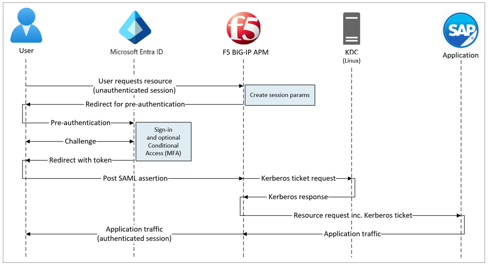
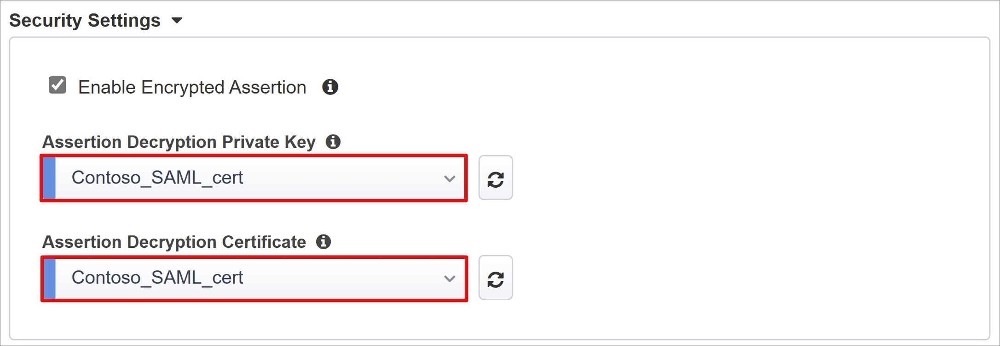
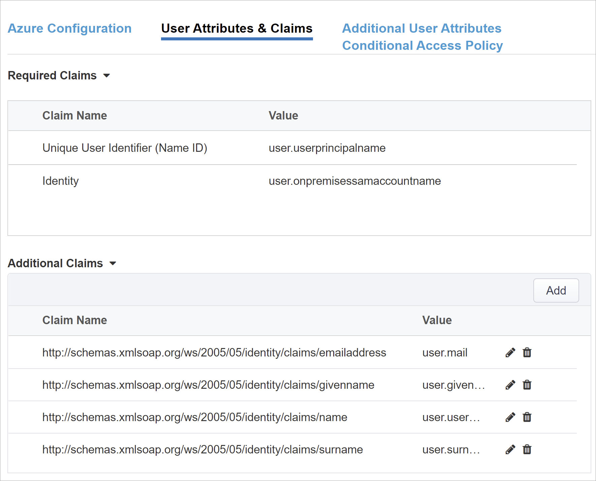
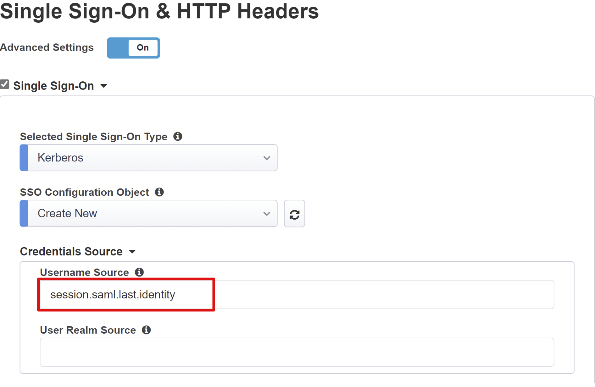

# Tutorial: Configure F5 BIG-IP Easy Button for SSO to SAP ERP

In this article, learn to secure SAP ERP using Azure Active Directory (Azure AD), with F5 BIG-IP Easy Button Guided Configuration 16.1. Integrating a BIG-IP with Azure AD has many benefits:

* [Zero Trust framework to enable remote work](https://www.microsoft.com/security/blog/2020/04/02/announcing-microsoft-zero-trust-assessment-tool/) 
* [What is Conditional Access?](../conditional-access/overview.md)
* Single sign-on (SSO) between Azure AD and BIG-IP published services
* Manage identities and access from the [Azure portal](https://portal.azure.com/)

Learn more: 

* [Integrate F5 BIG-IP with Azure AD](./f5-aad-integration.md)
* [Enable SSO for an enterprise application](add-application-portal-setup-sso.md).

## Scenario description

This scenario includes the SAP ERP application using Kerberos authentication to manage access to protected content.

Legacy applications lack modern protocols to support integration with Azure AD. Modernization is costly, requires planning, and introduces potential downtime risk. Instead, use an F5 BIG-IP Application Delivery Controller (ADC) to bridge the gap between the legacy application and the modern ID control plane, through protocol transitioning. 

A BIG-IP in front of the application enables overlay jof the service with Azure AD pre-authentication and headers-based SSO. This configuration improves overall application security posture.

## Scenario architecture

The secure hybrid access (SHA) solution has the following components:

* **SAP ERP application** - a BIG-IP published service protected by Azure AD SHA
* **Azure AD** - Security Assertion Markup Language (SAML) identity provider (IdP) that verifies user credentials, Conditional Access, and SAML-based SSO to the BIG-IP
* **BIG-IP** - reverse-proxy and SAML service provider (SP) to the application. BIG-IP delegates authentication to the SAML IdP then performs header-based SSO to the SAP service

SHA supports SP and IdP initiated flows. The following image illustrates the SP-initiated flow.

   

1. User connects to application endpoint (BIG-IP)
2. BIG-IP APM access policy redirects user to Azure AD (SAML IdP)
3. Azure AD pre-authenticates user and applies enforced Conditional Access policies
4. User is redirected to BIG-IP (SAML SP) and SSO occurs with issued SAML token 
5. BIG-IP requests Kerberos ticket from KDC
6. BIG-IP sends request to back-end application, with the Kerberos ticket for SSO
7. Application authorizes request and returns payload

## Prerequisites

You need:

* An Azure AD free account, or above
  * If you don't have one, get an [Azure free account](https://azure.microsoft.com/free/active-directory/)
* An BIG-IP or a BIG-IP Virtual Edition (VE) in Azure
  * See, [Deploy F5 BIG-IP Virtual Edition VM in Azure](./f5-bigip-deployment-guide.md)
* Any of the following F5 BIG-IP licenses:
    * F5 BIG-IP® Best bundle
    * F5 BIG-IP APM standalone license
    * F5 BIG-IP APM add-on license on an existing BIG-IP F5 BIG-IP® Local Traffic Manager™ (LTM)
    * 90-day BIG-IP full feature [trial license](https://www.f5.com/trial/big-ip-trial.php).
* User identities synchronized from an on-premises directory to Azure AD, or created in Azure AD and flowed back to the on-premises directory
  * See, [Azure AD Connect sync: Understand and customize synchronization](../hybrid/how-to-connect-sync-whatis.md)
* An account with Azure AD Application Admin permissions
  * See, [Azure AD built-in roles](../roles/permissions-reference.md)
* An SSL Web certificate to publish services over HTTPS, or use default BIG-IP certs for testing
  * See, [Deploy F5 BIG-IP Virtual Edition VM in Azure](./f5-bigip-deployment-guide.md)
* An SAP ERP environment configured for Kerberos authentication

## BIG-IP configuration methods

This tutorial uses Guided Configuration 16.1 with an Easy Button template. With the Easy Button, admins don't go between Azure AD and a BIG-IP to enable services for SHA. The deployment and policy management is handled by the APM Guided Configuration wizard and Microsoft Graph. This integration ensures applications support identity federation, SSO, and Conditional Access.

   >[!NOTE] 
   > Replace example strings or values in this guide with those in your environment.

## Register Easy Button

Before a client or service accesses Microsoft Graph, the Microsoft identity platform must trust it. 

See, [Quickstart: Register an application with the Microsoft identity platform](../develop/quickstart-register-app.md)

Register the Easy Button client in Azure AD, then it's allowed to establish a trust between SAML SP instances of a BIG-IP published application, and Azure AD as the SAML IdP.

1. Sign in to the [Azure portal](https://portal.azure.com/) with with Application Administrator permisssions.
2. In the left navigation pane, select the **Azure Active Directory** service.
3. Under Manage, select **App registrations > New registration**.
4. Enter a **Name**. 
5. In **Accounts in this organizational directory only**, specify who can use the application.
6. Select **Register**.
7. Navigate to **API permissions**.
8. Authorize the following Microsoft Graph Application permissions:

   * Application.Read.All
   * Application.ReadWrite.All
   * Application.ReadWrite.OwnedBy
   * Directory.Read.All
   * Group.Read.All
   * IdentityRiskyUser.Read.All
   * Policy.Read.All
   * Policy.ReadWrite.ApplicationConfiguration
   * Policy.ReadWrite.ConditionalAccess
   * User.Read.All

9. Grant admin consent for your organization.
10. In the **Certificates & Secrets** blade, generate a new **client secret**.
11. Note the secret to use later.
12. From **Overview**, note the **Client ID** and **Tenant ID**.

## Configure the Easy Button

1. Initiate the APM Guided Configuration.
2. Launch the Easy Button template.
3. From a browser, sign-in to the F5 BIG-IP management console.
4. Navigate to **Access > Guided Configuration > Microsoft Integration**.
5. Select **Azure AD Application**.

  

3. Review the configuration list.
4. Select **Next**

  

4. Follow the configuration sequence under **Azure AD Application Configuration**.

  
   
### Configuration Properties

The **Configuration Properties** tab has service account properties and creates a BIG-IP application config and SSO object. The **Azure Service Account Details** section represents the client you registered as an application, in the Azure AD tenant. Use the settings for BIG-IP OAuth client to individually register a SAML SP in the tenant, with the SSO properties. Easy Button does this action for BIG-IP services published and enabled for SHA.

   > [!NOTE]
   > Some settings are global and can be re-used to publish more applications.

1. Enter a **Configuration Name**. Unique names differentiate Easy Button configurations.
2. For **Single Sign-On (SSO) & HTTP Headers**, select **On**.
3. For **Tenant ID, Client ID,** and **Client Secret**, enter the Tentant ID, Client ID, and Client Secret you noted during tenant registration.
4. Click **Test Connection**. This action confirms the BIG-IP connects to your tenant.
5. Select **Next**

   
   
### Service Provider

Use the Service Provider settings to define SAML SP instance properties of the application secured by SHA.

1. For **Host**, enter the public fully qualified domain name (FQDN) of the application being secured.
2. For **Entity ID**, enter the identifier Azure AD uses to identify the SAML SP requesting a token.

   

3. (Optional) Use **Security Settings** to indicate Azure AD encrypts issued SAML assertions. Assertions encrypted between Azure AD and the BIG-IP APM increase assurance that content tokens aren't intercepted, nor data compromised.
4. From **Assertion Decryption Private Key**, select **Create New**.
 
   

5.	Select **OK**. 
6.	The **Import SSL Certificate and Keys** dialog appears in a new tab. 

5.	To import the certificate and private key, select **PKCS 12 (IIS)**. 
6.	Close the browser tab to return to the main tab.

   

7.	For **Enable Encrypted Assertion**, check the box.
8.	If you enabled encryption, from the **Assertion Decryption Private Key** list, select the key. This is the private key for certificate BIG-IP APM uses to decrypt Azure AD assertions.
9.	If you enabled encryption, from the **Assertion Decryption Certificate** list, select the certificate. This is the certificate BIG-IP uploads to Azure AD to encrypt the issued SAML assertions.

   

### Azure Active Directory

Easy Button has application templates for Oracle PeopleSoft, Oracle E-Business Suite, Oracle JD Edwards, SAP ERP, and a generic SHA template. 

1. To start Azure configuration, select **SAP ERP Central Component > Add**.

   
   
   > [!NOTE]
   > You can use the information in the following sections when manually configuring a new BIG-IP SAML application in an Azure AD tenant. 

#### Azure Configuration

1. For **Display Name** enter the app BIG-IP creates in the Azure AD tenant. The name appears on the icon in the [My Apps](https://myapplications.microsoft.com/) portal.
2. (Optional) leave **Sign On URL (optional)** blank.

   

3. Next to **Signing Key** select **refresh**.
4. Select **Signing Certificate**. This action locates the certificate you entered.
5. For **Signing Key Passphrase**, enter the certificate password.
6. (Optional) Enable **Signing Option**. This option ensures BIG-IP accepts tokens and claims signed by Azure AD

   

7. **User and User Groups** are dynamically queried from your Azure AD tenant. Groups help authorize application access. 
8. Add a user or group for testing, otherwise access is denied.

   

#### User Attributes & Claims

When a user successfully authenticates to Azure AD, it issues a SAML token with a default set of claims and attributes uniquely identifying the user. The **User Attributes & Claims tab** shows the default claims to issue for the new application. It also lets you configure more claims.

As our example AD infrastructure is based on a .com domain suffix used both, internally and externally, we don’t require any additional attributes to achieve a functional KCD SSO implementation. See the [advanced tutorial](./f5-big-ip-kerberos-advanced.md) for cases where you have multiple domains or user’s login using an alternate suffix. 

   
   
You can include additional Azure AD attributes, if necessary, but for this scenario SAP ERP only requires the default attributes.

#### Additional User Attributes

The **Additional User Attributes** tab can support a variety of distributed systems requiring attributes stored in other directories, for session augmentation. Attributes fetched from an LDAP source can then be injected as additional SSO headers to further control access based on roles, Partner IDs, etc.

   

>[!NOTE] 
>This feature has no correlation to Azure AD but is another source of attributes.

#### Conditional Access Policy

CA policies are enforced post Azure AD pre-authentication, to control access based on device, application, location, and risk signals.

The **Available Policies** view, by default, will list all CA policies that do not include user based actions.

The **Selected Policies** view, by default, displays all policies targeting All cloud apps. These policies cannot be deselected or moved to the Available Policies list as they are enforced at a tenant level.

To select a policy to be applied to the application being published:

1.	Select the desired policy in the **Available Policies** list
2.	Select the right arrow and move it to the **Selected Policies** list

Selected policies should either have an **Include** or **Exclude** option checked. If both options are checked, the selected policy is not enforced.

>[!NOTE]
>The policy list is enumerated only once when first switching to this tab. A refresh button is available to manually force the wizard to query your tenant, but this button is displayed only when the application has been deployed. 

### Virtual Server Properties

A virtual server is a BIG-IP data plane object represented by a virtual IP address listening for client requests to the application. Any received traffic is processed and evaluated against the APM profile associated with the virtual server, before being directed according to the policy results and settings.

1. Enter **Destination Address**. This is any available IPv4/IPv6 address that the BIG-IP can use to receive client traffic. A corresponding record should also exist in DNS, enabling clients to resolve the external URL of your BIG-IP published application to this IP, instead of the appllication itself. Using a test PC's localhost DNS is fine for testing

2. Enter **Service Port** as *443* for HTTPS

3. Check **Enable Redirect Port** and then enter **Redirect Port**. It redirects incoming HTTP client traffic to HTTPS

4. The Client SSL Profile enables the virtual server for HTTPS, so that client connections are encrypted over TLS. Select the **Client SSL Profile** you created as part of the prerequisites or leave the default whilst testing

  

### Pool Properties

The **Application Pool tab** details the services behind a BIG-IP, represented as a pool containing one or more application servers.

1. Choose from **Select a Pool.** Create a new pool or select an existing one

2. Choose the **Load Balancing Method** as *Round Robin*

3. For **Pool Servers** select an existing server node or specify an IP and port for the backend node hosting the header-based application

   

#### Single Sign-On & HTTP Headers

Enabling SSO allows users to access BIG-IP published services without having to enter credentials. The **Easy Button wizard** supports Kerberos, OAuth Bearer, and HTTP authorization headers for SSO. You will need the Kerberos delegation account created earlier to complete this step. 

Enable **Kerberos** and **Show Advanced Setting** to enter the following:

* **Username Source:** Specifies the preferred username to cache for SSO. You can provide any session variable as the source of the user ID, but *session.saml.last.identity* tends to work best as it holds the Azure AD claim containing the logged in user ID

* **User Realm Source:** Required if the user domain is different to the BIG-IP’s kerberos realm. In that case, the APM session variable would contain the logged in user domain. For example,*session.saml.last.attr.name.domain*

   

* **KDC:** IP of a Domain Controller (Or FQDN if DNS is configured & efficient)

* **UPN Support:** Enable for the APM to use the UPN for kerberos ticketing 

* **SPN Pattern:** Use HTTP/%h to inform the APM to use the host header of the client request and build the SPN that it is requesting a kerberos token for.

* **Send Authorization:** Disable for applications that prefer negotiating authentication instead of receiving the kerberos token in the first request. For example, *Tomcat.*

   
   
### Session Management

The BIG-IPs session management settings are used to define the conditions under which user sessions are terminated or allowed to continue, limits for users and IP addresses, and corresponding user info. Consult [F5 documentation]( https://support.f5.com/csp/article/K18390492) for details on these settings.

What isn’t covered however is Single Log-Out (SLO) functionality, which ensures all sessions between the IdP, the BIG-IP, and the user agent are terminated as users log off.
 When the Easy Button deploys a SAML application to your Azure AD tenant, it also populates the Logout Url with the APM’s SLO endpoint. That way IdP initiated sign-outs from the Microsoft [MyApps portal]( https://support.microsoft.com/en-us/account-billing/sign-in-and-start-apps-from-the-my-apps-portal-2f3b1bae-0e5a-4a86-a33e-876fbd2a4510) also terminate the session between the BIG-IP and a client.

During deployment, the SAML federation metadata for the published application is imported from your tenant, providing the APM the SAML logout endpoint for Azure AD. This helps SP initiated sign-outs terminate the session between a client and Azure AD.

## Summary

This last step provides a breakdown of your configurations. Select **Deploy** to commit all settings and verify that the application now exists in your tenants list of Enterprise applications.

## Next steps

From a browser, **connect** to the application’s external URL or select the **application’s icon** in the [Microsoft MyApps portal](https://myapps.microsoft.com/). After authenticating to Azure AD, you’ll be redirected to the BIG-IP virtual server for the application and automatically signed in through SSO.

For increased security, organizations using this pattern could also consider blocking all direct access to the application, thereby forcing a strict path through the BIG-IP.

## Advanced deployment

There may be cases where the Guided Configuration templates lacks the flexibility to achieve more specific requirements. For those scenarios, see [Advanced Configuration for kerberos-based SSO](./f5-big-ip-kerberos-advanced.md).

Alternatively, the BIG-IP gives you the option to disable **Guided Configuration’s strict management mode**. This allows you to manually tweak your configurations, even though bulk of your configurations are automated through the wizard-based templates.

You can navigate to **Access > Guided Configuration** and select the **small padlock icon** on the far right of the row for your applications’ configs. 
 
   

At that point, changes via the wizard UI are no longer possible, but all BIG-IP objects associated with the published instance of the application will be unlocked for direct management.

>[!NOTE]
>Re-enabling strict mode and deploying a configuration will overwrite any settings performed outside of the Guided Configuration UI, therefore we recommend the advanced configuration method for production services.

## Troubleshooting

You can fail to access the SHA protected application due to any number of factors, including a misconfiguration.

* Kerberos is time sensitive, so requires that servers and clients be set to the correct time and where possible synchronized to a reliable time source

* Ensure the hostname for the domain controller and web application are resolvable in DNS

* Ensure there are no duplicate SPNs in your AD environment by executing the following query at the command line on a domain PC: setspn -q HTTP/my_target_SPN

You can refer to our [App Proxy guidance](../app-proxy/application-proxy-back-end-kerberos-constrained-delegation-how-to.md) to validate an IIS application is configured appropriately for KCD. F5’s article on [how the APM handles Kerberos SSO](https://techdocs.f5.com/en-us/bigip-15-1-0/big-ip-access-policy-manager-single-sign-on-concepts-configuration/kerberos-single-sign-on-method.html) is also a valuable resource.

### Log analysis

BIG-IP logging can help quickly isolate all sorts of issues with connectivity, SSO, policy violations, or misconfigured variable mappings. Start troubleshooting by increasing the log verbosity level.

1. Navigate to **Access Policy > Overview > Event Logs > Settings**

2. Select the row for your published application, then **Edit > Access System Logs**

3. Select **Debug** from the SSO list, and then select **OK**

Reproduce your issue, then inspect the logs, but remember to switch this back when finished as verbose mode generates lots of data. 

If you see a BIG-IP branded error immediately after successful Azure AD pre-authentication, it’s possible the issue relates to SSO from Azure AD to the BIG-IP.

1. Navigate to **Access > Overview > Access reports**

2. Run the report for the last hour to see logs provide any clues. The **View session variables** link for your session will also help understand if the APM is receiving the expected claims from Azure AD.

If you don’t see a BIG-IP error page, then the issue is probably more related to the backend request or SSO from the BIG-IP to the application. 

1. Navigate to **Access Policy > Overview > Active Sessions**

2. Select the link for your active session. The **View Variables** link in this location may also help determine root cause KCD issues, particularly if the BIG-IP APM fails to obtain the right user and domain identifiers from session variables

See [BIG-IP APM variable assign examples]( https://devcentral.f5.com/s/articles/apm-variable-assign-examples-1107) and [F5 BIG-IP session variables reference]( https://techdocs.f5.com/en-us/bigip-15-0-0/big-ip-access-policy-manager-visual-policy-editor/session-variables.html) for more info.
