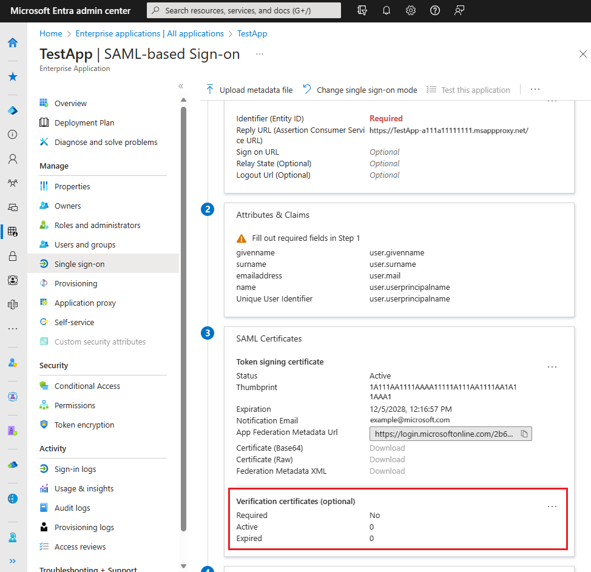
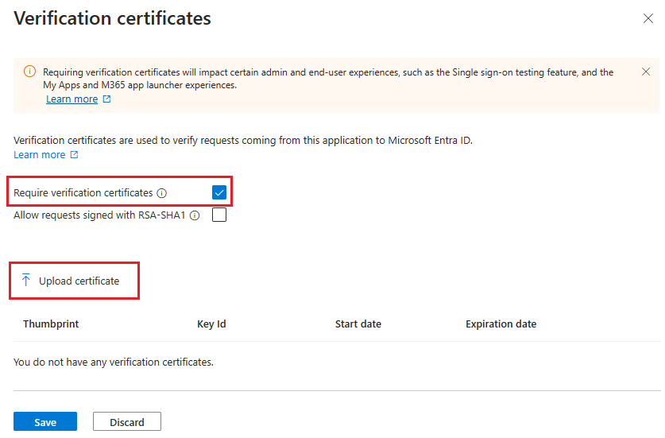

--- 
title: enforce signed SAML authentication requests 
description: Learn how to enforce signed SAML authentication requests. 
services: active-directory 
author: AllisonAm 
manager: CelesteDG 
ms.service: active-directory 
ms.subservice: app-mgmt 
ms.workload: identity 
ms.topic: conceptual 
ms.date: 06/29/2022 
ms.author: alamaral 
ms.collection: M365-identity-device-management 
--- 

# SAML Request Signature Verification (Preview)  

SAML Request Signature Verification is a functionality that validates the signature of signed authentication requests. An App Admin now can enable and disable the enforcement of signed requests and upload the public keys that should be used to do the validation.  

If enabled Azure Active Directory will validate the requests against the public keys configured. There are some scenarios where the authentication requests can fail:  

- Protocol not allowed for signed requests. Only SAML protocol is supported.  
- Request not signed, but verification is enabled.  
- No verification certificate configured for SAML request signature verification.  
- Signature verification failed.  
- Key identifier in request is missing and two most recently added certificates don't match with the request signature.  
- Request signed but algorithm missing.  
- No certificate matching with provided key identifier.  
- Signature algorithm not allowed. Only RSA-SHA256 is supported.  

## To configure SAML Request Signature Verification in the Azure portal 

1. Inside the Azure Portal, navigate to **Azure Active Directory** from the Search bar or Azure Services. 

 

2. Navigate to **Enterprise applications** from the left menu.  

 

3. Select the application you wish to apply the changes.  

4. Navigate to **Single sign-on.**  

5. In the **Single sign-on** screen, there's a new subsection called **Verification certificates** under **SAML Certificates.** 

 

6. Click on **Edit.**  

7. In the new blade, you'll be able to enable the verification of signed requests and opt-in for weak algorithm verification in case your application still uses RSA-SHA1 to sign the authentication requests.   

8. To enable the verification of signed requests, click **Enable verification certificates** and upload a verification public key that matches with the private key used to sign the request. 

 

 

 

9. Once you have your verification certificate uploaded, click **Save.** 

 

 

10. When the verification of signed requests is enabled, the test experience is disabled as the requests requires to be signed by the service provider.  

 

11. If you want to see the current configuration of an enterprise application, you can navigate to the **Single Sign-on** screen and see the summary of your configuration under **SAML Certificates**. There you'll be able to see if the verification of signed requests is enabled and the count of Active and Expired verification certificates. 

 

## Next steps  

* Find out [How Azure AD uses the SAML protocol](../develop/active-directory-saml-protocol-reference.md) 
* Learn the format, security characteristics, and contents of [SAML tokens in Azure AD](../develop/reference-saml-tokens.md) 