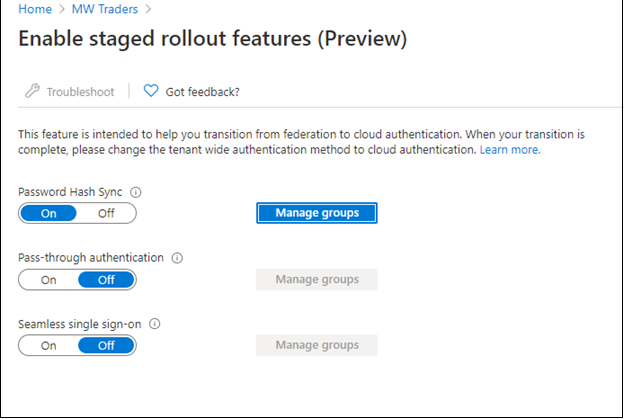
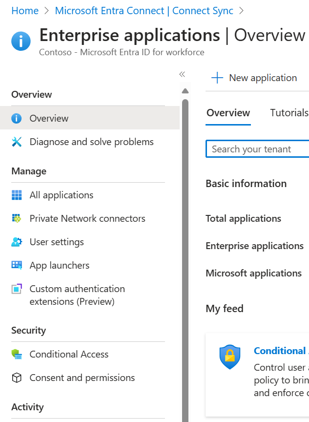
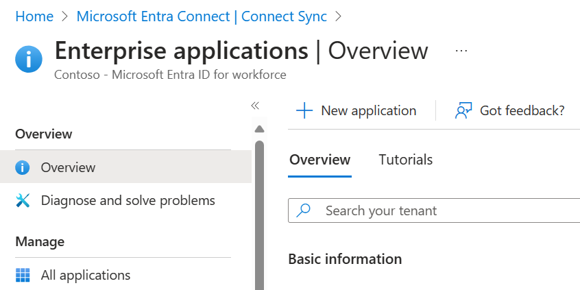
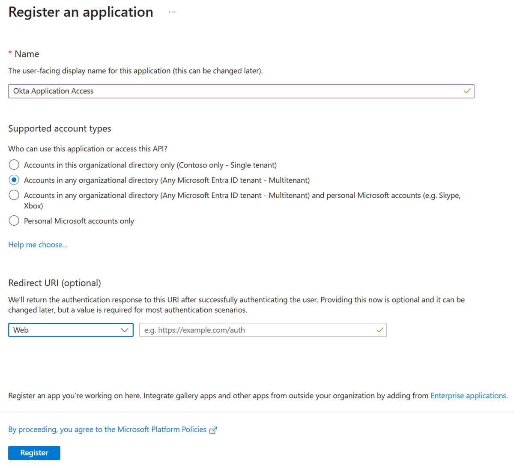
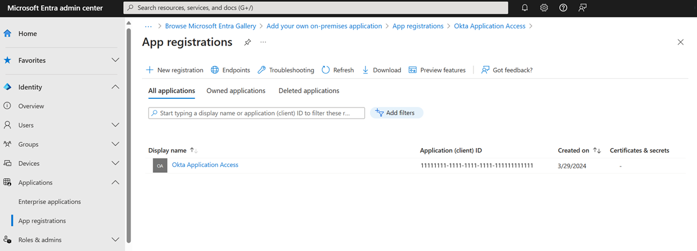
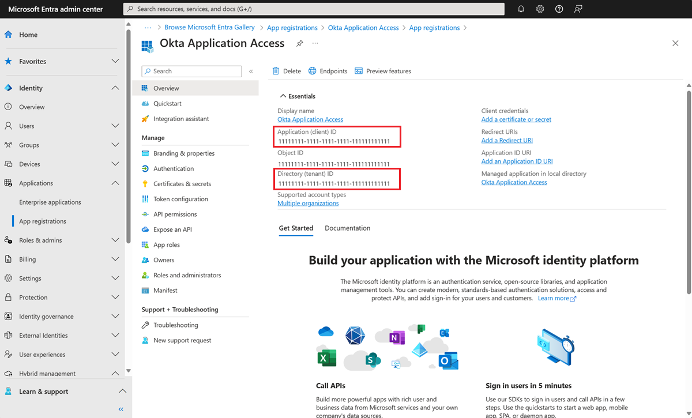
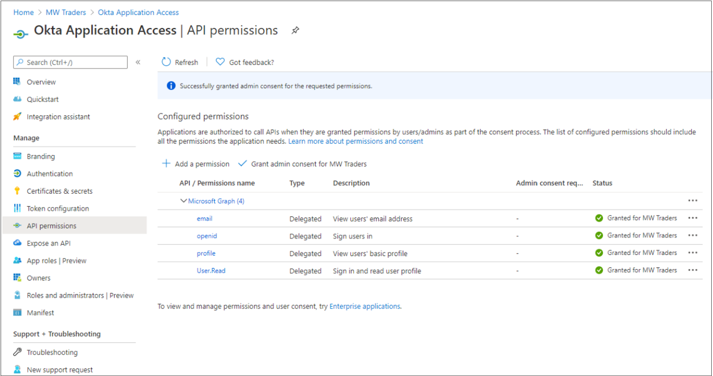
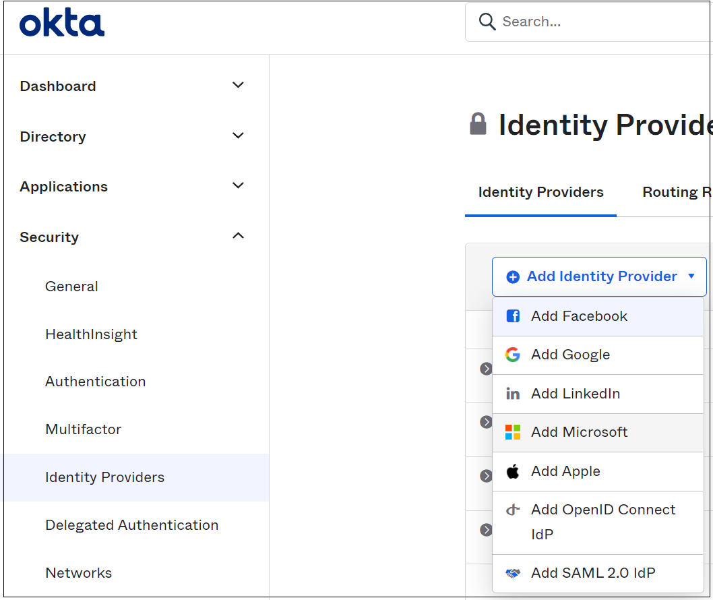
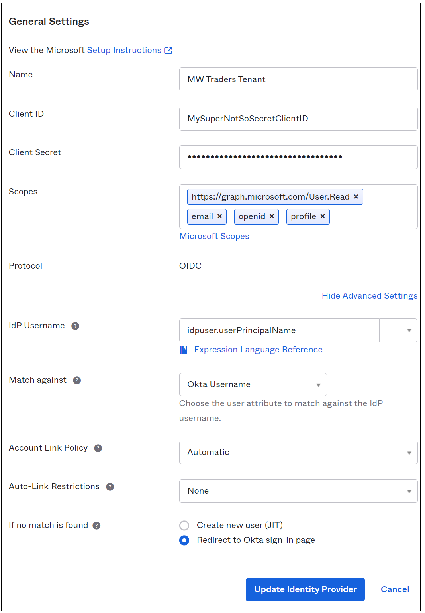
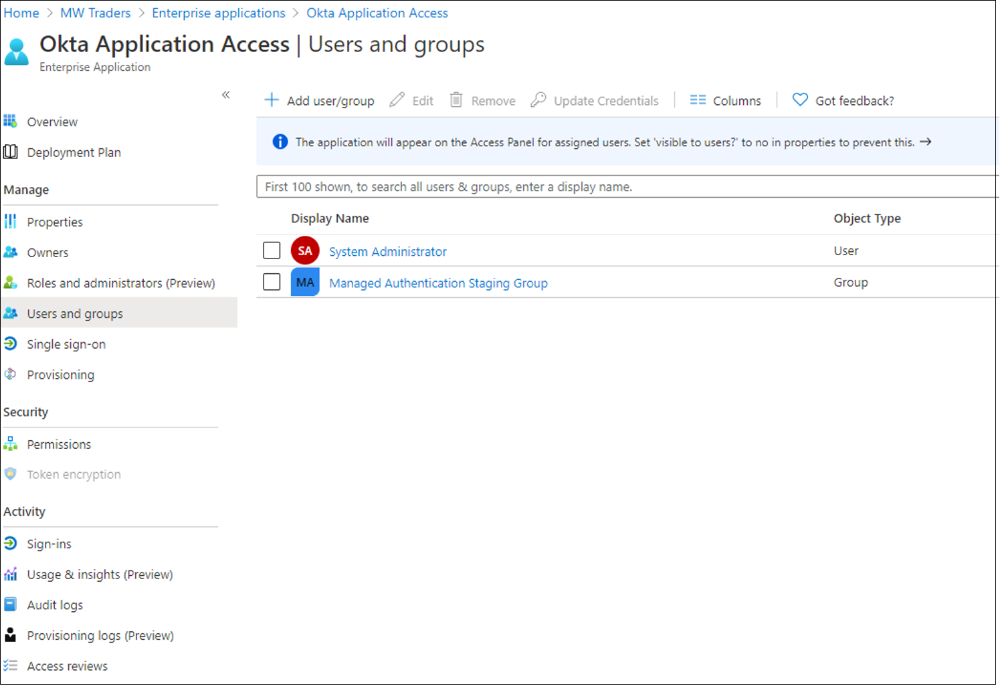

# Tutorial: Migrate Okta federation to Microsoft Entra ID-managed authentication

In this tutorial, learn to federate Office 365 tenants with Okta for single sign-on (SSO).

You can migrate federation to Microsoft Entra ID in a staged manner to ensure a good authentication experience for users. In a staged migration, you can test reverse federation access to remaining Okta SSO applications.

>[!NOTE]
>Scenario described in this tutorial is only one possible way of implementing the migration. You should try to adapt the information to your specific setup.

## Prerequisites

- An Office 365 tenant federated to Okta for SSO
- A Microsoft Entra Connect server or Microsoft Entra Connect cloud provisioning agents configured for user provisioning to Microsoft Entra ID
- One of the following roles: Global Administrator, Application Administrator, Cloud Application Administrator, or Hybrid Identity Administrator.

<a name='configure-azure-ad-connect-for-authentication'></a>

## Configure Microsoft Entra Connect for authentication

Customers that federate their Office 365 domains with Okta might not have a valid authentication method in Microsoft Entra ID. Before you migrate to managed authentication, validate Microsoft Entra Connect and configure it for user sign-in.

Set up the sign-in method:

* **Password hash synchronization** - an extension of the directory synchronization feature implemented by Microsoft Entra Connect server or cloud-provisioning agents
  * Use this feature to sign in to Microsoft Entra services like Microsoft 365
  * Sign in to the service with the password to sign in to the on-premises Active Directory instance
  * See, [What is password hash synchronization with Microsoft Entra ID?](../hybrid/connect/whatis-phs.md)
* **Pass-through authentication** - sign in to on-premises and cloud applications with the same passwords 
  * When users sign in through Microsoft Entra ID, the pass-through authentication agent validates passwords against the on-premises AD
  * See, [User sign-in with Microsoft Entra pass-through authentication](../hybrid/connect/how-to-connect-pta.md)
* **Seamless SSO** - signs in users on corporate desktops connected to the corporate network
  * Users have access to cloud applications without other on-premises components
  * See, [Microsoft Entra seamless SSO](../hybrid/connect/how-to-connect-sso.md)

To create a seamless authentication user experience in Microsoft Entra ID, deploy seamless SSO to password hash synchronization or pass-through authentication.

For prerequisites of seamless SSO see, [Quickstart: Microsoft Entra seamless single sign-on](../hybrid/connect/how-to-connect-sso-quick-start.md#step-1-check-the-prerequisites).

For this tutorial, you configure password hash synchronization and seamless SSO.

<a name='configure-azure-ad-connect-for-password-hash-synchronization-and-seamless-sso'></a>

### Configure Microsoft Entra Connect for password hash synchronization and seamless SSO

1. On the Microsoft Entra Connect server, open the **Microsoft Entra Connect** app.
2. Select **Configure**.

   

3. Select **Change user sign-in**.
4. Select **Next**.

   

5. Enter the credentials of the Global Administrator of the Microsoft Entra Connect server.

   

6. The server is configured for federation with Okta. Change the selection to **Password Hash Synchronization**. 
7. Select **Enable single sign-on**.
8. Select **Next**.
9. For the local on-premises system, enter the domain administrator credentials. 
10. Select **Next**.

   

11. On the final page, select **Configure**.

   

12. Ignore the warning for Microsoft Entra hybrid join. 

   

## Configure staged rollout features

[!INCLUDE [portal updates](~/includes/portal-update.md)]

Before you test defederating a domain, in Microsoft Entra ID use a cloud authentication staged rollout to test defederating users. 

Learn more: [Migrate to cloud authentication using Staged Rollout](../hybrid/connect/how-to-connect-staged-rollout.md)

After you enable password hash sync and seamless SSO on the Microsoft Entra Connect server, configure a staged rollout:

1. Sign in to the [Microsoft Entra admin center](https://entra.microsoft.com) as at least a [Hybrid Identity Administrator](~/identity/role-based-access-control/permissions-reference.md#hybrid-identity-administrator).
2. Browse to **Identity** > **Hybrid management** > **Microsoft Entra Connect** > **Connect Sync**. 
3. Confirm **Password Hash Sync** is enabled in the tenant.
4. Select **Enable staged rollout for managed user sign-in**.

   

5. After the server configuration, **Password Hash Sync** setting can change to **On**. 
6. Enable the setting.
7. **Seamless single sign-on** is **Off**. If you enable it, an error appears because it's enabled in the tenant.
8. Select **Manage groups**.

   

9. Add a group to the password hash sync rollout. In the following example, the security group starts with 10 members.

   

10. Wait about 30 minutes for the feature to take effect in your tenant. 
11. When the feature takes effect, users aren't redirected to Okta when attempting to access Office 365 services.

The staged rollout feature has some unsupported scenarios:

* Legacy authentication protocols such as POP3 and SMTP aren't supported.
* If you configured Microsoft Entra hybrid join for Okta, the Microsoft Entra hybrid join flows go to Okta until the domain is defederated. 
  * A sign-on policy remains in Okta for legacy authentication of Microsoft Entra hybrid join Windows clients.

<a name='create-an-okta-app-in-azure-ad'></a>

## Create an Okta app in Microsoft Entra ID

Users that converted to managed authentication might need access to applications in Okta. For user access to those applications, register a Microsoft Entra application that links to the Okta home page.

Configure the enterprise application registration for Okta.

1. Sign in to the [Microsoft Entra admin center](https://entra.microsoft.com) as at least a [Cloud Application Administrator](~/identity/role-based-access-control/permissions-reference.md#cloud-application-administrator). 
2. Browse to **Identity** > **Applications** > **Enterprise applications** > **All applications**.

   

3. Select **New application**.

   

4. Select **Create your own application**. 
5. On the menu, name the Okta app.
6. Select **Register an application you're working on to integrate with Microsoft Entra ID**. 
7. Select **Create**.
8. Select **Accounts in any organizational directory (Any Microsoft Entra Directory - Multitenant)**.
9. Select **Register**.

   

10. On the Microsoft Entra ID menu, select **App registrations**. 
11. Open the created registration.

   

12. Record the Tenant ID and Application ID.

   >[!Note]
   >You need the Tenant ID and Application ID to configure the identity provider in Okta.

   

13. On the left menu, select **Certificates & secrets**. 
14. Select **New client secret**. 
15. Enter a secret name.
16. Enter its expiration date.
17. Record the secret value and ID.

   >[!NOTE]
   >The value and ID don't appear later. If you don't record the information, you must regenerate a secret.

   

18. On the left menu, select **API permissions**. 
19. Grant the application access to the OpenID Connect (OIDC) stack.
20. Select **Add a permission**.
21. Select **Microsoft Graph**
22. Select **Delegated permissions**.
23. In the OpenID permissions section, add **email**, **openid**, and **profile**. 
24. Select **Add permissions**.
25. Select **Grant admin consent for \<tenant domain name>**.
26. Wait for the **Granted** status to appear.

    

27. On the left menu, select **Branding**. 
28. For **Home page URL**, add your user application home page.

    

29. In the Okta administration portal, to add a new identity provider, select **Security** then **Identity Providers**. 
30. Select **Add Microsoft**.

    

31. On the **Identity Provider** page, enter the Application ID in the **Client ID** field. 
32. Enter the client secret in the **Client Secret** field.
33. Select **Show Advanced Settings**. By default, this configuration ties the user principal name (UPN) in Okta to the UPN in Microsoft Entra ID for reverse-federation access.

    >[!IMPORTANT]
    >If UPNs in Okta and Microsoft Entra ID don't match, select an attribute that's common between users.

34. Complete autoprovisioning selections. 
35. By default, if no match appears for an Okta user, the system attempts to provision the user in Microsoft Entra ID. If you migrated provisioning away from Okta, select **Redirect to Okta sign-in page**.

    

You created the identity provider (IDP). Send users to the correct IDP.

1. On the **Identity Providers** menu, select **Routing Rules** then **Add Routing Rule**. 
2. Use one of the available attributes in the Okta profile.
3. To direct sign-ins from devices and IPs to Microsoft Entra ID, set up the policy seen in following image. In this example, the **Division** attribute is unused on all Okta profiles. It's a good choice for IDP routing.

    

4. Record the redirect URI to add it to the application registration.

    

5. On the application registration, on the left menu, select **Authentication**. 
6. Select **Add a platform**
7. Select **Web**.
8. Add the redirect URI you recorded in the IDP in Okta. 
9. Select **Access tokens** and **ID tokens**.

    

10. In the admin console, select **Directory**.
11. Select **People**. 
12. Select a test user to edit the profile.
13. In the profile, add **ToAzureAD**. See the following image. 
14. Select **Save**.

    

15. Sign in to the [Microsoft 356 portal](https://portal.office.com) as the modified user. If your user isn't in the managed authentication pilot, your action enters a loop. To exit the loop, add the user to the managed authentication experience.

## Test Okta app access on pilot members

After you configure the Okta app in Microsoft Entra ID and configure the IDP in the Okta portal, assign the application to users.

1. In the Microsoft Entra admin center, browse to **Identity** > **Applications** > **Enterprise applications**.
2. Select the app registration you created.
3. Go to **Users and groups**. 
4. Add the group that correlates with the managed authentication pilot.

   >[!NOTE]
   >You can add users and groups from the **Enterprise applications** page. You can't add users from the **App registrations** menu.

   

5. Wait about 15 minutes.
6. Sign in as a managed authentication pilot user.
7. Go to [My Apps](https://myapplications.microsoft.com).

   

8. To return to the Okta home page, select the **Okta Application Access** tile.

## Test managed authentication on pilot members

After you configure the Okta reverse-federation app, ask users to conduct testing on the managed authentication experience. We recommend you configure company branding to help users recognize the tenant.

Learn more: [Configure your company branding](../fundamentals/how-to-customize-branding.md).

  >[!IMPORTANT]
  >Before you defederate the domains from Okta, identify needed Conditional Access policies. You can secure your environment before cut-off. See, [Tutorial: Migrate Okta sign-on policies to Microsoft Entra Conditional Access](migrate-okta-sign-on-policies-conditional-access.md).

## Defederate Office 365 domains

When your organization is comfortable with the managed authentication experience, you can defederate your domain from Okta. To begin, use the following commands to connect to Microsoft Graph PowerShell. If you don't have the Microsoft Graph PowerShell module, download it by entering `Install-Module Microsoft.Graph`.

1. In PowerShell, sign in to Microsoft Entra ID by using a Global Administrator account.
   ```powershell
    Connect-MgGraph -Scopes "Domain.ReadWrite.All", "Directory.AccessAsUser.All"
    ```

2. To convert the domain, run the following command:
   ```powershell
    Update-MgDomain -DomainId yourdomain.com -AuthenticationType "Managed"
    ```

3. Verify that the domain has been converted to managed by running the command below.  The Authentication type should be set to managed.
    ```powershell
    Get-MgDomain -DomainId yourdomain.com
    ```

After you set the domain to managed authentication, you've defederated your Office 365 tenant from Okta while maintaining user access to the Okta home page.

## Next steps

- [Tutorial: Migrate Okta sync provisioning to Microsoft Entra Connect-based synchronization](migrate-okta-sync-provisioning.md)
- [Tutorial: Migrate Okta sign-on policies to Microsoft Entra Conditional Access](migrate-okta-sign-on-policies-conditional-access.md)
- [Tutorial: Migrate your applications from Okta to Microsoft Entra ID](migrate-applications-from-okta.md)
