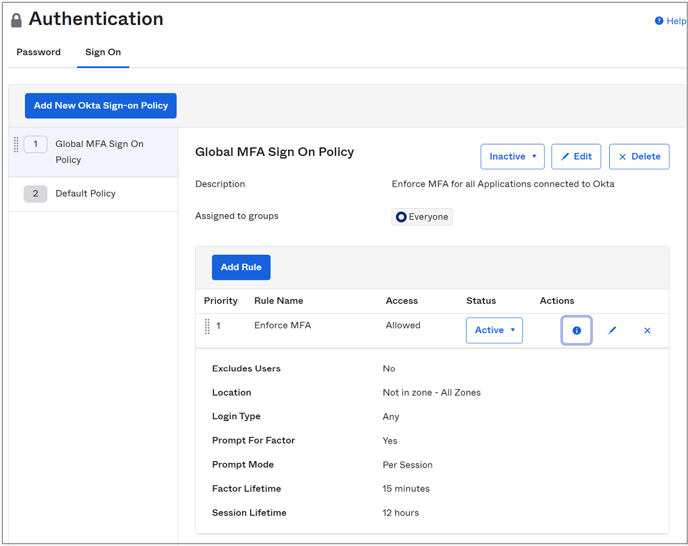
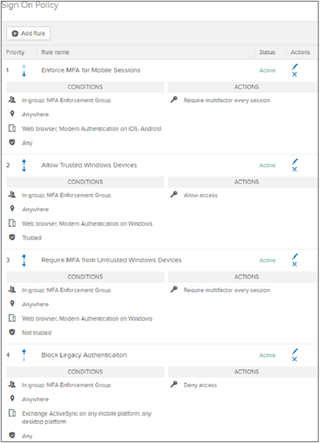
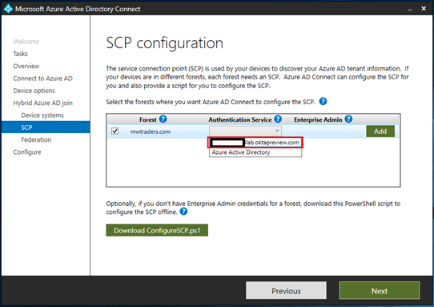
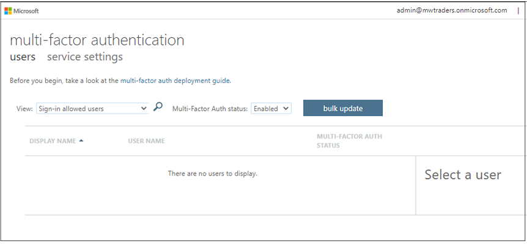
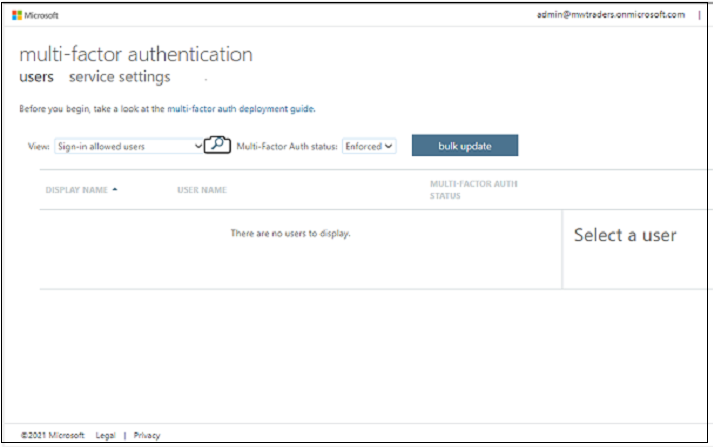
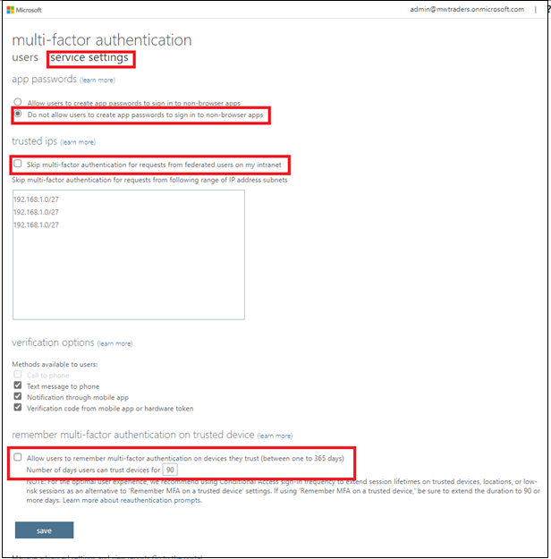
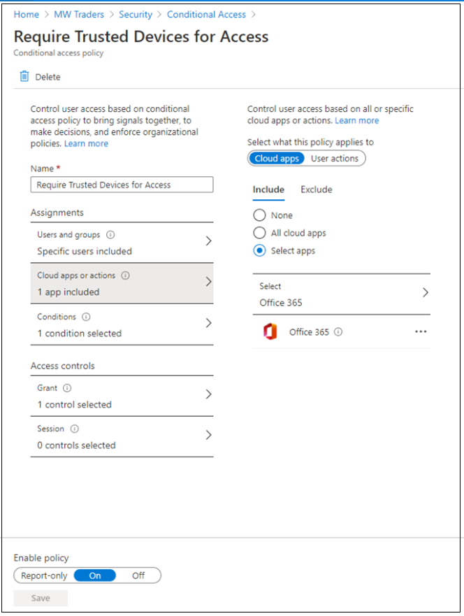
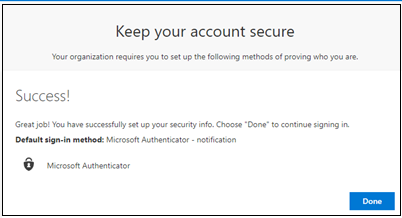
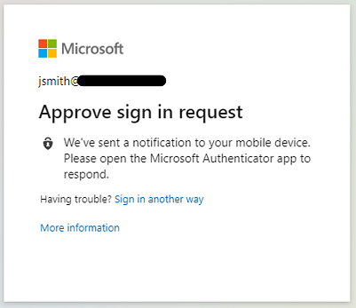
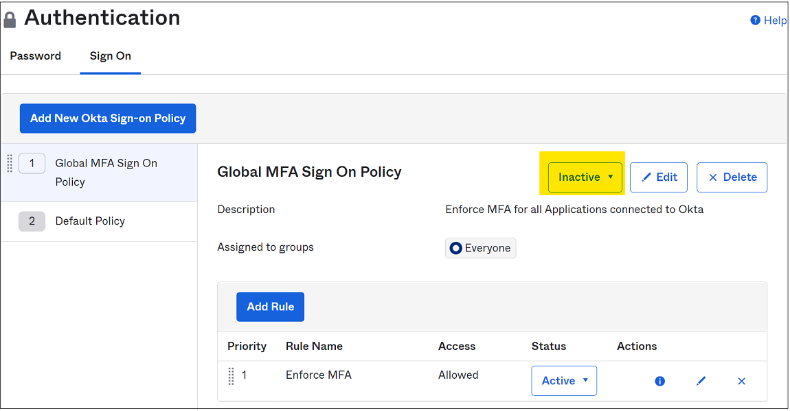

# Tutorial: Migrate Okta sign-on policies to Azure Active Directory Conditional Access

In this tutorial, learn to migrate an organization from global or application-level sign-on policies in Okta Conditional Access in Azure Active Directory (Azure AD). Conditional Access policies secure user access in Azure AD and connected applications.

Learn more: [What is Conditional Access?](/azure/active-directory/conditional-access/overview)

This tutorial assumes you have:

* Office 365 tenant federated to Okta for sign-in and multi-factor authentication
* Azure AD Connect server, or Azure AD Connect cloud provisioning agents configured for user provisioning to Azure AD

## Prerequisites

See the following two sections for licensing and credentials prerequisites.

### Licensing

There are licensing requirements if you switch from Okta sign-on to Conditional Access. The process requires an Azure AD Premium P1 license to enable registration for Azure AD Multi-Factor Authentication (MFA).

Learn more: [Assign or remove licenses in the Azure Active Directory portal](/azure/active-directory/fundamentals/license-users-groups)

### Enterprise Administrator credentials

To configure the service connection point (SCP) record, ensure you have Enterprise Administrator credentials in the on-premises forest.

## Evaluate Okta sign-on policies for transition

Locate and evaluate Okta sign-on policies to determine what will be transitioned to Azure AD.

1. In Okta go to **Security** > **Authentication** > **Sign On**.

    

2. Go to **Applications**. 
3. From the submenu, select **Applications**
4. From the **Active apps list**, select the Microsoft Office 365 connected instance.

    

5. Select **Sign On**.
6. Scroll to the bottom of the page.

The Microsoft Office 365 application sign-on policy has four rules:

- **Enforce MFA for mobile sessions** - requires MFA from modern authentication or browser sessions on iOS or Android
- **Allow trusted Windows devices** - prevents unnecessary verification or factor prompts for trusted Okta devices
- **Require MFA from untrusted Windows devices** - requires MFA from modern authentication or browser sessions on untrusted Windows devices
- **Block legacy authentication** - prevents legacy authentication clients from connecting to the service

The following screenshot is conditions and actions for the four rules, on the Sign On Policy screen.

   

## Configure Conditional Access policies

Configure Conditional Access policies to match Okta conditions. However, in some scenarios, you might need more setup:

* Okta network locations to named locations in Azure AD 
  *  [Using the location condition in a Conditional Access policy](../conditional-access/location-condition.md)
* Okta device trust to device-based Conditional Access (two options to evaluate user devices):
  * See the following section, **Hybrid Azure AD join configuration** to synchronize Windows devices, such as Windows 10, Windows Server 2016 and 2019, to Azure AD
  * See the following section, **Configure device compliance**
  * See, [Use hybrid Azure AD join](#hybrid-azure-ad-join-configuration), a feature in Azure AD Connect server that synchronizes Windows devices, such as Windows 10, Windows Server 2016, and Windows Server 2019, to Azure AD
  * See, [Enroll the device in Microsoft Intune](#configure-device-compliance) and assign a compliance policy

### Hybrid Azure AD join configuration

To enable hybrid Azure AD join on your Azure AD Connect server, run the configuration wizard. After configuration, enroll devices.

   >[!NOTE]
   >Hybrid Azure AD join isn't supported with the Azure AD Connect cloud provisioning agents.

1. [Configure hybrid Azure AD join](../devices/howto-hybrid-join.md).
2. On the **SCP configuration** page, select the **Authentication Service** dropdown. 

    

4. Select an Okta federation provider URL.
5. Select **Add**. 
6. Enter your on-premises Enterprise Administrator credentials
7. Select **Next**.

    > [!TIP]
    > If you blocked legacy authentication on Windows clients in the global or app-level sign-on policy, make a rule that enables the hybrid Azure AD join process to finish. Allow the legacy authentication stack for Windows clients.  To enable custom client strings on app policies, contact the [Okta Help Center](https://support.okta.com/help/). 

### Configure device compliance

Hybrid Azure AD join is a replacement for Okta device trust on Windows. Conditional Access policies recognize compliance for devices enrolled in Microsoft Intune.

#### Device compliance policy

* [Use compliance policies to set rules for devices you manage with Intune](/mem/intune/protect/device-compliance-get-started)
* [Create a compliance policy in Microsoft Intune](/mem/intune/protect/create-compliance-policy)

#### Windows 10/11, iOS, iPadOS, and Android enrollment

If you deployed hybrid Azure AD join, you can deploy another group policy to complete auto-enrollment of these devices in Intune.

* [Enrollment in Microsoft Intune](/mem/intune/enrollment/)
* [Quickstart: Set up automatic enrollment for Windows 10/11 devices](/mem/intune/enrollment/quickstart-setup-auto-enrollment)
* [Enroll Android devices](/mem/intune/enrollment/android-enroll)
* [Enroll iOS/iPadOS devices in Intune](/mem/intune/enrollment/ios-enroll)

## Configure Azure AD Multi-Factor Authentication tenant settings

[!INCLUDE [portal updates](~/articles/active-directory/includes/portal-update.md)]

Before you convert to Conditional Access, confirm the base MFA tenant settings for your organization.

1. Sign in to the [Azure portal](https://portal.azure.com).
2. Sign in as a Global Administrator.
3. Select **Azure Active Directory** > **Users** > **Multi-Factor Authentication**.
4. The legacy Azure AD Multi-Factor Authentication portal appears. Or select [Azure AD MFA portal](https://aka.ms/mfaportal).

    

5. Confirm there are no users enabled for legacy MFA: On the **multi-factor authentication** menu, on **Multi-Factor Auth status**, select **Enabled** and **Enforced**. If the tenant has users in the following views, disable them in the legacy menu.

    

6. Ensure the **Enforced** field is empty.
7. Select the **Service settings** option. 
8. Change the **App passwords** selection to **Do not allow users to create app passwords to sign in to non-browser apps**.

   

9. Clear the checkboxes for **Skip multi-factor authentication for requests from federated users on my intranet** and **Allow users to remember multi-factor authentication on devices they trust (between one to 365 days)**.
10. Select **Save**.

    

    >[!NOTE]
    >See [Optimize reauthentication prompts and understand session lifetime for Azure AD MFA](../authentication/concepts-azure-multi-factor-authentication-prompts-session-lifetime.md).

## Build a Conditional Access policy

To configure Conditional Access policies, see [Best practices for deploying and designing Conditional Access](../conditional-access/plan-conditional-access.md#conditional-access-policy-components).

After you configure the prerequisites and established base settings, you can build Conditional Access policy. Policy can be targeted to an application, a test group of users, or both.

Before you get started: 

* [Understand Conditional Access policy components](../conditional-access/plan-conditional-access.md)
* [Building a Conditional Access policy](../conditional-access/concept-conditional-access-policies.md)

1. Sign in to the [Azure portal](https://portal.azure.com). 
2. On **Manage Azure Active Directory**, select **View**.
3. Create a policy. See, [Common Conditional Access policy: Require MFA for all users](../conditional-access/howto-conditional-access-policy-all-users-mfa.md).
4. Create a device trust-based Conditional Access rule.

   

   

5. After you configure the location-based policy and device trust policy, [Block legacy authentication with Azure AD with Conditional Access](/azure/active-directory/conditional-access/block-legacy-authentication).

With these three Conditional Access policies, the original Okta sign-on policies experience is replicated in Azure AD. 

## Enroll pilot members in MFA

Users register for MFA methods. 

For individual registration, users go to [Microsoft Sign-in pane](https://aka.ms/mfasetup).

To manage registration, users go to [Microsoft My Sign-Ins | Security Info](https://aka.ms/mysecurityinfo).

Learn more: [Enable combined security information registration in Azure Active Directory](../authentication/howto-registration-mfa-sspr-combined.md).

   >[!NOTE]
   >If users registered, they're redirected to the **My Security** page, after they satisfy MFA.

## Enable Conditional Access policies

1. To test, change the created policies to **Enabled test user login**.

   

2. On the Office 365 **Sign-In** pane, the test user John Smith is prompted to sign in with Okta MFA and Azure AD MFA.

   

3. Complete the MFA verification through Okta.

   

4. The user is prompted for Conditional Access. 
5. Ensure the policies are configured to be triggered for MFA.

   

## Add organization members to Conditional Access policies

After you conduct testing on pilot members, add the remaining organization members to Conditional Access policies, after registration.

To avoid double-prompting between Azure AD MFA and Okta MFA, opt out from Okta MFA: modify sign-on policies.

1. Go to the Okta admin console
2. Select **Security** > **Authentication**
3. Go to **Sign-on Policy**.

   >[!NOTE]
   > Set global policies to **Inactive** if all applications from Okta are protected by application sign-on policies.

4. Set the **Enforce MFA** policy to **Inactive**. You can assign the policy to a new group that doesn't include the Azure AD users.

    

5. On the application-level sign-on policy pane, select the **Disable Rule** option. 
6. Select **Inactive**. You can assign the policy to a new group that doesn't include the Azure AD users.
7. Ensure there's at least one application-level sign-on policy enabled for the application that allows access without MFA.

    

8. Users are prompted for Conditional Access the next time they sign in.

## Next steps

- [Tutorial: Migrate your applications from Okta to Azure Active Directory](migrate-applications-from-okta.md)
- [Tutorial: Migrate Okta federation to Azure Active Directory-managed authentication](migrate-okta-federation.md)
- [Tutorial: Migrate Okta sync provisioning to Azure AD Connect-based synchronization](migrate-okta-sync-provisioning.md)
