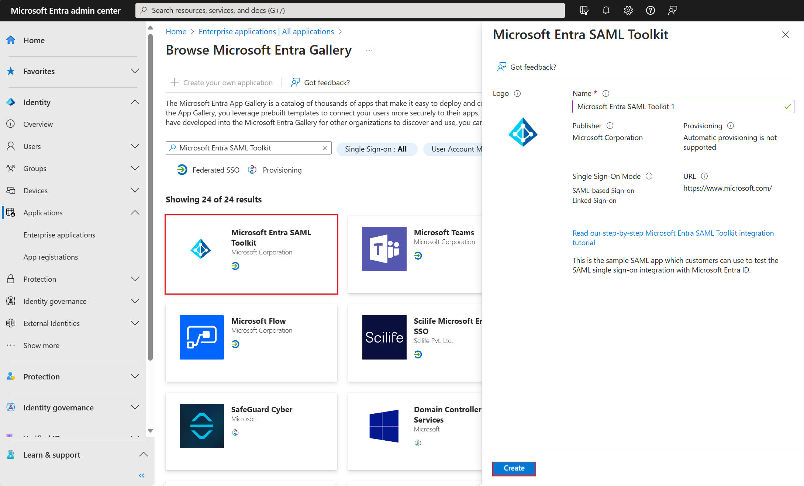

# Quickstart: Remove an application from your Azure Active Directory tenant

Azure Active Directory (Azure AD) has a gallery that contains thousands of pre-integrated applications. Some of the applications your organization uses are probably in the gallery. This quickstart uses the Azure portal to add a gallery application to your Azure Active Directory (Azure AD) tenant.

After an application is added to your Azure AD tenant, you can:

- Manage user access to the application with a Conditional Access policy.
- Configure users to single sign-on to the application with their Azure AD accounts.

>[!IMPORTANT]
>We recommend using a non-production environment to test the steps in this quickstart.

## Remove an application from your Azure AD tenant

To add a gallery application to your Azure AD tenant:

1. In the [Azure portal](https://portal.azure.com), on the left navigation panel, select **Azure Active Directory**.

1. In the **Azure Active Directory** pane, select **Enterprise applications**. The **All applications** pane opens and displays a random sample of the applications in your Azure AD tenant.

1. To add a gallery app to your tenant, select **New application**. 

    

1. Switch to the new gallery preview experience: In the banner at the top of the **Add an application page**, select the link that says **Click here to try out the new and improved app gallery**.

1. The **Browse Azure AD Gallery (Preview)** pane opens and displays tiles for cloud platforms, on-premises applications, and featured applications. Note that the applications listed in the **Featured applications** section have icons indicating whether they support federated single sign-on (SSO) and provisioning.

    

1. You can browse the gallery for the application you want to add, or search for the application by entering its name in the search box. Then select the application from the results. In the form, you can edit the name of the application to match the needs of your organization. In this example we've changed the name to **GitHub-test**.

    

1. Select **Create**. A getting started page appears with the options for configuring the application for your organization.

You've finished adding your application. The next quickstart shows you how to change the logo and edit other properties for your application.

## Next steps

- [Configure an app](add-application-portal-configure.md)
- [Set up single sign-on](add-application-portal-setup-sso.md)