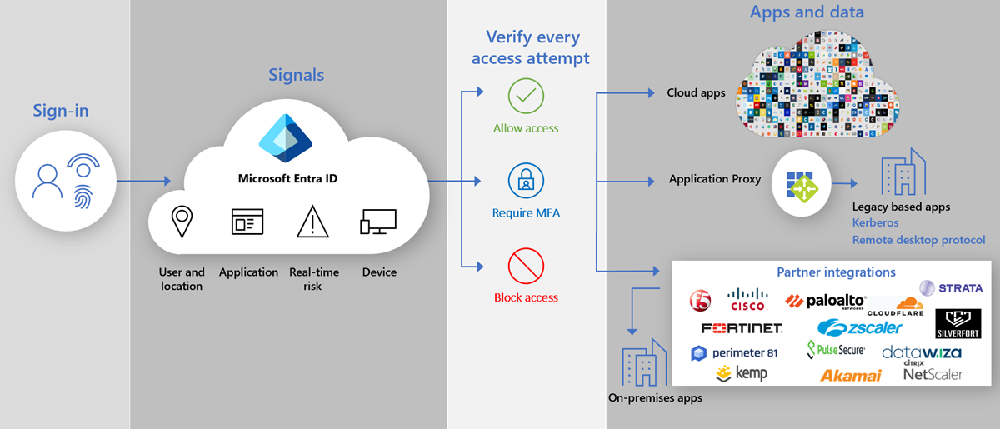

# Secure hybrid access: Protect legacy apps with Azure Active Directory

In this article, learn to protect your on-premises and cloud legacy authentication applications by connecting them to Azure Active Directory (Azure AD).

* **Application Proxy**:
  * Protect users, apps, and data in the cloud and on-premises 
  * Use it to publish on-premises web applications externally
  * [What is Application Proxy?](./app-proxy/application-proxy#what-is-application-proxy)
* **Secure hybrid access through Azure AD partner integrations**:
  * Pre-built solutions
  * Conditional Access policies per application
  * [What is Conditional Access?](/articles/active-directory/conditional-access/overview.md)
  * Azure AD integration documentation

In addition to Application Proxy, you can strengthen your security posture with Identity Protection. 

Learn more:

* [What is Identity Protection?](/articles/active-directory/identity-protection/overview-identity-protection.md)
* [Using Azure AD Application Proxy to publish on-premises apps for remote users](/articles/active-directory/app-proxywhat-is-application-proxy.md)

## Single sign-on and multi-factor authentication

With Azure AD as an identity provider (IdP), you can use modern authentication and authorization methods like single sign-on (SSO) and Azure AD Multi-Factor Authentication (MFA) to secure legacy, on-premises applications.

Learn more:

* [What is SSO in Azure Active Directory?](/articles/active-directory/manage-apps/what-is-single-sign-on.md)
* [How it works: Azure AD Multi-Factor Authentication](/articles/active-directory/authentication/concept-mfa-howitworks.md)

## Secure hybrid access with Application Proxy

Use Application Proxy for secure remote access to on-premises web applications. Users don’t need to use a virtual private network (VPN); they connect to applications from devices with SSO. 

Learn more:

* [Tutorial: Add an on-premises application for remote access through Application Proxy in Azure AD](/articles/active-directory/app-proxy/application-proxy-add-on-premises-application.md)
* [How to configure SSO to an Application Proxy application](/articles/active-directory/app-proxy/application-proxy-config-sso-how-to.md)
* [Using Azure AD Application Proxy to publish on-premises apps for remote users](/articles/active-directory/app-proxy/what-is-application-proxy.md)

### Application publishing and access management

Use Application Proxy remote access as a service to publish applications to users outside the corporate network. Help improve your cloud access management without requiring modification to your on-premises applications.

Learn more:

* [Tutorial: Add an on-premises application for remote access through Application Proxy in Azure AD](/articles/active-directory/app-proxy/application-proxy-add-on-premises-application.md)
* [Plan an Azure AD Application Proxy deployment](/articles/active-directory/app-proxy/application-proxy-deployment-plan.md)

## Partner integrations for apps: on-premises and legacy authentication

Microsoft partners with various companies that deliver access solutions for on-premises applications, and applications that use legacy authentication. The following diagram illustrates a user flow from sign-in to secure access to apps and data.

   

### Secure hybrid access through Azure AD partner integrations

The following partners offer pre-built solutions to support Conditional Access policies per application. Use the tables in the following two sections to learn about the partners and Azure AD integration documentation.

|Partner company site|Integration documentation|
|---|---|
|[Akamai Technologies](https://www.akamai.com/)|[Tutorial: Azure AD SSO integration with Akamai](/articles/active-directory/saas-apps/akamai-tutorial.md)|
|[Citrix Systems, Inc.](https://www.citrix.com/)|[Tutorial: Azure AD SSO integration with Citrix ADC SAML Connector for Azure AD (Kerberos-based authentication)](/articles/active-directory/saas-apps/citrix-netscaler-tutorial.md)|
|[Datawiza](https://www.datawiza.com/)|[Tutorial: Configure Secure Hybrid Access with Azure AD and Datawiza](/articles/active-directory/manage-apps/datawiza-with-azure-ad.md)|
|[F5, Inc.](https://www.f5.com/)|[Integrate F5 BIG-IP with Azure AD](/articles/active-directory/manage-apps/f5-aad-integration.md) [Tutorial: Configure F5 BIG-IP SSL-VPN for Azure AD SSO](/articles/active-directory/manage-apps/f5-aad-password-less-vpn.md)|
|[Progress Software Corporation, Progress Kemp](https://support.kemptechnologies.com/hc)|[Tutorial: Azure AD SSO integration with Kemp LoadMaster Azure AD integration](/articles/active-directory/saas-apps/kemp-tutorial.md)|
|[Perimeter 81 Ltd.]()|[Tutorial: Azure AD SSO integration with Perimeter 81](/articles/active-directory/saas-apps/perimeter-81-tutorial.md)|
|[Silverfort](https://www.silverfort.com/)|[Tutorial: Configure Secure Hybrid Access with Azure AD and Silverfort](/articles/active-directory/manage-apps/silverfort-azure-ad-integration.md)|
|[Strata Identity, Inc.](https://www.strata.io/)|[Integrate Azure AD SSO with Maverics Identity Orchestrator SAML Connector](/articles/active-directory/saas-apps/maverics-identity-orchestrator-saml-connector-tutorial.md)|

### Partners with pre-built solutions and integration documentation

|Partner company site|Integration documentation|
|---|---|
|[Amazon Web Service, Inc.](https://aws.amazon.com/)|[Tutorial: Azure AD SSO integration with AWS ClientVPN](/articles/active-directory/saas-apps/aws-clientvpn-tutorial.md)|
|[Check Point Software Technologies Ltd.](https://www.checkpoint.com/)|[Tutorial: Azure AD single SSO integration with Check Point Remote Secure Access VPN](/articles/active-directory/saas-apps/check-point-remote-access-vpn-tutorial.md)|
|[Cisco Systems, Inc.](https://www.cisco.com/)|[Tutorial: Azure AD SSO integration with Cisco AnyConnect](/articles/active-directory/saas-apps/cisco-anyconnect.md)|
|[Cloudflare, Inc.](https://www.cloudflare.com/)|[Tutorial: Configure Cloudflare with Azure AD for secure hybrid access](/articles/active-directory/manage-apps/cloudflare-azure-ad-integration.md)|
|[Fortinet, Inc.](https://www.fortinet.com/)|[Tutorial: Azure AD SSO integration with FortiGate SSL VPN](/articles/active-directory/saas-apps/fortigate-ssl-vpn-tutorial.md)|
|[Palo Alto Networks](https://www.paloaltonetworks.com/)|[Tutorial: Azure AD SSO integration with Palo Alto Networks Admin UI](/articles/active-directory/saas-apps/paloaltoadmin-tutorial.md)|
|[Pulse Secure, Aquired by Ivanti](https://www.pulsesecure.net/)|[Tutorial: Azure AD SSO integration with Pulse Connect Secure (PCS)](/articles/active-directory/saas-apps/pulse-secure-pcs-tutorial.md) [Tutorial: Azure AD SSO integration with Pulse Secure Virtual Traffic Manager](/articles/active-directory/saas-apps/pulse-secure-virtual-traffic-manager-tutorial.md) **Note**: Pulse Secure is part of Ivanti. See, [Ivanti, Pulse Secure](https://www.ivanti.com/company/history/pulse-secure?psredirect)|
|[Zsclaer, Inc.](https://www.zscaler.com/)|[Tutorial: Integrate Zscaler Private Access with Azure AD](/articles/active-directory/saas-apps/zscalerprivateaccess-tutorial.md)|

