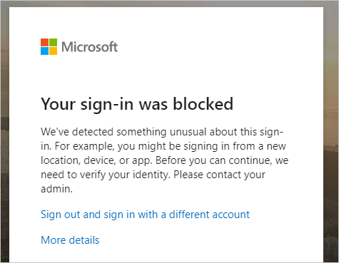

# Your sign-in was blocked

This article provides information for resolving a blocked sign-in to the Microsoft Application Network portal.

## Symptoms

The user sees this message when trying to sign in to the Microsoft Application Network portal.

## Cause

The guest user is federated to a home tenant which is also an Azure AD tenant. The guest user is at high risk. High risk users are not allowed to access resources. All high risk users (employees, guests, or vendors) must remediate their risk to access resources. For guest users, this user risk comes from the home tenant and the policy comes from the resource tenant.
 
## Solutions

- MFA registered guest users remediate their own user risk. This can be done by the guest user performing a secured password change or reset (https://aka.ms/sspr) at their home tenant (this needs MFA and SSPR at the home tenant). The secured password change or reset must be initiated on Azure AD and not on-premises.

- Guest users have their adminitrators remediate their risk. In this case, the administrator performs a password reset (temporary password generation). The guest user's administrator can go to https://aka.ms/RiskyUsers and select **Reset password**.

- Guest users have their administrators dismiss their risk. The admin can go to https://aka.ms/RiskyUsers and select **Dismiss user risk**. However, the administrator must do the due diligence to make sure this was a false positive risk assessment before dismissing the user risk. Otherwise, they are putting their and Microsoft's resources at risk by suppressing a risk assessment without investigation.

If you have any issues with access, contact the [Azure AD SSO Integration Team](mailto:SaaSApplicationIntegrations@service.microsoft.com).
