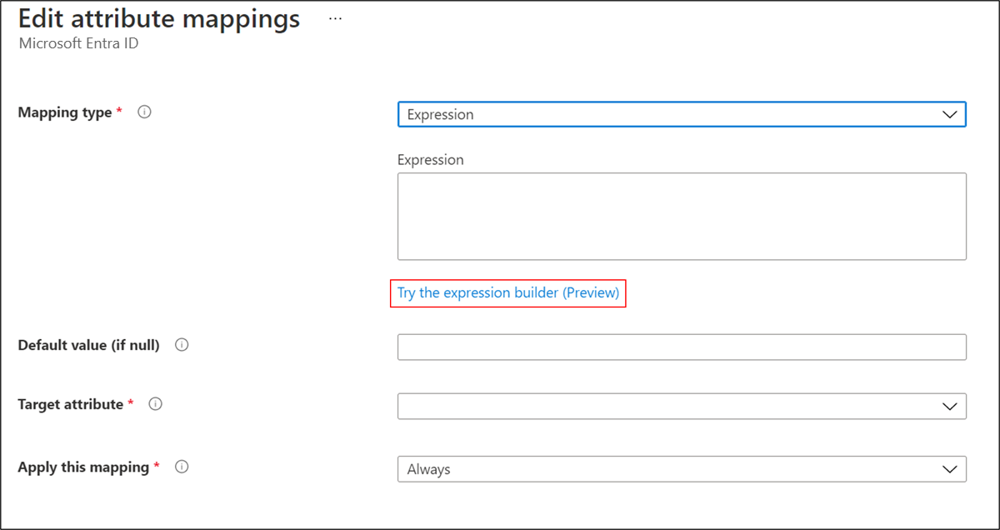
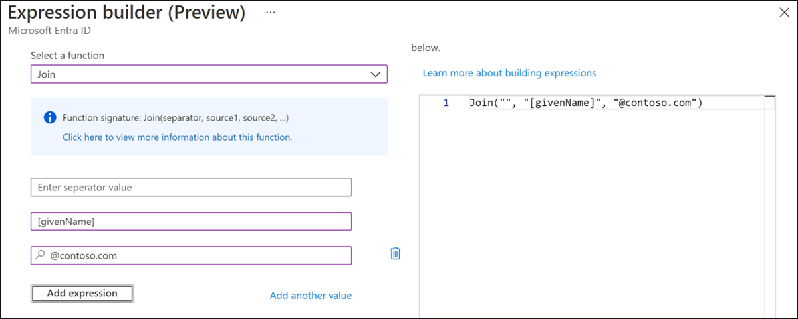
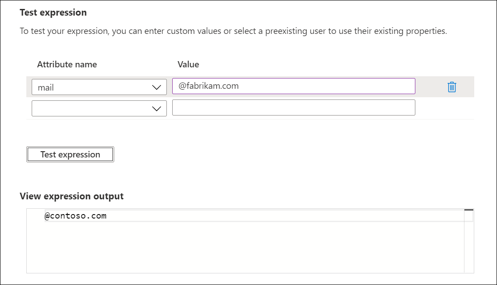
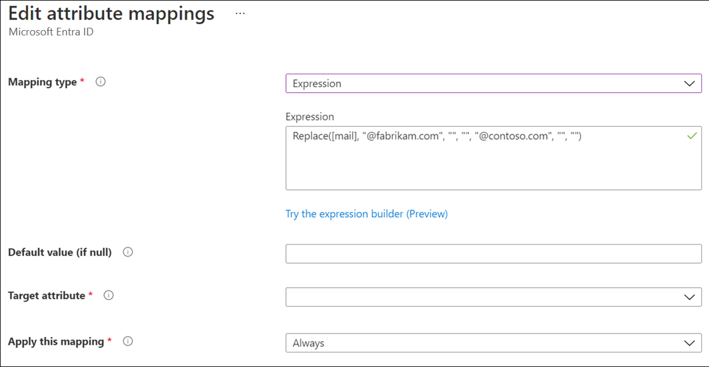
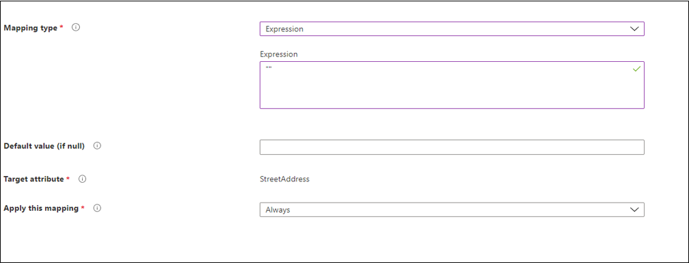

# Expression builder with cloud sync
The expression builder is a new function in Azure located under cloud sync. It helps you build complex expressions. You can use it to test these expressions before you apply them to your cloud sync environment.

## Use the expression builder
To access the expression builder:

 [!INCLUDE [sign in](~/includes/cloud-sync-sign-in.md)]
 3. Under **Configuration**, select your configuration.
 4. Under **Manage attributes**, select **Click to edit mappings**.
 5. On the **Edit attribute mappings** pane, select **Add attribute mapping**.
 6. Under **Mapping type**, select **Expression**.
 7. Select **Try the expression builder (Preview)**.
 
    

## Build an expression
In this section, you use the dropdown list to select from supported functions. Then you fill in more boxes, depending on the function selected. After you select **Apply expression**, the syntax appears in the **Expression input** box.

For example, by selecting **Replace** from the dropdown list, more boxes are provided. The syntax for the function is displayed in the light blue box. The boxes that are displayed correspond to the syntax of the function you selected. Replace works differently depending on the parameters provided.

For this example, when **oldValue** and **replacementValue** are provided, all occurrences of **oldValue** are replaced in the source with **replacementValue**.

For more information, see [Replace](reference-expressions.md#replace).

The first thing you need to do is select the attribute that's the source for the replace function. In this example, the **mail** attribute is selected.

Next, find the box for **oldValue** and enter **@fabrikam.com**. Finally, in the box for **replacementValue**, fill in the value **@contoso.com**.

The expression basically says, replace the mail attribute on user objects that have a value of @fabrikam.com with the @contoso.com value. When you select **Add expression**, you can see the syntax in the **Expression input** box.

>[!NOTE]
>Be sure to place the values in the boxes that would correspond with **oldValue** and **replacementValue** based on the syntax that occurs when you've selected **Replace**.

For more information on supported expressions, see [Writing expressions for attribute mappings in Microsoft Entra ID](reference-expressions.md).

### Information on expression builder input boxes
Depending on which function you selected, the boxes provided by the expression builder will accept multiple values. For example, the JOIN function will accept strings or the value that's associated with a given attribute. For example, we can use the value contained in the attribute value of **[givenName]** and join it with a string value of **@contoso.com** to create an email address.

  

For more information on acceptable values and how to write expressions, see [Writing expressions for attribute mappings in Microsoft Entra ID](reference-expressions.md).

## Test an expression
In this section, you can test your expressions. From the dropdown list, select the **mail** attribute. Fill in the value with **@fabrikam.com**, and select **Test expression**.

The value **@contoso.com** appears in the **View expression output** box.

 

## Deploy the expression
After you're satisfied with the expression, select **Apply expression**.

This action adds the expression to the agent configuration.

## Set a NULL value on an expression
To set an attribute's value to NULL, use an expression with the value of `""`. This expression will flow the NULL value to the target attribute.

## Next steps 

- [Writing expressions for attribute mappings in Microsoft Entra ID](reference-expressions.md)
- [Cloud sync configuration](how-to-configure.md)
