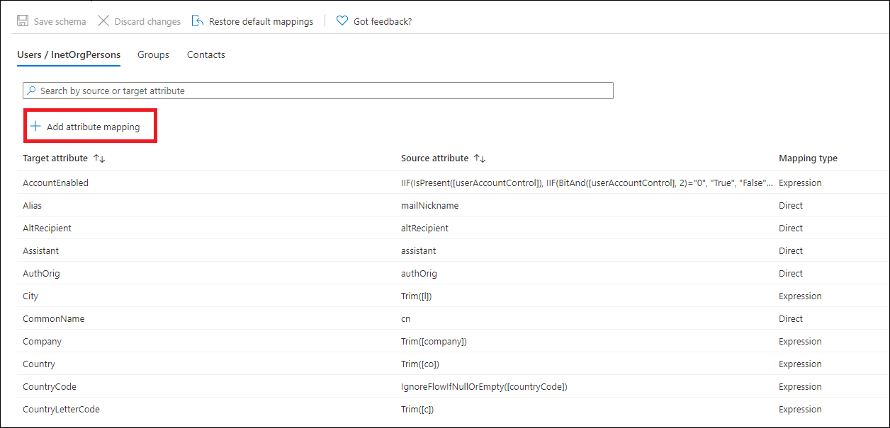

# Map UserType with cloud sync

Cloud sync supports synchronization of the **UserType** attribute for User objects.

By default, the **UserType** attribute isn't enabled for synchronization because there's no corresponding **UserType** attribute in on-premises Active Directory. You must manually add this mapping for synchronization. Before you do this step, you must take note of the following behavior enforced by Microsoft Entra ID:

- Microsoft Entra-only accepts two values for the **UserType** attribute: Member and Guest.
- If the **UserType** attribute isn't mapped in cloud sync, Microsoft Entra users created through directory synchronization would have the **UserType** attribute set to Member.

Before you add a mapping for the **UserType** attribute, you must first decide how the attribute is derived from on-premises Active Directory. The following approaches are the most common:

 - Designate an unused on-premises Active Directory attribute, such as extensionAttribute1, to be used as the source attribute. The designated on-premises Active Directory attribute should be of the type string, be single-valued, and contain the value Member or Guest.
 - If you choose this approach, you must ensure that the designated attribute is populated with the correct value for all existing user objects in on-premises Active Directory that are synchronized to Microsoft Entra ID before you enable synchronization of the **UserType** attribute.

## Add the UserType mapping
To add the **UserType** mapping:

 [!INCLUDE [sign in](~/includes/cloud-sync-sign-in.md)]
 2. Under **Configuration**, select your configuration.
 3. Under **Manage attributes**, select **Click to edit mappings**.
 
     

 4. Select **Add attribute mapping**.
 
     
 5. Select the mapping type. You can do the mapping in one of three ways:
   - A direct mapping, for example, from an Active Directory attribute
   - An expression, such as IIF(InStr([userPrincipalName], "@partners") > 0,"Guest","Member")
   - A constant, for example, make all user objects as Guest
 
     

6. In the **Target attribute** dropdown box, select **UserType**.
7. Select **Apply** at the bottom of the page to create a mapping for the Microsoft Entra ID **UserType** attribute.

## Next steps 

- [Writing expressions for attribute mappings in Microsoft Entra ID](reference-expressions.md)
- [Cloud sync configuration](how-to-configure.md)
