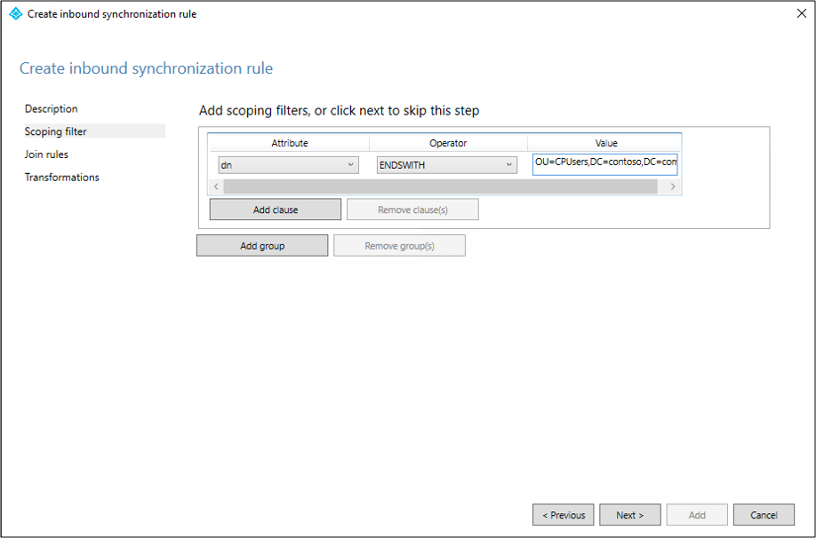
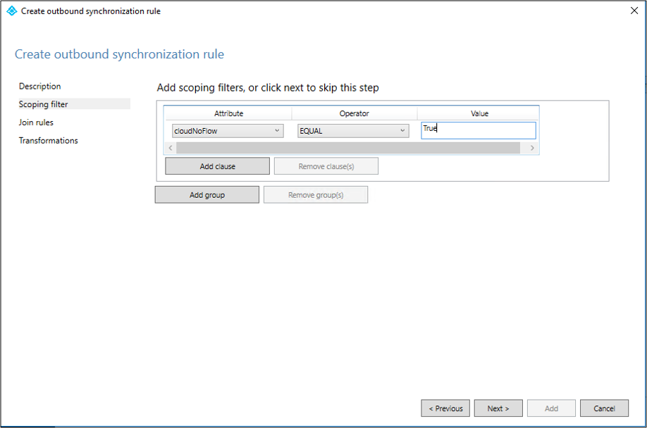

# Migrate Microsoft Entra Connect Sync group writeback V2 to Microsoft Entra Cloud Sync

## Step 1 - Copy adminDescription to msDS-ExternalDirectoryObjectID
 1. In your on-premises environment, open ADSI Edit.
 2. Copy the value that it in the group's adminDescription attribute

:::image type="content" source="media/migrate-group-writeback/migrate-1.png" alt-text="Screenshot of the adminDescription attribute." lightbox="media/migrate-group-writeback/migrate-1.png":::
 3. Paste this in to the msDS-ExternalDirectoryObjectID attribute
 :::image type="content" source="media/migrate-group-writeback/migrate-2.png" alt-text="Screenshot of the msDS-ExternalDirectoryObjectID attribute." lightbox="media/migrate-group-writeback/migrate-2.png":::

## Step 2 - Place Entra Connect server in staging mode and disable the sync scheduler
1. Start the Microsot Entra Connect Sync(Azure AD Connect) wizard 
2. Click **Configure**
3. Select **Configure staging mode** and click **Next**
4. Enter Entra ID credentials
5. Place a check in **Enable staging mode** and click **Next**
6. Click **Configure**
7. Click **Exit**
8. On your Microsoft Entra Connect server, open a PowerShell prompt as an administrator. 
9. Disable the sync scheduler: 

   ``` PowerShell 
   Set-ADSyncScheduler -SyncCycleEnabled $false  
   ``` 


## Step 3 - Create custom group inbound rule
In the Microsoft Entra Connect Synchronization Rules editor, you need to create an inbound sync rule that filters out groups in the OU you identified previously.  The inbound sync rule is a join rule with a target attribute of cloudNoFlow.  This rule tells Microsoft Entra Connect not to synchronize attributes for these groups.  

 1. Launch the synchronization editor from the application menu in desktop as shown below:
 
     

 2. Select **Inbound** from the drop-down list for Direction and select **Add new rule**.

     

 3. On the **Description** page, enter the following and select **Next**:

    - **Name:** Give the rule a meaningful name
    - **Description:** Add a meaningful description
    - **Connected System:** Choose the AD connector that you're writing the custom sync rule for
    - **Connected System Object Type:** Group
    - **Metaverse Object Type:** Group
    - **Link Type:** Join
    - **Precedence:** Provide a value that is unique in the system
    - **Tag:** Leave this empty

    

 4. On the **Scoping filter** page, enter the OU or security group that you want the pilot based off.  To filter on OU, add the OU portion of the distinguished name. This rule will be applied to all users who are in that OU. So, if DN ends with "OU=CPUsers,DC=contoso,DC=com, you would add this filter.  Then select **Next**.

    |Rule|Attribute|Operator|Value|
    |-----|----|----|-----|
    |Scoping OU|DN|ENDSWITH|Distinguished name of the OU.|
    |Scoping group||ISMEMBEROF|Distinguished name of the security group.|

    

 5. On the **Join** rules page, select **Next**.
 6. On the **Transformations** page, add a Constant transformation: flow True to cloudNoFlow attribute. Select **Add**.

     

Same steps need to be followed for all object types (user, group and contact). Repeat steps per configured AD Connector / per AD forest.

## Step 4 - Create custom group outbound rule
You'll also need an outbound sync rule with a link type of JoinNoFlow and the scoping filter that has the cloudNoFlow attribute set to True.  This rule tells Microsoft Entra Connect not to synchronize attributes for these groups. 

 1. Select **Outbound** from the drop-down list for Direction and select **Add rule**.

     

 2. On the **Description** page, enter the following and select **Next**:

    - **Name:** Give the rule a meaningful name
    - **Description:** Add a meaningful description
    - **Connected System:** Choose the Microsoft Entra connector that you're writing the custom sync rule for
    - **Connected System Object Type:** Group
    - **Metaverse Object Type:** Group
    - **Link Type:** JoinNoFlow
    - **Precedence:** Provide a value that is unique in the system<br>
    - **Tag:** Leave this empty

    

 3. On the **Scoping filter** page, choose **cloudNoFlow** equal **True**. Then select **Next**.

     

 4. On the **Join** rules page, select **Next**.
 5. On the **Transformations** page, select **Add**.


## Step 5 - Use PowerShell to finish configuration
1. On your Microsoft Entra Connect server, open a PowerShell prompt as an administrator. 
2. Import the ADSync module:

   ``` PowerShell 
   Import-Module  'C:\Program Files\Microsoft Azure Active Directory Connect\Tools\ADSyncTools.psm1' 
   ``` 
3. Run a full sync cycle:
   ``` PowerShell 
   Start-ADSyncSyncCycle -PolicyType Initial
   ``` 
4. Disable the group writeback feature for the tenant: 

   ``` PowerShell 
   Set-ADSyncAADCompanyFeature -GroupWritebackV2 $false 

5. Run a full sync cycle (yes again):
   ``` PowerShell 
   Start-ADSyncSyncCycle -PolicyType Initial
   ``` 
   ``` 
6. Re-enable the sync scheduler:

   ``` PowerShell 
   Set-ADSyncScheduler -SyncCycleEnabled $true  
   ``` 
## Step 6 - Remove the Microsoft Entra Connect server from staging mode
1.  Start the Entra Connect Sync wizard (Azure AD Connect)
2.  Click **Configure**
3.  Select **Configure staging mode** and click **Next**
4.  Enter Entra ID credentials
5.  Remove the check in **Enable staging mode** and click **Next**
6.  Click **Configure**
7.  Click **Exit**

## Step 7 - Configure Microsoft Entra Cloud Sync

## Next Steps
- [Provision groups to Active Directory using Microsoft Entra Cloud Sync](how-to-configure-entra-to-ad.md)
- [Govern on-premises Active Directory based apps (Kerberos) using Microsoft Entra ID Governance](govern-on-premises-groups.md)