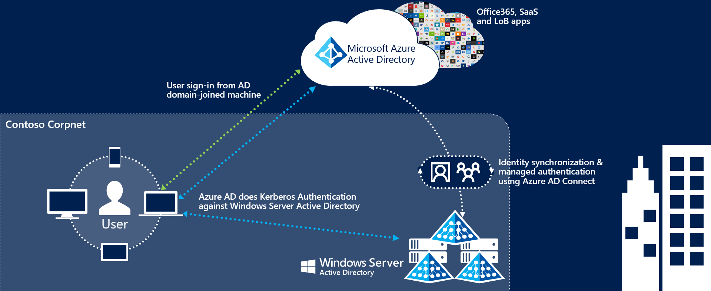

# Microsoft Entra seamless single sign-on

## What is Microsoft Entra seamless single sign-on?

Microsoft Entra seamless single sign-on (Microsoft Entra seamless SSO) automatically signs users in when they are on their corporate devices connected to your corporate network. When enabled, users don't need to type in their passwords to sign in to Microsoft Entra ID, and usually, even type in their usernames. This feature provides your users easy access to your cloud-based applications without needing any additional on-premises components.

>[!VIDEO https://www.youtube.com/embed/PyeAC85Gm7w]

Seamless SSO can be combined with either the [Password Hash Synchronization](how-to-connect-password-hash-synchronization.md) or [Pass-through Authentication](how-to-connect-pta.md) sign-in methods. Seamless SSO is _not_ applicable to Active Directory Federation Services (ADFS).

## SSO via primary refresh token vs. Seamless SSO

For Windows 10, Windows Server 2016 and later versions, it’s recommended to use SSO via primary refresh token (PRT). For Windows 7 and Windows 8.1, it’s recommended to use Seamless SSO.
Seamless SSO needs the user's device to be domain-joined, but it isn't used on Windows 10 [Microsoft Entra joined devices](~/identity/devices/concept-directory-join.md) or [Microsoft Entra hybrid joined devices](~/identity/devices/concept-hybrid-join.md). SSO on Microsoft Entra joined, Microsoft Entra hybrid joined, and Microsoft Entra registered devices works based on the [Primary Refresh Token (PRT)](~/identity/devices/concept-primary-refresh-token.md)

SSO via PRT works once devices are registered with Microsoft Entra ID for Microsoft Entra hybrid joined, Microsoft Entra joined or personal registered devices via Add Work or School Account. 
For more information on how SSO works with Windows 10 using PRT, see: [Primary Refresh Token (PRT) and Microsoft Entra ID](~/identity/devices/concept-primary-refresh-token.md)

## Key benefits

- *Great user experience*
  - Users are automatically signed into both on-premises and cloud-based applications.
  - Users don't have to enter their passwords repeatedly.
- *Easy to deploy & administer*
  - No additional components needed on-premises to make this work.
  - Works with any method of cloud authentication - [Password Hash Synchronization](how-to-connect-password-hash-synchronization.md) or [Pass-through Authentication](how-to-connect-pta.md).
  - Can be rolled out to some or all your users using Group Policy.
  - Register non-Windows 10 devices with Microsoft Entra ID without the need for any AD FS infrastructure. This capability needs you to use version 2.1 or later of the [workplace-join client](https://www.microsoft.com/download/details.aspx?id=53554).

## Feature highlights

- Sign-in username can be either the on-premises default username (`userPrincipalName`) or another attribute configured in Microsoft Entra Connect (`Alternate ID`). Both use cases work because Seamless SSO uses the `securityIdentifier` claim in the Kerberos ticket to look up the corresponding user object in Microsoft Entra ID.
- Seamless SSO is an opportunistic feature. If it fails for any reason, the user sign-in experience goes back to its regular behavior - i.e, the user needs to enter their password on the sign-in page.
- If an application (for example,  `https://myapps.microsoft.com/contoso.com`) forwards a `domain_hint` (OpenID Connect) or `whr` (SAML) parameter - identifying your tenant, or `login_hint` parameter - identifying the user, in its Microsoft Entra sign-in request, users are automatically signed in without them entering usernames or passwords.
- Users also get a silent sign-on experience if an application (for example, `https://contoso.sharepoint.com`) sends sign-in requests to Microsoft Entra ID's endpoints set up as tenants - that is, `https://login.microsoftonline.com/contoso.com/<..>` or `https://login.microsoftonline.com/<tenant_ID>/<..>` - instead of Microsoft Entra ID's common endpoint - that is, `https://login.microsoftonline.com/common/<...>`.
- Sign out is supported. This allows users to choose another Microsoft Entra account to sign in with, instead of being automatically signed in using Seamless SSO automatically.
- Microsoft 365 Win32 clients (Outlook, Word, Excel, and others) with versions 16.0.8730.xxxx and above are supported using a non-interactive flow. For OneDrive, you'll have to activate the [OneDrive silent config feature](https://techcommunity.microsoft.com/t5/Microsoft-OneDrive-Blog/Previews-for-Silent-Sync-Account-Configuration-and-Bandwidth/ba-p/120894) for a silent sign-on experience.
- It can be enabled via Microsoft Entra Connect.
- It's a free feature, and you don't need any paid editions of Microsoft Entra ID to use it.
- It's supported on web browser-based clients and Office clients that support [modern authentication](/microsoft-365/enterprise/modern-auth-for-office-2013-and-2016) on platforms and browsers capable of Kerberos authentication:

| OS\Browser |Internet Explorer|Microsoft Edge\*\*\*\*|Google Chrome|Mozilla Firefox|Safari|
| --- | --- |--- | --- | --- | -- 
|Windows 10|Yes\*|Yes|Yes|Yes\*\*\*|N/A
|Windows 8.1|Yes\*|Yes*\*\*\*|Yes|Yes\*\*\*|N/A
|Windows 8|Yes\*|N/A|Yes|Yes\*\*\*|N/A
|Windows Server 2012 R2 or above|Yes\*\*|N/A|Yes|Yes\*\*\*|N/A
|Mac OS X|N/A|N/A|Yes\*\*\*|Yes\*\*\*|Yes\*\*\*

 > [!NOTE]
 >Microsoft Edge legacy is no longer supported

\*Requires Internet Explorer version 11 or later. ([Beginning August 17, 2021, Microsoft 365 apps and services won't support IE 11](https://techcommunity.microsoft.com/t5/microsoft-365-blog/microsoft-365-apps-say-farewell-to-internet-explorer-11-and/ba-p/1591666).)

\*\*Requires Internet Explorer version 11 or later. Disable Enhanced Protected Mode.

\*\*\*Requires [additional configuration](how-to-connect-sso-quick-start.md#browser-considerations).

\*\*\*\*Microsoft Edge based on Chromium

## Next steps

- [**Quick Start**](how-to-connect-sso-quick-start.md) - Get up and running Microsoft Entra seamless SSO.
- [**Deployment Plan**](~/identity/enterprise-apps/plan-sso-deployment.md) - Step-by-step deployment plan.
- [**Technical Deep Dive**](how-to-connect-sso-how-it-works.md) - Understand how this feature works.
- [**Frequently Asked Questions**](how-to-connect-sso-faq.yml) - Answers to frequently asked questions.
- [**Troubleshoot**](tshoot-connect-sso.md) - Learn how to resolve common issues with the feature.
- [**UserVoice**](https://feedback.azure.com/d365community/forum/22920db1-ad25-ec11-b6e6-000d3a4f0789) - For filing new feature requests.
