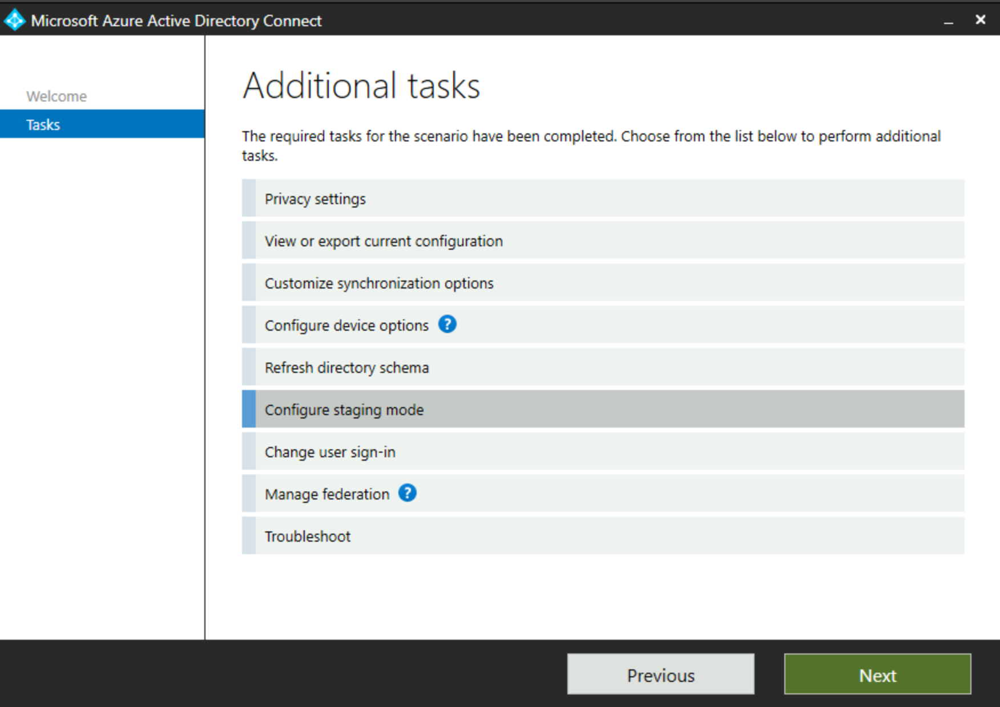
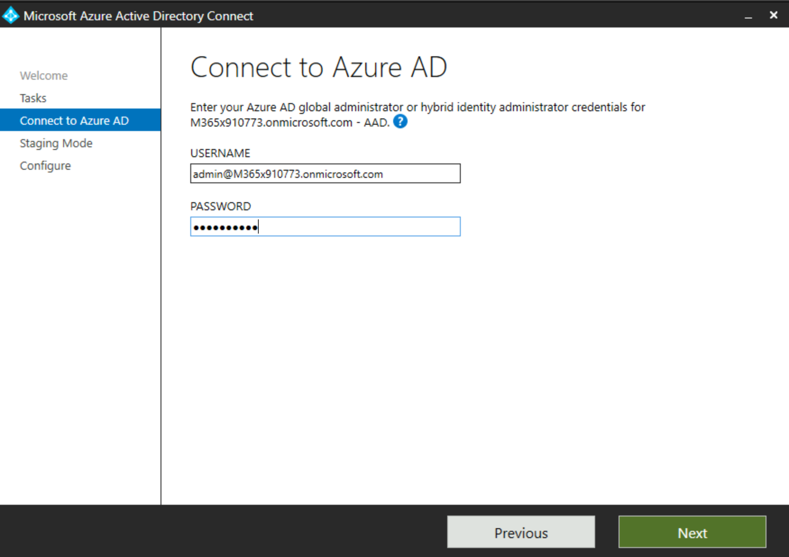
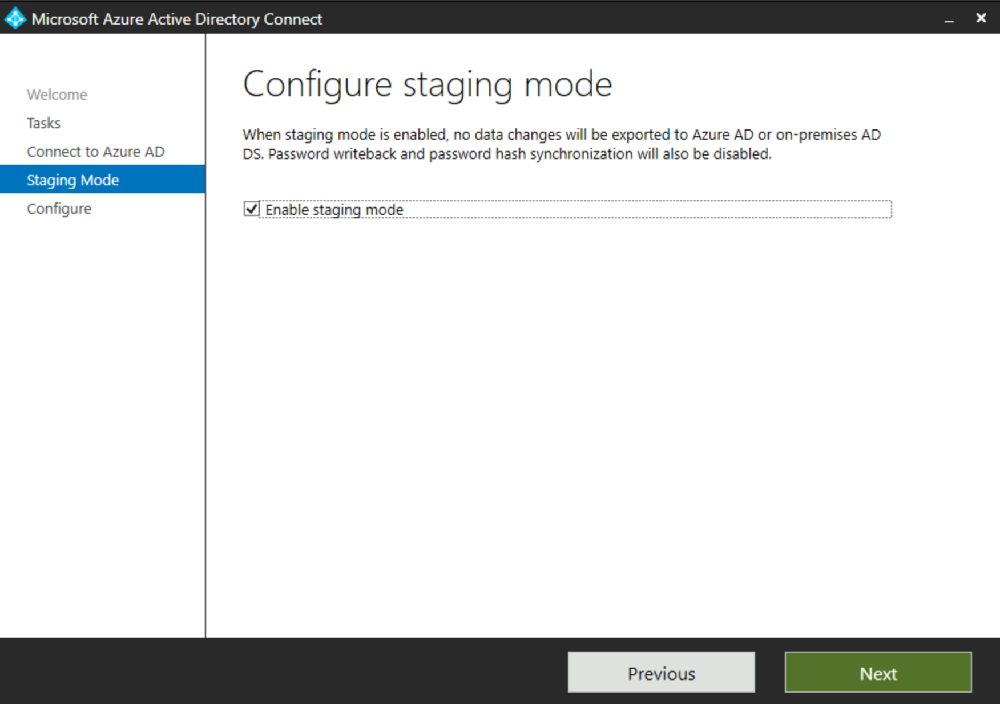
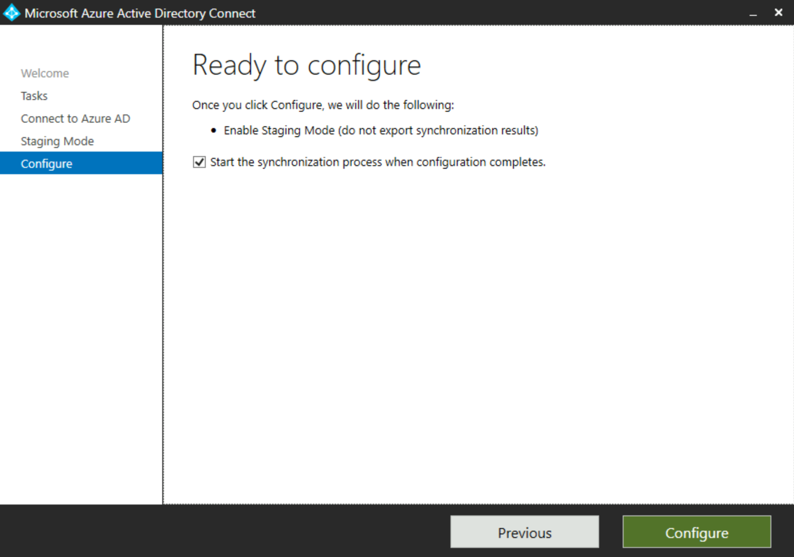
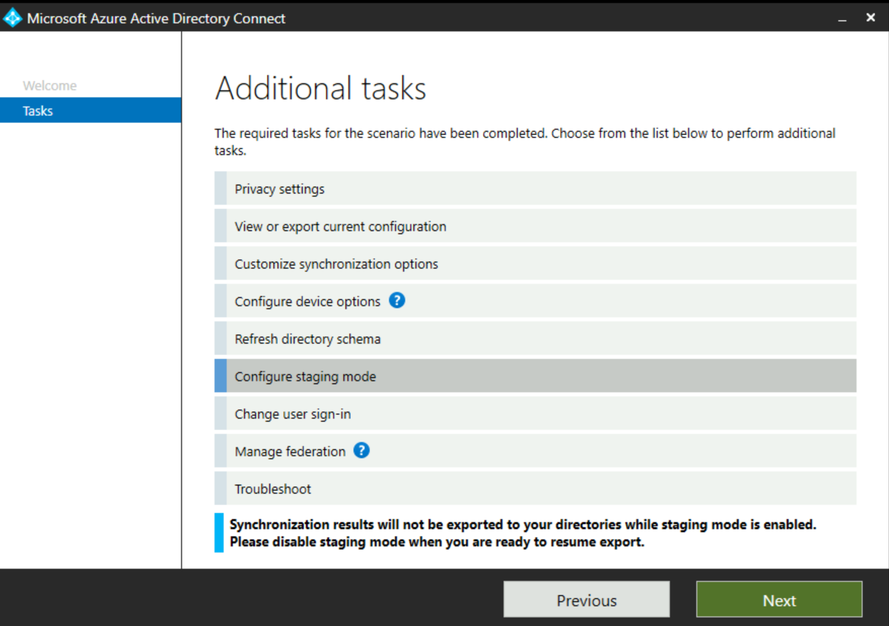
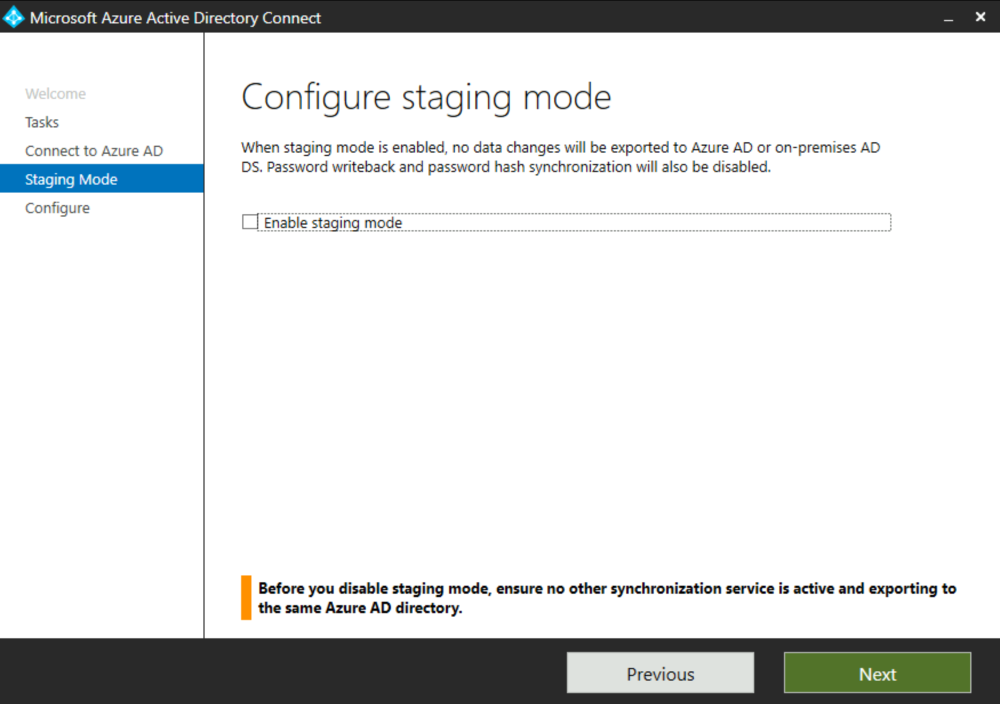
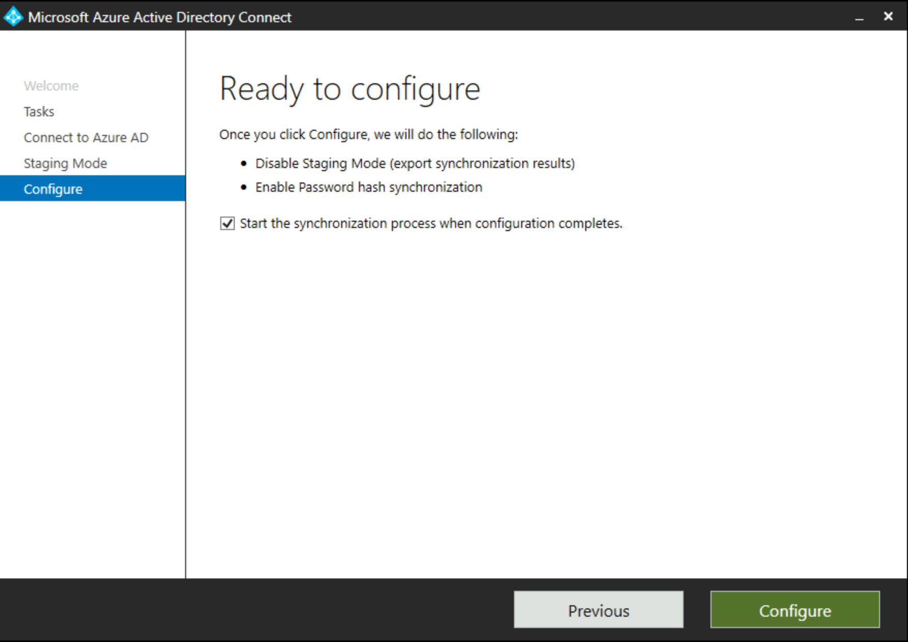
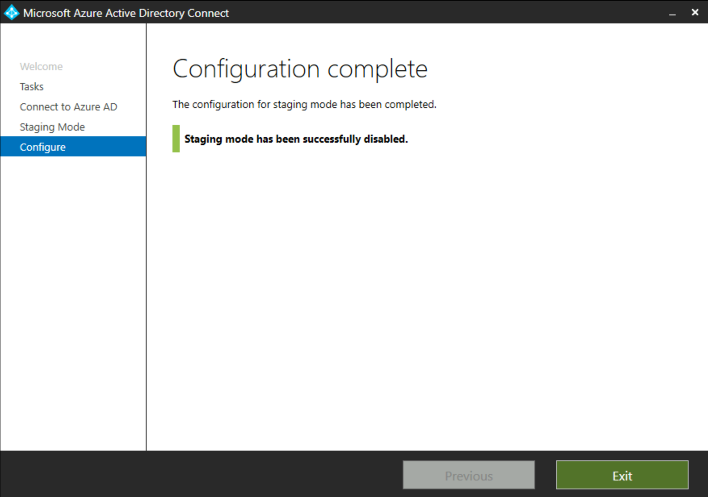
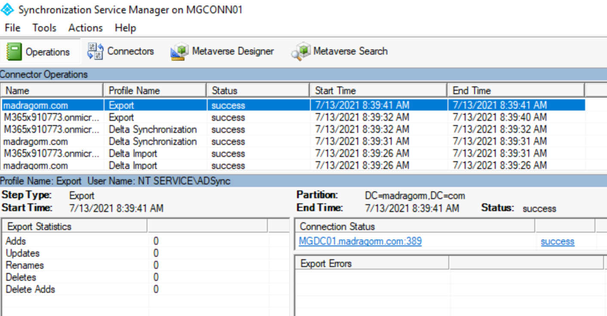

# Microsoft Entra Connect: Staging server and disaster recovery

With a server in staging mode, you can make changes to the configuration and preview the changes before you make the server active. It also allows you to run full import and full synchronization to verify that all changes are expected before you make these changes into your production environment.

## Staging mode

Staging mode can be used for several scenarios, including:

* High availability.
* Test and deploy new configuration changes.
* Introduce a new server and decommission the old.

During installation, you can select the server to be in **staging mode**. This action makes the server active for import and synchronization, but it does not run any exports. A server in staging mode is not running password sync or password writeback, even if you selected these features during installation. When you disable staging mode, the server starts exporting, enables password sync, and enables password writeback.

> [!NOTE]
> Suppose you have a Microsoft Entra Connect with Password Hash Synchronization feature enabled. When you enable staging mode, the server stops synchronizing password changes from on-premises AD. When you disable staging mode, the server resumes synchronizing password changes from where it last left off. If the server is left in staging mode for an extended period of time, it can take a while for the server to synchronize all password changes that had occurred during the time period.
>
>

You can still force an export by using the synchronization service manager.

A server in staging mode continues to receive changes from Active Directory and Microsoft Entra ID and can quickly take over the responsibilities of another server in the event of a failure. If you make configuration changes to your primary server, it is your responsibility to make the same changes to the server in staging mode.

For those of you with knowledge of older sync technologies, the staging mode is different since the server has its own SQL database. This architecture allows the staging mode server to be located in a different datacenter.

### Verify the configuration of a server

To apply this method, follow these steps:

1. [Prepare](#prepare)
2. [Configuration](#configuration)
3. [Import and Synchronize](#import-and-synchronize)
4. [Verify](#verify)
5. [Switch active server](#switch-active-server)

#### Prepare

1. Install Microsoft Entra Connect, select **staging mode**, and unselect **start synchronization** on the last page in the installation wizard. This mode allows you to run the sync engine manually.
   
2. Sign off/sign in and from the start menu select **Synchronization Service**.

#### Configuration

If you have made custom changes to the primary server and want to compare the configuration with the staging server, then use [Microsoft Entra Connect configuration documenter](https://github.com/Microsoft/AADConnectConfigDocumenter).

#### Import and Synchronize

1. Select **Connectors**, and select the first Connector with the type **Active Directory Domain Services**. Click **Run**, select **Full import**, and **OK**. Do these steps for all Connectors of this type.
2. Select the Connector with type **Microsoft Entra ID (Microsoft)**. Click **Run**, select **Full import**, and **OK**.
3. Make sure the tab Connectors is still selected. For each Connector with type **Active Directory Domain Services**, click **Run**, select **Delta Synchronization**, and **OK**.
4. Select the Connector with type **Microsoft Entra ID (Microsoft)**. Click **Run**, select **Delta Synchronization**, and **OK**.

You have now staged export changes to Microsoft Entra ID and on-premises AD (if you are using Exchange hybrid deployment). The next steps allow you to inspect what is about to change before you actually start the export to the directories.

#### Verify

1. Start a cmd prompt and go to `%ProgramFiles%\Microsoft Azure AD Sync\bin`
2. Run: `csexport "Name of Connector" %temp%\export.xml /f:x`
   The name of the Connector can be found in Synchronization Service. It has a name similar to "contoso.com – Microsoft Entra ID" for Microsoft Entra ID.
3. Run: `CSExportAnalyzer %temp%\export.xml > %temp%\export.csv`
You have a file in %temp% named export.csv that can be examined in Microsoft Excel. This file contains all changes that are about to be exported.
4. Make necessary changes to the data or configuration and run these steps again (Import and Synchronize and Verify) until the changes that are about to be exported are expected.

**Understanding the export.csv file**

Most of the file is self-explanatory. Some abbreviations to understand the content:
* OMODT – Object Modification Type. Indicates if the operation at an object level is an Add, Update, or Delete.
* AMODT – Attribute Modification Type. Indicates if the operation at an attribute level is an Add, Update, or delete.

**Retrieve common identifiers**

The export.csv file contains all changes that are about to be exported. Each row corresponds to a change for an object in the connector space and the object is identified by the DN attribute. The DN attribute is a unique identifier assigned to an object in the connector space. When you have many rows/changes in the export.csv to analyze, it may be difficult for you to figure out which objects the changes are for based on the DN attribute alone. To simplify the process of analyzing the changes, use the `csanalyzer.ps1` PowerShell script. The script retrieves common identifiers (for example, displayName, userPrincipalName) of the objects. To use the script:
1. Copy the PowerShell script from the section [CSAnalyzer](#appendix-csanalyzer) to a file named `csanalyzer.ps1`.
2. Open a PowerShell window and browse to the folder where you created the PowerShell script.
3. Run: `.\csanalyzer.ps1 -xmltoimport %temp%\export.xml`.
4. You now have a file named **processedusers1.csv** that can be examined in Microsoft Excel. Note that the file provides a mapping from the DN attribute to common identifiers (for example, displayName and userPrincipalName). It currently does not include the actual attribute changes that are about to be exported.

#### Switch active server

Microsoft Entra Connect can be set up in an Active-Passive High Availability setup, where one server will actively push changes to the synced AD objects to Microsoft Entra ID and the passive server will stage these changes in the event it will need to take over.

>[!Note]
>
>You cannot set up Microsoft Entra Connect in an Active-Active setup. It must be Active-Passive. Ensure that only 1 Microsoft Entra Connect server is actively syncing changes.

For more information on setting up a Microsoft Entra Connect Sync server in Staging Mode, see [staging mode](how-to-connect-sync-staging-server.md)

You may need to perform a failover of the Sync Servers for several reasons, such as upgrading the version of Microsoft Entra Connect, or receiving an alert that the health service of the Sync Service is not receiving up to date information. In these events you can attempt a failover of the Sync Servers by following the below steps.

> [!IMPORTANT]
> Switching a staging server to active mode can have a severe impact in the synchronization, if the following conditions are not met. As a precaution, always run an initial sync cycle and [Verify](#verify) the pending exports, before doing this operation.

#### Prerequisites

- One currently active Microsoft Entra Connect Sync Server
- One staging Microsoft Entra Connect Sync Server
- The staging server have synchronization scheduler enabled and has synchronized with Microsoft Entra ID recently
- In case of any updates in synchronization rules or in sync scope, run an initial sync cycle
- Confirm that your Microsoft Entra Connect Sync Server is configured to [prevent accidental deletes](how-to-connect-sync-feature-prevent-accidental-deletes.md) 
- [Verify ](#verify)the pending exports and confirm that there aren't significant updates, and such updates are expected
- Check if [Microsoft Entra Connect Health](whatis-azure-ad-connect.md#what-is-microsoft-entra-connect-health) agent is updated by checking the server in [Microsoft Entra ID Connect Health](https://aka.ms/aadconnecthealth) portal
- Switch the current active server to staging mode, before switching the staging server to active

#### Change currently Active Sync Server to staging mode

We need to ensure that only one Sync Server is syncing changes at any given time throughout this process. If the currently active Sync Server is reachable you can perform the below steps to move it to Staging Mode. If it is not reachable, ensure that the server or VM does not regain access unexpectedly either by shutting down the server or isolating it from outbound connections.

1. For the currently active Microsoft Entra Connect server, open the Microsoft Entra Connect wizard and click "Configure staging mode" then Next:  

   > [!div class="mx-imgBorder"]
   > 

2. You will need to sign into Microsoft Entra ID with Global Administrator or Hybrid Identity Admin credentials:  

   > [!div class="mx-imgBorder"]
   > 

3. Tick the box for Staging Mode and click Next:  

   > [!div class="mx-imgBorder"]
   > 

4. The Microsoft Entra Connect server will check for installed components and then prompt you whether you want to start the sync process when the configuration change completes:  

   > [!div class="mx-imgBorder"]
   >   

Since the server will be in staging mode, it will not write changes to Microsoft Entra ID, but retain any changes to the AD in its Connector Space, ready to write them.  
It is recommended to leave the sync process on for the server in Staging Mode, so if it becomes active, it will quickly take over and won't have to do a large sync to catch up to the current state of the Active Directory / Microsoft Entra objects in scope.

5. After selecting to start the sync process and clicking Configure, the Microsoft Entra Connect server will be configured into Staging Mode.  
When this is completed, you will be prompted with a screen that confirms Staging Mode is enabled.  
You can click Exit to finish.

6. You can confirm that the server is successfully in Staging Mode by opening Windows PowerShell, load the "ADSync" module and verify the ADSync Scheduler configuration, using the following commands:

```powershell
Import-Module ADSync
Get-ADSyncScheduler
``` 
  
From the results, verify the value of the "StagingModeEnabled" setting. If the server was successfully switched to staging mode the value of this setting should be _**True**_ like in the example below:  

> [!div class="mx-imgBorder"]
> 

#### Change current Staging Sync server to active mode

At this point, all of our Microsoft Entra Connect Sync Servers should be in Staging Mode and not exporting changes.
We can now move our Staging Sync Server to Active mode and actively sync changes.

1. Now move to the Microsoft Entra Connect server that was originally in Staging Mode and open the Microsoft Entra Connect wizard.  

   Click on "Configure staging mode" and click Next:  

   > [!div class="mx-imgBorder"]
   >   

   The message at the bottom of the wizard indicates this server is in Staging Mode.

2. Sign into Microsoft Entra ID, then go to the Staging Mode screen.

   Untick the box for Staging Mode and click Next  

   > [!div class="mx-imgBorder"]
   >   

   As per the warning on this page, it is important to ensure no other Microsoft Entra Connect server is actively syncing.  

   There should only be one active Microsoft Entra Connect Sync server at any time.

3. When you are prompted to start the sync process, tick this box and click Configure:  

   > [!div class="mx-imgBorder"]
   > 

4. Once the process is finished you should get the below confirmation screen where you can click Exit to finish:  

   > [!div class="mx-imgBorder"]
   > 

5. You can confirm that this is working by opening the Sync Service Console and checking if Export jobs are running:
  
   > [!div class="mx-imgBorder"]
   > 

## Disaster recovery

Part of the implementation design is to plan for what to do in case there is a disaster where you lose the sync server. There are different models to use and which one to use depends on several factors including:

* What is your tolerance for not being able make changes to objects in Microsoft Entra ID during the downtime?
* If you use password synchronization, do the users accept that they have to use the old password in Microsoft Entra ID in case they change it on-premises?
* Do you have a dependency on real-time operations, such as password writeback?

Depending on the answers to these questions and your organization’s policy, one of the following strategies can be implemented:

* Rebuild when needed.
* Have a spare standby server, known as **staging mode**.
* Use virtual machines.

If you do not use the built-in SQL Express database, then you should also review the [SQL High Availability](#sql-high-availability) section.

### Rebuild when needed

A viable strategy is to plan for a server rebuild when needed. Usually, installing the sync engine and do the initial import and sync can be completed within a few hours. If there isn’t a spare server available, it is possible to temporarily use a domain controller to host the sync engine.

The sync engine server does not store any state about the objects so the database can be rebuilt from the data in Active Directory and Microsoft Entra ID. The **sourceAnchor** attribute is used to join the objects from on-premises and the cloud. If you rebuild the server with existing objects on-premises and the cloud, then the sync engine matches those objects together again on reinstallation. The things you need to document and save are the configuration changes made to the server, such as filtering and synchronization rules. These custom configurations must be reapplied before you start synchronizing.

### Have a spare standby server - staging mode

If you have a more complex environment, then having one or more standby servers is recommended. During installation, you can enable a server to be in **staging mode**.

For more information, see [staging mode](#staging-mode).

### Use virtual machines

A common and supported method is to run the sync engine in a virtual machine. In case the host has an issue, the image with the sync engine server can be migrated to another server.

### SQL High Availability

If you are not using the SQL Server Express that comes with Microsoft Entra Connect, then high availability for SQL Server should also be considered. The high availability solutions supported include SQL clustering and AOA (Always On Availability Groups). Unsupported solutions include mirroring.

Support for SQL AOA was added to Microsoft Entra Connect in version 1.1.524.0. You must enable SQL AOA before installing Microsoft Entra Connect. During installation, Microsoft Entra Connect detects whether the SQL instance provided is enabled for SQL AOA or not. If SQL AOA is enabled, Microsoft Entra Connect further figures out if SQL AOA is configured to use synchronous replication or asynchronous replication. When setting up the Availability Group Listener, the RegisterAllProvidersIP property must be set to 0. This is because Microsoft Entra Connect currently uses SQL Native Client to connect to SQL and SQL Native Client does not support the use of MultiSubNetFailover property.

## Appendix CSAnalyzer

See the section [verify](#verify) on how to use this script.

```powershell
Param(
    [Parameter(Mandatory=$true, HelpMessage="Must be a file generated using csexport 'Name of Connector' export.xml /f:x)")]
    [string]$xmltoimport="%temp%\exportedStage1a.xml",
    [Parameter(Mandatory=$false, HelpMessage="Maximum number of users per output file")][int]$batchsize=1000,
    [Parameter(Mandatory=$false, HelpMessage="Show console output")][bool]$showOutput=$false
)

#LINQ isn't loaded automatically, so force it
[Reflection.Assembly]::Load("System.Xml.Linq, Version=3.5.0.0, Culture=neutral, PublicKeyToken=b77a5c561934e089") | Out-Null

[int]$count=1
[int]$outputfilecount=1
[array]$objOutputUsers=@()

#XML must be generated using "csexport "Name of Connector" export.xml /f:x"
write-host "Importing XML" -ForegroundColor Yellow

#XmlReader.Create won't properly resolve the file location,
#so expand and then resolve it
$resolvedXMLtoimport=Resolve-Path -Path ([Environment]::ExpandEnvironmentVariables($xmltoimport))

#use an XmlReader to deal with even large files
$result=$reader = [System.Xml.XmlReader]::Create($resolvedXMLtoimport) 
$result=$reader.ReadToDescendant('cs-object')
if($result)
{
    do 
    {
        #create the object placeholder
        #adding them up here means we can enforce consistency
        $objOutputUser=New-Object psobject
        Add-Member -InputObject $objOutputUser -MemberType NoteProperty -Name ID -Value ""
        Add-Member -InputObject $objOutputUser -MemberType NoteProperty -Name Type -Value ""
        Add-Member -inputobject $objOutputUser -MemberType NoteProperty -Name DN -Value ""
        Add-Member -inputobject $objOutputUser -MemberType NoteProperty -Name operation -Value ""
        Add-Member -inputobject $objOutputUser -MemberType NoteProperty -Name UPN -Value ""
        Add-Member -inputobject $objOutputUser -MemberType NoteProperty -Name displayName -Value ""
        Add-Member -inputobject $objOutputUser -MemberType NoteProperty -Name sourceAnchor -Value ""
        Add-Member -inputobject $objOutputUser -MemberType NoteProperty -Name alias -Value ""
        Add-Member -inputobject $objOutputUser -MemberType NoteProperty -Name primarySMTP -Value ""
        Add-Member -inputobject $objOutputUser -MemberType NoteProperty -Name onPremisesSamAccountName -Value ""
        Add-Member -inputobject $objOutputUser -MemberType NoteProperty -Name mail -Value ""

        $user = [System.Xml.Linq.XElement]::ReadFrom($reader)
        if ($showOutput) {Write-Host Found an exported object... -ForegroundColor Green}

        #object id
        $outID=$user.Attribute('id').Value
        if ($showOutput) {Write-Host ID: $outID}
        $objOutputUser.ID=$outID

        #object type
        $outType=$user.Attribute('object-type').Value
        if ($showOutput) {Write-Host Type: $outType}
        $objOutputUser.Type=$outType

        #dn
        $outDN= $user.Element('unapplied-export').Element('delta').Attribute('dn').Value
        if ($showOutput) {Write-Host DN: $outDN}
        $objOutputUser.DN=$outDN

        #operation
        $outOperation= $user.Element('unapplied-export').Element('delta').Attribute('operation').Value
        if ($showOutput) {Write-Host Operation: $outOperation}
        $objOutputUser.operation=$outOperation

        #now that we have the basics, go get the details

        foreach ($attr in $user.Element('unapplied-export-hologram').Element('entry').Elements("attr"))
        {
            $attrvalue=$attr.Attribute('name').Value
            $internalvalue= $attr.Element('value').Value

            switch ($attrvalue)
            {
                "userPrincipalName"
                {
                    if ($showOutput) {Write-Host UPN: $internalvalue}
                    $objOutputUser.UPN=$internalvalue
                }
                "displayName"
                {
                    if ($showOutput) {Write-Host displayName: $internalvalue}
                    $objOutputUser.displayName=$internalvalue
                }
                "sourceAnchor"
                {
                    if ($showOutput) {Write-Host sourceAnchor: $internalvalue}
                    $objOutputUser.sourceAnchor=$internalvalue
                }
                "alias"
                {
                    if ($showOutput) {Write-Host alias: $internalvalue}
                    $objOutputUser.alias=$internalvalue
                }
                "proxyAddresses"
                {
                    if ($showOutput) {Write-Host primarySMTP: ($internalvalue -replace "SMTP:","")}
                    $objOutputUser.primarySMTP=$internalvalue -replace "SMTP:",""
                }
            }
        }

        $objOutputUsers += $objOutputUser

        Write-Progress -activity "Processing ${xmltoimport} in batches of ${batchsize}" -status "Batch ${outputfilecount}: " -percentComplete (($objOutputUsers.Count / $batchsize) * 100)

        #every so often, dump the processed users in case we blow up somewhere
        if ($count % $batchsize -eq 0)
        {
            Write-Host Hit the maximum users processed without completion... -ForegroundColor Yellow

            #export the collection of users as a CSV
            Write-Host Writing processedusers${outputfilecount}.csv -ForegroundColor Yellow
            $objOutputUsers | Export-Csv -path processedusers${outputfilecount}.csv -NoTypeInformation

            #increment the output file counter
            $outputfilecount+=1

            #reset the collection and the user counter
            $objOutputUsers = $null
            $count=0
        }

        $count+=1

        #need to bail out of the loop if no more users to process
        if ($reader.NodeType -eq [System.Xml.XmlNodeType]::EndElement)
        {
            break
        }

    } while ($reader.Read)

    #need to write out any users that didn't get picked up in a batch of 1000
    #export the collection of users as CSV
    Write-Host Writing processedusers${outputfilecount}.csv -ForegroundColor Yellow
    $objOutputUsers | Export-Csv -path processedusers${outputfilecount}.csv -NoTypeInformation
}
else
{
    Write-Host "Imported XML file is empty. No work to do." -ForegroundColor Red
}
```

## Next steps

**Overview topics**  

* [Microsoft Entra Connect Sync: Understand and customize synchronization](how-to-connect-sync-whatis.md)  
* [Integrating your on-premises identities with Microsoft Entra ID](../whatis-hybrid-identity.md)  

