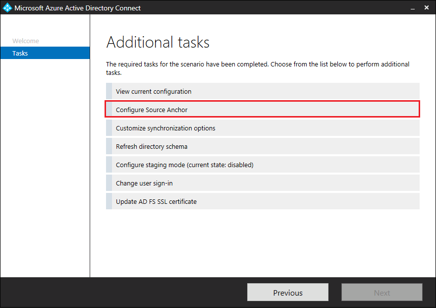
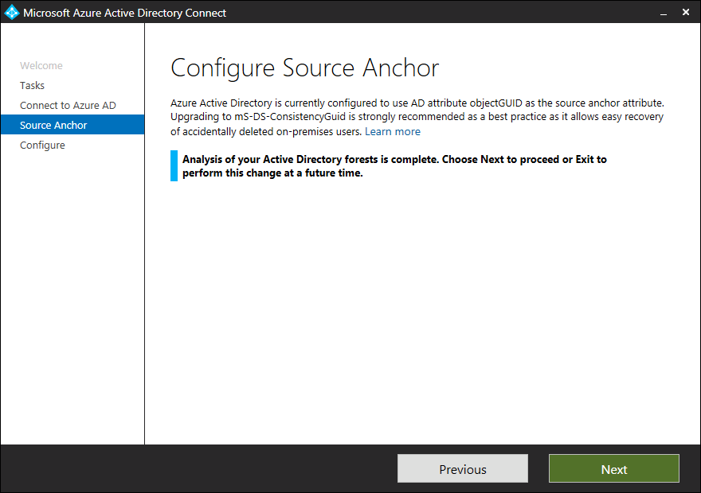
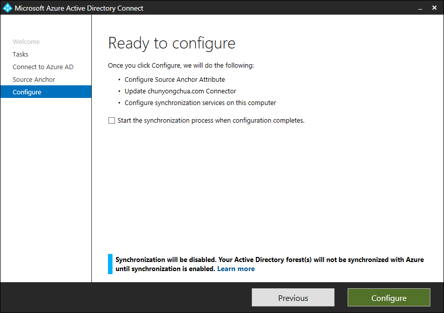
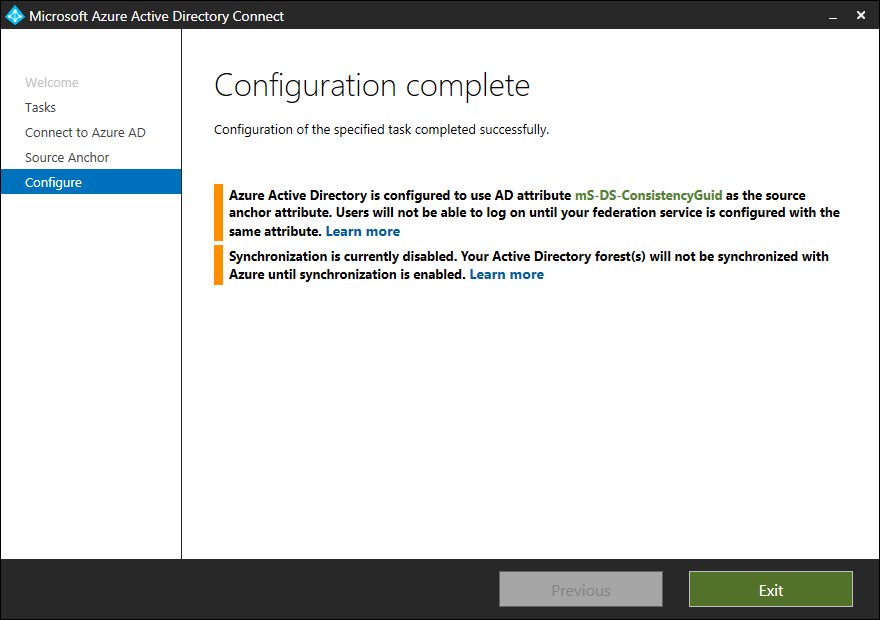
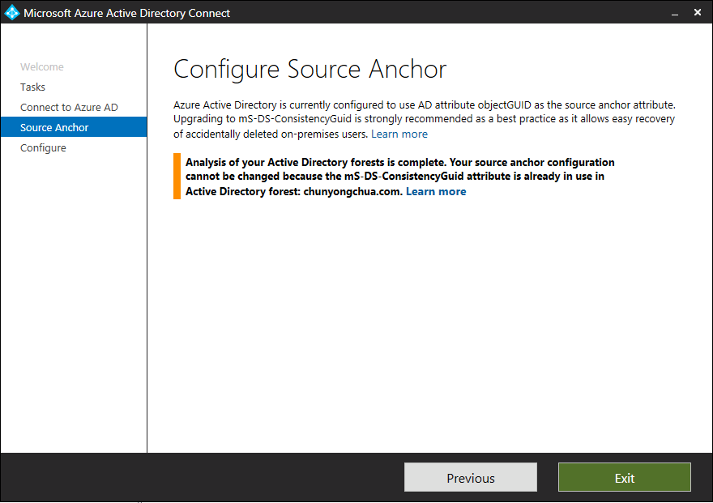

# Microsoft Entra Connect: Design concepts
The purpose of this document is to describe areas that must be considered while configuring Microsoft Entra Connect. This document is a deep dive on certain areas and these concepts are briefly described in other documents as well.

## sourceAnchor
The sourceAnchor attribute is defined as *an attribute immutable during the lifetime of an object*. It uniquely identifies an object as being the same object on-premises and in Microsoft Entra ID. The attribute is also called **immutableId** and the two names are used interchangeably.

The word immutable, that is "can't be changed", is important to this document. Since this attribute’s value can't be changed after it has been set, it's important to pick a design that supports your scenario.

The attribute is used for the following scenarios:

* When a new sync engine server is built, or rebuilt after a disaster recovery scenario, this attribute links existing objects in Microsoft Entra ID with objects on-premises.
* If you move from a cloud-only identity to a synchronized identity model, then this attribute allows objects to "hard match" existing objects in Microsoft Entra ID with on-premises objects.
* If you use federation, then this attribute together with the **userPrincipalName** is used in the claim to uniquely identify a user.

This topic only talks about sourceAnchor as it relates to users. The same rules apply to all object types, but it's only for users this problem usually is a concern.

### Selecting a good sourceAnchor attribute
The attribute value must follow the following rules:

* Fewer than 60 characters in length
  * Characters not being a-z, A-Z, or 0-9 are encoded and counted as 3 characters
* Not contain a special character: &#92; ! # $ % & * + / = ? ^ &#96; { } | ~ < > ( ) ' ; : , [ ] " \@ _
* Must be globally unique
* Must be either a string, integer, or binary
* Shouldn't be based on user's name because these can change
* Shouldn't be case-sensitive and avoid values that may vary by case
* Should be assigned when the object is created

If the selected sourceAnchor isn't of type string, then Microsoft Entra Connect Base64Encode the attribute value to ensure no special characters appear. If you use another federation server than ADFS, make sure your server can also Base64Encode the attribute.

The sourceAnchor attribute is case-sensitive. A value of “JohnDoe” isn't the same as “johndoe”. But you shouldn't have two different objects with only a difference in case.

If you've a single forest on-premises, then the attribute you should use is **objectGUID**. This is also the attribute used when you use express settings in Microsoft Entra Connect and also the attribute used by DirSync.

If you've multiple forests and don't move users between forests and domains, then **objectGUID** is a good attribute to use even in this case.

If you move users between forests and domains, then you must find an attribute that doesn't change or can be moved with the users during the move. A recommended approach is to introduce a synthetic attribute. An attribute that could hold something that looks like a GUID would be suitable. During object creation, a new GUID is created and stamped on the user. A custom sync rule can be created in the sync engine server to create this value based on the **objectGUID** and update the selected attribute in AD DS. When you move the object, make sure to also copy the content of this value.

Another solution is to pick an existing attribute you know doesn't change. Commonly used attributes include **employeeID**. If you consider an attribute that contains letters, make sure there's no chance the case (upper case vs. lower case) can change for the attribute's value. Bad attributes that shouldn't be used include those attributes with the name of the user. In a marriage or divorce, the name is expected to change, which isn't allowed for this attribute. This is also one reason why attributes such as **userPrincipalName**, **mail**, and **targetAddress** aren't even possible to select in the Microsoft Entra Connect installation wizard. Those attributes also contain the "\@" character, which isn't allowed in the sourceAnchor.

### Changing the sourceAnchor attribute
The sourceAnchor attribute value can't be changed after the object has been created in Microsoft Entra ID and the identity is synchronized.

For this reason, the following restrictions apply to Microsoft Entra Connect:

* The sourceAnchor attribute can only be set during initial installation. If you rerun the installation wizard, this option is read-only. If you need to change this setting, then you must uninstall and reinstall.
* If you install another Microsoft Entra Connect server, then you must select the same sourceAnchor attribute as previously used. If you've earlier been using DirSync and move to Microsoft Entra Connect, then you must use **objectGUID** since that is the attribute used by DirSync.
* If the value for sourceAnchor is changed after the object has been exported to Microsoft Entra ID, then Microsoft Entra Connect Sync throws an error and doesn't allow any more changes on that object before the issue has been fixed and the sourceAnchor is changed back in the source directory.

## Using ms-DS-ConsistencyGuid as sourceAnchor
By default, Microsoft Entra Connect (version 1.1.486.0 and older) uses objectGUID as the sourceAnchor attribute. ObjectGUID is system-generated. You can't specify its value when creating on-premises AD objects. As explained in section [sourceAnchor](#sourceanchor), there are scenarios where you need to specify the sourceAnchor value. If the scenarios are applicable to you, you must use a configurable AD attribute (for example, ms-DS-ConsistencyGuid) as the sourceAnchor attribute.

Microsoft Entra Connect (version 1.1.524.0 and after) now facilitates the use of ms-DS-ConsistencyGuid as sourceAnchor attribute. When using this feature, Microsoft Entra Connect automatically configures the synchronization rules to:

1. Use ms-DS-ConsistencyGuid as the sourceAnchor attribute for User objects. ObjectGUID is used for other object types.

2. For any given on-premises AD User object whose ms-DS-ConsistencyGuid attribute isn't populated, Microsoft Entra Connect writes its objectGUID value back to the ms-DS-ConsistencyGuid attribute in on-premises Active Directory. After the ms-DS-ConsistencyGuid attribute is populated, Microsoft Entra Connect then exports the object to Microsoft Entra ID.

>[!NOTE]
> Once an on-premises AD object is imported into Microsoft Entra Connect (that is, imported into the AD Connector Space and projected into the Metaverse), you can't change its sourceAnchor value anymore. To specify the sourceAnchor value for a given on-premises AD object, configure its ms-DS-ConsistencyGuid attribute before it's imported into Microsoft Entra Connect.

### Permission required
For this feature to work, the AD DS account used to synchronize with on-premises Active Directory must be granted write permission to the ms-DS-ConsistencyGuid attribute in on-premises Active Directory.

### How to enable the ConsistencyGuid feature - New installation
You can enable the use of ConsistencyGuid as sourceAnchor during new installation. This section covers both Express and Custom installation in details.

  >[!NOTE]
  > Only newer versions of Microsoft Entra Connect (1.1.524.0 and after) support the use of ConsistencyGuid as sourceAnchor during new installation.

### How to enable the ConsistencyGuid feature

#### Express Installation
When installing Microsoft Entra Connect with Express mode, the Microsoft Entra Connect wizard automatically determines the most appropriate AD attribute to use as the sourceAnchor attribute using the following logic:

* First, the Microsoft Entra Connect wizard queries your Microsoft Entra tenant to retrieve the AD attribute used as the sourceAnchor attribute in the previous Microsoft Entra Connect installation (if any). If this information is available, Microsoft Entra Connect uses the same AD attribute.

  >[!NOTE]
  > Only newer versions of Microsoft Entra Connect (1.1.524.0 and after) store information in your Microsoft Entra tenant about the sourceAnchor attribute used during installation. Older versions of Microsoft Entra Connect don't.

* If information about the sourceAnchor attribute used isn't available, the wizard checks the state of the ms-DS-ConsistencyGuid attribute in your on-premises Active Directory. If the attribute isn't configured on any object in the directory, the wizard uses the ms-DS-ConsistencyGuid as the sourceAnchor attribute. If the attribute is configured on one or more objects in the directory, the wizard concludes the attribute is being used by other applications and isn't suitable as sourceAnchor attribute...

* In which case, the wizard falls back to using objectGUID as the sourceAnchor attribute.

* Once the sourceAnchor attribute is decided, the wizard stores the information in your Microsoft Entra tenant. The information will be used by future installation of Microsoft Entra Connect.

Once Express installation completes, the wizard informs you which attribute has been picked as the Source Anchor attribute.


#### Custom installation
When installing Microsoft Entra Connect with Custom mode, the Microsoft Entra Connect wizard provides two options when configuring sourceAnchor attribute:


| Setting | Description |
| --- | --- |
| Let Microsoft Entra ID manage the source anchor for me | Select this option if you want Microsoft Entra ID to pick the attribute for you. If you select this option, Microsoft Entra Connect wizard applies the same [sourceAnchor attribute selection logic used during Express installation](#express-installation). Similar to Express installation, the wizard informs you which attribute has been picked as the Source Anchor attribute after Custom installation completes. |
| A specific attribute | Select this option if you wish to specify an existing AD attribute as the sourceAnchor attribute. |

### How to enable the ConsistencyGuid feature - Existing deployment
If you've an existing Microsoft Entra Connect deployment which is using objectGUID as the Source Anchor attribute, you can switch it to using ConsistencyGuid instead.

>[!NOTE]
> Only newer versions of Microsoft Entra Connect (1.1.552.0 and after) support switching from ObjectGuid to ConsistencyGuid as the Source Anchor attribute.

To switch from objectGUID to ConsistencyGuid as the Source Anchor attribute:

1. Start the Microsoft Entra Connect wizard and click **Configure** to go to the Tasks screen.

2. Select the **Configure Source Anchor** task option and click **Next**.

   

3. Enter your Microsoft Entra Administrator credentials and click **Next**.

4. Microsoft Entra Connect wizard analyzes the state of the ms-DS-ConsistencyGuid attribute in your on-premises Active Directory. If the attribute isn't configured on any object in the directory, Microsoft Entra Connect concludes that no other application is currently using the attribute and is safe to use it as the Source Anchor attribute. Click **Next** to continue.

   

5. In the **Ready to Configure** screen, click **Configure** to make the configuration change.

   

6. Once the configuration completes, the wizard indicates that ms-DS-ConsistencyGuid is now being used as the Source Anchor attribute.

   

During the analysis (step 4), if the attribute is configured on one or more objects in the directory, the wizard concludes the attribute is being used by another application and returns an error as illustrated in the diagram below. This error can also occur if you've previously enabled the ConsistencyGuid feature on your primary Microsoft Entra Connect server and you're trying to do the same on your staging server.



 If you're certain that the attribute isn't used by other existing applications, you can suppress the error by restarting the Microsoft Entra Connect wizard with the **/SkipLdapSearch** switch specified. To do so, run the following command in command prompt:

```
"c:\Program Files\Microsoft Azure Active Directory Connect\AzureADConnect.exe" /SkipLdapSearch
```

### Impact on AD FS or third-party federation configuration
If you're using Microsoft Entra Connect to manage on-premises AD FS deployment, the Microsoft Entra Connect automatically updates the claim rules to use the same AD attribute as sourceAnchor. This ensures that the ImmutableID claim generated by ADFS is consistent with the sourceAnchor values exported to Microsoft Entra ID.

If you're managing AD FS outside of Microsoft Entra Connect or you're using third-party federation servers for authentication, you must manually update the claim rules for ImmutableID claim to be consistent with the sourceAnchor values exported to Microsoft Entra ID as described in article section [Modify AD FS claim rules](./how-to-connect-fed-management.md#modclaims). The wizard returns the following warning after installation completes:


### Adding new directories to existing deployment
Suppose you've deployed Microsoft Entra Connect with the ConsistencyGuid feature enabled, and now you would like to add another directory to the deployment. When you try to add the directory, Microsoft Entra Connect wizard checks the state of the ms-DS-ConsistencyGuid attribute in the directory. If the attribute is configured on one or more objects in the directory, the wizard concludes the attribute is being used by other applications and returns an error as illustrated in the diagram below. If you're certain that the attribute isn't used by existing applications, you can suppress the error by restarting the Microsoft Entra Connect wizard with the **/SkipLdapSearch** switch specified as described above or you need to contact Support for more information.


<a name='azure-ad-sign-in'></a>

## Microsoft Entra sign-in
While integrating your on-premises directory with Microsoft Entra ID, it's important to understand how the synchronization settings can affect the way user authenticates. Microsoft Entra ID uses userPrincipalName (UPN) to authenticate the user. However, when you synchronize your users, you must choose the attribute to be used for value of userPrincipalName carefully.

### Choosing the attribute for userPrincipalName
When you're selecting the attribute for providing the value of UPN to be used in Microsoft Entra ID one should ensure

* The attribute values conform to the UPN syntax (RFC 822), it should be in the format of username\@domain
* The suffix in the values matches to one of the verified custom domains in Microsoft Entra ID

In express settings, the assumed choice for the attribute is userPrincipalName. If the userPrincipalName attribute doesn't contain the value you want your users to sign in to Microsoft Entra ID, then you must choose **Custom Installation**.

>[!NOTE]
>It's recommended as a best practice that the UPN prefix contains more than one character.

### Custom domain state and UPN
It is important to ensure that there's a verified domain for the UPN suffix.

John is a user in contoso.com. You want John to use the on-premises UPN john\@contoso.com to sign in to Microsoft Entra ID after you've synced users to your Microsoft Entra directory contoso.onmicrosoft.com. To do so, you need to add and verify contoso.com as a custom domain in Microsoft Entra ID before you can start syncing the users. If the UPN suffix of John, for example contoso.com, doesn't match a verified domain in Microsoft Entra ID, then Microsoft Entra ID replaces the UPN suffix with contoso.onmicrosoft.com.

<a name='non-routable-on-premises-domains-and-upn-for-azure-ad'></a>

### Non-routable on-premises domains and UPN for Microsoft Entra ID
Some organizations have non-routable domains, like contoso.local, or simple single label domains like contoso. You aren't able to verify a non-routable domain in Microsoft Entra ID. Microsoft Entra Connect can sync to only a verified domain in Microsoft Entra ID. When you create a Microsoft Entra directory, it creates a routable domain that becomes default domain for your Microsoft Entra ID for example, contoso.onmicrosoft.com. Therefore, it becomes necessary to verify any other routable domain in such a scenario in case you don't want to sync to the default onmicrosoft.com domain.

Read [Add your custom domain name to Microsoft Entra ID](~/fundamentals/add-custom-domain.md) for more info on adding and verifying domains.

Microsoft Entra Connect detects if you're running in a non-routable domain environment and would appropriately warn you from going ahead with express settings. If you're operating in a non-routable domain, then it's likely that the UPN, of the users, have non-routable suffixes too. For example, if you're running under contoso.local, Microsoft Entra Connect suggests you to use custom settings rather than using express settings. Using custom settings, you're able to specify the attribute that should be used as UPN to sign in to Microsoft Entra ID after the users are synced to Microsoft Entra ID.

## Next steps
Learn more about [Integrating your on-premises identities with Microsoft Entra ID](../whatis-hybrid-identity.md).
