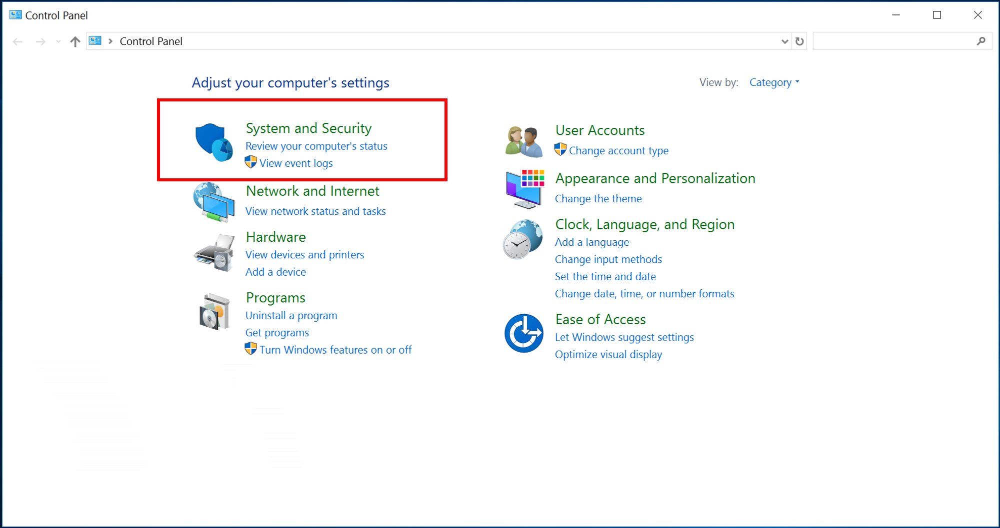
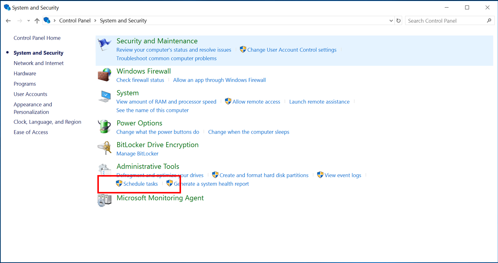

# User privacy and Microsoft Entra Connect 

[!INCLUDE [Privacy](~/includes/includes/azure-docs-pr/gdpr-intro-sentence.md)]

>[!NOTE] 
>This article deals with Microsoft Entra Connect and user privacy.  For information on Microsoft Entra Connect Health and user privacy see the article [here](reference-connect-health-user-privacy.md).

Improve user privacy for Microsoft Entra Connect installations in two ways:

1. Upon request, extract data for a person and remove data from that person from the installations
2. Ensure no data is retained beyond 48 hours.

The Microsoft Entra Connect team recommends the second option since it is much easier to implement and maintain.

A Microsoft Entra Connect Sync server stores the following user privacy data:
1. Data about a person in the **Microsoft Entra Connect database**
2. Data in the **Windows Event log** files that may contain information about a person
3. Data in the **Microsoft Entra Connect installation log files** that may contain about a person

Microsoft Entra Connect customers should use the following guidelines when removing user data:
1. Delete the contents of the folder that contains the Microsoft Entra Connect installation log files on a regular basis – at least every 48 hours
2. This product may also create Event Logs.  To learn more about Event Logs logs, please see the [documentation here](/windows/win32/wes/windows-event-log).

Data about a person is automatically removed from the Microsoft Entra Connect database when that person’s data is removed from the source system where it originated from. No specific action from administrators is required to be GDPR compliant.  However, it does require that the Microsoft Entra Connect data is synced with your data source at least every two days.

<a name='delete-the-azure-ad-connect-installation-log-file-folder-contents'></a>

## Delete the Microsoft Entra Connect installation log file folder contents
Regularly check and delete the contents of **c:\programdata\aadconnect** folder – except for the **PersistedState.Xml** file. This file maintains the state of the previous installation of Azure A Connect and is used when an upgrade installation is performed. This file doesn't contain any data about a person and shouldn't be deleted.

>[!IMPORTANT]
>Do not delete the PersistedState.xml file.  This file contains no user information and maintains the state of the previous installation.

You can either review and delete these files using Windows Explorer or you can use a script like the following to perform the necessary actions:


```
$Files = ((Get-childitem -Path "$env:programdata\aadconnect" -Recurse).VersionInfo).FileName
Foreach ($file in $files) {
If ($File.ToUpper() -ne "$env:programdata\aadconnect\PERSISTEDSTATE.XML".toupper()) # Do not delete this file
    {Remove-Item -Path $File -Force}
    } 
```

### Schedule this script to run every 48 hours
Use the following steps to schedule the script to run every 48 hours.

1. Save the script in a file with the extension **&#46;PS1**, then open the Control Panel and click on **Systems and Security**.
    

2. Under the Administrative Tools heading, click on **Schedule Tasks**.
    
3. In Task Scheduler, right click on **Task Schedule Library** and click on **Create Basic task…**
4. Enter the name for the new task and click **Next**.
5. Select **Daily** for the task trigger and click on **Next**.
6. Set the recurrence to **2 days** and click **Next**.
7. Select **Start a program** as the action and click on **Next**.
8. Type **PowerShell** in the box for the Program/script, and in box labeled **Add arguments (optional)**, enter the full path to the script that you created earlier, then click **Next**.
9. The next screen shows a summary of the task you are about to create. Verify the values and click **Finish** to create the task.


## Next steps
* [Review the Microsoft Privacy policy on Trust Center](https://www.microsoft.com/trust-center)
* [Microsoft Entra Connect Health and User Privacy](reference-connect-health-user-privacy.md)
