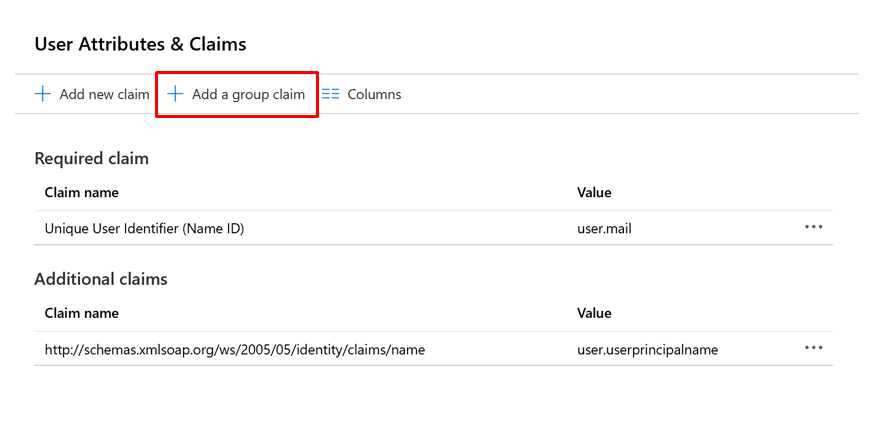
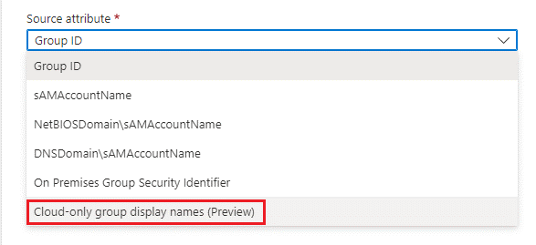
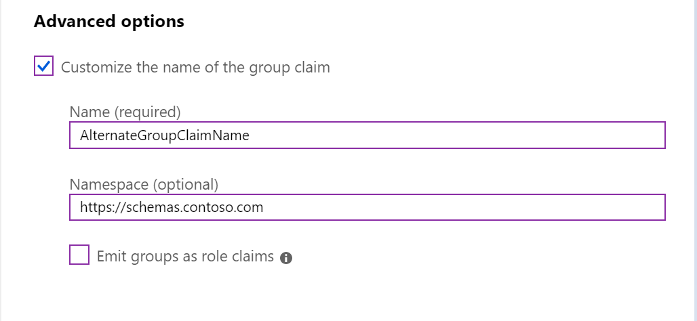
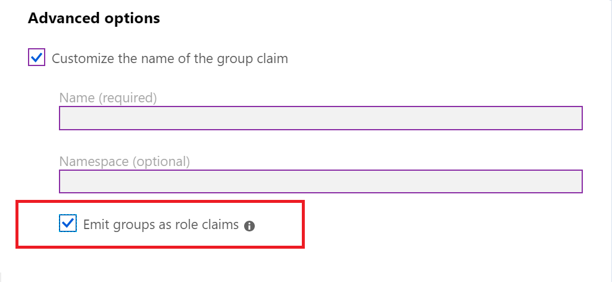
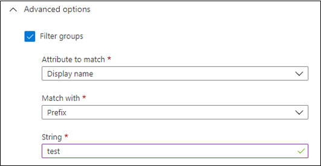
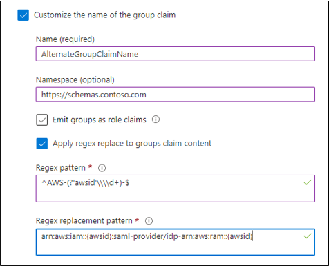
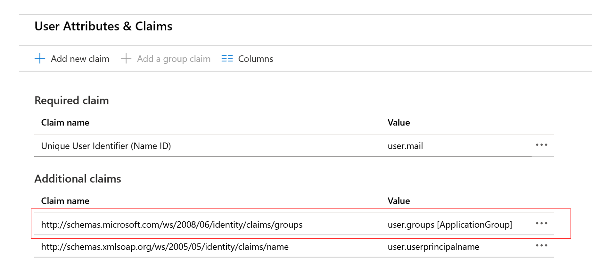

# Configure group claims for applications by using Azure Active Directory

Azure Active Directory (Azure AD) can provide a user's group membership information in tokens for use within applications. This feature supports three main patterns:

- Groups identified by their Azure AD object identifier (OID) attribute
- Groups identified by the `sAMAccountName` or `GroupSID` attribute for Active Directory-synchronized groups and users
- Groups identified by their Display Name attribute for cloud-only groups (Preview)

> [!IMPORTANT]
> The number of groups emitted in a token is limited to 150 for SAML assertions and 200 for JWT, including nested groups. In larger organizations, the number of groups where a user is a member might exceed the limit that Azure AD will add to a token. Exceeding a limit can lead to unpredictable results. For workarounds to these limits, read more in [Important caveats for this functionality](#important-caveats-for-this-functionality).

## Important caveats for this functionality

- Support for use of `sAMAccountName` and security identifier (SID) attributes synced from on-premises is designed to enable moving existing applications from Active Directory Federation Services (AD FS) and other identity providers. Groups managed in Azure AD don't contain the attributes necessary to emit these claims.
- In order to avoid the number of groups limit if your users have large numbers of group memberships, you can restrict the groups emitted in claims to the relevant groups for the application. Read more about emitting groups assigned to the application for [JWT tokens](..\develop\active-directory-optional-claims.md#configuring-groups-optional-claims) and [SAML tokens](#add-group-claims-to-tokens-for-saml-applications-using-sso-configuration). If assigning groups to your applications is not possible, you can also configure a [group filter](#group-filtering) to reduce the number of groups emitted in the claim. Group filtering applies to tokens emitted for apps where group claims and filtering was configured in the **Enterprise apps** blade in the portal.
- Group claims have a five-group limit if the token is issued through the implicit flow. Tokens requested via the implicit flow will have a `"hasgroups":true` claim only if the user is in more than five groups.
- We recommend basing in-app authorization on application roles rather than groups when:

  - You're developing a new application, or an existing application can be configured for it.
  - Support for nested groups isn't required.
  
  Using application roles limits the amount of information that needs to go into the token, is more secure, and separates user assignment from app configuration.

## Group claims for applications migrating from AD FS and other identity providers

Many applications that are configured to authenticate with AD FS rely on group membership information in the form of Windows Server Active Directory group attributes. These attributes are the group `sAMAccountName`, which might be qualified by domain name, or the Windows group security identifier (`GroupSID`). When the application is federated with AD FS, AD FS uses the `TokenGroups` function to retrieve the group memberships for the user.

An app that has been moved from AD FS needs claims in the same format. Group and role claims emitted from Azure AD might contain the domain-qualified `sAMAccountName` attribute or the `GroupSID` attribute synced from Active Directory, rather than the group's Azure AD `objectID` attribute.

The supported formats for group claims are:

- **Azure AD group ObjectId**: Available for all groups.
- **sAMAccountName**: Available for groups synchronized from Active Directory.
- **NetbiosDomain\sAMAccountName**: Available for groups synchronized from Active Directory.
- **DNSDomainName\sAMAccountName**: Available for groups synchronized from Active Directory.
- **On-premises group security identifier**: Available for groups synchronized from Active Directory.

> [!NOTE]
> `sAMAccountName` and on-premises `GroupSID` attributes are available only on group objects synced from Active Directory. They aren't available on groups created in Azure AD or Office 365. Applications configured in Azure AD to get synced on-premises group attributes get them for synced groups only.

## Options for applications to consume group information

Applications can call the Microsoft Graph group's endpoint to obtain group information for the authenticated user. This call ensures that all the groups where a user is a member are available, even when a large number of groups is involved. Group enumeration is then independent of limitations on token size.

However, if an existing application expects to consume group information via claims, you can configure Azure AD with various claim formats. Consider the following options:

- When you're using group membership for in-application authorization, it's preferable to use the group `ObjectID` attribute. The group `ObjectID` attribute is immutable and unique in Azure AD. It's available for all groups.
- If you're using the on-premises group `sAMAccountName` attribute for authorization, use domain-qualified names. It reduces the chance of names clashing. `sAMAccountName` might be unique within an Active Directory domain, but if more than one Active Directory domain is synchronized with an Azure AD tenant, there's a possibility for more than one group to have the same name.
- Consider using [application roles](../../active-directory/develop/howto-add-app-roles-in-azure-ad-apps.md) to provide a layer of indirection between the group membership and the application. The application then makes internal authorization decisions based on role claims in the token.
- If the application is configured to get group attributes that are synced from Active Directory and a group doesn't contain those attributes, it won't be included in the claims.
- Group claims in tokens include nested groups, except when you're using the option to restrict the group claims to groups that are assigned to the application. 

  If a user is a member of GroupB, and GroupB is a member of GroupA, then the group claims for the user will contain both GroupA and GroupB. When an organization's users have large numbers of group memberships, the number of groups listed in the token can grow the token size. Azure AD limits the number of groups that it will emit in a token to 150 for SAML assertions and 200 for JWT. If a user is a member of a larger number of groups, the groups are omitted. A link to the Microsoft Graph endpoint to obtain group information is included instead.

## Prerequisites for using group attributes synchronized from Active Directory

Group membership claims can be emitted in tokens for any group if you use the `ObjectId` format. To use group claims in formats other than group `ObjectId`, the groups must be synchronized from Active Directory via Azure AD Connect.

To configure Azure AD to emit group names for Active Directory groups:

1. **Synchronize group names from Active Directory**

   Before Azure AD can emit the group names or on-premises group SID in group or role claims, you need to synchronize the required attributes from Active Directory. You must be running Azure AD Connect version 1.2.70 or later. Earlier versions of Azure AD Connect than 1.2.70 will synchronize the group objects from Active Directory, but they won't include the required group name attributes.

2. **Configure the application registration in Azure AD to include group claims in tokens**

   You can configure group claims in the **Enterprise Applications** section of the portal, or by using the application manifest in the **Application Registrations** section. To configure group claims in the application manifest, see [Configure the Azure AD application registration for group attributes](#configure-the-azure-ad-application-registration-for-group-attributes) later in this article.

## Add group claims to tokens for SAML applications using SSO configuration

To configure group claims for a gallery or non-gallery SAML application via single sign-on (SSO):

1. Open **Enterprise Applications**, select the application in the list, select **Single Sign On configuration**, and then select **User Attributes & Claims**.

2. Select **Add a group claim**.

   

3. Use the options to select which groups should be included in the token.

   

   | Selection | Description |
   |----------|-------------|
   | **All groups** | Emits security groups and distribution lists and roles. |
   | **Security groups** | Emits security groups that the user is a member of in the groups claim. |
   | **Directory roles** | If the user is assigned directory roles, they're emitted as a `wids` claim. (The group's claim won't be emitted.) |
   | **Groups assigned to the application** | Emits only the groups that are explicitly assigned to the application and that the user is a member of. Recommended for large organizations due to the group number limit in token. |

   - For example, to emit all the security groups that the user is a member of, select **Security groups**.

     

     To emit groups by using Active Directory attributes synced from Active Directory instead of Azure AD `objectID` attributes, select the required format from the **Source attribute** drop-down list. Only groups synchronized from Active Directory will be included in the claims.

     

   - To emit only groups assigned to the application, select **Groups assigned to the application**.

     

     Groups assigned to the application will be included in the token. Other groups that the user is a member of will be omitted. With this option, nested groups are not included and the user must be a direct member of the group assigned to the application.

     To change the groups assigned to the application, select the application from the **Enterprise Applications** list. Then select **Users and Groups** from the application's left menu.

     For more information about managing group assignment to applications, see [Assign a user or group to an enterprise app](../../active-directory/manage-apps/assign-user-or-group-access-portal.md).

## Emit cloud-only group display name in token (Preview)

You can configure group claim to include the group display name for the cloud-only groups.

1. Open **Enterprise Applications**, select the application in the list, select **Single Sign On configuration**, and then select **User Attributes & Claims**.

2. If you already have group claims configured, select it from the **Additional claims** section. Otherwise, you can add the group claim as described in the previous steps.

3. For the group type emitted in the token select **Groups assigned to the application**:
   
   

4. To emit group display name just for cloud groups, in the **Source attribute** dropdown select the **Cloud-only group display names (Preview)**:

   

5. For a hybrid setup, to emit on-premises group attribute for synced groups and display name for cloud groups, you can select the desired on-premises sources attribute and check the checkbox **Emit group name for cloud-only groups (Preview)**:

   


### Set advanced options

#### Customize group claim name
You can modify the way that group claims are emitted by using the settings under **Advanced options**.

If you select **Customize the name of the group claim**, you can specify a different claim type for group claims. Enter the claim type in the **Name** box and the optional namespace for the claim in the **Namespace** box.



Some applications require the group membership information to appear in the role claim. You can optionally emit the user's groups as roles by selecting the **Emit groups as role claims** checkbox.



> [!NOTE]
> If you use the option to emit group data as roles, only groups will appear in the role claim. Any application roles that the user is assigned to won't appear in the role claim.

#### Group filtering
Group filtering allows for fine control of the list of groups that's included as part of the group claim. When a filter is configured, only groups that match the filter will be included in the group's claim that's sent to that application. The filter will be applied against all groups regardless of the group hierarchy.

> [!NOTE]
> Group filtering applies to tokens emitted for apps where group claims and filtering was configured in the **Enterprise apps** blade in the portal.

You can configure filters to be applied to the group's display name or `SAMAccountName` attribute. The following filtering operations are supported: 

 - **Prefix**: Matches the start of the selected attribute. 
 - **Suffix**: Matches the end of the selected attribute. 
 - **Contains**: Matches any location in the selected attribute. 

 

#### Group transformation
Some applications might require the groups in a different format from how they're represented in Azure AD. To support this requirement, you can apply a transformation to each group that will be emitted in the group claim. You achieve it by allowing the configuration of a regular expression (regex) and a replacement value on custom group claims. 

\

- **Regex pattern**: Use a regex to parse text strings according to the pattern that you set in this box. If the regex pattern that you outline evaluates to `true`, the regex replacement pattern will run. 
- **Regex replacement pattern**: Outline in regex notation how you want to replace your string if the regex pattern that you outlined evaluates to `true`. Use capture groups to match subexpressions in this replacement regex. 

For more information about regex replace and capture groups, see [The Regular Expression Object Model: The Captured Group](/dotnet/standard/base-types/the-regular-expression-object-model?WT.mc_id=Portal-fx#the-captured-group).

>[!NOTE]
> As described in the Azure AD documentation, you can't modify a restricted claim by using a policy. The data source can't be changed, and no transformation is applied when you're generating these claims. The group claim is still a restricted claim, so you need to customize the groups by changing the name. If you select a restricted name for the name of your custom group claim, the claim will be ignored at runtime. 
>
> You can also use the regex transform feature as a filter, because any groups that don't match the regex pattern will not be emitted in the resulting claim.
>
>If the transform applied to the original groups claim results in a new custom claim, then the original groups claim will be omitted from the token. However, if the configured regex doesn't match any value in the original list, then the custom claim will not be present and the original groups claim will be included in the token.

### Edit the group claim configuration

After you add a group claim configuration to the **User Attributes & Claims** configuration, the option to add a group claim will be unavailable. To change the group claim configuration, select the group claim in the **Additional claims** list.



## Configure the Azure AD application registration for group attributes

You can also configure group claims in the [optional claims](../../active-directory/develop/active-directory-optional-claims.md) section of the [application manifest](../../active-directory/develop/reference-app-manifest.md).

1. In the portal, select **Azure Active Directory** > **Application Registrations** > **Select Application** > **Manifest**.

2. Enable group membership claims by changing `groupMembershipClaims`.

   Valid values are:

   | Selection | Description |
   |----------|-------------|
   | `All` | Emits security groups, distribution lists, and roles. |
   | `SecurityGroup` | Emits security groups that the user is a member of in the group claim. |
   | `DirectoryRole` | If the user is assigned directory roles, they're emitted as a `wids` claim. (A group claim won't be emitted.) |
   | `ApplicationGroup` | Emits only the groups that are explicitly assigned to the application and that the user is a member of. |
   | `None` | No groups are returned. (It's not case-sensitive, so `none` also works. It can be set directly in the application manifest.) |

   For example:

   ```json
   "groupMembershipClaims": "SecurityGroup"
   ```

   By default, group `ObjectID` attributes will be emitted in the group claim value. To modify the claim value to contain on-premises group attributes, or to change the claim type to a role, use the `optionalClaims` configuration described in the next step.

3. Set optional claims for group name configuration.

   If you want the groups in the token to contain the on-premises Active Directory group attributes, specify which token-type optional claim should be applied in the `optionalClaims` section. You can list multiple token types:

   - `idToken` for the OIDC ID token
   - `accessToken` for the OAuth/OIDC access token
   - `Saml2Token` for SAML tokens

   > [!NOTE]
   > The `Saml2Token` type applies to tokens in both SAML1.1 and SAML2.0 format.

   For each relevant token type, modify the group claim to use the `optionalClaims` section in the manifest. The `optionalClaims` schema is as follows:

   ```json
   {
   "name": "groups",
   "source": null,
   "essential": false,
   "additionalProperties": []
   }
   ```

   | Optional claims schema | Value |
   |----------|-------------|
   | `name` | Must be `"groups"`. |
   | `source` | Not used. Omit or specify `null`. |
   | `essential` | Not used. Omit or specify `false`. |
   | `additionalProperties` | List of additional properties. Valid options are `"sam_account_name"`, `"dns_domain_and_sam_account_name"`, `"netbios_domain_and_sam_account_name"`, `"cloud_displayname"`, and `"emit_as_roles"`. |

   In `additionalProperties`, only one of `"sam_account_name"`, `"dns_domain_and_sam_account_name"`, or `"netbios_domain_and_sam_account_name"` is required. If more than one is present, the first is used and any others are ignored.

   Some applications require group information about the user in the role claim. To change the claim type to from a group claim to a role claim, add `"emit_as_roles"` to additional properties. The group values will be emitted in the role claim.

   To emit group display name for cloud-only groups, you can add `"cloud_displayname"` to `additional properties`. This option will work only when `“groupMembershipClaims”` is set to `ApplicationGroup`

   > [!NOTE]
   > If you use `"emit_as_roles"`, any configured application roles that the user is assigned to will not appear in the role claim.

### Examples

Emit groups as group names in OAuth access tokens in `DNSDomainName\sAMAccountName` format:

```json
"optionalClaims": {
    "accessToken": [{
        "name": "groups",
        "additionalProperties": ["dns_domain_and_sam_account_name"]
    }]
}
```

Emit group names to be returned in `NetbiosDomain\sAMAccountName` format as the role claim in SAML and OIDC ID tokens:

```json
"optionalClaims": {
    "saml2Token": [{
        "name": "groups",
        "additionalProperties": ["netbios_domain_and_sam_account_name", "emit_as_roles"]
    }],

    "idToken": [{
        "name": "groups",
        "additionalProperties": ["netbios_domain_and_sam_account_name", "emit_as_roles"]
    }]
}
```

## Next steps

- [Add authorization using groups & group claims to an ASP.NET Core web app (code sample)](https://github.com/Azure-Samples/active-directory-aspnetcore-webapp-openidconnect-v2/blob/master/5-WebApp-AuthZ/5-2-Groups/README.md)
- [Assign a user or group to an enterprise app](../../active-directory/manage-apps/assign-user-or-group-access-portal.md)
- [Configure role claims](../../active-directory/develop/active-directory-enterprise-app-role-management.md)
