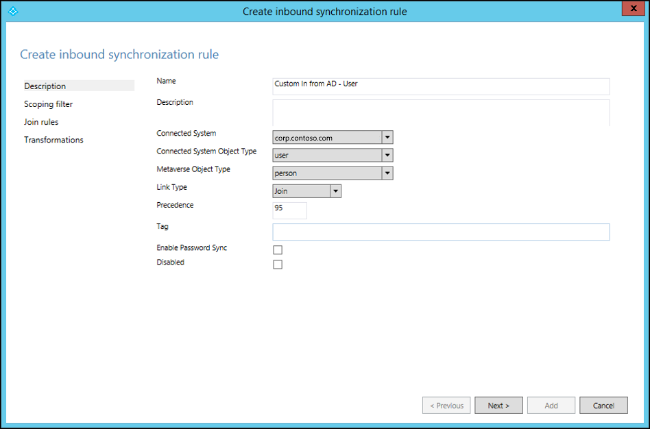
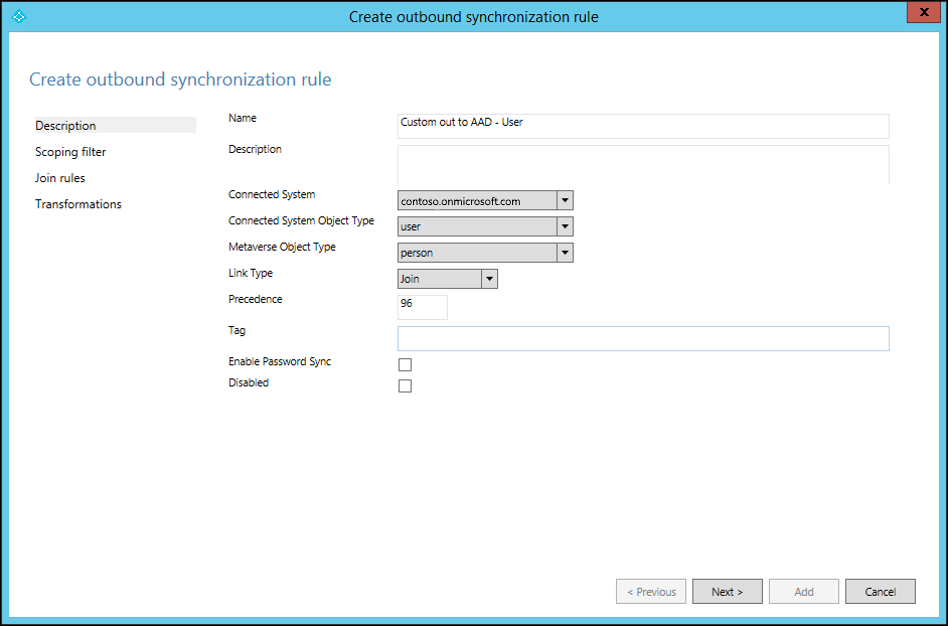
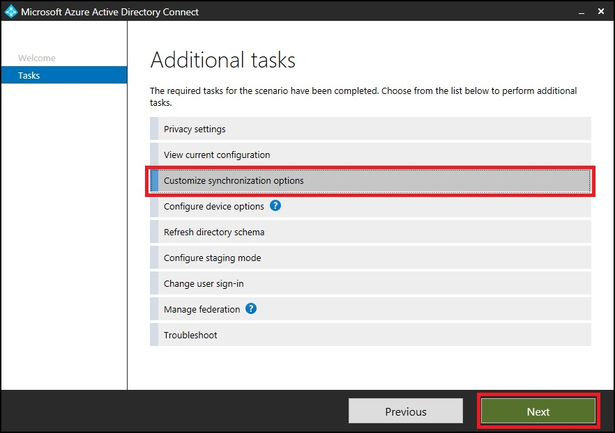
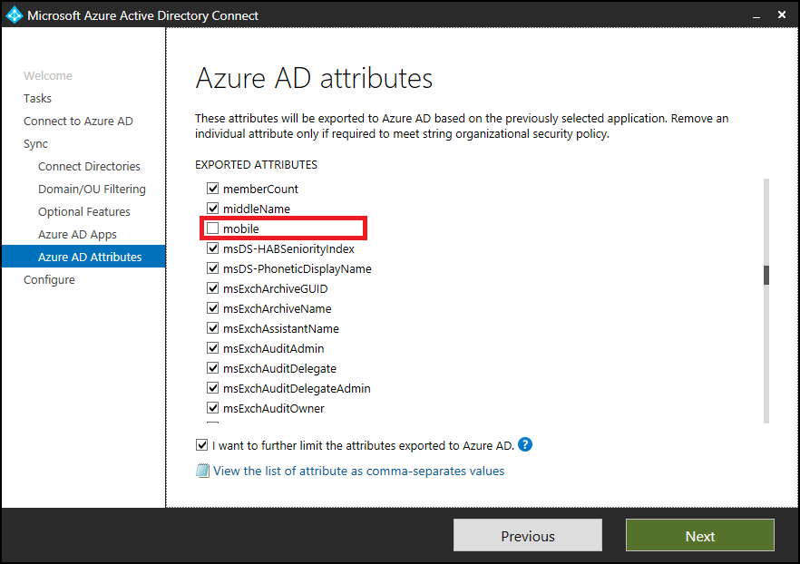
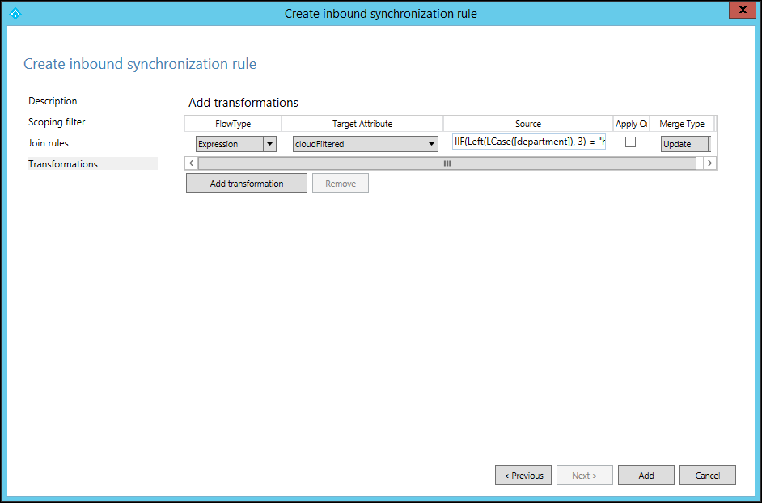
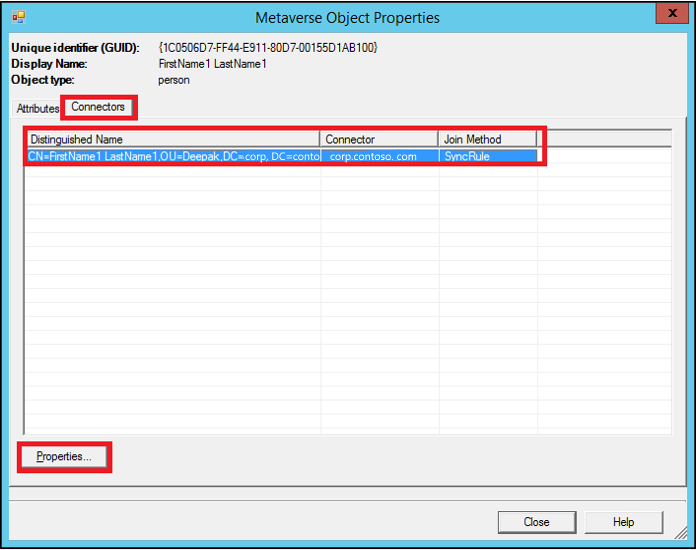

# Fix modified default rules in Azure AD Connect

Azure Active Directory (Azure AD) Connect uses default rules for synchronization.  Unfortunately, these rules don't apply universally to all organizations. Based on your requirements, you might need to modify them. This article discusses two examples of the most common customizations, and explains the correct way to achieve these customizations.

>[!NOTE] 
> Modifying existing default rules to achieve a needed customization isn't supported. If you do so, it prevents updating these rules to the latest version in future releases. You won't get the bug fixes you need, or new features. This document explains how to achieve the same result without modifying the existing default rules. 

## How to identify modified default rules
Starting with version 1.3.7.0 of Azure AD Connect, it's easy to identify the modified default rule. Go to **Apps on Desktop**, and select **Synchronization Rules Editor**.

In the Editor, any modified default rules are shown with a warning icon in front of the name.

 A disabled rule with same name next to it also appears (this is the the standard default rule).

## Common customizations
The following are common customizations to the default rules:

- [Change attribute flow](#changing-attribute-flow)
- [Change scoping filter](#changing-scoping-filter)
- [Change join condition](#changing-join-condition)

Before changing any rules:

- Disable the sync scheduler. The scheduler runs every 30 minutes by default. Make sure it's not starting while you're making changes and troubleshooting your new rules. To temporarily disable the scheduler, start PowerShell, and run `Set-ADSyncScheduler -SyncCycleEnabled $false`.
 

- The change in scoping filter can result in deletion of objects in the target directory. Be careful before making any changes in the scoping of objects. It’s recommended to make changes to a staging server before making changes on the active server.
- Run a preview on a single object, as mentioned in the [Validate Sync Rule](#validate-sync-rule) section, after adding any new rule.
- Run a full sync after adding a new rule or modifying any custom sync rule. This sync applies new rules to all the objects.

## Change attribute flow
There are three different scenarios for changing the attribute flow:
- Adding a new attribute.
- Overriding the value of an existing attribute.
- Choosing not to sync an existing attribute.

You can do these without altering standard default rules.

### Add a new attribute
If you find that an attribute is not flowing from your source directory to the target directory, use the [Azure AD Connect sync: Directory extensions](how-to-connect-sync-feature-directory-extensions.md) to fix this.

If the extensions don't work for you, try adding two new sync rules, described in the following sections.

#### Add an inbound sync rule
An inbound sync rule means the source for the attribute is a connector space, and the target is the metaverse. For example, to have a new attribute flow from on-premises Active Directory to Azure Active Directory, create a new inbound sync rule. Launch the **Synchronization Rules Editor**, select **Inbound** as the direction, and select **Add new rule**. 

 

Follow your own naming convention to name the rule. Here, we use **Custom In from AD - User**. This means that the rule is a custom rule, and is an inbound rule from the Active Directory connector space to the metaverse.   

 

Provide your own description of the rule, so that future maintenance of the rule is easy. For example, the description can be based on what the objective of the rule is, and why it's needed.

Make your selections for the **Connected System**, **Connected System Object Type**, and **Metaverse Object Type** fields.

Specify the precedence value between 0 – 99 (the lower the number, the higher the precedence). For the **Tag**, **Enable Password Sync**, and **Disabled** fields, use the default selections.

Keep **Scoping filter** empty. This means that the rule applies to all the objects joined between the Active Directory Connected System and the metaverse.

Keep **Join rules** empty. This means this rule uses the join condition defined in the standard default rule. This is another reason not to disable or delete the standard default rule. If there is no join condition, the attribute won't flow. 

Add appropriate transformations for your attribute. You can assign a constant, to make a constant value flow to your target attribute. You can use direct mapping between the source or target attribute. Or, you can use an expression for the attribute. Here are various [expression functions](https://docs.microsoft.com/azure/active-directory/hybrid/reference-connect-sync-functions-reference) you can use.

#### Add an outbound sync rule
To link the attribute to the target directory, you need to create an outbound rule. This means that the source is the metaverse, and the target is the connected system. To create an outbound rule, launch the **Synchronization Rules Editor**, change the **Direction** to **Outbound**, and select **Add new rule**. 

As with the inbound rule, you can use your own naming convention to name the rule. Select the **Connected System** as the Azure AD tenant, and select the connected system object to which you want to set the attribute value. Set the precedence between 0 - 99. 

Keep **Scoping filter** and **Join rules** empty. Fill in the transformation as constant, direct, or expression. 

You now know how to make a new attribute for a user object flow from Active Directory to Azure Active Directory. You can use these steps to map any attribute from any object to source and target. For more information, see [Creating custom sync rules](how-to-connect-create-custom-sync-rule.md) and [Prepare to provision users](https://docs.microsoft.com/office365/enterprise/prepare-for-directory-synchronization).

### Override the value of an existing attribute
It’s possible that you want to override the value of already mapped attribute, for example you always want to set Null value to an attribute in Azure AD, you can do this by simply creating only an inbound rule as mentioned in previous step and flow **AuthoritativeNull** constant value for the target attribute. Please note that we have used AuthoritativeNulll instead of Null in this case. This is because the non-null value will replace the Null value even if it has lower precedence (higher number value in the rule). However, the AuthoritativeNull will be treated as Null and will not be replaced with non-null value by other rules. 

### Don’t sync existing attribute
If you want to exclude an attribute from syncing, then you can use the attribute filtering feature provided in Azure AD Connect. Launch **Azure AD Connect** from desktop icon, and then select **Customize synchronization options**.

 Make sure **Azure AD app and attribute filtering** is selected and click **Next**.

Uncheck the attributes that you want to exclude from syncing.

## Changing scoping filter
Azure AD Sync takes care of most of the objects, you can reduce the scope of objects and reduce it fewer objects to be exported in a supported manner without changing the standard default sync rules. In case you want to increase the scope of objects then you can **Edit** the existing rule, clone it and disable the original rule. Microsoft recommends you not to increase the scope configured by Azure AD Connect. Increase in scope of objects will make it hard for support team to understand the customizations and support the product.

Here is how you can reduce the scope of objects synced to Azure AD. Please note that if you reduce the scope of the **users** being synced then the password hash syncing will also stop for the filtered-out users. If the objects are already syncing, then after reducing scope, the filtered-out objects will be deleted from the target directory, please work on scoping very carefully.
Here are the supported ways to reduce the scope of the objects you are syncing.

- [cloudFiltered attribute](#cloudfiltered-attribute)
- [OU filtering](#ou-filtering)

### cloudFiltered attribute
Please note that this is not an attribute which can be set in Active Directory. You need to set the value of this attribute by adding a new inbound rule as mentioned in **Overriding value of existing attribute** section. You can then use the **Transformation** and use **Expression** to set this attribute in the Metaverse. Here is an example that you don’t want to sync all the user’s whose department name starts with case insensitive **HRD**:

`cloudFiltered <= IIF(Left(LCase([department]), 3) = "hrd", True, NULL)`

We have first converted the department from source (Active Directory) to lower case. Then using Left function, we took only first 3 characters and compared it with hrd. If it matched, then set the value to True otherwise NULL. Please note that we are setting the value NULL, so that some other rule with lower precedence (higher number value) can write to it with different condition. Please run preview on one object to validate sync rule as mentioned in [Validate Sync Rule](#validate-sync-rule) section.

### OU Filtering
You can create one or more OUs and move the objects you don’t want to sync to these OUs. Then configure the OU filtering in Azure AD Connect by launching **Azure AD Connect** from the desktop icon and select the options as shown below. You can also configure the OU filtering at the time of installation of Azure AD Connect. 

Follow the wizard and then unselect the OUs you don’t want to sync.

## Changing join condition
Microsoft recommends you that you use the default join conditions configured by Azure AD Connect. Changing default join conditions will make it hard for support team to understand the customizations and support the product.

## Validate sync rule
You can validate the newly added sync rule by using the preview feature without running full sync cycle. Launch **Synchronization Service** UI.

Click on the **Metaverse Search**, select scope object as **person**, **Add Clause** and mention your search criteria. Click on **Search** button and double-click on the object in the **Search Results** Please note that you run the import and sync on the forest before you run this step, this is to ensure the data in Azure AD Connect is up-to-date for that object.

Select **Connectors**, select the object in corresponding connector(forest), click **Properties…**.

Click on the **Preview…**

Click on **Generate Preview** and **Import Attribute Flow** in the left pane.

 
Here you will notice that the newly added rule is run on the object and has set the cloudFiltered attribute to True.

 
How to compare modified rule with default rule?
You can export both the rules separately as text files. These rules will be exported as powershell script file. You can compare them using any file comparison tool to see what kind of changes are done. Here in this example I used windiff to compare two files.
 
You can notice that in user modified rule, msExchMailboxGuid attribute is changed to **Expression** type instead of **Direct** with value as **NULL** and **ExecuteOnce** option. You can ignore Identified and Precedence differences. 

 
How to fix a modified default rule?
To fix your rules to default settings, you can delete the modified rule and enable the default rule as shown below and then run a **Full Synchronization**. Before doing that please take corrective actions as mentioned above so that you don’t lose the customization you are trying to achieve## Next Steps

## Next Steps
- [Hardware and prerequisites](how-to-connect-install-prerequisites.md) 
- [Express settings](how-to-connect-install-express.md)
- [Customized settings](how-to-connect-install-custom.md)

