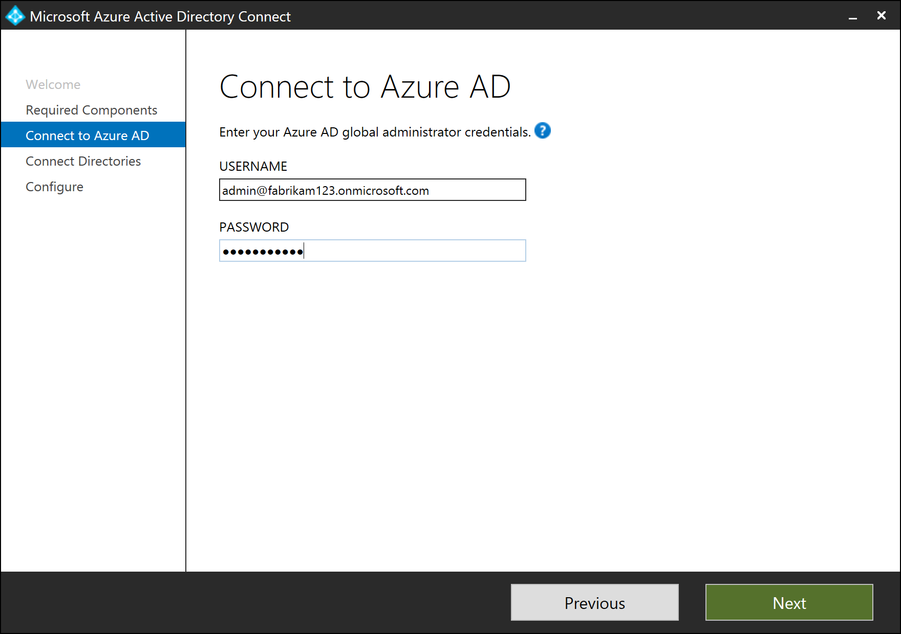
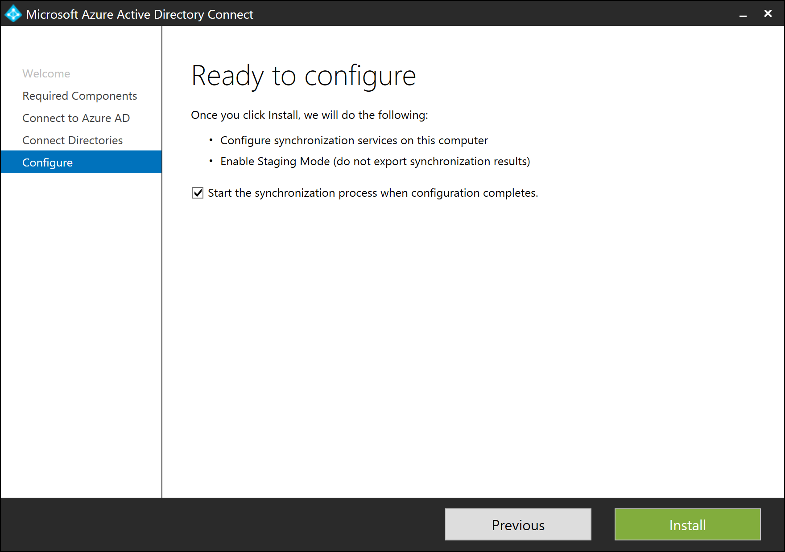

# Move Azure AD Connect database from SQL Server Express to SQL Server

This article describes how to move the Azure AD Connect database from the local SQL Server Express server to a computer running remote SQL Server. You can use the steps described in this article to accomplish this task.

## About this scenario

In this scenario, Azure AD Connect version 1.1.819.0 is installed on a single Windows Server 2016 domain controller. Azure AD Connect is using the built-in SQL Server 2012 Express Edition for its database. The database will be moved to a SQL Server 2017 server.

## Move the Azure AD Connect database

Use the following steps to move the Azure AD Connect database to a computer running remote SQL Server:

1. On the Azure AD Connect server, go to **Services** and stop the Microsoft Azure AD Sync service.
1. Go to the *%ProgramFiles%\Microsoft Azure AD Sync\Data* folder and copy the *ADSync.mdf* and *ADSync_log.ldf* files to the computer running remote SQL Server.
1. Restart the **Microsoft Azure AD Sync** service on the Azure AD Connect server.
1. Uninstall Azure AD Connect by going to **Control Panel** > **Programs** > **Programs and Features**. Select **Microsoft Azure AD Connect**, and then select **Uninstall**.
1. On the computer running remote SQL Server, open SQL Server Management Studio.
1. Right-click **Databases** and select **Attach**.
1. In **Attach Databases**, select **Add** and go to the *ADSync.mdf* file. Select **OK**.

   

1. When the database is attached, go back to the Azure AD Connect server and install Azure AD Connect.
1. When the MSI installation is finished, the Azure AD Connect wizard starts in express settings mode. Select the **Exit** icon to close the page.

   

1. Open a new Command Prompt window or PowerShell session. Go to the folder *\<drive>\program files\Microsoft Azure AD Connect*. Run the command `.\AzureADConnect.exe /useexistingdatabase` to start the Azure AD Connect wizard in **Use existing database** setup mode.

    

1. In **Welcome to Azure AD Connect**. Review and agree to the license terms and privacy notice, and then select **Continue**.

    

1. In **Install required components**, the **Use an existing SQL Server** option is enabled. Specify the name of the SQL Server instance that's hosting the ADSync database. If the SQL engine instance that's used to host the ADSync database isn't the default instance on the SQL Server instance, you must specify the name of the SQL engine instance. Also, if SQL browsing is not enabled, you must specify the SQL engine instance port number. For example:

    

1. In **Connect to Azure AD**, you must provide the credentials of a Hybrid Identity Administrator for your Azure AD directory. We recommend that you use an account in the default `onmicrosoft.com` domain. This account is used only to create a service account in Azure AD and is not used after the wizard has completed.

    

1. In **Connect your directories**, the existing Windows Server AD forest that's configured for directory sync is listed with a red cross icon beside it. To sync changes from a Windows Server AD, an Active Directory Domain Services (AD DS) account is required. The Azure AD Connect wizard can't retrieve the credentials of the AD DS account that's stored in the ADSync database because the credentials are encrypted. The credentials can be decrypted only by the earlier Azure AD Connect server. Select **Change Credentials** to specify the AD DS account for the Windows Server AD forest.

    

1. In the dialog, you can either enter the credentials for an Enterprise Admin and let Azure AD Connect create the AD DS account for you, or you can create the AD DS account yourself and enter its credentials in Azure AD Connect. After you select an option and enter the credentials, select **OK**.

    

1. After the credentials are entered, the red cross icon is replaced with a green checkmark icon. Select **Next**.

    

1. In **Ready to configure**, select **Install**.

    

1. When installation is finished, the Azure AD Connect server is automatically enabled for Staging Mode. We recommend that you review the server configuration and pending exports for unexpected changes before you disable Staging Mode.

## Next steps

- Learn more about [integrating your on-premises identities with Azure Active Directory](whatis-hybrid-identity.md).
- [Install Azure AD Connect by using an existing ADSync database](how-to-connect-install-existing-database.md).
- [Install Azure AD Connect by using SQL delegated administrator permissions](how-to-connect-install-sql-delegation.md).
