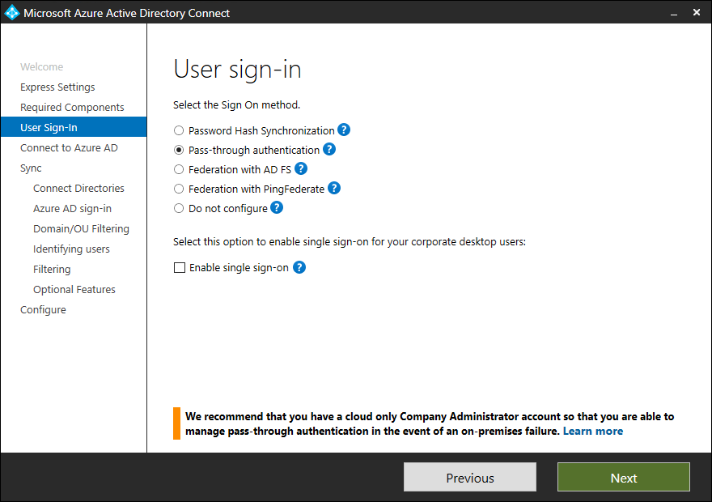
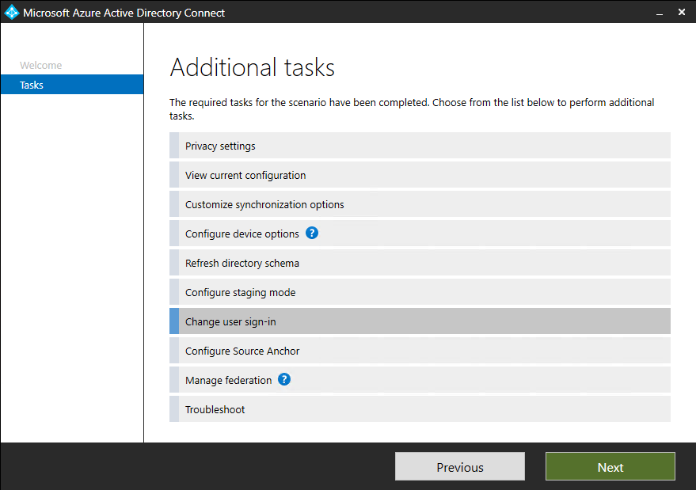

# Azure Active Directory Pass-through Authentication: Quick start

## Deploy Azure AD Pass-through Authentication

Azure Active Directory (Azure AD) Pass-through Authentication allows your users to sign in to both on-premises and cloud-based applications by using the same passwords. Pass-through Authentication signs users in by validating their passwords directly against on-premises Active Directory.

>[!IMPORTANT]
>If you are migrating from AD FS (or other federation technologies) to Pass-through Authentication, we highly recommend that you follow our detailed deployment guide published [here](https://aka.ms/adfstoPTADPDownload).

Follow these instructions to deploy Pass-through Authentication on your tenant:

## Step 1: Check the prerequisites

Ensure that the following prerequisites are in place.

### In the Azure Active Directory admin center

1. Create a cloud-only global administrator account on your Azure AD tenant. This way, you can manage the configuration of your tenant should your on-premises services fail or become unavailable. Learn about [adding a cloud-only global administrator account](../active-directory-users-create-azure-portal.md). Completing this step is critical to ensure that you don't get locked out of your tenant.
2. Add one or more [custom domain names](../active-directory-domains-add-azure-portal.md) to your Azure AD tenant. Your users can sign in with one of these domain names.

### In your on-premises environment

1. Identify a server running Windows Server 2012 R2 or later to run Azure AD Connect. Add the server to the same Active Directory forest as the users whose passwords you need to validate.
2. Install the [latest version of Azure AD Connect](https://www.microsoft.com/download/details.aspx?id=47594) on the server identified in the preceding step. If you already have Azure AD Connect running, ensure that the version is 1.1.750.0 or later.

    >[!NOTE]
    >Azure AD Connect versions 1.1.557.0, 1.1.558.0, 1.1.561.0, and 1.1.614.0 have a problem related to password hash synchronization. If you _don't_ intend to use password hash synchronization in conjunction with Pass-through Authentication, read the [Azure AD Connect release notes](https://docs.microsoft.com/azure/active-directory/hybrid/reference-connect-version-history#116470).

3. Identify one or more additional servers (running Windows Server 2012 R2 or later) where you can run standalone Authentication Agents. These additional servers are needed to ensure the high availability of requests to sign in. Add the servers to the same Active Directory forest as the users whose passwords you need to validate.

    >[!IMPORTANT]
    >In production environments, we recommend that you have a minimum of 3 Authentication Agents running on your tenant. There is a system limit of 12 Authentication Agents per tenant. And as best practice, treat all servers running Authentication Agents as Tier 0 systems (see [reference](https://docs.microsoft.com/windows-server/identity/securing-privileged-access/securing-privileged-access-reference-material)).

4. If there is a firewall between your servers and Azure AD, configure the following items:
   - Ensure that Authentication Agents can make *outbound* requests to Azure AD over the following ports:

    | Port number | How it's used |
    | --- | --- |
    | **80** | Downloads the certificate revocation lists (CRLs) while validating the SSL certificate |
    | **443** | Handles all outbound communication with the service |
    | **8080** (optional) | Authentication Agents report their status every ten minutes over port 8080, if port 443 is unavailable. This status is displayed on the Azure AD portal. Port 8080 is _not_ used for user sign-ins. |

    If your firewall enforces rules according to the originating users, open these ports for traffic from Windows services that run as a network service.
   - If your firewall or proxy allows DNS whitelisting, whitelist connections to **\*.msappproxy.net** and **\*.servicebus.windows.net**. If not, allow access to the [Azure datacenter IP ranges](https://www.microsoft.com/download/details.aspx?id=41653), which are updated weekly.
   - Your Authentication Agents need access to **login.windows.net** and **login.microsoftonline.com** for initial registration. Open your firewall for those URLs as well.
   - For certificate validation, unblock the following URLs: **mscrl.microsoft.com:80**, **crl.microsoft.com:80**, **ocsp.msocsp.com:80**, and **www.microsoft.com:80**. Since these URLs are used for certificate validation with other Microsoft products you may already have these URLs unblocked.

## Step 2: Enable the feature

Enable Pass-through Authentication through [Azure AD Connect](whatis-hybrid-identity.md).

>[!IMPORTANT]
>You can enable Pass-through Authentication on the Azure AD Connect primary or staging server. It is highly recommended that you enable it from the primary server. If you are setting up an Azure AD Connect staging server in the future, you **must** continue to choose Pass-through Authentication as the sign-in option; choosing another option will **disable** Pass-through Authentication on the tenant and override the setting in the primary server.

If you're installing Azure AD Connect for the first time, choose the [custom installation path](how-to-connect-install-custom.md). At the **User sign-in** page, choose **Pass-through Authentication** as the **Sign On method**. On successful completion, a Pass-through Authentication Agent is installed on the same server as Azure AD Connect. In addition, the Pass-through Authentication feature is enabled on your tenant.

If you have already installed Azure AD Connect by using the [express installation](how-to-connect-install-express.md) or the [custom installation](how-to-connect-install-custom.md) path, select the **Change user sign-in** task on Azure AD Connect, and then select **Next**. Then select **Pass-through Authentication** as the sign-in method. On successful completion, a Pass-through Authentication Agent is installed on the same server as Azure AD Connect and the feature is enabled on your tenant.

>[!IMPORTANT]
>Pass-through Authentication is a tenant-level feature. Turning it on affects the sign-in for users across _all_ the managed domains in your tenant. If you're switching from Active Directory Federation Services (AD FS) to Pass-through Authentication, you should wait at least 12 hours before shutting down your AD FS infrastructure. This wait time is to ensure that users can keep signing in to Exchange ActiveSync during the transition. For more help on migrating from AD FS to Pass-through Authentication, check out our detailed deployment plan published [here](https://aka.ms/adfstoptadpdownload).

## Step 3: Test the feature

Follow these instructions to verify that you have enabled Pass-through Authentication correctly:

1. Sign in to the [Azure Active Directory admin center](https://aad.portal.azure.com) with the global administrator credentials for your tenant.
2. Select **Azure Active Directory** in the left pane.
3. Select **Azure AD Connect**.
4. Verify that the **Pass-through authentication** feature appears as **Enabled**.
5. Select **Pass-through authentication**. The **Pass-through authentication** pane lists the servers where your Authentication Agents are installed.

At this stage, users from all the managed domains in your tenant can sign in by using Pass-through Authentication. However, users from federated domains continue to sign in by using AD FS or another federation provider that you have previously configured. If you convert a domain from federated to managed, all users from that domain automatically start signing in by using Pass-through Authentication. The Pass-through Authentication feature does not affect cloud-only users.

## Step 4: Ensure high availability

If you plan to deploy Pass-through Authentication in a production environment, you should install additional standalone Authentication Agents. Install these Authentication Agent(s) on server(s) _other_ than the one running Azure AD Connect. This setup provides you with high availability for user sign-in requests.

>[!IMPORTANT]
>In production environments, we recommend that you have a minimum of 3 Authentication Agents running on your tenant. There is a system limit of 12 Authentication Agents per tenant. And as best practice, treat all servers running Authentication Agents as Tier 0 systems (see [reference](https://docs.microsoft.com/windows-server/identity/securing-privileged-access/securing-privileged-access-reference-material)).

Follow these instructions to download the Authentication Agent software:

1. To download the latest version of the Authentication Agent (version 1.5.193.0 or later), sign in to the [Azure Active Directory admin center](https://aad.portal.azure.com) with your tenant's global administrator credentials.
2. Select **Azure Active Directory** in the left pane.
3. Select **Azure AD Connect**, select **Pass-through authentication**, and then select **Download Agent**.
4. Select the **Accept terms & download** button.

>[!NOTE]
>You can also directly [download the Authentication Agent software](https://aka.ms/getauthagent). Review and accept the Authentication Agent's [Terms of Service](https://aka.ms/authagenteula) _before_ installing it.

There are two ways to deploy a standalone Authentication Agent:

First, you can do it interactively by just running the downloaded Authentication Agent executable and providing your tenant's global administrator credentials when prompted.

Second, you can create and run an unattended deployment script. This is useful when you want to deploy multiple Authentication Agents at once, or install Authentication Agents on Windows servers that don't have user interface enabled, or that you can't access with Remote Desktop. Here are the instructions on how to use this approach:

1. Run the following command to install an Authentication Agent: `AADConnectAuthAgentSetup.exe REGISTERCONNECTOR="false" /q`.
2. You can register the Authentication Agent with our service using Windows PowerShell. Create a PowerShell Credentials object `$cred` that contains a global administrator username and password for your tenant. Run the following command, replacing *\<username\>* and *\<password\>*:

        $User = "<username>"
        $PlainPassword = '<password>'
        $SecurePassword = $PlainPassword | ConvertTo-SecureString -AsPlainText -Force
        $cred = New-Object –TypeName System.Management.Automation.PSCredential –ArgumentList $User, $SecurePassword
3. Go to **C:\Program Files\Microsoft Azure AD Connect Authentication Agent** and run the following script using the `$cred` object that you created:

        RegisterConnector.ps1 -modulePath "C:\Program Files\Microsoft Azure AD Connect Authentication Agent\Modules\" -moduleName "AppProxyPSModule" -Authenticationmode Credentials -Usercredentials $cred -Feature PassthroughAuthentication

## Next steps
- [Migrate from AD FS to Pass-through Authentication](https://aka.ms/adfstoptadp) - A detailed guide to migrate from AD FS (or other federation technologies) to Pass-through Authentication.
- [Smart Lockout](../authentication/howto-password-smart-lockout.md): Learn how to configure the Smart Lockout capability on your tenant to protect user accounts.
- [Current limitations](how-to-connect-pta-current-limitations.md): Learn which scenarios are supported with the Pass-through Authentication and which ones are not.
- [Technical deep dive](how-to-connect-pta-how-it-works.md): Understand how the Pass-through Authentication feature works.
- [Frequently asked questions](how-to-connect-pta-faq.md): Find answers to frequently asked questions.
- [Troubleshoot](tshoot-connect-pass-through-authentication.md): Learn how to resolve common problems with the Pass-through Authentication feature.
- [Security deep dive](how-to-connect-pta-security-deep-dive.md): Get technical information on the Pass-through Authentication feature.
- [Azure AD Seamless SSO](how-to-connect-sso.md): Learn more about this complementary feature.
- [UserVoice](https://feedback.azure.com/forums/169401-azure-active-directory/category/160611-directory-synchronization-aad-connect): Use the Azure Active Directory Forum to file new feature requests.
