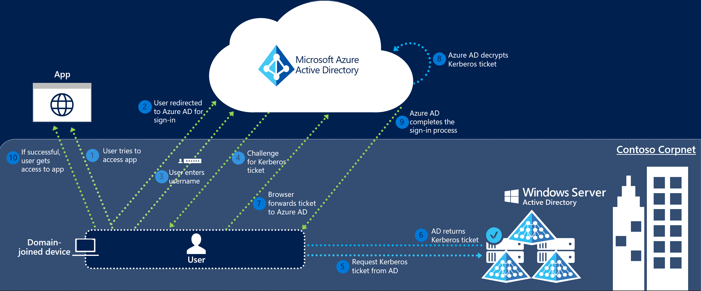
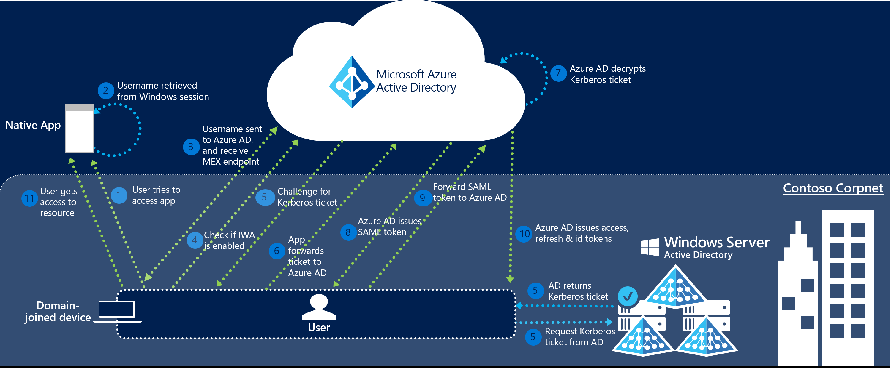

# Azure Active Directory Seamless Single Sign-On: Technical deep dive

This article gives you technical details into how the Azure Active Directory Seamless Single Sign-On (Seamless SSO) feature works.

## How does Seamless SSO work?

This section has three parts to it:

1. The setup of the Seamless SSO feature.
2. How a single user sign-in transaction on a web browser works with Seamless SSO.
3. How a single user sign-in transaction on a native client works with Seamless SSO.

### How does set up work?

Seamless SSO is enabled using Azure AD Connect as shown [here](how-to-connect-sso-quick-start.md). While enabling the feature, the following steps occur:

- A computer account (`AZUREADSSOACC`) is created in your on-premises Active Directory (AD) in each AD forest that you synchronize to Azure AD (using Azure AD Connect).
- In addition, a number of Kerberos service principal names (SPNs) are created to be used during the Azure AD sign-in process.
- The computer account's Kerberos decryption key is shared securely with Azure AD. If there are multiple AD forests, each computer account will have its own unique Kerberos decryption key.

>[!IMPORTANT]
> The `AZUREADSSOACC` computer account needs to be strongly protected for security reasons. Only Domain Admins should be able to manage the computer account. Ensure that Kerberos delegation on the computer account is disabled, and that no other account in Active Directory has delegation permissions on the `AZUREADSSOACC` computer account.. Store the computer account in an Organization Unit (OU) where they are safe from accidental deletions and where only Domain Admins have access. The Kerberos decryption key on the computer account should also be treated as sensitive. We highly recommend that you [roll over the Kerberos decryption key](how-to-connect-sso-faq.yml) of the `AZUREADSSOACC` computer account at least every 30 days.

>[!IMPORTANT]
> Seamless SSO supports the `AES256_HMAC_SHA1`, `AES128_HMAC_SHA1` and `RC4_HMAC_MD5` encryption types for Kerberos. It is recommended that the encryption type for the `AzureADSSOAcc$` account is set to `AES256_HMAC_SHA1`, or one of the AES types vs. RC4 for added security. The encryption type is stored on the `msDS-SupportedEncryptionTypes` attribute of the account in your Active Directory.  If the `AzureADSSOAcc$` account encryption type is set to `RC4_HMAC_MD5`, and you want to change it to one of the AES encryption types, please make sure that you first roll over the Kerberos decryption key of the `AzureADSSOAcc$` account as explained in the [FAQ document](how-to-connect-sso-faq.yml) under the relevant question, otherwise Seamless SSO will not happen.

Once the set-up is complete, Seamless SSO works the same way as any other sign-in that uses integrated Windows authentication (IWA).

### How does sign-in on a web browser with Seamless SSO work?

The sign-in flow on a web browser is as follows:

1. The user tries to access a web application (for example, the Outlook Web App - https://outlook.office365.com/owa/) from a domain-joined corporate device inside your corporate network.
2. If the user is not already signed in, the user is redirected to the Azure AD sign-in page.
3. The user types in their user name into the Azure AD sign-in page.

   >[!NOTE]
   >For [certain applications](./how-to-connect-sso-faq.yml), steps 2 & 3 are skipped.

4. Using JavaScript in the background, Azure AD challenges the browser, via a 401 Unauthorized response, to provide a Kerberos ticket.
5. The browser, in turn, requests a ticket from Active Directory for the `AZUREADSSOACC` computer account (which represents Azure AD).
6. Active Directory locates the computer account and returns a Kerberos ticket to the browser encrypted with the computer account's secret.
7. The browser forwards the Kerberos ticket it acquired from Active Directory to Azure AD.
8. Azure AD decrypts the Kerberos ticket, which includes the identity of the user signed into the corporate device, using the previously shared key.
9. After evaluation, Azure AD either returns a token back to the application or asks the user to perform additional proofs, such as Multi-Factor Authentication.
10. If the user sign-in is successful, the user is able to access the application.

The following diagram illustrates all the components and the steps involved.

Seamless SSO is opportunistic, which means if it fails, the sign-in experience falls back to its regular behavior - i.e, the user needs to enter their password to sign in.

### How does sign-in on a native client with Seamless SSO work?

The sign-in flow on a native client is as follows:

1. The user tries to access a native application (for example, the Outlook client) from a domain-joined corporate device inside your corporate network.
2. If the user is not already signed in, the native application retrieves the username of the user from the device's Windows session.
3. The app sends the username to Azure AD, and retrieves your tenant's WS-Trust MEX endpoint. This WS-Trust endpoint is used exclusively by the Seamless SSO feature, and is not a general implementation of the WS-Trust protocol on Azure AD.
4. The app then queries the WS-Trust MEX endpoint to see if integrated authentication endpoint is available. The integrated authentication endpoint is used exclusively by the Seamless SSO feature.
5. If step 4 succeeds, a Kerberos challenge is issued.
6. If the app is able to retrieve the Kerberos ticket, it forwards it up to Azure AD's integrated authentication endpoint.
7. Azure AD decrypts the Kerberos ticket and validates it.
8. Azure AD signs the user in, and issues a SAML token to the app.
9. The app then submits the SAML token to Azure AD's OAuth2 token endpoint.
10. Azure AD validates the SAML token, and issues to the app an access token and a refresh token for the specified resource, and an id token.
11. The user gets access to the app's resource.

The following diagram illustrates all the components and the steps involved.

## Next steps

- [**Quick Start**](how-to-connect-sso-quick-start.md) - Get up and running Azure AD Seamless SSO.
- [**Frequently Asked Questions**](how-to-connect-sso-faq.yml) - Answers to frequently asked questions.
- [**Troubleshoot**](tshoot-connect-sso.md) - Learn how to resolve common issues with the feature.
- [**UserVoice**](https://feedback.azure.com/d365community/forum/22920db1-ad25-ec11-b6e6-000d3a4f0789) - For filing new feature requests.
