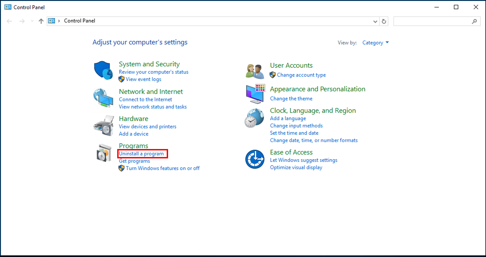
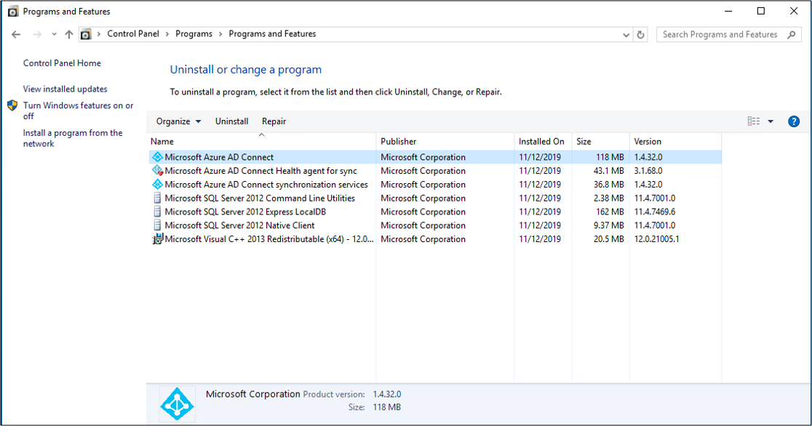
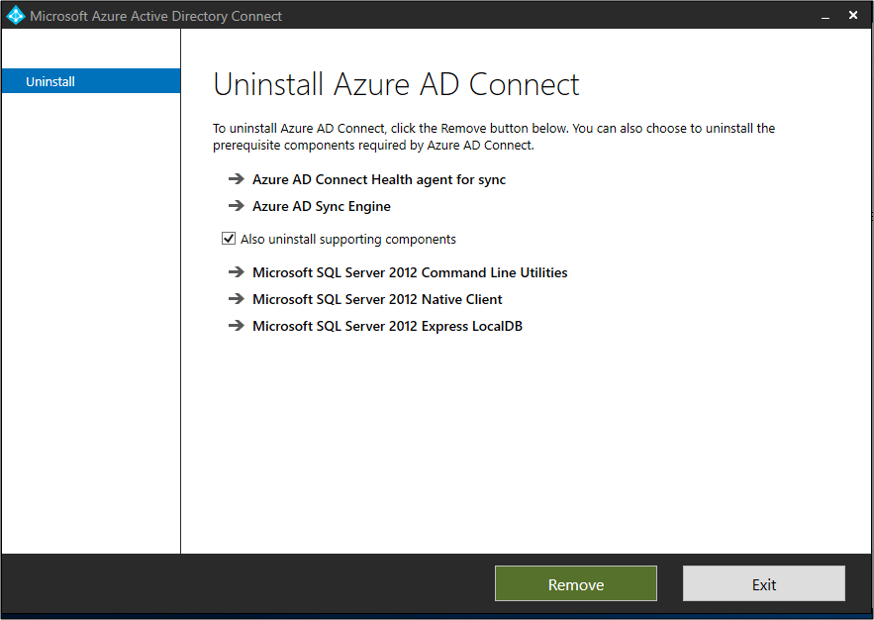
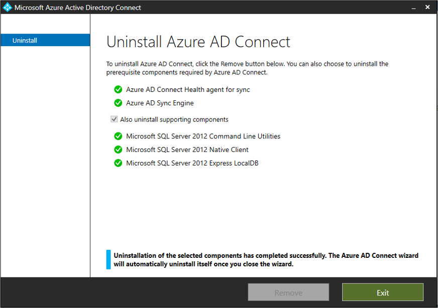

# Uninstall Azure AD Connect

This document describes how to correctly uninstall Azure AD Connect.

## Uninstall Azure AD Connect from the server
The first thing you need to do is remove Azure AD Connect from the server that it is running on.  Use the following steps:

 1. On the server running Azure AD Connect, navigate to **Control Panel**.
 2. Click **Uninstall a program**
  
 
 3. Select **Azure AD Connect**.
  
 
 4. When prompted, click **Yes** to confirm.
 5. This confirmation will bring up the Azure AD Connect screen.  Click **Remove**.
  
 
 6. Once this action completes, click **Exit**.
 7.  
 
 8. Back in **Control Panel** click **Refresh** and all of the components should have been removed.

## Next steps

- Learn more about [Integrating your on-premises identities with Azure Active Directory](whatis-hybrid-identity.md).
- [Install Azure AD Connect using an existing ADSync database](how-to-connect-install-existing-database.md)
- [Install Azure AD Connect using SQL delegated administrator permissions](how-to-connect-install-sql-delegation.md)

