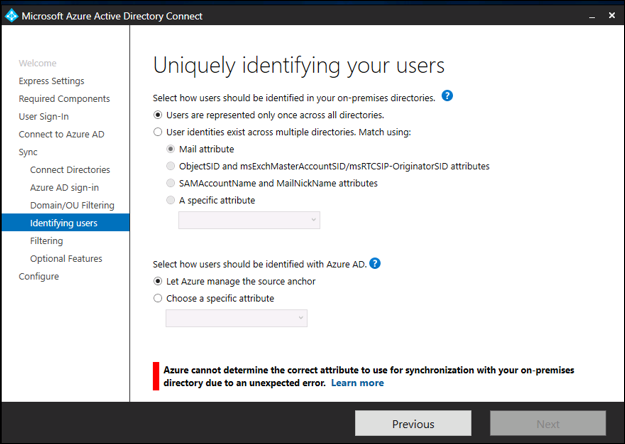
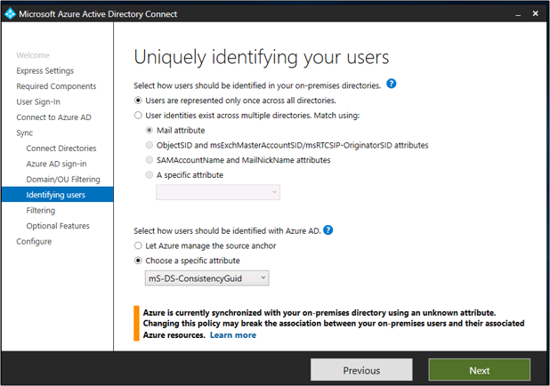
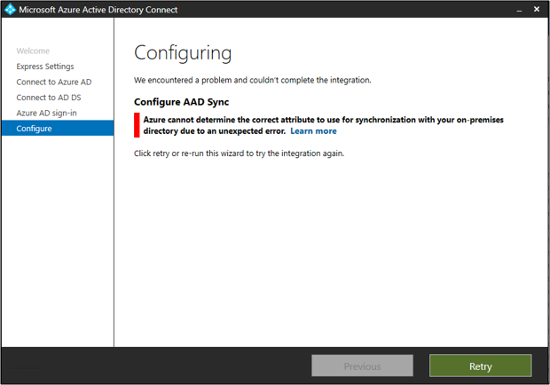
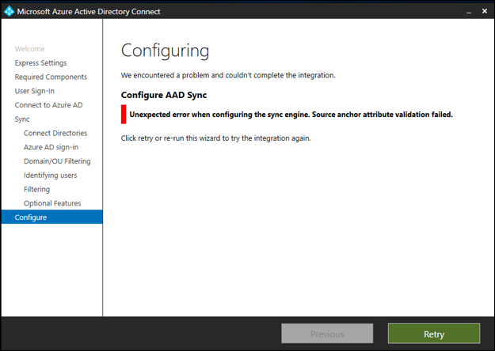

# Troubleshooting Source Anchor Issues during Installation
This article explains the different source anchor related issues that may occur during installation and offers ways to resolve these issues.

## Invalid Source Anchor in Azure Active Directory

### Custom Installation

During custom installation, Azure AD Connect reads the source anchor policy from Azure Active Directory. If the policy exists in Azure Active Directory, Azure AD Connect applies the same policy unless it is overridden by the customer. The wizard informs you which attribute has been read. Additionally, the wizard warns if you try to override the source anchor policy.

During this read operation, it is possible that the source anchor policy in Azure Active Directory is unexpected. In this case, Azure AD Connect does not know what source anchor to use and needs manual override. 

To resolve this, you can manually override the source anchor by selecting a specific attribute. Proceed with this option if and only if you are certain of which attribute to select. If you are not certain, please contact [Microsoft support](https://support.microsoft.com/contactus/) for guidance. Please note that if you change the source anchor policy, it can break the association between your on-premises users and their associated Azure resources. 

### Express Installation
During express installation, Azure AD Connect reads the source anchor policy from Azure Active Directory. If the policy exists in Azure Active Directory, Azure AD Connect applies the same policy. There is no option to do manual override.

During this read operation, it is possible that the source anchor policy in Azure Active Directory is unexpected. In this case, AAD Connect does not know what source anchor to use. 

To resolve this, you need to re-install using the custom mode and manually override the source anchor by selecting a specific attribute. Proceed with this option if and only if you are certain of which attribute to select. If you are not certain, please contact Microsoft support for guidance. Please note that if you change the source anchor policy, it can break the association between your on-premises users and their associated Azure resources.

### Invalid Source Anchor in Sync Engine
During installation, it is possible Azure AD Connect attempts configure sync engine using an invalid source anchor. This is most likely a product issues and Azure AD Connect will fail the installation will fail in this case. Please contact Microsoft Support in case you run into this issue so that Microsoft can troubleshoot this and provide mitigation steps. 

## Next steps
Learn more about [Integrating your on-premises identities with Azure Active Directory](whatis-hybrid-identity.md).