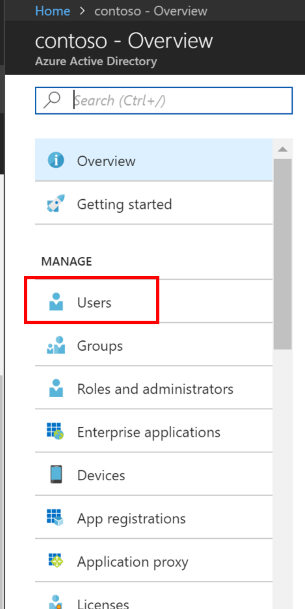

# Tutorial:  Integrate a single AD forest using pass-through authentication


## Pre-requisties
The following are pre-requisties required for completing this tutorial
- A computer with [Hyper-V](https://docs.microsoft.com/windows-server/virtualization/hyper-v/hyper-v-technology-overview) installed.  It is suggested to do this on either a [Windows 10](https://docs.microsoft.com/virtualization/hyper-v-on-windows/about/supported-guest-os) or a [Windows Server 2016](https://docs.microsoft.com/windows-server/virtualization/hyper-v/supported-windows-guest-operating-systems-for-hyper-v-on-windows) computer.
- An [Azure subscription](https://azure.microsoft.com/en-us/free)

## Create a Virtual Machine

1. Open up the PowerShell ISE as Administrator.
2. Run the following script.

  ```powershell 
# Set VM Name, Switch Name, and Installation Media Path.
$VMName = 'DC1'
$Switch = 'External'
$InstallMedia = 'C:\Downloads\en_windows_server_version_1709_updated_jan_2018_x64_dvd_100492040.iso'
$Path = 'D:\VM'
$VHDPath = 'D:\VM\DC1\DC1.vhdx'
$VHDSize = '21474836480'

# Create New Virtual Machine
New-VM -Name $VMName -MemoryStartupBytes 16GB -BootDevice VHD -Path $Path -NewVHDPath $VHDPath -NewVHDSizeBytes $VHDSize  -Generation 2 -Switch $Switch  

# Add DVD Drive to Virtual Machine
Add-VMScsiController -VMName $VMName
Add-VMDvdDrive -VMName $VMName -ControllerNumber 1 -ControllerLocation 0 -Path $InstallMedia

# Mount Installation Media
$DVDDrive = Get-VMDvdDrive -VMName $VMName

# Configure Virtual Machine to Boot from DVD
Set-VMFirmware -VMName $VMName -FirstBootDevice $DVDDrive
``` 

## Complete the Operating System Deployment
In order to finish building the virtual machine, you need to finish the operating system installation.

1. Hyper-V Manager, double-click on the virtual machine.c
2. Click on the Start button.
3.  You will be prompted to ‘Press any key to boot from CD or DVD’. Go ahead and do so.
4. On the Windows Server start up screen select your language and click **Next**.
5. Click **Install Now**.
6. Enter your license key and click **Next**.
7. Check **I accept the license terms and click **Next**.
8. Select **Custom:  Install Windows Only (Advanced)**
9. Click **Next**
10. Once the installation has completed, restart the virtual machine, sign-in and run Windows updates to ensure the VM is the most up-to-date.

## Install Windows Server Active Directory on the new VM
1. Open up the PowerShell ISE as Administrator.
2. Run the following script.

  ```powershell 
Install-windowsfeature -name AD-Domain-Services -IncludeManagementTools  
<<Windows PowerShell cmdlet and arguments>> 
```

## Create a Windows Server AD Environment
 1. Open up the PowerShell ISE as Administrator.
2. Run the following script.

 ```powershell 
Install-ADDSForest [-SkipPreChecks] -DomainName <string> -SafeModeAdministratorPassword <SecureString> [-CreateDNSDelegation] [-DatabasePath <string>] [-DNSDelegationCredential <PS Credential>] [-NoDNSOnNetwork] [-DomainMode <DomainMode> {Win2003 | Win2008 | Win2008R2 | Win2012}] [-DomainNetBIOSName <string>] [-ForestMode <ForestMode> {Win2003 | Win2008 | Win2008R2 | Win2012}] [-InstallDNS] [-LogPath <string>] [-NoRebootOnCompletion] [-SkipAutoConfigureDNS] [-SYSVOLPath] [-Force] [-WhatIf] [-Confirm] [<CommonParameters>] 
```

## Create Windows Server AD Uus
 1. Open up the PowerShell ISE as Administrator.
2. Run the following script.

 ```powershell 
PS C:\> New-ADUser -Name "ChewDavid"PS C:\> New-ADUser -Name "ChewDavid"
```

## Create an Azure AD tenant
To create a new Azure AD tenant, do the following.

1. Browse to the [Azure portal](https://portal.azure.com) and sign in with an account that has an Azure subscription.
2. Select the **plus icon (+)** and search for **Azure Active Directory**.
3. Select **Azure Active Directory** in the search results.
4. Select **Create**.

5. Provide a **name for the organization** along with the **initial domain name**. Then select **Create**. This will create your directory.
6. Once this has completed, click the **here** link to manage the directory.

## Create a global administrator in Azure AD
Now that we have an Azure AD tenant, we will create a global administrator account.  This account is used to create the Azure AD Connector account during Azure AD Connect installation.  The Azure AD Connector account is used to write information to Azure AD.   To create the global administrator account do the following.

1.  Under **Manage**, select **Users**.

2.  Select **All users** and then select **+ New user**.
3.  Provide a name and username for this user. This will be your Global Admin for the tenant. You will also want to change the **Directory role** to **Global administrator** You can also show the temporary password. When you are done, select **Create**.

4. Once this has completed, open a new web browser and sign-in to myapps.microsoft.com using the new global administrator account and the temporary password.
5. Change the password for the global administrator to something that you will remember.

## Download and install Azure AD Connect

1. Download [Azure AD Connect](https://www.microsoft.com/en-us/download/details.aspx?id=47594)
2. Navigate to and double-click **AzureADConnect.msi**.
3. On the Welcome screen, select the box agreeing to the licensing terms and click **Continue**.  
4. On the Express settings screen, click **Use express settings**.  

5. On the Connect to Azure AD screen, enter the username and password the global administrator for Azure AD. Click **Next**.  
6. On the Connect to AD DS screen, enter the username and password for an enterprise admin account. Click **Next**.  
7. On the Ready to configure screen, click **Install**.
8. When the installation completes, click **Exit**.
9. After the installation has completed, sign off and sign in again before you use Synchronization Service Manager or Synchronization Rule Editor.


## Verify users are created and synchronization is occurring
We will now verify that the users that we had in our on-premises directory have been synchronized and now exist in out Azure AD tenant.  Be aware that this may take a few hours to complete.  To verify users are synchronized due the following.


1. Browse to the [Azure portal](https://portal.azure.com) and sign in with an account that has an Azure subscription.
2. On the left, select **Azure Active Directory**
3. Under **Manage**, select **Users**.
4. Verify that you see the new users in our tenant

## Test signing in with one of our users

1.  Browe to [http://myapps.microsoft.com](http://myapps.microsoft.com)
2. Sign-in with a user account that was created in our new tenant.  You will need to sign-in using the following format: (user@domain.onmicrosoft.com). Use the same password that the user uses to sign-in on-premises.