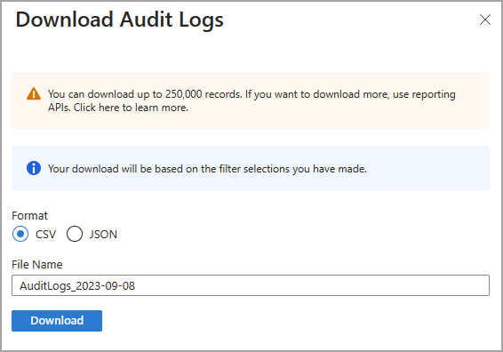

# What are Microsoft Entra audit logs?

Microsoft Entra activity logs include audit logs, which is a comprehensive report on every logged event in Microsoft Entra ID. Changes to applications, groups, users, and licenses are all captured in the Microsoft Entra audit logs.

Two other activity logs are also available to help monitor the health of your tenant:

- **[Sign-ins](concept-sign-ins.md)** – Information about sign-ins and how your resources are used by your users.
- **[Provisioning](concept-provisioning-logs.md)** – Activities performed by the provisioning service, such as the creation of a group in ServiceNow or a user imported from Workday.

This article gives you an overview of the audit logs.

## What can you do with audit logs?

Audit logs in Microsoft Entra ID provide access to system activity records, often needed for compliance. You can get answers to questions related to users, groups, and applications.

**Users:**

- What types of changes were recently applied to users?
- How many users were changed?
- How many passwords were changed?

**Groups:**

- What groups were recently added?
- Have the owners of group been changed?
- What licenses have been assigned to a group or a user?

**Applications:**

- What applications have been added, updated, or removed?
- Has a service principal for an application changed?
- Have the names of applications been changed?
 
## What do the logs show?

Audit logs have a default list view that shows:

- Date and time of the occurrence
- Service that logged the occurrence
- Category and name of the activity (*what*) 
- Status of the activity (success or failure)
- Target
- Initiator / actor of an activity (*who*)

### Filtering audit logs

You can customize and filter the list view by clicking the **Columns** button in the toolbar. Editing the columns enables you to add or remove fields from your view.

Filter the audit data using the options visible in your list such as date range, service, category, and activity. For information on the audit log filters, see [How to customize and filter identity logs](howto-customize-filter-logs.md).

### Archiving and analyzing the audit logs

There are several options available if you need to store the logs for data retention or route them to an analysis tool. Review the [How to access activity logs](howto-access-activity-logs.md) article for details on each option. 

You can download the audit logs from the Microsoft Entra portal, up to 250,000 records, by selecting the **Download** button. The exact number of records varies, based on the number of fields included in your view when you select the **Download** button. You can download the logs in either CSV or JSON format. The number of records you can download is constrained by the [Microsoft Entra ID report retention policies](reference-reports-data-retention.md).

## Microsoft 365 activity logs

You can view Microsoft 365 activity logs from the [Microsoft 365 admin center](/office365/admin/admin-overview/about-the-admin-center). Even though Microsoft 365 activity and Microsoft Entra activity logs share many directory resources, only the Microsoft 365 admin center provides a full view of the Microsoft 365 activity logs. 

You can also access the Microsoft 365 activity logs programmatically by using the [Office 365 Management APIs](/office/office-365-management-api/office-365-management-apis-overview).

Most standalone or bundled Microsoft 365 subscriptions have back-end dependencies on some subsystems within the Microsoft 365 datacenter boundary. The dependencies require some information write-back to keep directories in sync and essentially to help enable hassle-free onboarding in a subscription opt-in for Exchange Online. For these write-backs, audit log entries show actions taken by “Microsoft Substrate Management”. These audit log entries refer to create/update/delete operations executed by Exchange Online to Microsoft Entra ID. The entries are informational and don't require any action.
