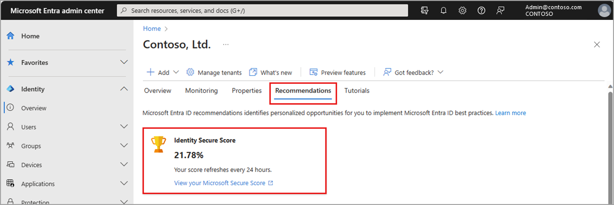
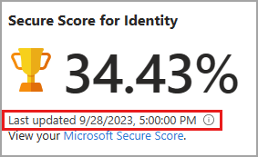

# What is identity secure score?

The identity secure score is shown as a percentage that functions as an indicator for how aligned you are with Microsoft's recommendations for security. Each improvement action in identity secure score is tailored to your configuration.  

This score helps to:

- Objectively measure your identity security posture
- Plan identity security improvements
- Review the success of your improvements

You can access the score and view individual recommendations related to your score in Microsoft Entra recommendations. You can also view the score and the full identity secure score dashboard, which compares your score to other tenants in the same industry and of a similar size. The dashboard also shows how your score has changed over time.

By following the improvement actions in the Microsoft Entra recommendations, you can:

- Improve your security posture and your score
- Take advantage the features available to your organization as part of your identity investments

## How do I get my secure score?

Identity secure score is available to free and paid customers.

1. Sign in to the [Microsoft Entra admin center](https://entra.microsoft.com) as at least a [Global Reader](../roles/permissions-reference.md#global-reader).
1. Browse to **Protection** > **Identity Secure Score** to view the dashboard.

The score and related recommendations are also found at **Identity** > **Overview** > **Recommendations**.

## How does it work?

Every 24 hours, we look at your security configuration and compare your settings with the recommended best practices. Based on the outcome of this evaluation, a new score is calculated for your directory. It’s possible that your security configuration isn’t fully aligned with the best practice guidance and the improvement actions are only partially met. In these scenarios, you're awarded a portion of the max score available for the control.

### Working with improvement actions on the dashboard

Each recommendation is measured based on your configuration. If you're using third-party products to enable a best practice recommendation, you can indicate this configuration in the settings of an improvement action. You may set recommendations to be ignored if they don't apply to your environment. An ignored recommendation doesn't contribute to the calculation of your score.

- **To address** - You recognize that the improvement action is necessary and plan to address it at some point in the future. This state also applies to actions that are detected as partially, but not fully completed.
- **Risk accepted** - Security should always be balanced with usability, and not every recommendation works for everyone. When that is the case, you can choose to accept the risk, or the remaining risk, and not enact the improvement action. You aren't awarded any points, and the action isn't visible in the list of improvement actions. You can view this action in history or undo it at any time.
- **Planned** - There are concrete plans in place to complete the improvement action.
- **Resolved through third party** and **Resolved through alternate mitigation** - The improvement action has already been addressed by a third-party application or software, or an internal tool. You're awarded the points the action is worth, so your score better reflects your overall security posture. If a third party or internal tool no longer covers the control, you can choose another status. Keep in mind, Microsoft has no visibility into the completeness of implementation if the improvement action is marked as either of these statuses.

### Working with secure score recommendations

Identity secure score improvement actions also appear in Microsoft Entra recommendations. They both appear in the same list, but the secure score recommendations show the score.

To address a secure score recommendation, select it from the list to view the details and action plan. If you take the appropriate action, the status changes automatically the next time the service runs. You can also mark the recommendation as *dismissed* or *postponed*. For more information on working with recommendations, see [How to use recommendations](./howto-use-recommendations.md).

## How does it help me?

The secure score helps you to:

- Objectively measure your identity security posture
- Plan identity security improvements
- Review the success of your improvements

## What you should know

There are several things to consider when working with your identity secure score.

### Who can use the identity secure score?

To access identity secure score, you must be assigned one of the following roles in Microsoft Entra ID.

#### Read and write roles

With read and write access, you can make changes and directly interact with identity secure score.

* Global Administrator
* Security Administrator
* Exchange Administrator
* SharePoint Administrator

#### Read-only roles

With read-only access, you aren't able to edit status for an improvement action.

* Helpdesk Administrator
* User Administrator
* Service Support Administrator
* Security Reader
* Security Operator
* Global Reader

### How are controls scored?

Controls can be scored in two ways. Some are scored in a binary fashion - you get 100% of the score if you have the feature or setting configured based on our recommendation. Other scores are calculated as a percentage of the total configuration. For example, if the improvement recommendation states there's a maximum of 10.71% increase if you protect all your users with MFA and you have 5 of 100 total users protected, you're given a partial score around 0.53% (5 protected / 100 total * 10.71% maximum = 0.53% partial score).

### What does [Not Scored] mean?

Actions labeled as [Not Scored] are ones you can perform in your organization but aren't scored. So, you can still improve your security, but you aren't given credit for those actions right now.

### How often is my score updated?

The score is calculated once per day (around 1:00 AM PST). If you make a change to a measured action, the score will automatically update the next day. It may take up to 48 hours for a change to be reflected in your score.

### My score changed. How do I figure out why?

Head over to the [Microsoft 365 Defender portal](https://security.microsoft.com/), where you find your complete Microsoft secure score. You can easily see all the changes to your secure score by reviewing the in-depth changes on the history tab.

### Does the secure score measure my risk of getting breached?

No, secure score doesn't express an absolute measure of how likely you're to get breached. It expresses the extent to which you have adopted features that can offset risk. No service can guarantee protection, and the secure score shouldn't be interpreted as a guarantee in any way.

### How should I interpret my score?

Your score improves for configuring recommended security features or performing security-related tasks (like reading reports). Some actions are scored for partial completion, like enabling multifactor authentication (MFA) for your users. Your secure score is directly representative of the Microsoft security services you use. Remember that security must be balanced with usability. All security controls have a user impact component. Controls with low user impact should have little to no effect on your users' day-to-day operations.

To see your score history, head over to the [Microsoft 365 Defender portal](https://security.microsoft.com/) and review your overall Microsoft secure score. You can review changes to your overall secure score be clicking on View History. Choose a specific date to see which controls were enabled for that day and what points you earned for each one.

### How does the identity secure score relate to the Microsoft 365 secure score?

The [Microsoft secure score](/office365/securitycompliance/microsoft-secure-score) contains five distinct control and score categories:

- Identity
- Data
- Devices
- Infrastructure
- Apps

The identity secure score represents the identity part of the Microsoft secure score. This overlap means that your recommendations for the identity secure score and the identity score in Microsoft are the same.

## Next steps

- [Find out more about Microsoft secure score](/office365/securitycompliance/microsoft-secure-score)
- [Learn about Microsoft Entra recommendations](./recommendations-overview.png)
- [Learn how to use recommendations](./how-to-use-recommendations.md)