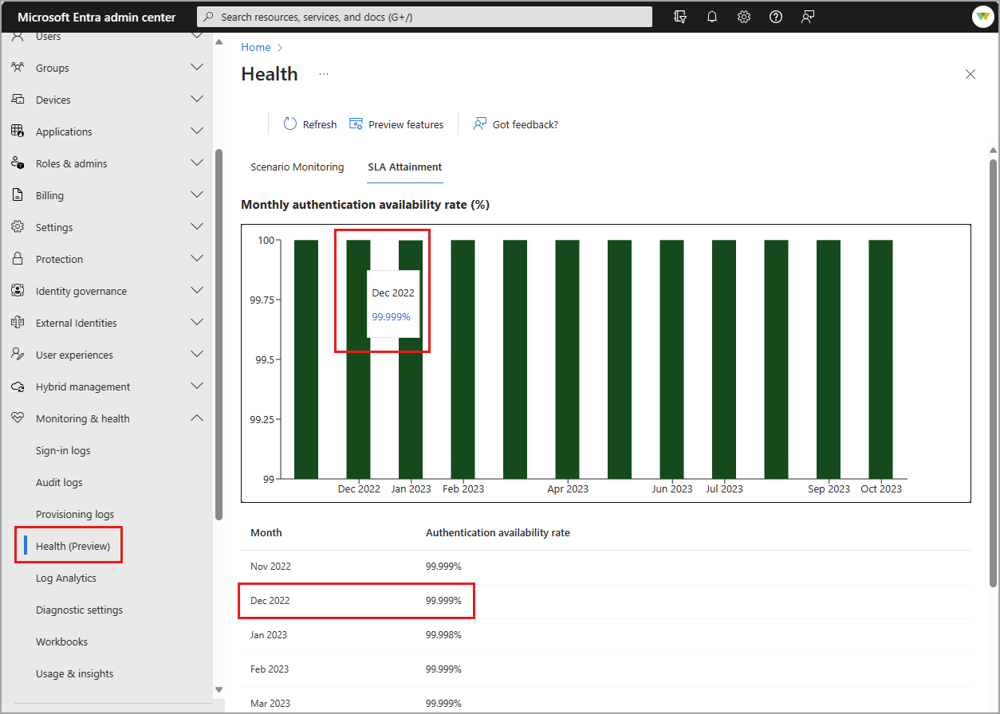

# What is Microsoft Entra Health?

Microsoft Entra Health (preview) provides you with the ability to view the health of your Microsoft Entra tenant through a report of service level agreement (SLA) attainment and a set of health metrics you can monitor for key Microsoft Entra ID scenarios.

Many IT administrators spend a considerable amount of time investigating several key scenarios, such as sign-ins requiring multifactor authentication (MFA) or sign-ins requiring a compliant or managed device. Microsoft Entra Health provides a visualization of the data associated with these metrics, so you can quickly identify trends and potential issues.

Machine learning now looks at these metrics and associated signals to develop a pattern specific to your tenant. When our anomaly detection service identifies a significant change to that pattern, it triggers an alert. By monitoring these scenarios and reviewing the alerts, you can more effectively monitor and improve the health of your tenant.

## How it works

1. Metrics and data are gathered, processed, and converted into meaningful signals displayed in Microsoft Entra Health scenario monitoring.

1. These signals are fed into our anomaly detection service.

1. When the anomaly detection service identifies a significant change to a pattern in the signal, it triggers an alert. 

1. An email alert is sent to a predetermined set of users when the anomaly detection service identifies a significant change to the pattern. 

After receiving an alert, you need to research possible root causes, determine the next steps, and take action to mitigate the root cause.

## Microsoft Entra Health scenario monitoring (preview) 

The following key scenarios are monitored in Microsoft Entra Health:

- Interactive user sign-in requests that require Microsoft Entra multifactor authentication.
- User sign-in requests that require a managed device through a Conditional Access policy.
- User sign-in requests that require a compliant device through a Conditional Access policy.
- User sign-in requests to applications using SAML authentication.

The data associated with each of these scenarios is aggregated into a view that's specific to that scenario. If you're only interested in sign-ins from compliant devices, you can dive into that scenario without noise from other sign-in activities. 

Each scenario detail page provides trends and totals for that scenario for the last 30 days. This data is aggregated every 15 minutes, for low latency insights into your tenant's health.

The scenario monitoring solution is currently in public preview and can be enabled or disabled in the Preview Hub; the SLA Attainment report is available by default.

## Microsoft Entra Health scenario alerts

As explained in the [How it works](#how-it-works) section, alerts are generated when our anomaly detection service identifies a significant change to the pattern in the signal. That pattern is specific to your tenant and the scenario being monitored. Machine learning requires at least four weeks of data to establish a pattern for your tenant. However, the more data we collect on the signal, the more accurate the anomaly detection service becomes.

With the pattern established, the service looks back 25-30 minutes on the timeline and triggers an alert if the signal deviates from the pattern.

The service provides alerts for the following scenarios:

- [Sign-ins requiring a compliant or managed device](scenario-health-sign-ins-compliant-device.md)
- [Sign-ins requiring multifactor authentication (MFA)](scenario-health-sign-ins-mfa.md)

At this time, the alerts are only available through the Microsoft Graph API. But with the Microsoft Graph health monitoring APIs, you can view the alerts, configure email notifications, and update the state of the alert. You can manually run the API calls daily or configure email notifications. For more information, see [How to use Microsoft Entra scenario health alerts](howto-use-health-scenario-alerts.md).

### Sign-ins to applications using SAML authentication

This scenario is included in the scenario monitoring, but at this time doesn't trigger alerts. The scenario monitors SAML 2.0 authentication attempts that the Microsoft Entra cloud service for your tenant successfully processed. This metric currently excludes WS-FED/SAML 1.1 apps integrated with Microsoft Entra ID. This scenario is currently only available for scenario monitoring.

- [Learn how the Microsoft Identity platform uses the SAML protocol](../../identity-platform/saml-protocol-reference.md)
- [Use a SAML 2.0 IdP for single sign on](../hybrid/connect/how-to-connect-fed-saml-idp.md).

## SLA attainment

In addition to providing global SLA performance, Microsoft Entra ID provides tenant-level SLA performance for organizations with at least 5000 monthly active users. The Service Level Agreement (SLA) attainment is the user authentication availability for Microsoft Entra ID. For the current availability target and details on how SLA is calculated, see [SLA for Microsoft Entra ID](https://azure.microsoft.com/support/legal/sla/active-directory/v1_1/).

Hover your mouse over the bar for a month to view the percentage for that month. A table with the same details appears below the graph.

You can also view SLA attainment using [Microsoft Graph](/graph/api/resources/serviceactivity?view=graph-rest-beta&preserve-view=true).

