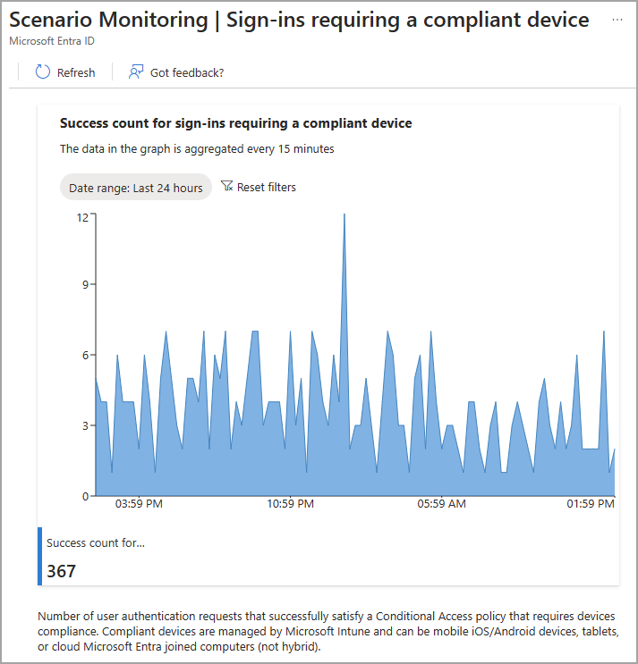
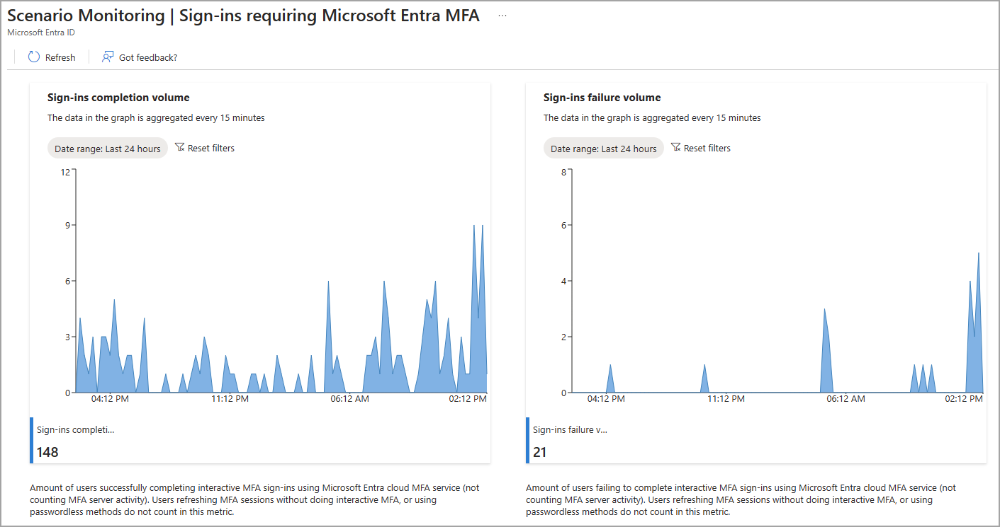
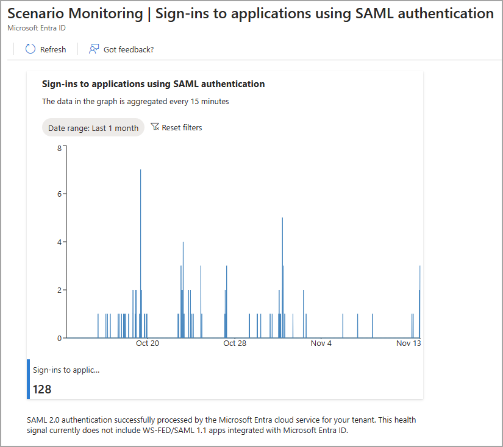

# Microsoft Entra Health

Microsoft Entra Health (preview) provides you with the ability to monitor and diagnose the health of your Microsoft Entra tenant through the following capabilities:

**Service level agreement (SLA) attainment**:

- Tenant-level user authentication availability for Microsoft Entra ID.

**Scenario monitoring (preview)**:

- Monitoring and diagnostics for key Microsoft Entra ID scenarios.
- Proactive alerts when a potential issue or failure condition is detected.
- Reduce time to detection and support issue resolution.
- Actionable and prescriptive guidance for every alert.

Microsoft Entra Health consists of multiple layers, which allows you to navigate from a high-level overview to a deep dive into specific health data. This article describes how Microsoft Entra Health works, along with details about each scenario.

## How to access Microsoft Entra Health

The SLA Attainment report is available for all Microsoft Entra tenants. Scenario Monitoring is currently in preview, but can be enabled for your view of the tenant.

1. Sign into the [Microsoft Entra admin center](https://entra.microsoft.com) as at least a [Reports Reader](~/identity/role-based-access-control/permissions-reference.md#reports-reader).
1. Browse to **Identity** > **Monitoring and health** > **Health (preview)**.

### Enable the Scenario monitoring preview

If you'd like to view the **Scenario monitoring (preview)**:

1. Sign into the [Microsoft Entra admin center] as at least a [Reports Reader](~/identity/role-based-access-control/permissions-reference.md#reports-reader).
1. Browse to **Identity** > **Settings** > **Preview hub**.
1. Enable **Scenario monitoring**.

Enabling preview feature might take up to 24 hours to populate. Enabling the preview only changes your view, not the entire tenant. You can disable the preview at any time.

## How it works

Many IT administrators spend a considerable amount of time investigating the following key scenarios:

- Interactive user sign-in requests that require Microsoft Entra multifactor authentication.
- User sign-in requests that require a managed or compliant device through a Conditional Access policy.
- User sign-in requests to applications using SAML authentication.

The data associated with each of these scenarios is aggregated into a view that's specific to that scenario. If you're only interested in sign-ins from compliant devices, you can dive into that scenario without noise from other sign-in activities.

At this time, data is aggregated every 15 minutes, so you're getting near real-time insights into your tenant's health. If there's an anomaly detected, an alert is generated. The alert provides you with diagnostic information and action steps to resolve the issue.

The scenarios available in Microsoft Entra ID Health are always available, even if there are no alerts.

## SLA attainment

In addition to providing global SLA performance, Microsoft Entra ID now provides tenant-level SLA performance. The Service Level Agreement (SLA) attainment is the user authentication availability for Microsoft Entra ID. The target SLA threshold is 99.99%.

Hover your mouse over the bar for a month to view the percentage for that month. A table with the same details appears below the graph.

## Scenario monitoring (preview)

Microsoft Entra Scenario monitoring (preview) provides insights into important events within a scenario, such as sign-ins that require a compliant or managed device. Each scenario detail page provides trends and totals for that scenario for the last 30 days. The graph aggregates data every 15 minutes. You can set the date range to 24 hours, 7 days, or 1 month.

Select **View details** on a tile to view the metrics for that scenario.

### Sign-ins requiring a compliant device

This scenario captures each user authentication that satisfies a Conditional Access policy requiring sign-in from a compliant device. 

- [Create a compliance policy in Microsoft Intune](/mem/intune/protect/create-compliance-policy).
- [Learn about Conditional Access and Intune](/mem/intune/protect/conditional-access).
- [Learn about Microsoft Entra joined devices](/identity/devices/concept-directory-join)

### Sign-ins requiring a managed device

This scenario captures each user authentication that satisfies a Conditional Access policy requiring sign-in from a managed device. The graph aggregates data every 15 minutes. You can set the date range to 24 hours, 7 days, or 1 month.

- [What is device management](/mem/intune/fundamentals/what-is-device-management)?
- [Learn about Microsoft Entra hybrid joined devices](/identity/devices/concept-hyrid-join)

### Sign-ins requiring multifactor authentication (MFA)

This scenario provides two aggregated data graphs. The first displays the number of users who successfully completed an interactive MFA sign-in using a Microsoft Entra cloud MFA service. The metric excludes instances when a user refreshes the session without completing the interactive MFA or using passwordless sign-in methods.

This scenario also provides an aggregated look at failures of interactive MFA sign-in attempts. The same type of refreshed sessions and passwordless methods are excluded from this metric.

- [Configure Conditional Access for MFA for all users](/identity/conditional-access/howto-conditional-access-policy-all-users-mfa).
- [Troubleshoot common sign-in errors](/identity/monitoring-health/howto-troubleshoot-sign-in-errors).

### Sign-ins to applications using SAML authentication

This scenario looks at SAML 2.0 authentication attempts that the Microsoft Entra cloud service for your tenant successfully processed. This metric currently excludes WS-FED/SAML 1.1 apps integrated with Microsoft Entra ID.

- [Learn how the Microsoft Identity platform uses the SAML protocol](/identity/identity-platform/saml-protocol-reference)
- [Use a SAML 2.0 IdP for single sign on](/identity/hybrid/connect/how-to-connect-fed-saml-ldp).

