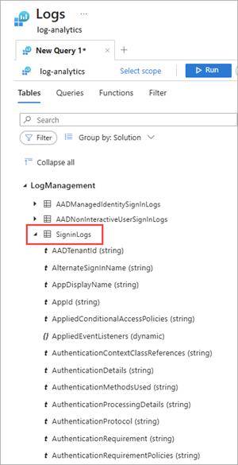

# Analyze Azure AD activity logs with Log Analytics

After you [integrate Azure AD activity logs with Azure Monitor logs](howto-integrate-activity-logs-with-log-analytics.md), you can use the power of Log Analytics and Azure Monitor logs to gain insights into your environment.

 * Compare your Azure AD sign-in logs against security logs published by Microsoft Defender for Cloud.
  
 * Troubleshoot performance bottlenecks on your application’s sign-in page by correlating application performance data from Azure Application Insights.

 * Analyze the Identity Protection risky users and risk detections logs to detect threats in your environment.

This article describes to analyze the Azure AD activity logs in your Log Analytics workspace. 

## Roles and licenses

To analyze Azure AD logs with Azure Monitor, you need the following roles and licenses:

* **An Azure subscription:** If you don't have an Azure subscription, you can [sign up for a free trial](https://azure.microsoft.com/free/).

* **An Azure AD Premium P1 or P2 tenant:** You can find the license type of your tenant on the [Overview](https://portal.azure.com/#blade/Microsoft_AAD_IAM/ActiveDirectoryMenuBlade/Overview) page in Azure AD.

* **Reports Reader**, **Security Reader**, or **Security Administrator** access for the Azure AD tenant: These roles are required to view Log Analytics through the Azure AD portal.

* **Permission to access data in a Log Analytics workspace:** See [Manage access to log data and workspaces in Azure Monitor](../../azure-monitor/logs/manage-access.md) for information on the different permission options and how to configure permissions.

## Access Log Analytics

To view the Azure AD Log Analytics, you must already be sending your activity logs from Azure AD to a Log Analytics workspace. This process is covered in the [How to integrate activity logs with Azure Monitor](howto-integrate-activity-logs-with-log-analytics.md) article.

[!INCLUDE [portal updates](~/articles/active-directory/includes/portal-update.md)]

1. Sign in to the [Azure portal](https://portal.azure.com). 

1. Go to **Azure Active Directory** > **Log Analytics**. A default search query runs.

    

1. Expand the **LogManagement** category to view the list of log related queries.

1. Select or hover over the name of a query to view a description and other useful details.

    

1. Expand a query from the list to view the schema.

    

## Query activity logs

You can run queries against the activity logs being routed to a Log Analytics workspace. For example, to get a list of applications with the most sign-ins from last week, enter the following query and select the **Run** button.

```
SigninLogs 
| where CreatedDateTime >= ago(7d)
| summarize signInCount = count() by AppDisplayName 
| sort by signInCount desc 
```

To get the top audit events over the last week, use the following query:

```
AuditLogs 
| where TimeGenerated >= ago(7d)
| summarize auditCount = count() by OperationName 
| sort by auditCount desc 
```
## Set up alerts

You can also set up alerts on a query. After running a query, the **+ New alert rule** button becomes active.

1. From Log Analytics, select the **+ New alert rule** button.
    - The **Create a rule** process involves several sections to customize the criteria for the rule.
    - For more information on creating alert rules, see [Create a new alert rule](../../azure-monitor/alerts/alerts-create-new-alert-rule.md) from the Azure Monitor documentation, starting with the **Condition** steps.
    
    

1. On the **Actions** tab, select the **Action Group** that will be alerted when the signal occurs.
    - You can choose to notify your team via email or text message, or you could automate the action using webhooks, Azure functions or logic apps.
    - Learn more about [creating and managing alert groups in the Azure portal](../../azure-monitor/alerts/action-groups.md).

1. On the **Details** tab, give the alert rule a name and associate it with a subscription and resource group.

1. After configuring all necessary details, select the **Review + Create** button. 

## Use workbooks to analyze logs

Azure AD workbooks provide several reports related to common scenarios involving audit, sign-in, and provisioning events. *You can also alert on any of the data provided in the reports, using the steps described in the previous section.*

* **Provisioning analysis:** This workbook shows reports related to auditing provisioning activity. Activities can include the number of new users provisioned, provisioning failures, number of users updated, update failures, the number of users de-provisioned, and corresponding failures. For more information, see [Understand how provisioning integrates with Azure Monitor logs](../app-provisioning/application-provisioning-log-analytics.md).

* **Sign-ins Events**: This workbook shows the most relevant reports related to monitoring sign-in activity, such as sign-ins by application, user, device, and a summary view tracking the number of sign-ins over time.

* **Conditional access insights**: The Conditional Access insights and reporting workbook enables you to understand the effect of Conditional Access policies in your organization over time. For more information, see [Conditional Access insights and reporting](../conditional-access/howto-conditional-access-insights-reporting.md).

## Next steps

* [Get started with queries in Azure Monitor logs](../../azure-monitor/logs/get-started-queries.md)
* [Create and manage alert groups in the Azure portal](../../azure-monitor/alerts/action-groups.md)
