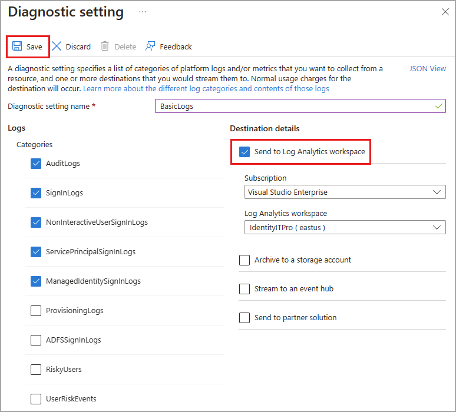

# Configure Microsoft Entra diagnostic settings for activity logs

Using **diagnostic settings** in Microsoft Entra ID, you can integrate logs with Azure Monitor, stream logs to an event hub, or archive logs to a storage account. You can create multiple diagnostic settings to send activity logs to different destinations. 

This article provides the steps to configure Microsoft Entra diagnostic settings for activity logs.

> [!NOTE]
> This article provides the steps to access diagnostic settings for the Microsoft Entra logs. If you need to configure diagnostic settings for Azure Monitor or Azure resources outside of Microsoft Entra ID, see [Diagnostic settings in Azure Monitor](/azure/azure-monitor/essentials/diagnostic-settings).

## Prerequisites

To configure diagnostic settings, you need:

- An Azure subscription. If you don't have an Azure subscription, you can [sign up for a free trial](https://azure.microsoft.com/free/).
- A Microsoft Entra ID P1 or P2 tenant.
- **Security Administrator** access for the Microsoft Entra tenant. For more information about least privilege in our documentation, see [Get the most out of documentation](/entra/fundamentals/how-to-navigate).
- A destination that is already set up. For example, if you want to stream logs to an event hub, you need to create the event hub before you can configure the diagnostic settings.

## Access diagnostic settings

[!INCLUDE [portal update](../../includes/portal-update.md)]

1. Sign in to the [Microsoft Entra admin center](https://entra.microsoft.com) as at least a [Security Administrator](../role-based-access-control/permissions-reference.md#security-administrator).
1. Browse to **Identity** > **Monitoring & health** > **Diagnostic settings**.
1. Any existing diagnostic settings that have already been configured appear in the table. Select **edit settings** to change an existing setting, or select **Add diagnostic setting** to create a new setting.

    

### Log categories

When you create or edit a diagnostic setting, you can choose which log categories to include. For a description of the available logs, see [Log options for streaming to endpoints](concept-diagnostic-settings-logs-options).

You can select one, some, or all of the available logs. Some logs might be part of a preview feature, so even if you select a log category, you might not see any data until the feature is generally available. 

### Destination details

You can send logs to a Log Analytics workspace, stream logs to an event hub, or archive logs to a storage account. At this time, the only supported partner solution is Azure Native ISV services. For more information, see [Azure Native ISV services overview](/azure/partner-solutions/overview).

To send your logs to one of the destinations, you must have already configured that destination. 

- [Configure a Log Analytics workspace](tutorial-configure-log-analytics-workspace.md)
- [Create an event hub](/azure/event-hubs/event-hubs-create)
- [Create a storage account](/azure/storage/common/storage-account-create)

### Configure diagnostic settings

For details on configuring diagnostic settings for a specific destination, see the following articles:

- [Integrate logs with Azure monitor logs](howto-integrate-activity-logs-with-azure-monitor-logs.md)
- [Stream logs to an event hub](howto-stream-logs-to-event-hub.md)
- [Archive logs to an Azure storage account](howto-archive-logs-to-storage-account.md)

The basic steps for configuring diagnostics settings are as follows:

1. To create a new diagnostic setting, select **Add diagnostic setting**.
1. Provide a name.
1. Select the logs you want to include.
1. Select the destinations you want to send the logs to.
1. Select the subscription and the destination from the dropdown menus that appear.
1. Select the **Save** button.

    

## Next steps

- [Integrate logs with Azure monitor logs](howto-integrate-activity-logs-with-azure-monitor-logs.md)
- [Stream logs to an event hub](howto-stream-logs-to-event-hub.md)
- [Archive logs to an Azure storage account](howto-archive-logs-to-storage-account.md)