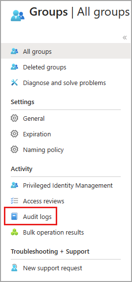
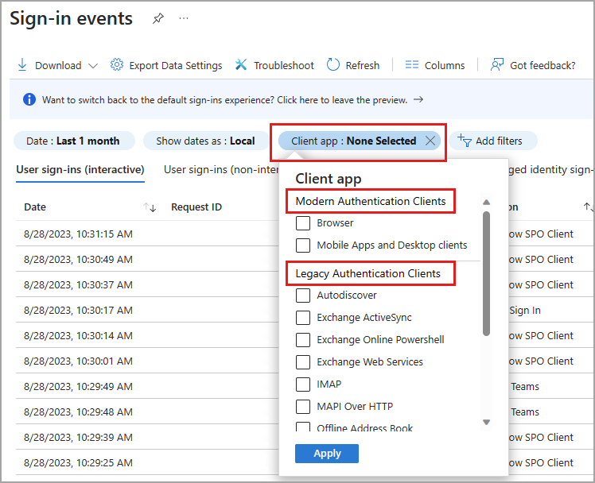
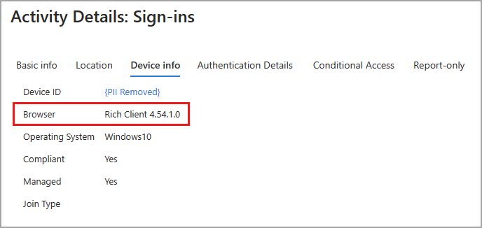

# How to customize and filter identity activity logs

Sign-in logs are a commonly used tool to troubleshoot user access issues and investigate risky sign-in activity. Audit logs collect every logged event in Microsoft Entra ID and can be used to investigate changes to your environment. There are over 30 columns you can choose from to customize your view of the sign-in logs in the Microsoft Entra admin center. Audit logs and Provisioning logs can also be customized and filtered for your needs.

This article shows you how to customize the columns and then filter the logs to find the information you need more efficiently.

## Prerequisites

The required roles and licenses may vary based on the report. Global Administrators can access all reports, but we recommend using a role with least privilege access to align with the [Zero Trust guidance](/security/zero-trust/zero-trust-overview).

| Log / Report | Roles | Licenses |
|--|--|--|
| Audit | Report Reader Security Reader Security Administrator Global Reader | All editions of Microsoft Entra ID |
| Sign-ins | Report Reader Security Reader Security Administrator Global Reader | All editions of Microsoft Entra ID |
| Provisioning | Same as audit and sign-ins, plus Security Operator Application Administrator Cloud App Administrator A custom role with `provisioningLogs` permission | Premium P1 or P2 |
| Conditional Access data in the sign-in logs | Company Administrator Global Reader Security Administrator Security Reader Conditional Access Administrator | Premium P1 or P2 |

## How to access the activity logs in the Microsoft Entra admin center

You can always access your own sign-in history at [https://mysignins.microsoft.com](https://mysignins.microsoft.com). You can also access the sign-in logs from **Users** and **Enterprise applications** in Microsoft Entra ID.

[!INCLUDE [portal updates](~/includes/portal-update.md)]

1. Sign in to the [Microsoft Entra admin center](https://entra.microsoft.com) as at least a [Reports Reader](~/identity/role-based-access-control/permissions-reference.md#reports-reader).
1. Browse to **Identity** > **Monitoring & health** > **Audit logs**/**Sign-in logs**/**Provisioning logs**.

## [Audit logs](#tab/audit-logs)

With the information in the Microsoft Entra audit logs, you can access all records of system activities for compliance purposes. Audit logs can be accessed from the **Monitoring and health** section of Microsoft Entra ID, where you can sort and filter on every category and activity. You can also access audit logs in the area of the admin center for the service you're investigating.

For example, if you're looking into changes to Microsoft Entra groups, you can access the Audit logs from **Microsoft Entra ID** > **Groups**. When you access the audit logs from the service, the filter is automatically adjusted according to the service.

### Customize the layout of the audit logs

Customize the columns in the audit logs to view only the information you need. The **Service**, **Category** and **Activity** columns are related to each other, so these columns should always be visible. 

### Filter the audit logs

When you filter the logs by **Service**, the **Category** and **Activity** details automatically change. In some cases, there may only be one Category or Activity. For a detailed table of all potential combinations of these details, see [Audit activities](reference-audit-activities.md).

:::image type="content" source="media/howto-customize-filter-logs/audit-log-activities-filter.png" alt-text="Screenshot of the audit log filter with Conditional Access as the service." lightbox="media/howto-customize-filter-logs/audit-log-activities-filter-expanded.png":::

- **Service**: Defaults to all available services, but you can filter the list to one or more by selecting an option from the dropdown list.

- **Category**: Defaults to all categories, but can be filtered to view the category of activity, such as changing a policy or activating an eligible Microsoft Entra role.

- **Activity**: Based on the category and activity resource type selection you make. You can select a specific activity you want to see or choose all.
 
    You can get the list of all Audit Activities using the Microsoft Graph API: `https://graph.windows.net/<tenantdomain>/activities/auditActivityTypesV2?api-version=beta`

- **Status**: Allows you to look at result based on if the activity was a success or failure.

- **Target**: Allows you to search for the target or recipient of an activity. Search by the first few letters of a name or user principal name (UPN). The target name and UPN are case-sensitive. 

- **Initiated by**: Allows you to search by who initiated the activity using the first few letters of their name or UPN. The name and UPN are case-sensitive.

- **Date range**: Enables to you to define a timeframe for the returned data. You can search the last 7 days, 24 hours, or a custom range. When you select a custom timeframe, you can configure a start time and an end time.

## [Sign-in logs](#tab/sign-in-logs)

On the sign-in logs page, you can switch between four sign-in log types. For more information on the four types of logs, see [What are Microsoft Entra sign-in logs?](concept-sign-ins.md).

:::image type="content" source="media/howto-customize-filter-logs/sign-in-logs-types.png" alt-text="Screenshot of the sign-in log types." lightbox="media/howto-customize-filter-logs/sign-in-logs-types-expanded.png":::

- **Interactive user sign-ins:** Sign-ins where a user provides an authentication factor, such as a password, a response through an MFA app, a biometric factor, or a QR code.

- **Non-interactive user sign-ins:** Sign-ins performed by a client on behalf of a user. These sign-ins don't require any interaction or authentication factor from the user. For example, authentication and authorization using refresh and access tokens that don't require a user to enter credentials.

- **Service principal sign-ins:** Sign-ins by apps and service principals that don't involve any user. In these sign-ins, the app or service provides a credential on its own behalf to authenticate or access resources.

- **Managed identities for Azure resources sign-ins:** Sign-ins by Azure resources that have secrets managed by Azure. For more information, see [What are managed identities for Azure resources?](~/identity/managed-identities-azure-resources/overview.md).

### Customize the layout of the sign-in logs

You can customize the columns for the interactive user sign-in log using over 30 column options. To more effectively view the sign-in log, spend a few moments customizing the view for your needs. 

1. Select **Columns** from the menu at the top of the log.
1. Select the columns you want to view and select the **Save** button at the bottom of the window.

### Filter the sign-in logs <h3 id="filter-sign-in-activities"></h3>

Filtering the sign-in logs is a helpful way to quickly find logs that match a specific scenario. For example, you could filter the list to only view sign-ins that occurred in a specific geographic location, from a specific operating system, or from a specific type of credential.

Some filter options prompt you to select more options. Follow the prompts to make the selection you need for the filter. You can add multiple filters. 

1. Select the **Add filters** button, choose a filter option and select **Apply**.

    

1. Either enter a specific detail - such as a Request ID - or select another filter option. 

    

You can filter on several details. The following table describes some commonly used filters. *Not all filter options are described.*

| Filter | Description |
| --- | --- |
| Request ID | Unique identifier for a sign-in request |
| Correlation ID | Unique identifier for all sign-in requests that are part of a single sign-in attempt |
| User | The *user principal name* (UPN) of the user |
| Application | The application targeted by the sign-in request |
| Status | Options are *Success*, *Failure*, and *Interrupted* |
| Resource | The name of the service used for the sign-in |
| IP address | The IP address of the client used for the sign-in |
| Conditional Access | Options are *Not applied*, *Success*, and *Failure* |

Now that your sign-in logs table is formatted for your needs, you can more effectively analyze the data. Further analysis and retention of sign-in data can be accomplished by exporting the logs to other tools. 

Customizing the columns and adjusting the filter helps to look at logs with similar characteristics. To look at the details of a sign-in, select a row in the table to open the **Activity Details** panel. There are several tabs in the panel to explore. For more information, see [Sign-in log activity details](concept-sign-in-log-activity-details.md).

:::image type="content" source="media/howto-customize-filter-logs/sign-in-activity-details.png" alt-text="Screenshot of the sign-in activity details." lightbox="media/howto-customize-filter-logs/sign-in-activity-details-expanded.png":::

### Client app filter

When reviewing where a sign-in originated, you may need to use the **Client app** filter. Client app has two subcategories: **Modern authentication clients** and **Legacy authentication clients**. Modern authentication clients have two more subcategories: **Browser** and **Mobile apps and desktop clients**. There are several subcategories for Legacy authentication clients, which are defined in the [Legacy authentication client details](#legacy-authentication-client-details) table.

**Browser** sign-ins include all sign-in attempts from web browsers. When viewing the details of a sign-in from a browser, the **Basic info** tab shows **Client app: Browser**.

On the **Device info** tab, **Browser** shows the details of the web browser. The browser type and version are listed, but in some cases, the name of the browser and version is not available. You may see something like **Rich Client 4.0.0.0**. 

#### Legacy authentication client details

The following table provides the details for each of the *Legacy authentication client* options.

|Name|Description|
|---|---|
|Authenticated SMTP|Used by POP and IMAP clients to send email messages.|
|Autodiscover|Used by Outlook and EAS clients to find and connect to mailboxes in Exchange Online.|
|Exchange ActiveSync|This filter shows all sign-in attempts where the EAS protocol has been attempted.|
|Exchange ActiveSync| Shows all sign-in attempts from users with client apps using Exchange ActiveSync to connect to Exchange Online|
|Exchange Online PowerShell|Used to connect to Exchange Online with remote PowerShell. If you block basic authentication for Exchange Online PowerShell, you need to use the Exchange Online PowerShell module to connect. For instructions, see [Connect to Exchange Online PowerShell using multi-factor authentication](/powershell/exchange/connect-to-exchange-online-powershell).|
|Exchange Web Services|A programming interface that's used by Outlook, Outlook for Mac, and third-party apps.|
|IMAP4|A legacy mail client using IMAP to retrieve email.|
|MAPI over HTTP|Used by Outlook 2010 and later.|
|Offline Address Book|A copy of address list collections that are downloaded and used by Outlook.|
|Outlook Anywhere (RPC over HTTP)|Used by Outlook 2016 and earlier.|
|Outlook Service|Used by the Mail and Calendar app for Windows 10.|
|POP3|A legacy mail client using POP3 to retrieve email.|
|Reporting Web Services|Used to retrieve report data in Exchange Online.|
|Other clients|Shows all sign-in attempts from users where the client app isn't included or unknown.|

## [Provisioning logs](#tab/provisioning-logs)

To more effectively view the provisioning log, spend a few moments customizing the view for your needs. You can specify what columns to include and filter the data to narrow things down.

### Customize the layout

The provisioning log has a default view, but you can customize columns.

1. Select **Columns** from the menu at the top of the log.
1. Select the columns you want to view and select the **Save** button at the bottom of the window.

## Filter the results

When you filter your provisioning data, some filter values are dynamically populated based on your tenant. For example, if you don't have any "create" events in your tenant, the\= **Create** filter option isn't available.

The **Identity** filter enables you to specify the name or the identity that you care about. This identity might be a user, group, role, or other object. 

You can search by the name or ID of the object. The ID varies by scenario.
- If you're provisioning an object *from Microsoft Entra ID to Salesforce*, the **source ID** is the object ID of the user in Microsoft Entra ID. The **target ID** is the ID of the user at Salesforce.
- If you're provisioning *from Workday to Microsoft Entra ID*, the **source ID** is the Workday worker employee ID. The **target ID** is the ID of the user in Microsoft Entra ID.
- If you're provisioning users for [cross-tenant synchronization](~/identity/multi-tenant-organizations/cross-tenant-synchronization-configure.md), the **source ID** is ID of the user in the source tenant. The **target ID** is ID of the user in the target tenant.

> [!NOTE]
> The name of the user might not always be present in the **Identity** column. There will always be one ID. 

The **Date** filter enables to you to define a timeframe for the returned data. Possible values are:

- One month
- Seven days
- 30 days
- 24 hours
- Custom time interval (configure a start date and an end date)

The **Status** filter enables you to select:

- All
- Success
- Failure
- Skipped

The **Action** filter enables you to filter these actions:

- Create
- Update
- Delete
- Disable
- Other

In addition to the filters of the default view, you can set the following filters.

- **Job ID**: A unique job ID is associated with each application that you've enabled provisioning for.   

- **Cycle ID**: The cycle ID uniquely identifies the provisioning cycle. You can share this ID with product support to look up the cycle in which this event occurred.

- **Change ID**: The change ID is a unique identifier for the provisioning event. You can share this ID with product support to look up the provisioning event.   

- **Source System**: You can specify where the identity is getting provisioned from. For example, when you're provisioning an object from Microsoft Entra ID to ServiceNow, the source system is Microsoft Entra ID. 

- **Target System**: You can specify where the identity is getting provisioned to. For example, when you're provisioning an object from Microsoft Entra ID to ServiceNow, the target system is ServiceNow. 

- **Application**: You can show only records of applications with a display name or object ID that contains a specific string. For [cross-tenant synchronization](~/identity/multi-tenant-organizations/cross-tenant-synchronization-configure.md), use the object ID of the configuration and not the application ID.

---

## Next steps

- [Analyze a sing-in error](quickstart-analyze-sign-in.md)
- [Troubleshoot sign-in errors](howto-troubleshoot-sign-in-errors.md)
- [Explore all audit log categories and activities](reference-audit-activities.md)
