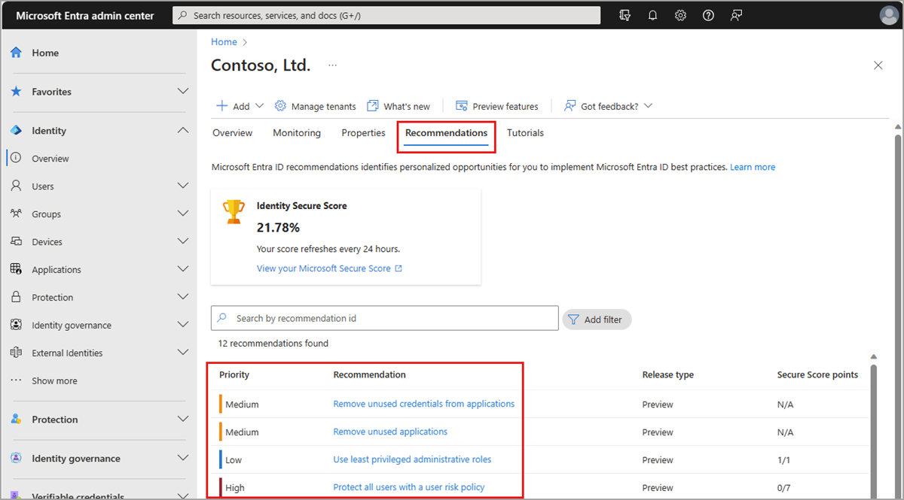
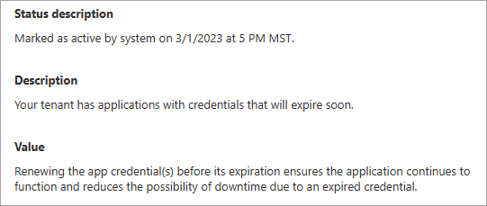

# How to: Use Azure AD recommendations

The Azure Active Directory (Azure AD) recommendations feature provides you with personalized insights with actionable guidance to:

- Help you identify opportunities to implement best practices for Azure AD-related features.
- Improve the state of your Azure AD tenant.
- Optimize the configurations for your scenarios.

This article covers how to work with Azure AD recommendations. Each Azure AD recommendation contains similar details such as a description, the value of addressing the recommendation, and the steps to address the recommendation. Microsoft Graph API guidance is also provided in this article.

## Role requirements

There are different role requirements for viewing or updating a recommendation. Use the least-privileged role for the type of access needed.

| Azure AD role | Access type |
|---- |---- |
| Reports Reader | Read-only | 
| Security Reader | Read-only |
| Global Reader | Read-only |
| Cloud apps Administrator | Update and read |
| Apps Administrator | Update and read |
| Security Operator | Update and read |
| Security Administrator | Update and read |

Some recommendations may require a P2 or other license. For more information, see [Recommendation availability and license requirements](overview-recommendations.md#recommendation-availability-and-license-requirements).

## How to read a recommendation

To view the details of a recommendation:

1. Sign in to Azure using the appropriate least-privilege role.
1. Go to **Azure AD** > **Recommendations** and select a recommendation from the list.

    

Each recommendation provides the same set of details that explain what the recommendation is, why it's important, and how to fix it.


- The **Status** of a recommendation can be updated manually or automatically by the system. If all resources are addressed according to the action plan, the status automatically changes to *Completed* the next time the recommendations service runs. The recommendation service runs every 24-48 hours, depending on the recommendation. 

- The **Priority** of a recommendation could be low, medium, or high. These values are determined by several factors, such as security implications, health concerns, or potential breaking changes.

    - **High**: Must do. Not acting will result in severe security implications or potential downtime.
    - **Medium**: Should do. No severe risk if action isn't taken.
    - **Low**: Might do. No security risks or health concerns if action isn't taken.

- The **Impacted resource type** for a recommendation could be applications, users, or your full tenant. This detail gives you an idea of what type of resources you need to address. If the impacted resource is at the tenant level, you may need to make a global change. 



- The **Status description** tells you the date the recommendation status changed and if it was changed by the system or a user.

- The recommendation's **Value** is an explanation of why completing the recommendation will benefit you, and the value of the associated feature. 

- The **Action plan** provides step-by-step instructions to implement a recommendation. The Action plan may include links to relevant documentation or direct you to other pages in the Azure portal.

- The **Impacted resources** table contains a list of resources identified by the recommendation. The resource's name, ID, date it was first detected, and status are provided. The resource could be an application or resource service principal, for example. 

> [!NOTE]
> In the Azure portal the impacted resources are limited to a maximum of 50 resources, to view more resources you should use the expand query parameter at the end of your API query on Microsoft graph. For example: Get: https://graph.microsoft.com/beta/directory/recommendations?$expand=impactedResources

## How to update a recommendation

To update the status of a recommendation or a related resource, sign in to Azure using a least-privileged role for updating a recommendation.

1. Go to **Azure AD** > **Recommendations**.

1. Select a recommendation from the list to view the details, status, and action plan.

1. Follow the **Action plan**.

1. If applicable, *right-click on the status* of a resource in a recommendation, select **Mark as**, then select a status.

    - The status for the resource appears as regular text, but you can right-click on the status to open the menu.
    - You can set each resource to a different status as needed.
    
    

1. The recommendation service automatically marks the recommendation as complete, but if you need to manually change the status of a recommendation, select **Mark as** from the top of the page and select a status.

    

    - Mark a recommendation as **Dismissed** if you think the recommendation is irrelevant or the data is wrong.
        - Azure AD asks for a reason why you dismissed the recommendation so we can improve the service.
    - Mark a recommendation as **Postponed** if you want to address the recommendation at a later time.
        - The recommendation becomes **Active** when the selected date occurs.
    - You can reactivate a completed or postponed recommendation to keep it top of mind and reassess the resources.
    - Recommendations change to **Completed** if all impacted resources have been addressed.
       - If the service identifies an active resource for a completed recommendation the next time the service runs, the recommendation will automatically change back to **Active**.
       - Completing a recommendation is the only action collected in the audit log. To view these logs, go to **Azure AD** > **Audit logs** and filter the service to "Azure AD recommendations."

Continue to monitor the recommendations in your tenant for changes.

### How to use Microsoft Graph with Azure Active Directory recommendations

Azure Active Directory recommendations can be viewed and managed using Microsoft Graph on the `/beta` endpoint. You can view recommendations along with their impacted resources, postpone a recommendation for later, and more. 

To get started, follow these instructions to work with recommendations using Microsoft Graph in Graph Explorer. The example uses the "Migrate apps from Active Directory Federated Services (ADFS) to Azure AD" recommendation.

1. Sign in to [Graph Explorer](https://aka.ms/ge).
1. Select **GET** as the HTTP method from the dropdown.
1. Set the API version to **beta**.
1. Add the following query to retrieve recommendations, then select the **Run query** button.

    ```http
    GET https://graph.microsoft.com/beta/directory/recommendations
    ```

1. To view the details of a specific `recommendationType`, use the following API. This example retrieves the detail of the "Migrate apps from AD FS to Azure AD" recommendation.

    ```http
    GET https://graph.microsoft.com/beta/directory/recommendations?$filter=recommendationType eq 'adfsAppsMigration'
    ```

1. To view the impacted resources for a specific recommendation, expand the `impactedResources` relationship.

    ```http
    GET https://graph.microsoft.com/beta/directory/recommendations?$filter=recommendationType eq 'adfsAppsMigration'&$expand=impactedResources
    ```

For more information, see the [Microsoft Graph documentation for recommendations](/graph/api/resources/recommendations-api-overview).

## Next steps

- [Review the Azure AD recommendations overview](overview-recommendations.md)
- [Learn about Service Health notifications](overview-service-health-notifications.md)
