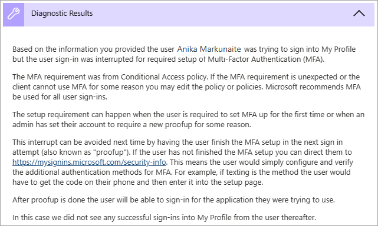

# What is the Sign-in diagnostic in Microsoft Entra ID?

Determining the reason for a failed sign-in can quickly become a challenging task. You need to analyze what happened during the sign-in attempt, and research the available recommendations to resolve the issue. Ideally, you want to resolve the issue without involving others, such as Microsoft support. If you are in a situation like this, you can use the Sign-in diagnostic in Microsoft Entra ID, a tool that helps you investigate sign-ins in Microsoft Entra ID.

This article gives you an overview of what the Sign-in diagnostic is and how you can use it to troubleshoot sign-in related errors.

## Prerequisites

To use the Sign-in diagnostic:

- You must be signed as at least a **Global Reader**.
- With the correct access level, you can start the Sign-in diagnostic from more than one place.
- Flagged sign-in events can also be reviewed from the Sign-in diagnostic.
  - Flagged sign-in events are captured *after* a user enabled flagging during their sign-in experience.
  - For more information, see [flagged sign-ins](overview-flagged-sign-ins.md).

## How does it work?

In Microsoft Entra ID, sign-in attempts are controlled by:

- **Who** performed a sign-in attempt.
- **How** a sign-in attempt was performed.

For example, you can configure Conditional Access policies that enable administrators to configure all aspects of the tenant when they sign in from the corporate network. But the same user might be blocked when they sign in to the same account from an untrusted network.

Due to the greater flexibility of the system to respond to a sign-in attempt, you might end up in scenarios where you need to troubleshoot sign-ins. The Sign-in diagnostic tool enables diagnosis of sign-in issues by:  

- Analyzing data from sign-in events and flagged sign-ins.  
- Displaying information about what happened.  
- Providing recommendations to resolve problems.  

### From Diagnose and Solve Problems

You can start the Sign-in diagnostic from the **Diagnose and Solve Problems** area of Microsoft Entra ID. From Diagnose and Solve Problems you can review any flagged sign-in events or search for a specific sign-in event. You can also start this process from the Conditional Access Diagnose and Solve Problems area.

[!INCLUDE [portal update](../../includes/portal-update.md)]

1. Sign in to the [Microsoft Entra admin center](https://entra.microsoft.com) as at least a [Global Reader](../role-based-access-control/permissions-reference.md#global-reader).

1. Browse to **Learn & support** > **Diagnose & solve problems** or **Protection** **Conditional Access** > **Diagnose and Solve Problems**.

1. Select the **Troubleshoot** link on the **Sign-in Diagnostic** tile.

1. Select the **All Sign-In Events** tab to start a search.

1. Enter as many details as possible into the search fields.
    - **User**: Provide the name or email address of who made the sign-in attempt.
    - **Application**: Provide the application display name or application ID.
    - **correlationId** or **requestId**: These details can be found in the error report or the sign-in log details.
    - **Date and time**: Provide a date and time to find sign-in events that occurred within 48 hours.
1. Select the **Next** button.

1. Explore the results and take action as necessary.

### From the Sign-in logs

You can start the Sign-in diagnostic from a specific sign-in event in the Sign-in logs. When you start the process from a specific sign-in event, the diagnostics start right away. You aren't prompted to enter details first.

1. Browse to **Identity** > **Monitoring & health** > **Sign-in logs** and select a sign-in event.
    - You can filter your list to make it easier to find specific sign-in events.
1. From the Activity Details window that opens, select the **Launch the Sign-in diagnostic** link.

    

1. Explore the results and take action as necessary.

### From a support request

If you're in the middle of creating a support request *and* the options you selected are related to sign-in activity, you're prompted to run the Sign-in diagnostics during the support request process.

1. Browse to **Diagnose and Solve Problems**.
1. Select the appropriate fields as necessary. For example:
    - **Service type**: Microsoft Entra Sign-in and multifactor authentication
    - **Problem type**: Multifactor authentication
    - **Problem subtype**: Unable to sign-in to an application due to MFA
1. Explore the results and take action as necessary.

    

## How to use the diagnostic results

After the Sign-in diagnostic completes its search, a few things appear on the screen:

- The **Authentication summary** lists all of the events that match the details you provided.
  - Select the **View Columns** option in the upper-right corner of the summary to change the columns that appear.
- The **Diagnostic results** describe what happened during the sign-in events.
  - Scenarios could include MFA requirements from a Conditional Access policy, sign-in events that might need to have a Conditional Access policy applied, or a large number of failed sign-in attempts over the past 48 hours.
  - Related content and links to troubleshooting tools might be provided.
  - Read through the results to identify any actions that you can take.
  - Because it's not always possible to resolve issues without more help, a recommended step might be to open a support ticket.

    

- Provide feedback on the results to help improve the feature.

## Next steps

- [Sign in diagnostics for Microsoft Entra scenarios](concept-sign-in-diagnostics-scenarios.md)
- [Learn about flagged sign-ins](overview-flagged-sign-ins.md)
- [Troubleshoot sign-in errors](howto-troubleshoot-sign-in-errors.md)
