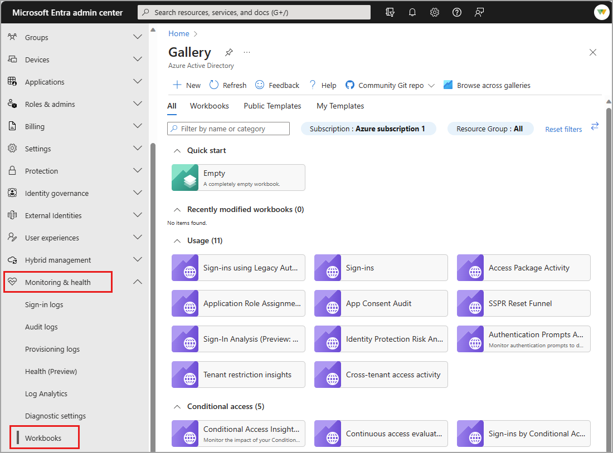

---

title: What are Microsoft Entra workbooks?
description: Learn how to create and work with Microsoft Entra workbooks, for identity monitoring, alerts, and data visualization.
services: active-directory
author: shlipsey3
manager: amycolannino
ms.service: active-directory
ms.topic: overview
ms.subservice: report-monitor
ms.date: 10/03/2023
ms.author: sarahlipsey
ms.reviewer: tspring
# Customer intent: As a Microsoft Entra administrator, I want a visualization tool that I can customize for my tenant.
---

# What are Microsoft Entra workbooks?

As an IT admin, you need may need to see your Microsoft Entra tenant data as a visual representation that enables you to understand how your identity management environment is doing. This article gives you an overview of how you can use Azure Workbooks for Microsoft Entra ID to analyze your Microsoft Entra tenant data.

With Azure Workbooks for Microsoft Entra ID, you can:

- Query data from multiple sources in Azure
- Visualize data for reporting and analysis
- Combine multiple elements into a single interactive experience

Workbooks are found in Microsoft Entra ID and in Azure Monitor. The concepts, processes, and best practices are the same for both types of workbooks. Workbooks for Microsoft Entra ID, however, cover only those identity management scenarios that are associated with Microsoft Entra ID. Sign-ins, Conditional Access, multifactor authentication, and Identity Protection are scenarios included in the Workbooks for Microsoft Entra ID.

For more information on workbooks for other Azure services, see [Azure Monitor workbooks](/azure/azure-monitor/visualize/workbooks-overview).

## How does it help me?

Workbooks are highly customizable, so you can make workbooks for any scenario. Public templates are added frequently, which provide a great starting point. Common scenarios for using workbooks include:

- Get shareable, at-a-glance summary reports about your Microsoft Entra tenant, and build your own custom reports.
- Find and diagnose sign-in failures, and get a trending view of your organization's sign-in health.
- Monitor Microsoft Entra logs for sign-ins, tenant administrator actions, provisioning, and risk together in a flexible, customizable format.
- Watch trends in your tenant’s usage of Microsoft Entra features such as Conditional Access, self-service password reset, and more.
- Know who's using legacy authentications to sign in to your environment.
- Understand the effect of your Conditional Access policies on your users' sign-in experience.

## Who should use it?

Because of the ability to customize workbooks, they can benefit many types of users. Typical personas that use workbooks are:

- **Reporting admin**: Someone who is responsible for creating reports on top of the available data and workbook templates
- **Tenant admins**: People who use the available reports to get insight and take action.
- **Workbook template builder**: Someone who “graduates” from the role of reporting admin by turning a workbook into a template for others with similar needs to use as a basis for creating their own workbooks.

## Public workbook templates

Public workbook templates are built, updated, and deprecated to reflect the needs of customers and the current Microsoft Entra services. Detailed guidance is available for several Microsoft Entra public workbook templates. 

- [Authentication prompts analysis](workbook-authentication-prompts-analysis.md)
- [Conditional Access gap analyzer](workbook-conditional-access-gap-analyzer.md)
- [Cross-tenant access activity](workbook-cross-tenant-access-activity.md)
- [Multifactor authentication gaps](workbook-mfa-gaps.md)
- [Risk analysis](workbook-risk-analysis.md)
- [Sensitive Operations Report](workbook-sensitive-operations-report.md)
- [Sign-ins using legacy authentication](workbook-legacy-authentication.md)

## Next steps

- Learn [how to use Azure Workbooks for Microsoft Entra ID](./howto-use-workbooks.md)
- [Create your own workbook](/azure/azure-monitor/visualize/workbooks-create-workbook)
- Create a [Log Analytics workspace](/azure/azure-monitor/logs/quick-create-workspace)
