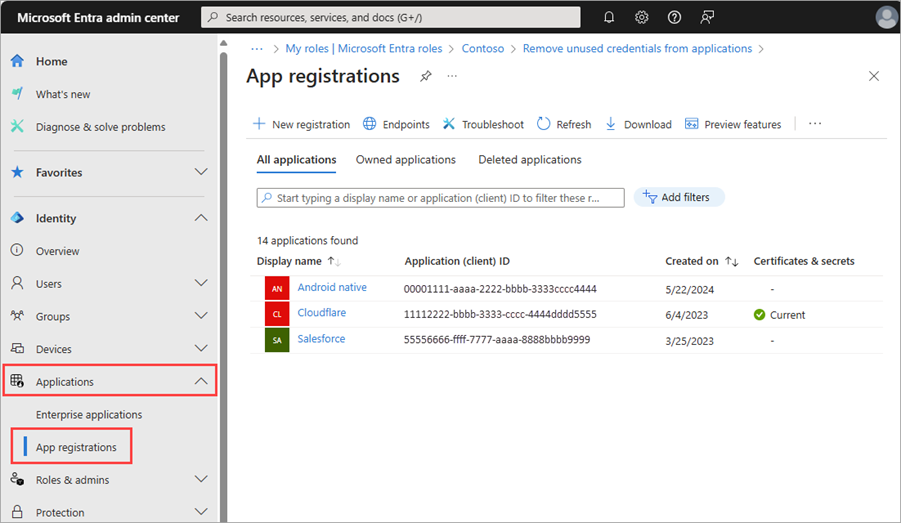

# Azure AD recommendation: Remove unused credentials from apps (preview)
[Azure AD recommendations](overview-recommendations.md) is a feature that provides you with personalized insights and actionable guidance to align your tenant with recommended best practices.

This article covers the recommendation to remove unused credentials from apps. This recommendation is called `UnusedAppCreds` in the recommendations API in Microsoft Graph. 

## Description

Application credentials can include certificates and other types of secrets that need to be registered with that application. These credentials are used to prove the identity of the application. Only credentials actively in use by an application should remain registered with the application.

## Logic 

This recommendation shows up if your tenant has application credentials that haven't been used in more than 30 days. 

## Value 

An application credential is used to get a token that grants access to a resource or another service. If an application credential is compromised, it could be used to access sensitive resources or allow a bad actor to move latterly, depending on the access granted to the application.

Removing credentials not actively used by applications improves security posture and promotes app hygiene. It reduces the risk of application compromise and improves the security posture of the application by reducing the attack surface for credential misuse by discovery.

## Action plan

Applications that the recommendation identified appear in the list of **Impacted resources** at the bottom of the recommendation. 

1. Take note of the application name and ID that the recommendation identified.

1. Go to **Azure AD** > **App registration** and locate the application that was surfaced as part of this recommendation.

    

1. Navigate to the **Certificates & Secrets** section of the app registration.
1. Locate the unused credential and remove it.

    

To remove a credential from a service principal resource, use the MS Graph Service Principal API service action `removePassword`.
 
## Next steps

- [Review the Azure AD recommendations overview](overview-recommendations.md)
- [Learn how to use Azure AD recommendations](howto-use-recommendations.md)
- [Explore the Microsoft Graph API properties for recommendations](/graph/api/resources/recommendation)
- [Learn about app and service principal objects in Azure AD](../develop/app-objects-and-service-principals.md)