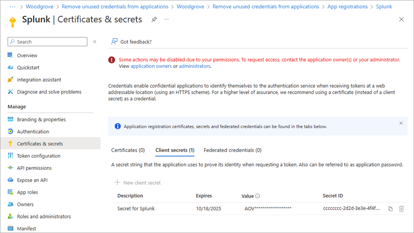

# Azure AD recommendation: Renew expiring application credentials (preview)
[Azure AD recommendations](overview-recommendations.md) is a feature that provides you with personalized insights and actionable guidance to align your tenant with recommended best practices.

This article covers the recommendation to renew expiring application credentials. This recommendation is called `applicationCredentialExpiry` in the recommendations API in Microsoft Graph. 

## Description

Application credentials can include certificates and other types of secrets that need to be registered with that application. These credentials are used to prove the identity of the application.

## Logic 

This recommendation shows up if your tenant has application credentials that will expire soon. 

## Value 

Renewing the app credential(s) before its expiration ensures the application continues to function and reduces the possibility of downtime due to an expired credential.

## Action plan

Applications that the recommendation identified appear in the list of **Impacted resources** at the bottom of the recommendation. 

1. Take note of the application name and ID that the recommendation identified.

1. Navigate to **Azure AD** > **App registration** and locate the application for which the credential needs to be rotated.

    

1. Navigate to the **Certificates & Secrets** section of the app registration.

1. Pick the credential type that you want to rotate and navigate to either **Certificates** or **Client Secret** tab and follow the prompts.

    

1. Once the certificate or secret is successfully added, update the service code to ensure it works with the new credential and doesn't negatively affect customers.
1. Use the Azure AD sign-in logs to validate that the thumbprint of the certificate matches the one that was recently uploaded.
1. After validating the new credential, navigate back to **Azure AD** > **App registrations** > **Certificates and Secrets** for the app and remove the old credential.
 
## Known limitations

When looking for the application with the credential that needs to be rotated, only the app name is used. The service doesn't have the ability to show the resource ID for the app.

## Next steps

- [Review the Azure AD recommendations overview](overview-recommendations.md)
- [Learn how to use Azure AD recommendations](howto-use-recommendations.md)
- [Explore the Microsoft Graph API properties for recommendations](/graph/api/resources/recommendation)
- [Learn about app and service principal objects in Azure AD](../develop/app-objects-and-service-principals.md)