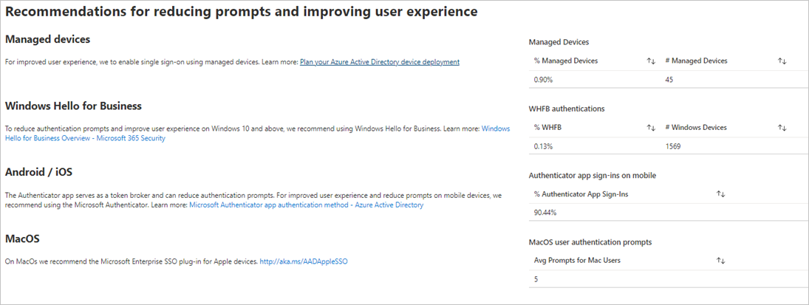

---

title: Authentication prompts analysis workbook in  Azure AD | Microsoft Docs
description: Learn how to use the authentication prompts analysis workbook.
services: active-directory
documentationcenter: ''
author: MarkusVi
manager: karenho
editor: ''

ms.service: active-directory
ms.topic: reference
ms.workload: identity
ms.subservice: report-monitor
ms.date: 02/02/2022
ms.author: markvi
ms.reviewer: sarbar 

ms.collection: M365-identity-device-management
---

# Authentication prompts analysis workbook

As an IT Pro, you want the right information about authentication prompts in your environment so that you can detect unexpected prompts and investigate further. Providing you with this type of information is the goal of the **authentication prompts analysis workbook**. 

This article provides you with an overview of this workbook.

## Description

Have you recently asked yourself: “why are my users getting so many prompts?”

Have you recently heard about complains from your users about getting too many authentication prompts?

Over prompting users impacts your user's productivity and often leads users getting phished for MFA. To be clear, MFA is essential! We are not talking about if you should require MFA but how frequently you should prompt your users.

Typically, this scenario is caused by:

- Misconfigured applications
- Over aggressive prompts policies 
- Cyber-attacks 
 
The authentication prompts analysis workbook identifies various types of authentication prompts. The types are  based on different pivots including users, applications, operating system, processes and more.

You can use this workbook in the following scenarios:

- You received aggregated feedback of too many prompts.
- To detect over prompting attributed to one specific authentication method, policy application, or device.
- To view authentication prompt counts of high-profile users.
- To track legacy TLS and other authentication process details.

 
 

## Sections

This workbook breaks down authentication prompts by: 

- Method
- Device state
- Application
- User
- Status
- Operating System
- Process detail
- Policy

In many environments, the most used apps are business productivity apps. Anything that isn’t expected should be investigated. The charts below show authentication prompts by application.

The prompts by application list-view shows additional information that help with investigations. This includes timestamps, and request IDs.

Additionally, you get a summary of the average and median prompts count for your tenant. 

This workbook also helps track impactful ways to improve your users’ experience and reduce prompts as well as the relative percentage.  

  

## Filters

Take advantage of the filters for more granular views of the data: 

Filtering for a specific user that has a lot of authentication requests or only showing applications with sign-in failures can also lead to interesting findings to continue to remediate. 

## Best practices

If data is not showing up or seems to be showing up incorrectly, please confirm that you have set the **Log Analytics Workspace** and **Subscriptions** on the proper resources.

If the visuals are taking too much time to load, try reducing the Time filter to 24 hours or less.

## Next steps

- To understand more about the different policies that impact MFA prompts, see [Optimize reauthentication prompts and understand session lifetime for Azure AD Multi-Factor Authentication](../authentication/concepts-azure-multi-factor-authentication-prompts-session-lifetime.md). 

- To learn more about the different vulnerabilities of different MFA methods, see [All your creds are belong to us!](https://aka.ms/allyourcreds).

- To learn how to move users from telecom-based methods to the Authenticator app, see [How to run a registration campaign to set up Microsoft Authenticator - Microsoft Authenticator app](../authentication/how-to-mfa-registration-campaign.md).

