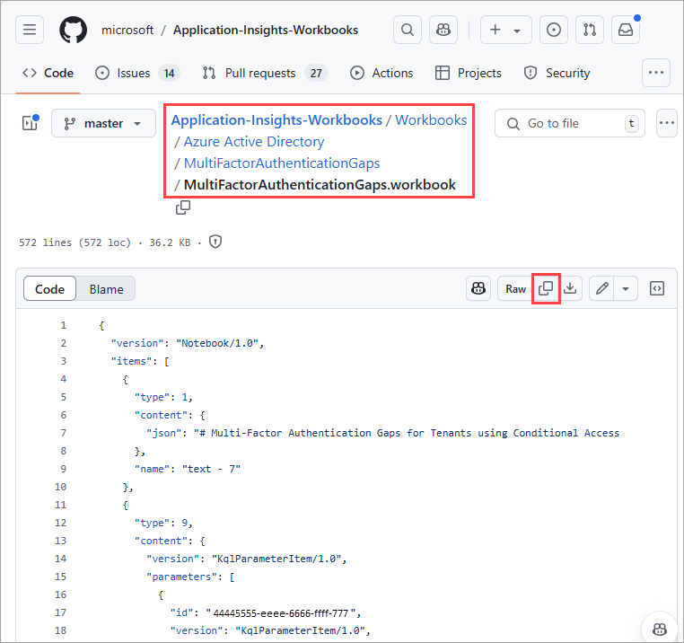

---

title: Multifactor Authentication Gaps workbook in Microsoft Entra ID
description: Learn how to use the MFA Gaps workbook.
services: active-directory
author: shlipsey3
manager: amycolannino
ms.service: active-directory
ms.topic: reference
ms.workload: identity
ms.subservice: report-monitor
ms.date: 10/03/2023
ms.author: sarahlipsey
ms.reviewer: sarbar 

---

# Multifactor Authentication Gaps workbook

The Multifactor Authentication Gaps workbook helps with identifying user sign-ins and applications that are not protected by multifactor authentication (MFA) requirements. This workbook:
* Identifies user sign-ins not protected by multi-factor authentication requirements.
* Provides further drill down options using various pivots such as applications, operating systems, and location.
* Provides several filters such as trusted locations and device states to narrow down the users/applications. 
* Provides filters to scope the workbook for a subset of users and applications.

This article gives you an overview of the **Multifactor authentication caps** workbook.

## How to import the workbook

The **MFA gaps** workbook is currently not available as a template, but you can import it from the Microsoft Entra workbooks GitHub repository.

[!INCLUDE [how to access workbooks](~/articles/active-directory/includes/how-to-access-workbooks.md)]
1. Select **+ New**.
1. Select the **Advanced Editor** button from the top of the page. A JSON editor opens.
    

1. Navigate to the Microsoft Entra workbooks GitHub repository
    - **Direct link to the Multifactor Authentication Gaps JSON file**: https://github.com/microsoft/Application-Insights-Workbooks/blob/master/Workbooks/Azure%20Active%20Directory/MultiFactorAuthenticationGaps/MultiFactorAuthenticationGaps.workbook
    - Select the link provided in the JSON editor, select the **Application-Insights-Workbooks** breadcrumb from the top of the page, select the **Workbooks** folder, select the **Microsoft Entra ID** folder, select the **MultiFactorAuthenticationGaps** folder, and open the **.workbook** file.
    
1. Copy the entire JSON file from the GitHub repository.
1. Return Advanced Editor window on the Azure portal and paste the JSON file over the exiting text.
1. Select the **Apply** button. The workbook will take a few moments to populate.
1. Select the **Save As** button and provide the required information.
    - Provide a **Title**, **Subscription**, **Resource Group** (you must have the ability to save a workbook for the selected Resource Group), and **Location**.
    - Optionally choose to save your workbook content to an [Azure Storage Account](../../azure-monitor/visualize/workbooks-bring-your-own-storage.md).
1. Select the **Apply** button.

## Summary
The summary widget provides a detailed look at sign-ins related to multifactor authentication.

### Sign-ins not protected by MFA requirement by applications

* **Number of users signing-in not protected by multi-factor authentication requirement by application:** This widget provides a time based bar-graph representation of the number of user sign-ins not protected by MFA requirement by applications.
* **Percent of users signing-in not protected by multi-factor authentication requirement by application:** This widget provides a time based bar-graph representation of the percentage of user sign-ins not protected by MFA requirement by applications.
* **Select an application and user to learn more:** This widget groups the top users signed in without MFA requirement by application. By selecting the application, it will list the user names and the count of sign-ins without MFA.

### Sign-ins not protected by MFA requirement by users
* **Sign-ins not protected by multi-factor auth requirement by user:** This widget shows top user and the count of sign-ins not protected by MFA requirement.
* **Top users with high percentage of authentications not protected by multi-factor authentication requirements:** This widget shows users with top percentage of authentications that are not protected by MFA requirements.

### Sign-ins not protected by MFA requirement by Operating Systems
* **Number of sign-ins not protected by multi-factor authentication requirement by operating system:** This widget provides time based bar graph of sign-in counts that are not protected by MFA by operating system of the devices.
* **Percent of sign-ins not protected by multi-factor authentication requirement by operating system:** This widget provides time based bar graph of sign-in percentages that are not protected by MFA by operating system of the devices.

### Sign-ins not protected by MFA requirement by locations
* **Number of sign-ins not protected by multi-factor authentication requirement by location:** This widget shows the sign-ins counts that are not protected by MFA requirement in map bubble chart on the world map.