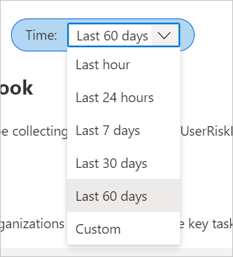

---

title: Identity protection risk analysis workbook in Microsoft Entra ID
description: Learn how to use the identity protection risk analysis workbook.
services: active-directory
author: shlipsey3
manager: amycolannino
ms.service: active-directory
ms.topic: reference
ms.workload: identity
ms.subservice: report-monitor
ms.date: 10/03/2023
ms.author: sarahlipsey
ms.reviewer: chuqiaoshi 

---
# Identity protection risk analysis workbook

Microsoft Entra ID Protection detects, remediates, and prevents compromised identities. As an IT administrator, you want to understand risk trends in your organizations and opportunities for better policy configuration. With the Identity Protection Risky Analysis Workbook, you can answer common questions about your Identity Protection implementation.

This article provides you with an overview of the **Identity Protection Risk Analysis** workbook.

## Description

As an IT administrator, you need to understand trends in identity risks and gaps in your policy implementations, to ensure you're best protecting your organizations from identity compromise. The identity protection risk analysis workbook helps you analyze the state of risk in your organization.

**This workbook:**

- Provides visualizations of where in the world risk is being detected.
- Allows you to understand the trends in real time vs. Offline risk detections.
- Provides insight into how effective you are at responding to risky users.

## How to access the workbook

[!INCLUDE [how to access workbooks](~/includes/how-to-access-workbooks.md)]
3. Select the **Identity Protection Risk Analysis** workbook from the **Usage** section.

## Sections

This workbook has five sections:

- Heatmap of risk detections
- Offline vs real-time risk detections
- Risk detection trends
- Risky users
- Summary

## Filters

This workbook supports setting a time range filter.

There are more filters in the risk detection trends and risky users sections. 

Risk Detection Trends:

- Detection timing type (real-time or offline)
- Risk level (low, medium, high, or none)

Risky Users:

- Risk detail (which indicates what changed a user’s risk level)
- Risk level (low, medium, high, or none)

## Best practices

- **[Enable risky sign-in policies](~/id-protection/concept-identity-protection-policies.md#sign-in-risk-based-conditional-access-policy)** - To prompt for multifactor authentication (MFA) on medium risk or higher. Enabling the policy reduces the proportion of active real-time risk detections by allowing legitimate users to self-remediate the risk detections with MFA.

- **[Enable a risky user policy](~/id-protection/howto-identity-protection-configure-risk-policies.md#user-risk-policy-in-conditional-access)** - To enable users to securely remediate their accounts when they're considered high risk. Enabling the policy reduces the number of active at-risk users in your organization by returning the user’s credentials to a safe state.

- To learn more about identity protection, see [What is identity protection](~/id-protection/overview-identity-protection.md). 

- For more information about Microsoft Entra workbooks, see [How to use Microsoft Entra workbooks](./howto-use-workbooks.md).
