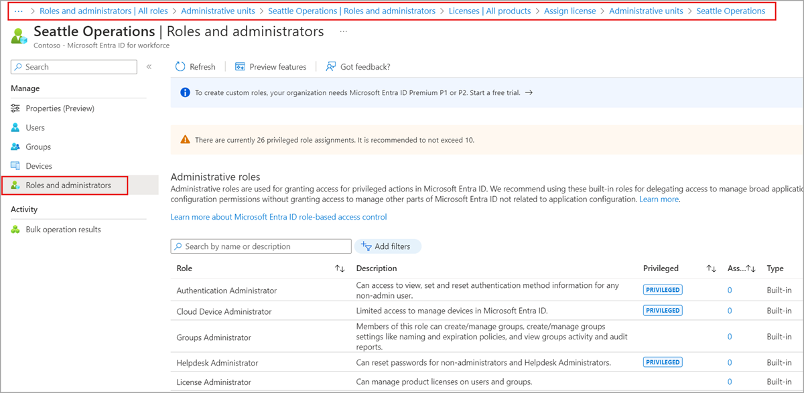

# Assign scoped roles to an administrative unit

In Azure Active Directory (Azure AD), you can assign users to an Azure AD role with a scope that's limited to one or more administrative units for more granular administrative control.

For steps to prepare to use PowerShell and Microsoft Graph for administrative unit management, see [Get started](admin-units-manage.md#get-started).

## Available roles

Role  |  Description
----- |  -----------
Authentication Administrator  |  Has access to view, set, and reset authentication method information for any non-admin user in the assigned administrative unit only.
Groups Administrator  |  Can manage all aspects of groups and groups settings, such as naming and expiration policies, in the assigned administrative unit only.
Helpdesk Administrator  |  Can reset passwords for non-administrators and Helpdesk administrators in the assigned administrative unit only.
License Administrator  |  Can assign, remove, and update license assignments within the administrative unit only.
Password Administrator  |  Can reset passwords for non-administrators and Password Administrators within the assigned administrative unit only.
User Administrator  |  Can manage all aspects of users and groups, including resetting passwords for limited admins within the assigned administrative unit only.

## Security principals that can be assigned to a scoped role

The following security principals can be assigned to a role with an administrative unit scope:

* Users
* Role-assignable cloud groups (preview)
* Service Principal Name (SPN)

## Assign a scoped role

You can assign a scoped role by using the Azure portal, PowerShell, or Microsoft Graph.

### Use the Azure portal

1. In the Azure portal, go to **Azure AD**, and then select **Administrative units**. 

1. Select the administrative unit over which you want to assign the role to a user. 

1. On the left pane, select **Roles and administrators** to list all the available roles.

   

1. Select the role to be assigned, and then select **Add assignments**. 

1. On the **Add assignments** pane, select one or more users to be assigned to the role.

   

> [!Note]
> To assign a role on an administrative unit using Azure AD Privileged Identity Management(PIM), see [Assign Azure AD roles in PIM](../privileged-identity-management/pim-how-to-add-role-to-user.md?tabs=new#assign-a-role-with-restricted-scope).

### Use PowerShell

```powershell
$AdminUser = Get-AzureADUser -ObjectId "Use the user's UPN, who would be an admin on this unit"
$Role = Get-AzureADDirectoryRole | Where-Object -Property DisplayName -EQ -Value "User Account Administrator"
$administrativeUnit = Get-AzureADMSAdministrativeUnit -Filter "displayname eq 'The display name of the unit'"
$RoleMember = New-Object -TypeName Microsoft.Open.AzureAD.Model.RoleMemberInfo
$RoleMember.ObjectId = $AdminUser.ObjectId
Add-AzureADMSScopedRoleMembership -ObjectId $administrativeUnit.ObjectId -RoleObjectId $Role.ObjectId -RoleMemberInfo $RoleMember
```

You can change the highlighted section as required for the specific environment.

### Use Microsoft Graph

```http
Http request
POST /directory/administrativeUnits/{id}/scopedRoleMembers
    
Request body
{
  "roleId": "roleId-value",
  "roleMemberInfo": {
    "id": "id-value"
  }
}
```

## List the scoped admins on an administrative unit

You can list scoped admins by using the Azure portal, PowerShell, or Microsoft Graph.

### Use the Azure portal

You can view all the role assignments done with an administrative unit scope in the [Administrative units section of Azure AD](https://ms.portal.azure.com/?microsoft_aad_iam_adminunitprivatepreview=true&microsoft_aad_iam_rbacv2=true#blade/Microsoft_AAD_IAM/ActiveDirectoryMenuBlade/AdminUnit). 

1. In the Azure portal, go to **Azure AD**, and then select **Administrative units**.

1. Select the administrative unit for the role assignments you want to list. 

1. Select **Roles and administrators**, and then open a role to view the assignments in the administrative unit.

### Use PowerShell

```powershell
$administrativeUnit = Get-AzureADMSAdministrativeUnit -Filter "displayname eq 'The display name of the unit'"
Get-AzureADMSScopedRoleMembership -ObjectId $administrativeUnit.ObjectId | fl *
```

You can change the highlighted section as required for the specific environment.

### Use Microsoft Graph

```http
Http request
GET /directory/administrativeUnits/{id}/scopedRoleMembers
Request body
{}
```

## Next steps

- [Use cloud groups to manage role assignments](groups-concept.md)
- [Troubleshoot roles assigned to cloud groups](groups-faq-troubleshooting.md)
