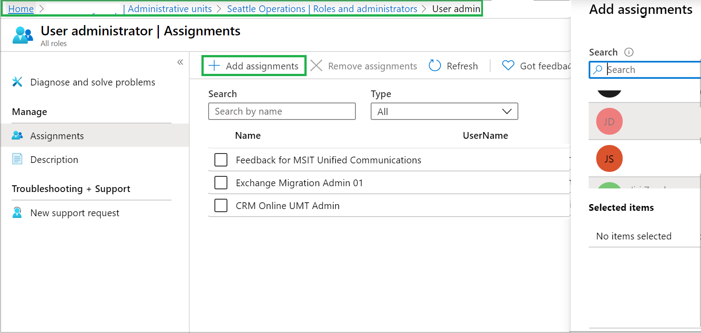

# Assign scoped roles to an administrative unit

In Azure Active Directory (Azure AD), for more granular administrative control, you can assign users to an Azure AD role with a scope that's limited to one or more administrative units.

## Prerequisites

- AzureAD module

For more information, see [Prerequisites to use PowerShell or Graph Explorer](prerequisites.md).


## Available roles

Role  |  Description
----- |  -----------
Authentication Administrator  |  Has access to view, set, and reset authentication method information for any non-admin user in the assigned administrative unit only.
Groups Administrator  |  Can manage all aspects of groups and groups settings, such as naming and expiration policies, in the assigned administrative unit only.
Helpdesk Administrator  |  Can reset passwords for non-administrators and Helpdesk administrators in the assigned administrative unit only.
License Administrator  |  Can assign, remove, and update license assignments within the administrative unit only.
Password Administrator  |  Can reset passwords for non-administrators and Password Administrators within the assigned administrative unit only.
User Administrator  |  Can manage all aspects of users and groups, including resetting passwords for limited admins within the assigned administrative unit only.

## Security principals that can be assigned to a scoped role

The following security principals can be assigned to a role with an administrative unit scope:

* Users
* Role-assignable cloud groups (preview)
* Service Principal Name (SPN)

## Assign a scoped role

You can assign a scoped role by using the Azure portal, PowerShell, or Microsoft Graph.

### Azure portal

1. In the Azure portal, go to **Azure AD**.

1. Select **Administrative units**, and then select the administrative unit that you want to assign a user role scope to. 

1. On the left pane, select **Roles and administrators** to list all the available roles.

   

1. Select the role to be assigned, and then select **Add assignments**. 

1. On the **Add assignments** pane, select one or more users to be assigned to the role.

   

> [!Note]
> To assign a role on an administrative unit by using Azure AD Privileged Identity Management (PIM), see [Assign Azure AD roles in PIM](../privileged-identity-management/pim-how-to-add-role-to-user.md?tabs=new#assign-a-role-with-restricted-scope).

### PowerShell

```powershell
$adminUser = Get-AzureADUser -ObjectId "Use the user's UPN, who would be an admin on this unit"
$role = Get-AzureADDirectoryRole | Where-Object -Property DisplayName -EQ -Value "User Administrator"
$adminUnitObj = Get-AzureADMSAdministrativeUnit -Filter "displayname eq 'The display name of the unit'"
$roleMember = New-Object -TypeName Microsoft.Open.MSGraph.Model.MsRoleMemberInfo
$roleMember.Id = $adminUser.ObjectId
Add-AzureADMSScopedRoleMembership -Id $adminUnitObj.Id -RoleId $role.ObjectId -RoleMemberInfo $roleMember
```

You can change the highlighted section as required for the specific environment.

### Microsoft Graph API

Request

```http
POST /directory/administrativeUnits/{admin-unit-id}/scopedRoleMembers
```
    
Body

```http
{
  "roleId": "roleId-value",
  "roleMemberInfo": {
    "id": "id-value"
  }
}
```

## View a list of the scoped admins in an administrative unit

You can view a list of scoped admins by using the Azure portal, PowerShell, or Microsoft Graph.

### Azure portal

You can view all the role assignments created with an administrative unit scope in the [Administrative units section of Azure AD](https://ms.portal.azure.com/?microsoft_aad_iam_adminunitprivatepreview=true&microsoft_aad_iam_rbacv2=true#blade/Microsoft_AAD_IAM/ActiveDirectoryMenuBlade/AdminUnit). 

1. In the Azure portal, go to **Azure AD**.

1. In the left pane, select **Administrative units**, and then select the administrative unit for the list of role assignments you want to view. 

1. Select **Roles and administrators**, and then open a role to view the assignments in the administrative unit.

### PowerShell

```powershell
$adminUnitObj = Get-AzureADMSAdministrativeUnit -Filter "displayname eq 'The display name of the unit'"
Get-AzureADMSScopedRoleMembership -Id $adminUnitObj.Id | fl *
```

You can change the highlighted section as required for your specific environment.

### Microsoft Graph API

Request

```http
GET /directory/administrativeUnits/{admin-unit-id}/scopedRoleMembers
```

Body

```http
{}
```

## Next steps

- [Use cloud groups to manage role assignments](groups-concept.md)
- [Troubleshoot roles assigned to cloud groups](groups-faq-troubleshooting.md)
