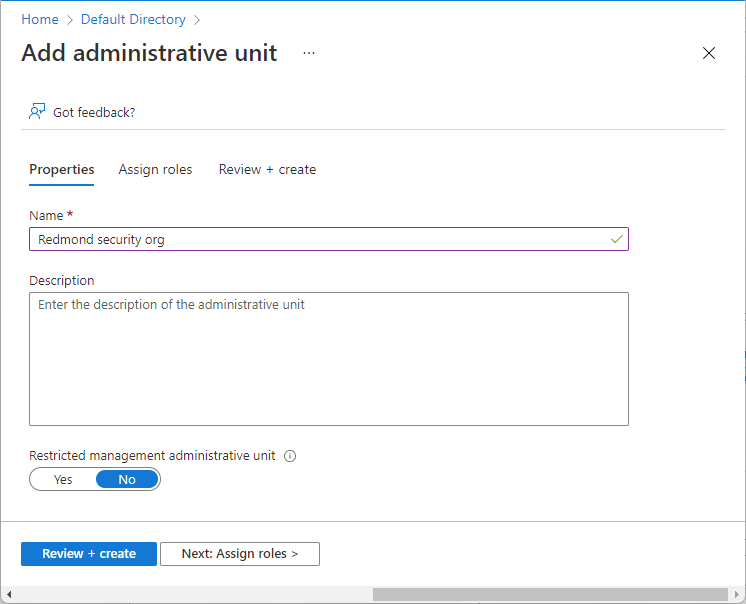

# Create or delete administrative units

Administrative units let you subdivide your organization into any unit that you want, and then assign specific administrators that can manage only the members of that unit. For example, you could use administrative units to delegate permissions to administrators of each school at a large university, so they could control access, manage users, and set policies only in the School of Engineering.

This article describes how to create or delete administrative units to restrict the scope of role permissions in Azure Active Directory (Azure AD).

## Prerequisites

- Azure AD Premium P1 or P2 license for each administrative unit administrator
- Azure AD Free licenses for administrative unit members
- Privileged Role Administrator or Global Administrator
- AzureAD module when using PowerShell
- Admin consent when using Graph explorer for Microsoft Graph API

For more information, see [Prerequisites to use PowerShell or Graph Explorer](prerequisites.md).

## Create an administrative unit

You can create a new administrative unit by using either the Azure portal, PowerShell or Microsoft Graph.

### Azure portal

1. Sign in to the [Azure portal](https://portal.azure.com) or [Azure AD admin center](https://aad.portal.azure.com).

1. Select **Azure Active Directory** > **Administrative units**.

    

1. Select the **Add** button at the upper part of the pane, and then, in the **Name** box, enter the name of the administrative unit. Optionally, add a description of the administrative unit.

    

1. Select the blue **Add** button to finalize the administrative unit.

### PowerShell

Use the [New-AzureADMSAdministrativeUnit](/powershell/module/azuread/new-azureadmsadministrativeunit) command to create a new administrative unit.

```powershell
New-AzureADMSAdministrativeUnit -Description "West Coast region" -DisplayName "West Coast"
```

### Microsoft Graph API

Use the [Create administrativeUnit](/graph/api/administrativeunit-post-administrativeunits) API to create a new administrative unit.

Request

```http
POST https://graph.microsoft.com/v1.0/directory/administrativeUnits
```

Body

```http
{
  "displayName": "North America Operations",
  "description": "North America Operations administration"
}
```

## Delete an administrative unit

In Azure AD, you can delete an administrative unit that you no longer need as a unit of scope for administrative roles.

### Azure portal

1. Sign in to the [Azure portal](https://portal.azure.com) or [Azure AD admin center](https://aad.portal.azure.com).

1. Select **Azure Active Directory** > **Administrative units**.
 
1. Select the administrative unit to be deleted, and then select **Delete**.

1. To confirm that you want to delete the administrative unit, select **Yes**. The administrative unit is deleted.

    

### PowerShell

Use the [Remove-AzureADMSAdministrativeUnit](/powershell/module/azuread/remove-azureadmsadministrativeunit) command to delete an administrative unit.

```powershell
$adminUnitObj = Get-AzureADMSAdministrativeUnit -Filter "displayname eq 'DeleteMe Admin Unit'"
Remove-AzureADMSAdministrativeUnit -Id $adminUnitObj.Id
```

### Microsoft Graph API

Use the [Delete administrativeUnit](/graph/api/administrativeunit-delete) API to delete an administrative unit.

```http
DELETE https://graph.microsoft.com/v1.0/directory/administrativeUnits/{admin-unit-id}
```

## Next steps

- [Add users, groups, or devices to an administrative unit](admin-units-members-add.md)
- [Assign Azure AD roles with administrative unit scope](admin-units-assign-roles.md)
