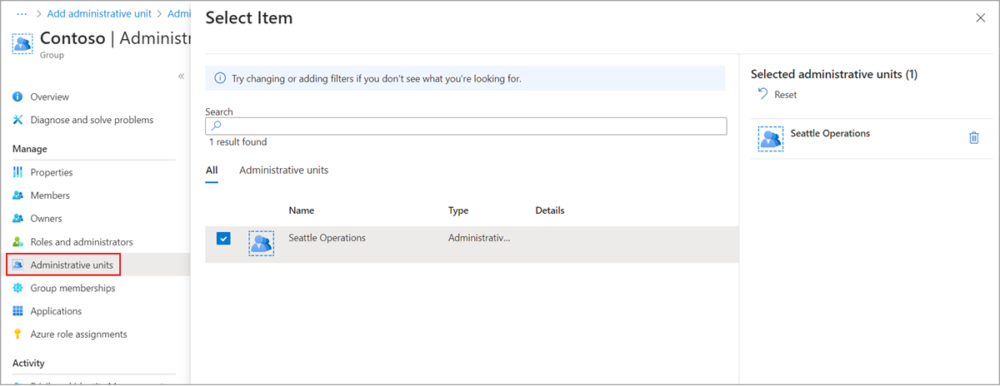
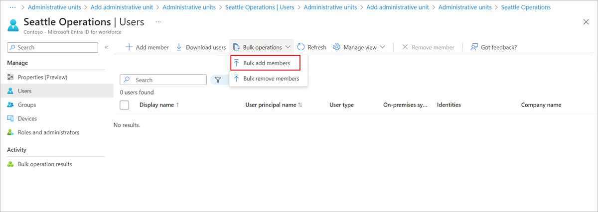

# Add users or groups to an administrative unit

In Azure Active Directory (Azure AD), you can add users or groups to an administrative unit to restrict the scope of role permissions. For additional details on what administrative unit members can do, see [Administrative units in Azure Active Directory](administrative-units.md).

## Prerequisites

- Azure AD Premium P1 or P2 license for each administrative unit administrator
- Azure AD Free licenses for administrative unit members
- Privileged Role Administrator or Global Administrator
- AzureAD module when using PowerShell
- Admin consent when using Graph explorer for Microsoft Graph API

For more information, see [Prerequisites to use PowerShell or Graph Explorer](prerequisites.md).

## Azure portal

You can add users or groups to administrative units using the Azure portal. You can also add users in a bulk operation.

### Add a single user or group to administrative units

1. Sign in to the [Azure portal](https://portal.azure.com) or [Azure AD admin center](https://aad.portal.azure.com).

1. Select **Azure Active Directory**.

1. Select **Users** or **Groups** and then select the user or group you want to add to an administrative unit.

1. Select **Administrative units**. 

1. Select **Assign to administrative unit**.

1. In the **Select** pane, select the administrative units and then select **Select**.

    

### Add users or groups to a single administrative unit

1. Sign in to the [Azure portal](https://portal.azure.com) or [Azure AD admin center](https://aad.portal.azure.com).

1. Select **Azure Active Directory**.

1. Select **Administrative units** and then select the administrative unit that you want to add users or groups to.

1. Select **Users** or **Groups**.

1. Select **Add member** or **Add**.

1. In the **Select** pane, select the users or groups you want to add to the administrative unit and then select **Select**.

    

### Add users to an administrative unit in a bulk operation

1. Sign in to the [Azure portal](https://portal.azure.com) or [Azure AD admin center](https://aad.portal.azure.com).

1. Select **Azure Active Directory**.

1. Select **Administrative units** and then select the administrative unit that you want to add users to.

1. Select the administrative unit to which you want to add users.

1. Select **Users** > **Bulk operations** > **Bulk add members**.

   

1. In the **Bulk add members** pane, download the comma-separated values (CSV) template.

1. Edit the downloaded CSV template with the list of users you want to add.

    Add one user principal name (UPN) in each row. Don't remove the first two rows of the template.

1. Save your changes and upload the CSV file.

   

1. Select **Submit**.

## PowerShell

Use the [Add-AzureADMSAdministrativeUnitMember](/powershell/module/azuread/add-azureadmsadministrativeunitmember) command to add users or groups to an administrative unit.

### Add users to an administrative unit

```powershell
$adminUnitObj = Get-AzureADMSAdministrativeUnit -Filter "displayname eq 'Test administrative unit 2'"
$userObj = Get-AzureADUser -Filter "UserPrincipalName eq 'bill@example.com'"
Add-AzureADMSAdministrativeUnitMember -Id $adminUnitObj.Id -RefObjectId $userObj.ObjectId
```

### Add groups to an administrative unit

```powershell
$adminUnitObj = Get-AzureADMSAdministrativeUnit -Filter "displayname eq 'Test administrative unit 2'"
$groupObj = Get-AzureADGroup -Filter "displayname eq 'TestGroup'"
Add-AzureADMSAdministrativeUnitMember -Id $adminUnitObj.Id -RefObjectId $groupObj.ObjectId
```

## Microsoft Graph API

Use the [Add a member](/graph/api/administrativeunit-post-members) API to add users or groups to an administrative unit.

### Add users to an administrative unit

Request

```http
POST https://graph.microsoft.com/v1.0/directory/administrativeUnits/{admin-unit-id}/members/$ref
```

Body

```http
{
  "@odata.id":"https://graph.microsoft.com/v1.0/users/{user-id}"
}
```

Example

```http
{
  "@odata.id":"https://graph.microsoft.com/v1.0/users/john@example.com"
}
```

### Add groups to an administrative unit

Request

```http
POST https://graph.microsoft.com/v1.0/directory/administrativeUnits/{admin-unit-id}/members/$ref
```

Body

```http
{
"@odata.id":"https://graph.microsoft.com/v1.0/groups/{group-id}"
}
```

Example

```http
{
"@odata.id":"https://graph.microsoft.com/v1.0/groups/871d21ab-6b4e-4d56-b257-ba27827628f3"
}
```

## Next steps

- [Administrative units in Azure Active Directory](administrative-units.md)
- [Assign Azure AD roles with administrative unit scope](admin-units-assign-roles.md)
- [Remove users or groups from an administrative unit](admin-units-members-remove.md)
