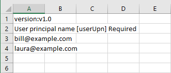

# Remove users or groups from an administrative unit

When users or groups no longer need access, you can remove users or groups from an administrative unit.

## Prerequisites

- Azure AD Premium P1 or P2 license for each administrative unit administrator
- Azure AD Free licenses for administrative unit members
- Privileged Role Administrator or Global Administrator
- AzureAD module when using PowerShell
- Admin consent when using Graph explorer for Microsoft Graph API

For more information, see [Prerequisites to use PowerShell or Graph Explorer](prerequisites.md).

## Azure portal

You can remove users or groups from administrative units individually using the Azure portal. You can also remove users in a bulk operation.

### Remove a single user or group from administrative units

1. Sign in to the [Azure portal](https://portal.azure.com) or [Azure AD admin center](https://aad.portal.azure.com).

1. Select **Azure Active Directory**.

1. Select **Users** or **Groups** and then select the user or group you want to remove from an administrative unit.

1. Select **Administrative units**.

1. Add check marks next to the administrative units you want to remove the user or group from.

1. Select **Remove from administrative unit**.

    

### Remove users or groups from an administrative unit

1. Sign in to the [Azure portal](https://portal.azure.com) or [Azure AD admin center](https://aad.portal.azure.com).

1. Select **Azure Active Directory**.

1. Select **Administrative units** and then select the administrative unit that you want to remove users or groups from.

1. Select **Users** or **Groups**.

1. Add check marks next to the users or groups you want to remove.

1. Select **Remove member** or **Remove**.

    

### Remove users from an administrative unit in a bulk operation

1. Sign in to the [Azure portal](https://portal.azure.com) or [Azure AD admin center](https://aad.portal.azure.com).

1. Select **Azure Active Directory**.

1. Select **Administrative units** and then select the administrative unit that you want to remove users from.

1. Select **Users** > **Bulk operations** > **Bulk remove members**.

   

1. In the **Bulk remove members** pane, download the comma-separated values (CSV) template.

1. Edit the downloaded CSV template with the list of users you want to remove.

    Add one user principal name (UPN) in each row. Don't remove the first two rows of the template.

1. Save your changes and upload the CSV file.

   

1. Select **Submit**.

## PowerShell

Use the [Remove-AzureADMSAdministrativeUnitMember](/powershell/module/azuread/remove-azureadmsadministrativeunitmember) command to remove users or groups from an administrative unit.

### Remove users from an administrative unit

```powershell
$adminUnitObj = Get-AzureADMSAdministrativeUnit -Filter "displayname eq 'Test administrative unit 2'"
$userObj = Get-AzureADUser -Filter "UserPrincipalName eq 'bill@example.com'"
Remove-AzureADMSAdministrativeUnitMember -Id $adminUnitObj.Id -MemberId $userObj.ObjectId
```

### Remove groups from an administrative unit

```powershell
$adminUnitObj = Get-AzureADMSAdministrativeUnit -Filter "displayname eq 'Test administrative unit 2'"
$groupObj = Get-AzureADGroup -Filter "displayname eq 'TestGroup'"
Remove-AzureADMSAdministrativeUnitMember -Id $adminUnitObj.Id -MemberId $groupObj.ObjectId
```

## Microsoft Graph API

Use the [Remove a member](/graph/api/administrativeunit-delete-members) API to remove users or groups from an administrative unit.

### Remove users from an administrative unit

Request

```http
DELETE https://graph.microsoft.com/v1.0/directory/administrativeUnits/{admin-unit-id}/members/{user-id}/$ref
```

### Remove groups from an administrative unit

Request

```http
DELETE https://graph.microsoft.com/v1.0/directory/administrativeUnits/{admin-unit-id}/members/{group-id}/$ref
```

## Next steps

- [Assign a role to an administrative unit](admin-units-assign-roles.md)
- [Add groups to an administrative unit](admin-units-add-manage-groups.md)
