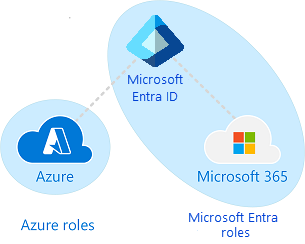
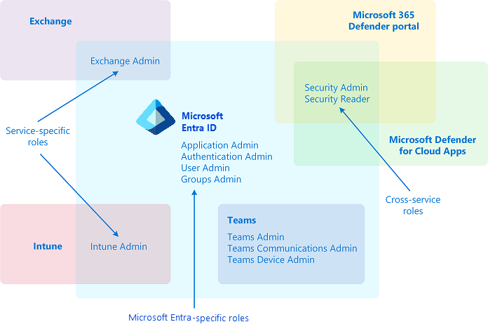

# Understand roles in Microsoft Entra ID

There are about 60 Microsoft Entra built-in roles, which are roles with a fixed set of role permissions. To supplement the built-in roles, Microsoft Entra ID also supports custom roles. Use custom roles to select the role permissions that you want. For example, you could create one to manage particular Microsoft Entra resources such as applications or service principals.

This article explains what Microsoft Entra roles are and how they can be used.

## How Microsoft Entra roles are different from other Microsoft 365 roles

There are many different services in Microsoft 365, such as Microsoft Entra ID and Intune. Some of these services have their own role-based access control systems, specifically:

- Microsoft Entra ID
- Microsoft Exchange
- Microsoft Intune
- Microsoft Defender for Cloud Apps
- Microsoft 365 Defender portal
- Compliance portal
- Cost Management + Billing

Other services such as Teams, SharePoint, and Managed Desktop don’t have separate role-based access control systems. They use Microsoft Entra roles for their administrative access. Azure has its own role-based access control system for Azure resources such as virtual machines, and this system is not the same as Microsoft Entra roles.

When we say separate role-based access control system. it means there is a different data store where role definitions and role assignments are stored. Similarly, there is a different policy decision point where access checks happen. For more information, see [Roles for Microsoft 365 services in Microsoft Entra ID](m365-workload-docs.md) and [Azure roles, Microsoft Entra roles, and classic subscription administrator roles](/azure/role-based-access-control/rbac-and-directory-admin-roles).

## Why some Microsoft Entra roles are for other services

Microsoft 365 has a number of role-based access control systems that developed independently over time, each with its own service portal. To make it convenient for you to manage identity across Microsoft 365 from the Microsoft Entra admin center, we have added some service-specific built-in roles, each of which grants administrative access to a Microsoft 365 service. An example of this addition is the Exchange Administrator role in Microsoft Entra ID. This role is equivalent to the [Organization Management role group](/exchange/organization-management-exchange-2013-help) in the Exchange role-based access control system, and can manage all aspects of Exchange. Similarly, we added the Intune Administrator role, Teams Administrator, SharePoint Administrator, and so on. Service-specific roles is one category of Microsoft Entra built-in roles in the following section.

## Categories of Microsoft Entra roles

Microsoft Entra built-in roles differ in where they can be used, which fall into the following three broad categories.

- **Microsoft Entra ID-specific roles**: These roles grant permissions to manage resources within Microsoft Entra-only. For example, User Administrator, Application Administrator, Groups Administrator all grant permissions to manage resources that live in Microsoft Entra ID.
- **Service-specific roles**: For major Microsoft 365 services (non-Azure AD), we have built service-specific roles that grant permissions to manage all features within the service.  For example, Exchange Administrator, Intune Administrator, SharePoint Administrator, and Teams Administrator roles can manage features with their respective services. Exchange Administrator can manage mailboxes, Intune Administrator can manage device policies, SharePoint Administrator can manage site collections, Teams Administrator can manage call qualities and so on.
- **Cross-service roles**: There are some roles that span services. We have two global roles - Global Administrator and Global Reader. All Microsoft 365 services honor these two roles. Also, there are some security-related roles like Security Administrator and Security Reader that grant access across multiple security services within Microsoft 365. For example, using Security Administrator roles in Microsoft Entra ID, you can manage Microsoft 365 Defender portal, Microsoft Defender Advanced Threat Protection, and Microsoft Defender for Cloud Apps. Similarly, in the Compliance Administrator role you can manage Compliance-related settings in Compliance portal, Exchange, and so on.

The following table is offered as an aid to understanding these role categories. The categories are named arbitrarily, and aren't intended to imply any other capabilities beyond the [documented Microsoft Entra role permissions](permissions-reference.md).

Category | Role
---- | ----
Microsoft Entra ID-specific roles | Application Administrator Application Developer Authentication Administrator B2C IEF Keyset Administrator B2C IEF Policy Administrator Cloud Application Administrator Cloud Device Administrator Conditional Access Administrator Device Administrators Directory Readers Directory Synchronization Accounts Directory Writers External ID User Flow Administrator External ID User Flow Attribute Administrator External Identity Provider Administrator Groups Administrator Guest Inviter Helpdesk Administrator Hybrid Identity Administrator License Administrator Partner Tier1 Support Partner Tier2 Support Password Administrator Privileged Authentication Administrator Privileged Role Administrator Reports Reader User Administrator
Cross-service roles | Global Administrator Compliance Administrator Compliance Data Administrator Global Reader Security Administrator Security Operator Security Reader Service Support Administrator
Service-specific roles | Azure DevOps Administrator Azure Information Protection Administrator Billing Administrator CRM Service Administrator Customer Lockbox Access Approver Desktop Analytics Administrator Exchange Service Administrator Insights Administrator Insights Business Leader Intune Service Administrator Kaizala Administrator Lync Service Administrator Message Center Privacy Reader Message Center Reader Modern Commerce Administrator Network Administrator Office Apps Administrator Power BI Service Administrator Power Platform Administrator Printer Administrator Printer Technician Search Administrator Search Editor SharePoint Service Administrator Teams Communications Administrator Teams Communications Support Engineer Teams Communications Support Specialist Teams Devices Administrator Teams Administrator

## Next steps

- [Overview of Microsoft Entra role-based access control](custom-overview.md)
- [Create and assign a custom role in Microsoft Entra ID](custom-create.YML)
- [List role assignments](view-assignments.md)
