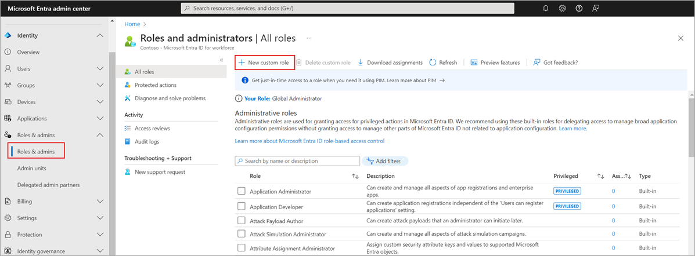
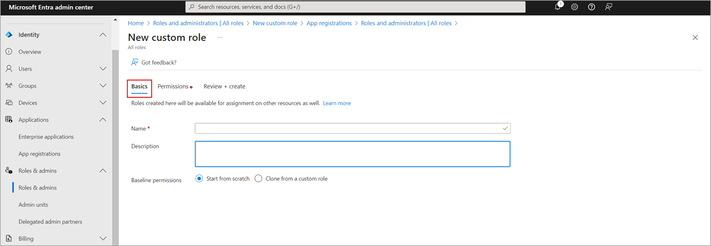
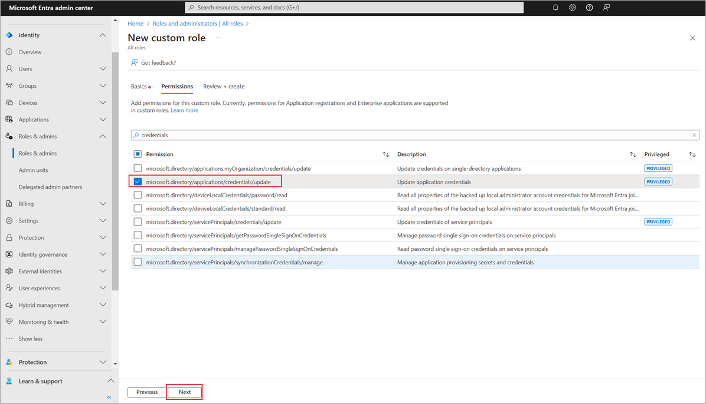
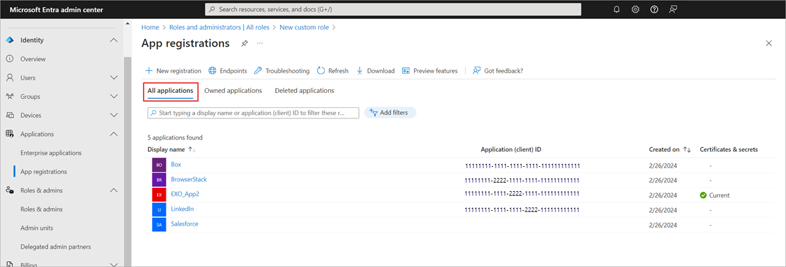

# Create and assign a custom role in Microsoft Entra ID

This article describes how to create new custom roles in Microsoft Entra ID. For the basics of custom roles, see the [custom roles overview](custom-overview.md). The role can be assigned either at the directory-level scope or an app registration resource scope only.

Custom roles can be created in the **Roles and administrators** page of the Microsoft Entra admin center.

## Prerequisites

- Microsoft Entra ID P1 or P2 license
- Privileged Role Administrator or Global Administrator
- Microsoft.Graph module when using PowerShell
- Admin consent when using Graph explorer for Microsoft Graph API

For more information, see [Prerequisites to use PowerShell or Graph Explorer](prerequisites.md).

## Create a role in the Microsoft Entra admin center

### Create a new custom role to grant access to manage app registrations

[!INCLUDE [portal updates](~/includes/portal-update.md)]

1. Sign in to the [Microsoft Entra admin center](https://entra.microsoft.com) as at least a [Privileged Role Administrator](~/identity/role-based-access-control/permissions-reference.md#privileged-role-administrator).

1. Browse to **Identity** > **Roles & admins** > **Roles & admins**.

1. Select **New custom role**.

   

1. On the **Basics** tab, provide a name and description for the role and then click **Next**.

   

1. On the **Permissions** tab, select the permissions necessary to manage basic properties and credential properties of app registrations. For a detailed description of each permission, see [Application registration subtypes and permissions in Microsoft Entra ID](custom-available-permissions.md).
   1. First, enter "credentials" in the search bar and select the `microsoft.directory/applications/credentials/update` permission.

      

   1. Next, enter "basic" in the search bar, select the `microsoft.directory/applications/basic/update` permission, and then click **Next**.
1. On the **Review + create** tab, review the permissions and select **Create**.

Your custom role will show up in the list of available roles to assign.

## Create a role using PowerShell

### Sign in

Use the [Connect-MgGraph](/powershell/module/microsoft.graph.authentication/connect-mggraph) command to sign in to your tenant.

``` PowerShell
Connect-MgGraph -Scopes "RoleManagement.ReadWrite.Directory"
```

### Create the custom role

Create a new role using the following PowerShell script:

``` PowerShell
# Basic role information
$displayName = "Application Support Administrator"
$description = "Can manage basic aspects of application registrations."
$templateId = (New-Guid).Guid
 
# Set of permissions to grant
$allowedResourceAction =
@(
    "microsoft.directory/applications/basic/update",
    "microsoft.directory/applications/credentials/update"
)
$rolePermissions = @(@{AllowedResourceActions= $allowedResourceAction})
 
# Create new custom admin role
$customAdmin = New-MgRoleManagementDirectoryRoleDefinition -RolePermissions $rolePermissions -DisplayName $displayName -IsEnabled -Description $description -TemplateId $templateId
```

### Assign the custom role using PowerShell

Assign the role using the below PowerShell script:

``` PowerShell
# Get the user and role definition you want to link
$user = Get-MgUser -Filter "userPrincipalName eq 'cburl@f128.info'"
$roleDefinition = Get-MgRoleManagementDirectoryRoleDefinition -Filter "DisplayName eq 'Application Support Administrator'"

# Get app registration and construct resource scope for assignment.
$appRegistration = Get-MgApplication -Filter "Displayname eq 'POSTMAN'"
$resourceScope = '/' + $appRegistration.objectId

# Create a scoped role assignment
$roleAssignment = New-MgRoleManagementDirectoryRoleAssignment -DirectoryScopeId $resourcescope -RoleDefinitionId $roledefinition.Id -PrincipalId $user.Id
```

## Create a role with the Microsoft Graph API

1. Use the [Create unifiedRoleDefinition](/graph/api/rbacapplication-post-roledefinitions) API to create a custom role.

    ``` HTTP
    POST https://graph.microsoft.com/v1.0/roleManagement/directory/roleDefinitions
    ```

    Body

    ``` HTTP
    {
       "description": "Can manage basic aspects of application registrations.",
       "displayName": "Application Support Administrator",
       "isEnabled": true,
       "templateId": "<GUID>",
       "rolePermissions": [
           {
               "allowedResourceActions": [
                   "microsoft.directory/applications/basic/update",
                   "microsoft.directory/applications/credentials/update"
               ]
           }
       ]
    }
    ```

    > [!Note]
    > The `"templateId": "GUID"` is an optional parameter that's sent in the body depending on the requirement. If you have a requirement to create multiple different custom roles with common parameters, it's best to create a template and define a `templateId` value. You can generate a `templateId` value beforehand by using the PowerShell cmdlet `(New-Guid).Guid`. 

1. Use the [Create unifiedRoleAssignment](/graph/api/rbacapplication-post-roleassignments) API to assign the custom role.

    ```http
    POST https://graph.microsoft.com/v1.0/roleManagement/directory/roleAssignments
    ```

    Body

    ```http
    {
        "principalId":"<GUID OF USER>",
        "roleDefinitionId":"<GUID OF ROLE DEFINITION>",
        "directoryScopeId":"/<GUID OF APPLICATION REGISTRATION>"
    }
    ```

## Assign a custom role scoped to a resource

Like built-in roles, custom roles are assigned by default at the default organization-wide scope to grant access permissions over all app registrations in your organization. Additionally, custom roles and some relevant built-in roles (depending on the type of Microsoft Entra resource) can also be assigned at the scope of a single Microsoft Entra resource. This allows you to give the user the permission to update credentials and basic properties of a single app without having to create a second custom role.

1. Sign in to the [Microsoft Entra admin center](https://entra.microsoft.com) as at least a [Application Developer](~/identity/role-based-access-control/permissions-reference.md#application-developer).

1. Browse to **Identity** > **Applications** > **App registrations**.

1. Select the app registration to which you are granting access to manage. You might have to select **All applications** to see the complete list of app registrations in your Microsoft Entra organization.

    

1. In the app registration, select **Roles and administrators**. If you haven't already created one, instructions are in the [preceding procedure](#create-a-new-custom-role-to-grant-access-to-manage-app-registrations).

1. Select the role to open the **Assignments** page.

1. Select **Add assignment** to add a user. The user will be granted any permissions over only the selected app registration.

## Next steps

- Feel free to share with us on the [Microsoft Entra administrative roles forum](https://feedback.azure.com/d365community/forum/22920db1-ad25-ec11-b6e6-000d3a4f0789).
- For more about role permissions, see [Microsoft Entra built-in roles](permissions-reference.md).
- For default user permissions, see a [comparison of default guest and member user permissions](~/fundamentals/users-default-permissions.md?context=azure/active-directory/roles/context/ugr-context).
