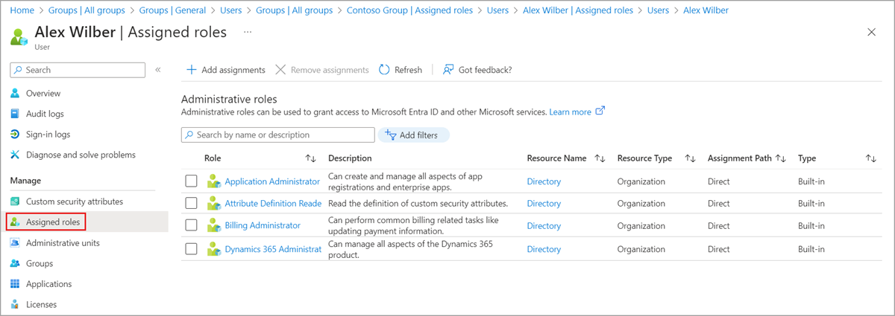
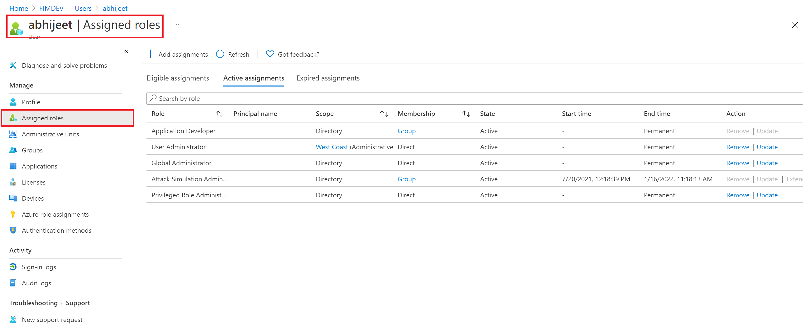

# List Azure AD role assignments for a user

A role can be assigned to a user directly or transitively via a group. This article describes how to list the Azure AD roles assigned to a user. For information about assigning roles to groups, see [Use Azure AD groups to manage role assignments](groups-concept.md).

## Prerequisites

- AzureADPreview module when using PowerShell
- Microsoft.Graph module when using PowerShell
- Admin consent when using Graph explorer for Microsoft Graph API

For more information, see [Prerequisites to use PowerShell or Graph Explorer](prerequisites.md).

## Azure portal
Follow these steps to list Azure AD roles for a user using the Azure portal. Your experience will be different depending on whether you have [Azure AD Privileged Identity Management (PIM)](../privileged-identity-management/pim-configure.md) enabled.

1. Sign in to the [Azure portal](https://portal.azure.com) or [Azure AD admin center](https://aad.portal.azure.com).

2. Select **Azure Active Directory** > **Users** > *user name* > **Assigned roles**.

    You can see the list of roles assigned to the user at different scopes. Additionally, you can see whether the role has been assigned directly or via group.
    
    

    If you have a Premium P2 license, you will see the PIM experience, which has eligible, active, and expired role assignment details.

    

## PowerShell

Follow these steps to list Azure AD roles assigned to a user using PowerShell.

1. Install AzureADPreview and Microsoft.Graph module using [Install-module](/powershell/azure/active-directory/install-adv2.md).
  
    ```powershell
    Install-module -name AzureADPreview
    Install-module -name Microsoft.Graph
    ```
  
2. Open a PowerShell window and use [Import-Module](/powershell/module/microsoft.powershell.core/import-module.md) to import the AzureADPreview module. For more information, see [Prerequisites to use PowerShell or Graph Explorer](prerequisites.md).

    ```powershell
    Import-Module -Name AzureADPreview -Force
    ```

3. In a PowerShell window, use [Connect-AzureAD](/powershell/module/azuread/connect-azuread.md) to sign in to your tenant.

    ```powershell
    Connect-AzureAD
    ```
4. Use [Get-AzureADMSRoleAssignment](/powershell/module/azuread/get-azureadmsroleassignment.md) to get roles assigned directly to a user.

    ```powershell
    #Get the user
    $userId = (Get-AzureADUser -Filter "userPrincipalName eq 'alice@contoso.com'").ObjectId

    #Get direct role assignments to the user
    $directRoles = (Get-AzureADMSRoleAssignment -Filter "principalId eq '$userId'").RoleDefinitionId
    ```

5. To get transitive roles assigned to the user, use the following cmdlets.
  
    a. Use [Get-AzureADMSGroup](/powershell/module/azuread/get-azureadmsgroup.md) to get the list of all role assignable groups.  
  
      ```powershell
      $roleAssignableGroups = (Get-AzureADMsGroup -All $true | Where-Object IsAssignableToRole -EQ 'True').Id
      ```

    b. Use [Connect-MgGraph](/graph/powershell/get-started.md) to sign into and use Microsoft Graph PowerShell cmdlets.
  
      ```powershell
      Connect-MgGraph -Scopes "User.Read.All”
      ```
  
    c. Use [checkMemberObjects](/graph/api/user-checkmemberobjects.md) API to figure out which of the role assignable groups the user is member of. 
    
      ```powershell
      $uri = "https://graph.microsoft.com/beta/directoryObjects/$userId/microsoft.graph.checkMemberObjects"

      $userRoleAssignableGroups = (Invoke-MgGraphRequest -Method POST -Uri $uri -Body @{"ids"= $roleAssignableGroups}).value
      ```
  
    d. Use [Get-AzureADMSRoleAssignment](/powershell/module/azuread/get-azureadmsroleassignment.md) to loop through the groups and get the roles assigned to them.
  
      ```powershell
      $transitiveRoles=@()
      foreach($item in $userRoleAssignableGroups){
          $transitiveRoles += (Get-AzureADMSRoleAssignment -Filter "principalId eq '$item'").RoleDefinitionId
      }
      ```

6. Combine both direct and transitive role assignments of the user.
  
    ```powershell
    $allRoles = $directRoles + $transitiveRoles
    ```
  
## Microsoft Graph API

Follow these steps to list Azure AD roles assigned to a user using the Microsoft Graph API in [Graph Explorer](https://aka.ms/ge).

1. Sign in to the [Graph Explorer](https://aka.ms/ge).

1. Use [List roleAssignments](/graph/api/rbacapplication-list-roleassignments.md) API to get roles assigned directly to a user. Add following query to the URL and select **Run query**.

   ```HTTP
   GET https://graph.microsoft.com/beta/rolemanagement/directory/roleAssignments?$filter=principalId eq '55c07278-7109-4a46-ae60-4b644bc83a31'
   ```
  
3. To get transitive roles assigned to the user, follow these steps.

    a. Use [List groups](/graph/api/group-list.md) to get the list of all role assignable groups.
  
      ```HTTP
      GET https://graph.microsoft.com/beta/groups?$filter=isAssignableToRole eq true 
      ```
  
    b. Pass this list to [checkMemberObjects](/graph/api/user-checkmemberobjects.md) API to figure out which of the role assignable groups the user is member of. 
    
      ```HTTP
      POST https://graph.microsoft.com/beta/users/55c07278-7109-4a46-ae60-4b644bc83a31/checkMemberObjects
      {
          "ids": [
              "936aec09-47d5-4a77-a708-db2ff1dae6f2",
              "5425a4a0-8998-45ca-b42c-4e00920a6382",
              "ca9631ad-2d2a-4a7c-88b7-e542bd8a7e12",
              "ea3cee12-360e-411d-b0ba-2173181daa76",
              "c3c263bb-b796-48ee-b4d2-3fbc5be5f944"
          ]
      }
      ```
  
    c. Use [List roleAssignments](/graph/api/rbacapplication-list-roleassignments.md) API to loop through the groups and get the roles assigned to them.
  
      ```HTTP
      GET https://graph.microsoft.com/beta/roleManagement/directory/roleAssignments?$filter=principalId eq '5425a4a0-8998-45ca-b42c-4e00920a6382' 
      ```

## Next steps

* [List Azure AD role assignments](view-assignments.md).
* [Assign Azure AD roles to users](manage-roles-portal.md).
* [Assign Azure AD roles to groups](groups-assign-role.md)