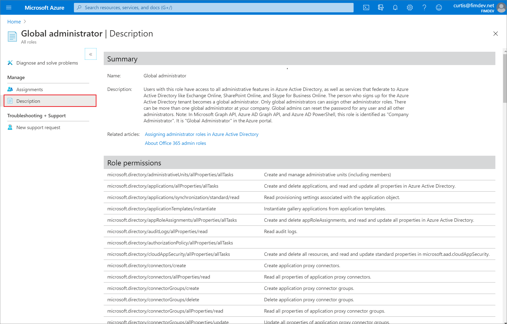

# View and assign administrator roles in Azure Active Directory

You can now see and manage all the members of the administrator roles in the Azure Active Directory portal. If you frequently manage role assignments, you will probably prefer this experience. And if you ever wondered “What the heck do these roles really do?”, you can see a detailed list of permissions for each of the Azure AD administrator roles.

## View all roles

1. Sign in to the [Azure portal](https://portal.azure.com) and select **Azure Active Directory**.

1. Select **Roles and administrators** to see the list of all available roles.

1. Select the ellipsis on the right of each row to see the permissions for the role. Select a role to view the users assigned to the role. If you see something different from the following picture, read the Note in [View assignments for privileged roles](#view-assignments-for-privileged-roles) to verify whether you're in Privileged Identity Management (PIM).

    

## View my roles

It's easy to view your own permissions as well. Select **Your Role** on the **Roles and administrators** page to see the roles that are currently assigned to you.

## View assignments for privileged roles

You can select **Manage in PIM** for additional management capabilities. Privileged Role Administrators can change “Permanent” (always active in the role) assignments to “Eligible” (in the role only when elevated). If you don't have Privileged Identity Management, you can still select **Manage in PIM** to sign up for a trial. Privileged Identity Management requires an [Azure AD Premium P2 license plan](../privileged-identity-management/subscription-requirements.md).

If you are a Global Administrator or a Privileged Role Administrator, you can easily add or remove members, filter the list, or select a member to see their active assigned roles.

> [!Note]
> If you have an Azure AD premium P2 license and you already use Privileged Identity Management, all role management tasks are performed in Privilege Identity Management and not in Azure AD.
>
> 

## View a user's role permissions

When you're viewing a role's members, select **Description** to see the complete list of permissions granted by the role assignment. The page includes links to relevant documentation to help guide you through managing directory roles.

## Download role assignments

To download all assignments for a specific role, on the **Roles and administrators** page, select a role, and then select **Download role assignments**. A CSV file that lists assignments at all scopes for that role is downloaded.

## Assign a role

1. Sign in to the [Azure portal](https://portal.azure.com) with Global Administrator or Privileged Role Administrator permissions and select **Azure Active Directory**.

1. Select **Roles and administrators** to see the list of all available roles.

1. Select a role to see its assignments.

    

    To help you find the role you need out of a list of many roles, Azure AD can show you subsets of the roles based on role categories. Check out the **Type** filter for [Azure AD Roles and administrators](https://portal.azure.com/#blade/Microsoft_AAD_IAM/ActiveDirectoryMenuBlade/RolesAndAdministrators) to show you only the roles in the selected type.

1. Select **Add assignments** and select the roles you want to assign. You can select **Manage in PIM** for additional management capabilities. If you see something different from the following picture, read the Note in [View assignments for privileged roles](#view-assignments-for-privileged-roles) to verify whether you're in PIM.

    

## Next steps

* Feel free to share with us on the [Azure AD administrative roles forum](https://feedback.azure.com/forums/169401-azure-active-directory?category_id=166032).
* For more about roles and Administrator role assignment, see [Assign administrator roles](permissions-reference.md).
* For default user permissions, see a [comparison of default guest and member user permissions](../fundamentals/users-default-permissions.md).
