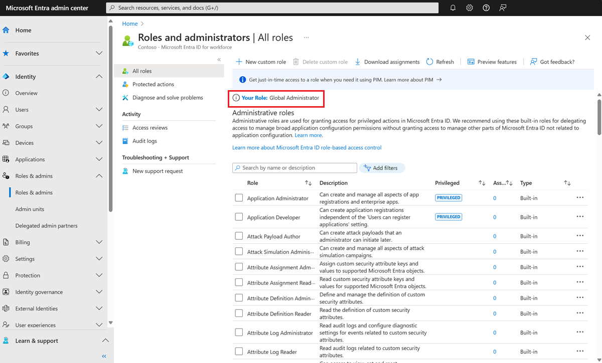
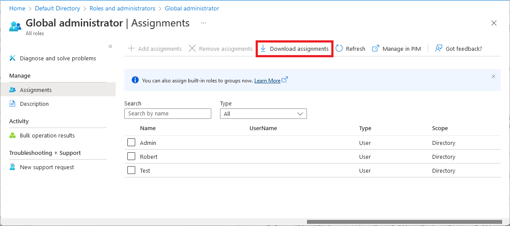
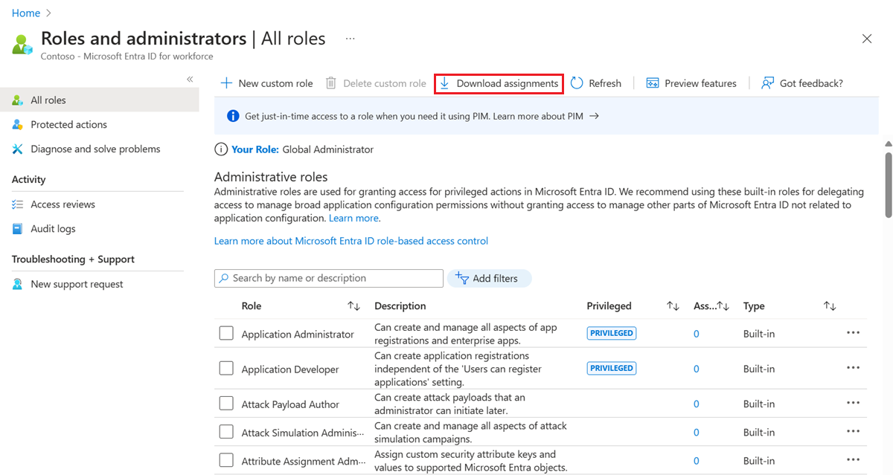
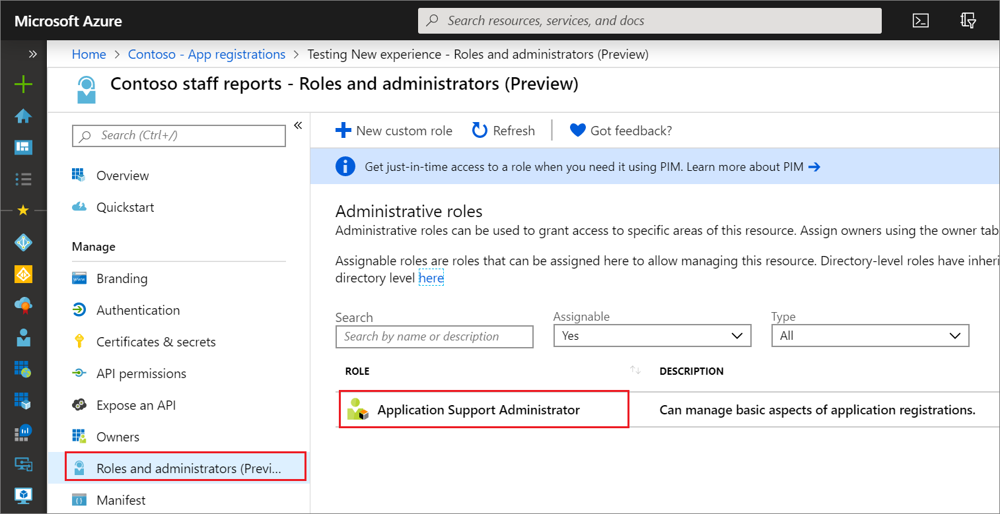

# List Azure AD role assignments

This article describes how to list roles you have assigned in Azure Active Directory (Azure AD). In Azure Active Directory (Azure AD), roles can be assigned at an organization-wide scope or with a single-application scope.

- Role assignments at the organization-wide scope are added to and can be seen in the list of single application role assignments.
- Role assignments at the single application scope aren't added to and can't be seen in the list of organization-wide scoped assignments.

## Prerequisites

- AzureAD module when using PowerShell
- Admin consent when using Graph explorer for Microsoft Graph API

For more information, see [Prerequisites to use PowerShell or Graph Explorer](prerequisites.md).

## Azure portal

This procedure describes how to list role assignments with organization-wide scope.

1. Sign in to the [Azure portal](https://portal.azure.com) or [Azure AD admin center](https://aad.portal.azure.com).

1. Select **Azure Active Directory** > **Roles and administrators** and then select a role to open it and view its properties.

1. Select **Assignments** to list the role assignments.

    

### List my role assignments

It's easy to list your own permissions as well. Select **Your Role** on the **Roles and administrators** page to see the roles that are currently assigned to you.

   

### Download role assignments

To download all assignments for a specific role, follow these steps.

1. On the **Roles and administrators** page, select a role.

1. Select **Download role assignments**.

    A CSV file that lists assignments at all scopes for that role is downloaded.

    

To download all active role assignments across all roles, including built-in and custom roles, follow these steps (currently in Preview).

1. On the **Roles and administrators** page, select **All roles**.

1. Select **Download assignments**.

    A CSV file that lists assignments at all scopes for all roles is downloaded.

    

### List role assignments with single-application scope

This section describes how to list role assignments with single-application scope. This feature is currently in public preview.

1. Sign in to the [Azure portal](https://portal.azure.com) or [Azure AD admin center](https://aad.portal.azure.com).

1. Select **Azure Active Directory** > **App registrations**, and then select the app registration to view its properties. You might have to select **All applications** to see the complete list of app registrations in your Azure AD organization.

    

1. In the app registration, select **Roles and administrators**, and then select a role to view its properties.

    

1. Select **Assignments** to list the role assignments. Opening the assignments page from within the app registration shows you the role assignments that are scoped to this Azure AD resource.

    


## PowerShell

This section describes viewing assignments of a role with organization-wide scope. This article uses the [Azure Active Directory PowerShell Version 2](/powershell/module/azuread/#directory_roles) module. To view single-application scope assignments using PowerShell, you can use the cmdlets in [Assign custom roles with PowerShell](custom-assign-powershell.md).

Use the [Get-AzureADMSRoleDefinition](/powershell/module/azuread/get-azureadmsroledefinition) and [Get-AzureADMSRoleAssignment](/powershell/module/azuread/get-azureadmsroleassignment) commands to list role assignments.

The following example shows hows to list the role assignments for the [Groups Administrator](permissions-reference.md#groups-administrator) role.

```powershell
# Fetch list of all directory roles with template ID
Get-AzureADMSRoleDefinition

# Fetch a specific directory role by ID
$role = Get-AzureADMSRoleDefinition -Id "fdd7a751-b60b-444a-984c-02652fe8fa1c"

# Fetch membership for a role
Get-AzureADMSRoleAssignment -Filter "roleDefinitionId eq '$($role.Id)'"
```

```Example
RoleDefinitionId                     PrincipalId                          DirectoryScopeId
----------------                     -----------                          ----------------
fdd7a751-b60b-444a-984c-02652fe8fa1c 04f632c3-8065-4466-9e30-e71ec81b3c36 /administrativeUnits/3883b136-67f0-412c-9b...
```

The following example shows hows to list all active role assignments across all roles, including built-in and custom roles (currently in Preview).

```powershell
$roles = Get-AzureADMSRoleDefinition
foreach ($role in $roles)
{
  Get-AzureADMSRoleAssignment -Filter "roleDefinitionId eq '$($role.Id)'"
}
```

```Example
RoleDefinitionId                     PrincipalId                          DirectoryScopeId Id
----------------                     -----------                          ---------------- --
e8611ab8-c189-46e8-94e1-60213ab1f814 9f9fb383-3148-46a7-9cec-5bf93f8a879c /                uB2o6InB6EaU4WAhOrH4FHwni...
e8611ab8-c189-46e8-94e1-60213ab1f814 027c8aba-2e94-49a8-974b-401e5838b2a0 /                uB2o6InB6EaU4WAhOrH4FEqdn...
fdd7a751-b60b-444a-984c-02652fe8fa1c 04f632c3-8065-4466-9e30-e71ec81b3c36 /administrati... UafX_Qu2SkSYTAJlL-j6HL5Dr...
...
```

## Microsoft Graph API

This section describes how to list role assignments with organization-wide scope. To list single-application scope role assignments using Graph API, you can use the operations in [Assign custom roles with Graph API](custom-assign-graph.md).

Use the [List unifiedRoleAssignments](/graph/api/rbacapplication-list-roleassignments) API to get the role assignments for a specific role definition. The following example shows hows to list the role assignments for a specific role definition with the ID `3671d40a-1aac-426c-a0c1-a3821ebd8218`.

```http
GET https://graph.microsoft.com/v1.0/roleManagement/directory/roleAssignments&$filter=roleDefinitionId eq ‘<template-id-of-role-definition>’
```

Response

```http
HTTP/1.1 200 OK
{
    "id": "CtRxNqwabEKgwaOCHr2CGJIiSDKQoTVJrLE9etXyrY0-1",
    "principalId": "ab2e1023-bddc-4038-9ac1-ad4843e7e539",
    "roleDefinitionId": "3671d40a-1aac-426c-a0c1-a3821ebd8218",
    "directoryScopeId": "/"
}
```

## Next steps

* Feel free to share with us on the [Azure AD administrative roles forum](https://feedback.azure.com/d365community/forum/22920db1-ad25-ec11-b6e6-000d3a4f0789).
* For more about role permissions, see [Azure AD built-in roles](permissions-reference.md).
* For default user permissions, see a [comparison of default guest and member user permissions](../fundamentals/users-default-permissions.md).
