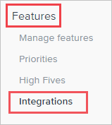
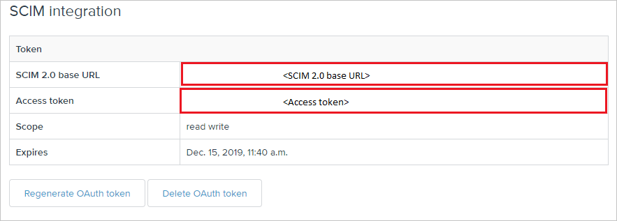

# Tutorial: Configure 15Five for automatic user provisioning

The objective of this tutorial is to demonstrate the steps to be performed in 15Five and Azure Active Directory (Azure AD) to configure Azure AD to automatically provision and de-provision users and/or groups to 15Five.

> [!NOTE]
> This tutorial describes a connector built on top of the Azure AD User Provisioning Service. For important details on what this service does, how it works, and frequently asked questions, see [Automate user provisioning and deprovisioning to SaaS applications with Azure Active Directory](../manage-apps/user-provisioning.md).
>
> This connector is currently in Public Preview. For more information on the general Microsoft Azure terms of use for Preview features, see [Supplemental Terms of Use for Microsoft Azure Previews](https://azure.microsoft.com/support/legal/preview-supplemental-terms/).

## Prerequisites

The scenario outlined in this tutorial assumes that you already have the following prerequisites:

* An Azure AD tenant.
* [A 15Five tenant](https://www.15five.com/pricing/).
* A user account in 15Five with Admin permissions.

## Assigning users to 15Five

Azure Active Directory uses a concept called *assignments* to determine which users should receive access to selected apps. In the context of automatic user provisioning, only the users and/or groups that have been assigned to an application in Azure AD are synchronized.

Before configuring and enabling automatic user provisioning, you should decide which users and/or groups in Azure AD need access to 15Five. Once decided, you can assign these users and/or groups to 15Five by following the instructions here:
* [Assign a user or group to an enterprise app](../manage-apps/assign-user-or-group-access-portal.md)

## Important tips for assigning users to 15Five

* It is recommended that a single Azure AD user is assigned to 15Five to test the automatic user provisioning configuration. Additional users and/or groups may be assigned later.

* When assigning a user to 15Five, you must select any valid application-specific role (if available) in the assignment dialog. Users with the **Default Access** role are excluded from provisioning.

## Setup 15Five for provisioning

Before configuring 15Five for automatic user provisioning with Azure AD, you will need to enable SCIM provisioning on 15Five.

1. Sign in to your [15Five Admin Console](https://my.15five.com/). Navigate to **Features > Integrations**.

	

2.	Click on **SCIM 2.0**.

	

3.	Navigate to **SCIM integration > Generate OAuth token**.

	

4.	Copy the values for **SCIM 2.0 base URL** and **Access Token**. This value will be entered in the **Tenant URL** and **Secret Token** field in the Provisioning tab of your 15Five application in the Azure portal.
	
	

## Add 15Five from the gallery

To configure 15Five for automatic user provisioning with Azure AD, you need to add 15Five from the Azure AD application gallery to your list of managed SaaS applications.

**To add 15Five from the Azure AD application gallery, perform the following steps:**

1. In the **[Azure portal](https://portal.azure.com)**, in the left navigation panel, select **Azure Active Directory**.

	

2. Go to **Enterprise applications**, and then select **All applications**.

	

3. To add a new application, select the **New application** button at the top of the pane.

	

4. In the search box, enter **15Five**, select **15Five** in the results panel, and then click the **Add** button to add the application.

	

## Configuring automatic user provisioning to 15Five 

This section guides you through the steps to configure the Azure AD provisioning service to create, update, and disable users and/or groups in 15Five based on user and/or group assignments in Azure AD.

> [!TIP]
> You may also choose to enable SAML-based single sign-on for 15Five , following the instructions provided in the [15Five Single sign-on tutorial](15five-tutorial.md). Single sign-on can be configured independently of automatic user provisioning, though these two features compliment each other.

### To configure automatic user provisioning for 15Five in Azure AD:

1. Sign in to the [Azure portal](https://portal.azure.com). Select **Enterprise Applications**, then select **All applications**.

	

2. In the applications list, select **15Five**.

	

3. Select the **Provisioning** tab.

	

4. Set the **Provisioning Mode** to **Automatic**.

	

5.	Under the Admin Credentials section, input the **SCIM 2.0 base URL and Access Token** values retrieved earlier in **Tenant URL** and **Secret Token** respectively. Click **Test Connection** to ensure Azure AD can connect to 15Five. If the connection fails, ensure your 15Five account has Admin permissions and try again.

	

6. In the **Notification Email** field, enter the email address of a person or group who should receive the provisioning error notifications and check the checkbox - **Send an email notification when a failure occurs**.

	

7. Click **Save**.

8. Under the **Mappings** section, select **Synchronize Azure Active Directory Users to 15Five**.

	

9. Review the user attributes that are synchronized from Azure AD to 15Five in the **Attribute Mapping** section. The attributes selected as **Matching** properties are used to match the user accounts in 15Five for update operations. Select the **Save** button to commit any changes.

	

10. Under the **Mappings** section, select **Synchronize Azure Active Directory Groups to 15Five**.

	

11. Review the group attributes that are synchronized from Azure AD to 15Five in the **Attribute Mapping** section. The attributes selected as **Matching** properties are used to match the groups in 15Five for update operations. Select the **Save** button to commit any changes.

	

12. To configure scoping filters, refer to the following instructions provided in the [Scoping filter tutorial](../manage-apps/define-conditional-rules-for-provisioning-user-accounts.md).

13. To enable the Azure AD provisioning service for 15Five, change the **Provisioning Status** to **On** in the **Settings** section.

	

14. Define the users and/or groups that you would like to provision to 15Five by choosing the desired values in **Scope** in the **Settings** section.

	

15. When you are ready to provision, click **Save**.

	

	This operation starts the initial synchronization of all users and/or groups defined in **Scope** in the **Settings** section. The initial sync takes longer to perform than subsequent syncs, which occur approximately every 40 minutes as long as the Azure AD provisioning service is running. You can use the **Synchronization Details** section to monitor progress and follow links to provisioning activity report, which describes all actions performed by the Azure AD provisioning service on 15Five.

	For more information on how to read the Azure AD provisioning logs, see [Reporting on automatic user account provisioning](../app-provisioning/check-status-user-account-provisioning.md)
	
## Connector limitations

* 15Five does not support hard deletes for users.

## Additional resources

* [Managing user account provisioning for Enterprise Apps](../app-provisioning/configure-automatic-user-provisioning-portal.md).
* [What is application access and single sign-on with Azure Active Directory?](../manage-apps/what-is-single-sign-on.md)

## Next steps

* [Learn how to review logs and get reports on provisioning activity](../app-provisioning/check-status-user-account-provisioning.md).
